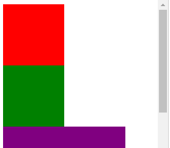
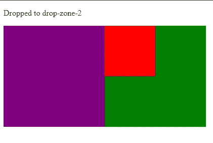

# JavaScript 事件处理程序— ondragend 和 ondragenter

> 原文：<https://javascript.plainenglish.io/javascript-events-handlers-ondragend-and-ondragenter-1d741649c2f5?source=collection_archive---------3----------------------->


Photo by [Sharon McCutcheon](https://unsplash.com/@sharonmccutcheon?utm_source=medium&utm_medium=referral) on [Unsplash](https://unsplash.com?utm_source=medium&utm_medium=referral)

在 JavaScript 中，事件是应用程序中发生的动作。它们是由各种事情触发的，比如输入、提交表单、调整大小等元素变化，或者应用程序运行时发生的错误等。我们可以分配事件处理程序来处理这些事件。发生在 DOM 元素上的事件可以通过为相应事件的 DOM 对象的属性分配一个事件处理程序来处理。在本文中，我们通过为`ondragend`和`ondragenter`事件处理程序创建我们自己的事件处理程序函数，来看看用普通 JavaScript 代码添加拖放功能的简单方法。

# 翁德拉根德

通过`ondragend`事件，我们可以设置一个事件处理程序来处理`dragend`事件，该事件发生在通过释放鼠标按钮或按 escape 键完成拖动操作时。例如，我们可以通过编写下面的 HTML 代码来使用它，通过将`draggable` 属性设置为`true`来制作一个可拖动的框，并在其下方放置我们分配了 ID `drop-zone`的可拖动框:

```
<div id='drag-box' draggable="true"></div><div id='drop-zone'></div>
```

然后我们用 CSS 样式化它，使其宽 100 像素，高 100 像素，填充红色背景，并使`drop-zone` div 宽 200 像素，高 200 像素，使其背景为紫色:

```
#drag-box {
  width: 100px;
  height: 100px;
  background-color: red;
}#drop-zone {
  width: 200px;
  height: 200px;
  background-color: purple
}
```

最后，我们可以添加 JavaScript 代码来跟踪框的拖动动作，方法是将一个事件处理函数分配给我们在 HTML 代码中创建的框的 DOM 元素的`ondragend`属性:

```
const dragBox = document.getElementById('drag-box');
const dropZone = document.getElementById('drop-zone');dragBox.ondragend = (e) => {
  dropZone.appendChild(dragBox);
}
```

在事件处理函数中，我们调用`dropZone`对象上的`appendChild`将红色可拖动框放入紫色框中，这样看起来就像红色框被放入紫色框中。除了将`dragBox`对象直接传递给`appendChild`方法，我们还可以获取`e`参数的`srcElement`属性，然后将其传递给`appendChild`，如以下代码所示:

```
const dragBox = document.getElementById('drag-box');
const dropZone = document.getElementById('drop-zone');dragBox.ondragend = (e) => {
  dropZone.appendChild(e.srcElement);
}
```

上面的代码比直接将`dragBox`传入`appendChild`要好，因为它比事件处理函数的原始版本更通用。我们可以将它附加到任何我们想要的可拖动对象上。例如，如果我们有多个可拖动的`div`元素，如下面的 HTML 代码所示:

```
<div id='drag-box' draggable="true">
</div><div id='drag-box-2' draggable="true">
</div><div id='drop-zone'>
</div>
```

我们更改 CSS 来设计两个可拖动的`div`元素，如下面的代码所示:

```
#drag-box {
  width: 100px;
  height: 100px;
  background-color: red;
}#drag-box-2 {
  width: 100px;
  height: 100px;
  background-color: green;
}#drop-zone {
  width: 200px;
  height: 200px;
  background-color: purple
}
```

然后，我们可以编写以下 JavaScript 代码，使用一个`ondragend`事件处理函数来处理两个可拖动的`div`元素的拖放，如下面的代码所示:

```
const dragBox = document.getElementById('drag-box');
const dragBox2 = document.getElementById('drag-box-2');
const dropZone = document.getElementById('drop-zone');const dragEndHandler = (e) => {
  dropZone.appendChild(e.srcElement);
}dragBox.ondragend = dragEndHandler;
dragBox2.ondragend = dragEndHandler;
```

从上面的代码中我们可以看到，我们为两个可拖动的`div` DOM 元素对象的`ondragend`属性分配了相同的事件处理函数。最后，我们得到以下效果:



Photo by [Matthew Sleeper](https://unsplash.com/@mjsleeper?utm_source=medium&utm_medium=referral) on [Unsplash](https://unsplash.com?utm_source=medium&utm_medium=referral)

# 翁德朗特

使用 DOM 元素的`ondragenter`属性，我们可以分配一个事件处理函数来处理`dragenter`事件。当拖动的元素或文本选择进入有效的放置目标时，触发`dragenter`事件。目标对象是被用户直接指定为放置目标或主体元素的元素。例如，我们可以使用`ondragenter`事件处理函数来跟踪可拖动元素进入的元素，并通过将事件处理函数分配给`ondragenter`属性，将可拖动元素拖放到我们想要拖放的元素中。例如，通过编写以下代码，我们可以添加以下 HTML 代码来添加一个用于显示可拖动元素被放入的元素的 ID 的`p`元素、一个可拖动的`div`元素和两个可拖动的`div`元素:

```
<p id='drop-tracker'></p>
<div id='drag-box' draggable="true">
</div>
<div id='drop-zones'>
  <div id='drop-zone'>
  </div><div id='drop-zone-2'>
  </div>
</div>
```

然后，我们通过使用以下 CSS 代码更改每个 div 的颜色和大小，来设置 HTML 代码中的元素的样式:

```
#drag-box {
  width: 100px;
  height: 100px;
  background-color: red;
}#drop-zones {
  display: flex;
}#drop-zone {
  width: 200px;
  height: 200px;
  background-color: purple
}#drop-zone-2 {
  width: 200px;
  height: 200px;
  background-color: green;
}
```

通过使用`display: flex`属性和值，我们将可以拖放`div`的 2 个`div`元素放在一起。然后，我们可以将自己的事件处理函数分配给 2 个`div`元素的`ondragenter`属性，通过编写以下代码，我们可以将可拖动的`div`元素放入其中:

```
const dragBox = document.getElementById('drag-box');
const dropZone = document.getElementById('drop-zone');
const dropZone2 = document.getElementById('drop-zone-2');
const dropTracker = document.getElementById('drop-tracker');const dragEnterHandler = (e) => {
  if (e.toElement.id.includes('drop-zone')) {
    dropTracker.innerHTML = `Dropped to ${e.toElement.id}`;
    e.toElement.appendChild(document.getElementById('drag-box'));
  }
}dropZone.ondragenter = dragEnterHandler;
dropZone2.ondragenter = dragEnterHandler;
```

在`dragEnterHandler`函数中，我们通过检查`e.toElement.id`属性来检查是否将`drag-box` `div`元素拖到了`drop-zone` `div`元素中。属性包含了我们要拖动的元素。我们通过写`e.toElement.id.includes(‘drop-zone’)`来检查`drag-box` `div`确实进入了 2 `drop-zone` `div`元素，所以我们不能把它们放在我们不希望它们被放的地方。如果`drag-box` `div`落在`drop-zone` `div`元素之一中，那么我们调用`drop-zone` `div`上的`appendChild`将它们放在`drop-zone` `div`里面。此外，我们通过设置`drop-tracker` `p`元素的`innerHTML`属性，显示了我们将`drag-box` `div`放入的`drop-zone` `div`的 ID。最后，我们应该有如下内容:



使用`ondragenter`事件处理函数，我们可以将可拖动的元素放入我们想要放入的元素中，可以是一个或多个。

DOM 元素的`ondragend`属性允许我们设置一个事件处理程序来处理`dragend`事件，该事件在通过释放鼠标按钮或按下 escape 键完成拖动操作时发生。利用 DOM 元素的`ondragenter`属性，我们可以分配一个事件处理函数来处理`dragenter`事件。当拖动的元素或文本选择进入有效的放置目标时，触发`dragenter`事件。目标对象是被用户直接指定为放置目标或主体元素的元素。这让我们可以将一个可拖动的元素拖放到多个可能的元素中。