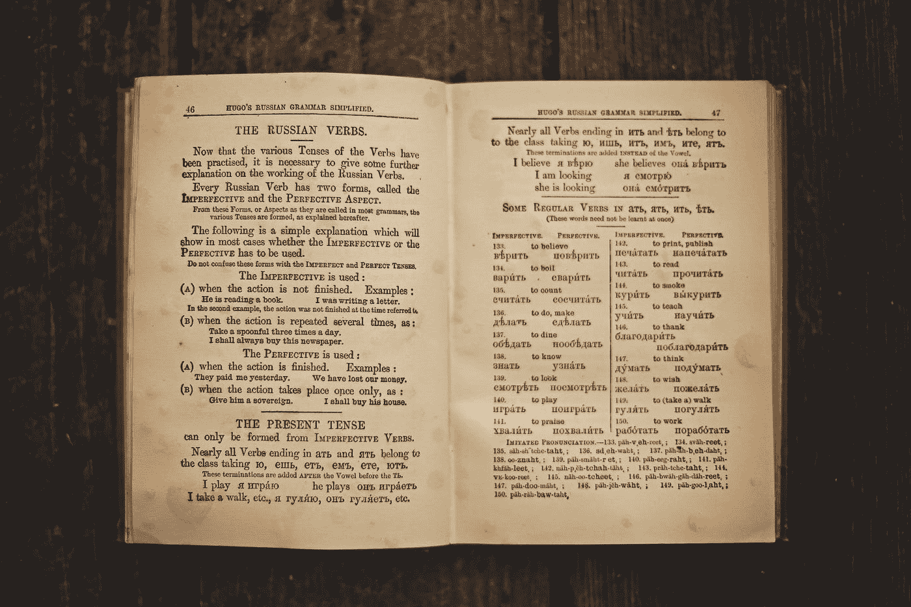

# JavaScript 事件处理程序— onfullscreenerror 和 onpaste

> 原文：<https://javascript.plainenglish.io/javascript-events-handlers-onfullscreenerror-and-onpaste-b8ff6d4f1625?source=collection_archive---------4----------------------->



Photo by [Ksenia Makagonova](https://unsplash.com/@dearseymour?utm_source=medium&utm_medium=referral) on [Unsplash](https://unsplash.com?utm_source=medium&utm_medium=referral)

在 JavaScript 中，事件是应用程序中发生的动作。它们是由各种事情触发的，比如输入、提交表单、调整大小等元素变化，或者应用程序运行时发生的错误等。我们可以分配事件处理程序来处理这些事件。发生在 DOM 元素上的事件可以通过为相应事件的 DOM 对象的属性分配一个事件处理程序来处理。在本文中，我们将看看`onfullscreenerror`和`onpaste`事件处理程序。

# window . document . onfull screen error

`onfullscreenerror`属性让我们分配一个事件处理程序来处理`fullscreenerror`事件。如果尝试调用`requestFullScreen`方法失败，那么`fullscreenerror`将被触发，而`onfullscreenerror`事件处理程序将运行。例如，如果我们有以下代码:

```
document.documentElement.requestFullscreen();document.onfullscreenerror = event => {
  console.log("onfullscreenerror");
  console.log(event);
};
```

那么`onfullscreenerror`处理程序将会运行，因为`fullscreenerror`事件被触发。它被触发是因为`requestFullScreen`只对用户与之交互的元素起作用。出于安全原因，它不能自动发生，所以会失败。错误事件如下所示:

```
bubbles: true
cancelBubble: false
cancelable: false
composed: true
currentTarget: null
defaultPrevented: false
eventPhase: 0
isTrusted: true
path: (3) [html, document, Window]
returnValue: true
srcElement: html
target: html
timeStamp: 144.4549998268485
type: "fullscreenerror"
```

这些是属于`Event`对象的属性。一个`Event`对象有以下值属性，其中许多是上面列出的:

*   `bubbles` —是一个只读布尔属性，指示事件是否在 DOM 树中冒泡。
*   `cancelBubble` —是`stopPropagation`方法的历史别名。在从事件处理程序返回之前将其值设置为`true`可防止事件传播。
*   `cancelable` —只读布尔属性，指示事件是否可以取消。
*   `composed` —是一个只读的布尔属性，指示事件是否可以跨越阴影 DOM 和常规 DOM 之间的边界。
*   `currentTarget` —只读属性，引用当前注册的事件目标。这是当前计划将事件发送到的对象，但有可能在重定目标的过程中已经发生了变化。
*   `deepPath` —是事件冒泡通过的 DOM 节点数组。
*   `defaultPrevented` —是一个只读布尔属性，指示是否在事件上调用了`event.preventDefault()`。
*   `eventPhase` —是一个只读属性，指示正在处理事件流的哪个阶段。
*   `explicitOriginalTarget` —是一个只读属性，具有事件的显式原始目标。该属性仅在 Mozilla 浏览器中可用。
*   `originalTarget` —是一个只读属性，在任何重定目标之前具有事件的原始目标。该属性仅在 Mozilla 浏览器中可用。
*   `returnValue` —是由 Internet Explorer 引入的历史属性，最终被纳入 DOM 规范，以确保现有站点继续工作。理想情况下，您应该尝试使用`preventDefault()`和`defaultPrevented` 来取消事件并检查事件是否被取消，但是如果您选择这样做，也可以使用 returnValue。
*   `srcElement` —是旧版本 Microsoft Internet Explorer 中用于`target`的非标准别名，出于 web 兼容性目的，其他一些浏览器也开始支持该别名。
*   `target` —只读属性，是对事件最初调度到的目标的引用。
*   `timeStamp` —只读，包含事件的创建时间(以毫秒为单位)。根据规范，该值是自 1970 年 1 月 1 日以来的时间，但实际上浏览器的定义各不相同。
*   `type` —具有事件名称的只读属性(不区分大小写)。
*   `isTrusted` —是一个只读属性，指示事件是由用户交互后的浏览器发起的，还是由使用类似`initEvent`的事件创建方法的脚本发起的。

上面的列表是部分属性。它只包含`Event`对象的值属性。


Photo by [FOODISM360](https://unsplash.com/@foodism360?utm_source=medium&utm_medium=referral) on [Unsplash](https://unsplash.com?utm_source=medium&utm_medium=referral)

# window.document.onpaste

属性让我们分配一个事件处理程序来处理`paste`事件，当我们将剪贴板中的数据粘贴到 web 页面中时，就会触发该事件。例如，我们可以在下面的代码中使用它:

```
document.onpaste = event => {
  console.log(event);
}
```

我们可以使用`clipboardData`属性获取粘贴到应用程序中的剪贴板数据，这是一个具有`getData`方法的`DataTransfer`对象。`DataTransfer`对象具有以下值属性:

*   `dropEffect` —返回当前所选拖放操作类型的字符串，或将该操作设置为新类型。可能的值有`none`、`copy`、`link`或`move`。
*   `effectAllowed` —返回可能的操作类型的字符串。可能的值是`none`、`copy`、`copyLink`、`copyMove`、`link`、`linkMove`、`move`、`all`或`uninitialized`中的一个。
*   `files` —`FileList`数据传输中可用的所有本地文件的对象。如果拖动操作不涉及拖动文件，则该属性为空列表。
*   `items` —是一个只读的给出了一个`DataTransferItemList`对象，它是所有拖动数据的列表。
*   `types` —是一个只读属性，它有一个字符串数组，给出了在`dragstart`事件中设置的格式

具有以下方法的`DataTransfer`对象:

*   `clearData()`-删除与给定类型相关的数据。type 参数是可选的。如果类型为空或未指定，则删除与所有类型关联的数据。如果指定类型的数据不存在，或者数据传输对象没有数据，则此方法不执行任何操作。它采用一个可选参数，该参数是一个带有要清除的数据类型的字符串。
*   `getData()` —检索作为参数传入的字符串类型的数据，如果该类型的数据不存在或数据传输不包含数据，则检索空字符串。它接受一个参数，该参数是包含要检索的数据类型的字符串。
*   `setData()` —设置给定类型的数据。它需要两个参数。第一个参数是被拖动数据的格式字符串，第二个参数是包含拖动对象数据的字符串。如果该类型的数据不存在，那么它将被添加到末尾，这将是新的格式。如果该类型的数据已经存在，现有数据将在相同位置被替换。
*   `setDragImage()` —如果需要自定义图像，设置用于拖动的图像。它需要三个参数。第一个是图像`Element`对象，用于拖动反馈图像。第二个和第三个参数是图像中的水平和垂直偏移量。

要获得粘贴的文本数据，我们可以使用带有`'Text'`参数的`getData`方法，如下面的代码所示:

```
document.onpaste = event => {
  console.log(event);
  console.log(event.clipboardData.getData('Text'));
}
```

然后我们应该得到粘贴到页面上的文本数据。

`onfullscreenerror`事件处理程序让我们处理任何切换到全屏失败的情况，比如试图自动切换到全屏，而不需要用户交互，比如试图在`documentElement`对象上调用`requestFullScreen`。我们可以使用`onpaste`事件处理程序来处理从剪贴板粘贴数据到我们的页面所触发的`paste`事件，并通过使用`event.clipboardData.getData(‘Text’)`方法调用来获取数据。