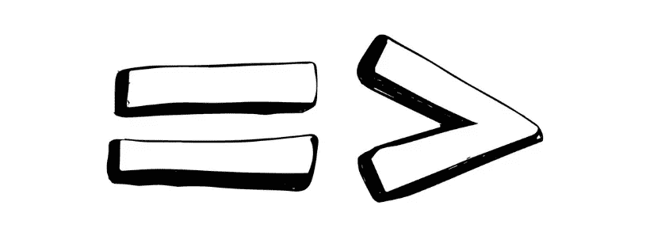
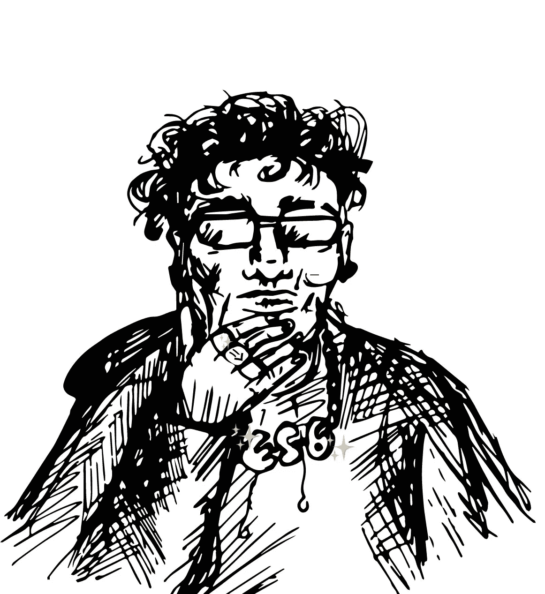
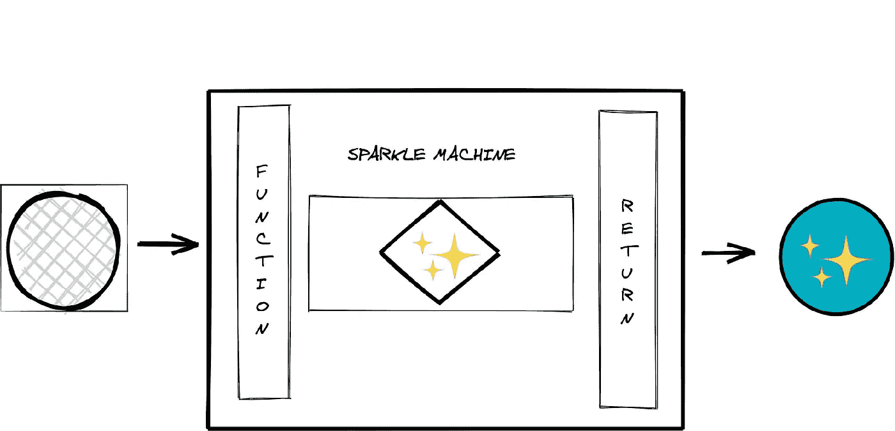
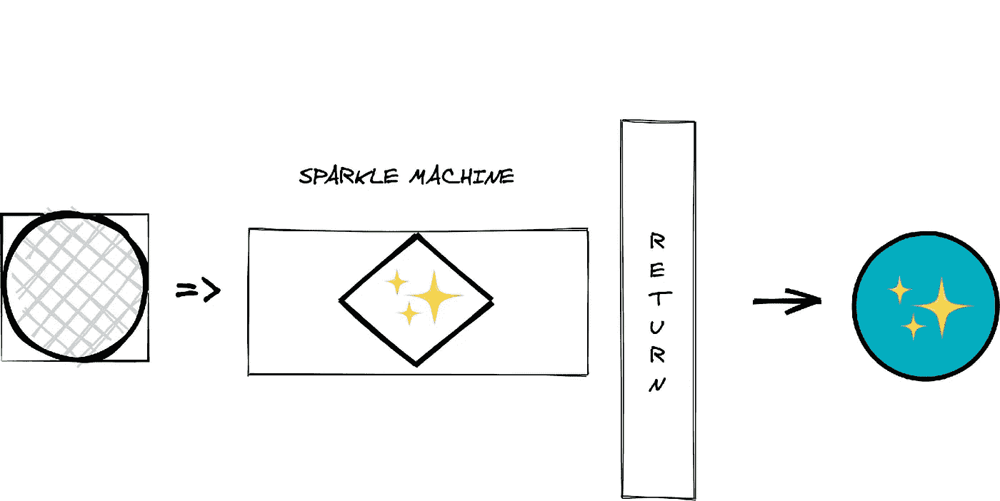
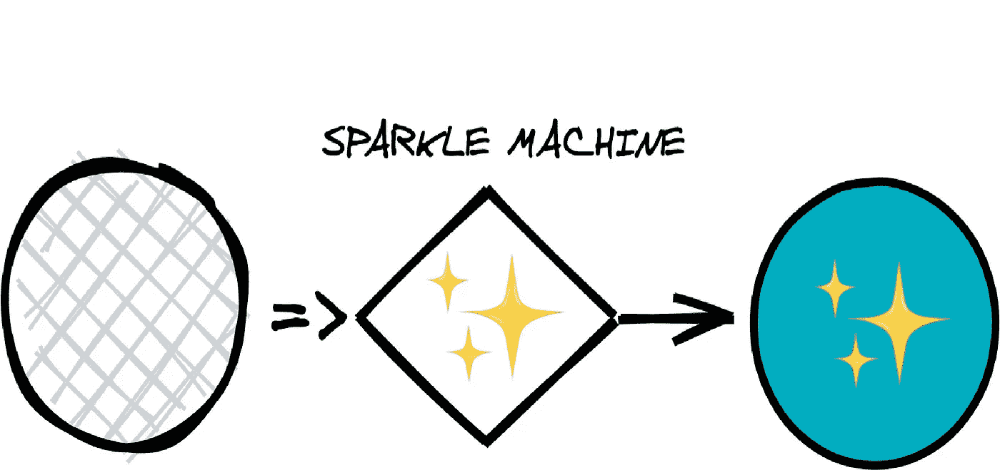

# 面向初学者的 JavaScript 胖箭头函数:图解指南

> 原文：<https://javascript.plainenglish.io/javascript-fat-arrow-functions-for-beginners-an-illustrated-guide-2070d34ec6ed?source=collection_archive---------6----------------------->

你开始学习 JavaScript。现在你已经注意到你一直遇到这个箭头。



通过观察其他人如何使用它，你可以得到一些要点，但是你不会 ***真正*** 得到它。所以你微笑着点头，因为现在问这是怎么回事已经太晚了。

只不过是**不是**。

让我们剖析胖箭头函数，并让您使用一些 ES6 俚语！



Apparently this is what a cool developer looks like

胖箭头函数就像你已经知道的常规 JS 函数**，**只是它们以更简洁的方式编写。让我们通过给一个简单的 JS 函数一个胖箭头改头换面。

所以我们可以理解这是怎么回事:

```
**function** sparkleMachine(boringItem){
    **return** boringItem + ‘✨’;
}
```

实际上是这样的:

```
**const** sparkleMachine = boringItem => boringItem + ‘✨’
```

# 分解它

假设你制造了一台机器。不是任何旧机器，而是一个闪闪发光的机器。它会将 **✨** 加到你手上任何东西的末尾。为什么？因为你是一个很棒的人，喜欢给无聊的事情增加点趣味。

**闪光点机**
你给它传东西→加闪光点→返回东西但有闪光点。



```
**function** sparkleMachine(boringItem){
    **return** boringItem + ‘✨’;
}
```

## 胖箭头改造

现在，让我们帮助我们的闪耀机器卸下一些额外的包袱。你不觉得**功能**关键字有点笨重吗？让我们把它换成更瘦的。

但是我们能用什么来代替它呢？如果我们有某种通用的符号来表示我们从一件事到另一件事该多好？啊哈，是的——一支**箭**！我们可以抛弃`**function**`关键词，用`**=>**` **代替。**

```
**const** sparkleMachine = (boringItem) => {
    **return** boringItem + ‘✨’;
}
```

**好看的**！我们的闪光器已经看起来更时尚了。但是我们可以做得更好。

注意机器如何执行**一个动作**——它返回我们的*镗孔* *东西*并添加一些'✨'.换句话说，我们的函数由一个**单一表达式组成。**



```
**const** sparkleMachine = (boringItem) => {**return** boringItem + '✨'};
```

因此，因为它是一行代码，而不是一个代码块，所以我们不需要那些花括号。

最重要的是，**隐含了**我们要返回一些东西，所以我们甚至可以转储`**return**`语句。

我们只有**一个参数**(东西)，所以也可以去掉括号！

我们现在看起来怎么样？

> …请击鼓…

## ✨TADA！✨



```
**const** sparkleMachine = boringItem => boringItem + '✨';
```

## 你做到了！👏

*   一开始，箭头函数看起来有点模糊。然而，一旦你找到了基础，你会发现它们实际上非常漂亮！
*   对我来说，理解这种新的语法与常规的普通 JS 函数的关系是一个灵光乍现的时刻💡希望我也为你阐明了这个话题！

> 页（page 的缩写）s:这篇文章关注的是 arrow **语法**。值得注意的是，肥胖箭头还会影响其他一些有趣的部分& bobs，比如 **scope** & the value of `*this*`。我鼓励你下一步去探索那些家伙！🚀

*感谢您抽出时间阅读本文。如果你喜欢，别忘了给一个*👏*如下:*

*在推特上随意攻击我*[*@ daire _ NIC*](https://twitter.com/daire_nic)*！*

## **来自 JavaScript 的普通英语注释**

我们一直对帮助推广高质量内容感兴趣。如果您有一篇文章想提交给我们的任何出版物，请用您的中用户名在[**submissions @ plain English . io**](mailto:submissions@plainenglish.io)**发邮件给我们，我们会将您添加为作者。**