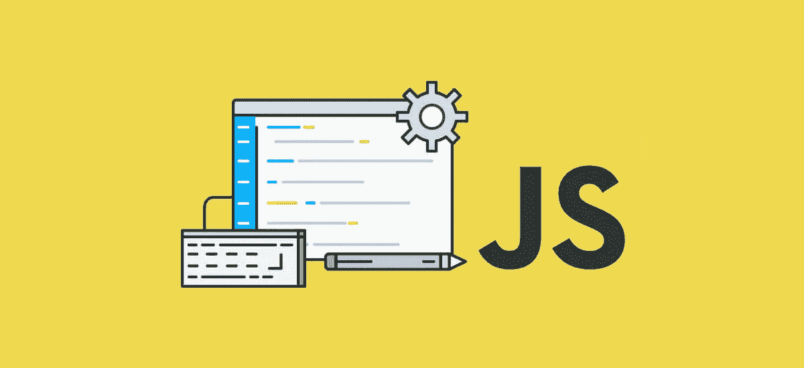

# 面向绝对初学者的 JavaScript

> 原文：<https://javascript.plainenglish.io/javascript-for-absolute-beginners-519dca78ce4a?source=collection_archive---------1----------------------->

## 我希望在我刚开始学习如何编码时就有这个指南！



## 如果你正在读这篇文章，很可能你最近才开始学习 Web 开发。

您可能已经对 HTML 和层叠样式表(CSS)有了一些了解。您知道您的 Web 开发之旅包括学习如何通过使用 JavaScript (JS)以编程方式操作网页中的内容。你可能听说过一些库和框架，比如 jQuery、React、Angular 和 Vue，并且想要掌握它们。不管是什么原因，如果你打算从事 Web 开发，几乎可以肯定的是，你需要掌握 JavaScript 的知识和经验。

考虑到这一点，是时候通过学习 JavaScript 将事情提升到一个新的水平了！

## 关于 JavaScript 学习曲线的一些话

学习 JavaScript 比学习 HTML 和 CSS 难有一个根本原因。是因为 HTML 和 CSS 是标记语言，而 JavaScript 是编程语言*。

**实际上，JavaScript 是一种脚本语言，它是编程语言家族的一个子集，但是现在，标记语言和编程语言的不同才是最重要的，所以让我们继续解释它们的区别……*

被定义为*标记语言*的语言是那些表示和提供一种机制的语言，通过这种机制，可以以文本格式解密和使用结构化数据。如果我们把它降低几个等级，使它更容易理解，标记语言基本上是一种工具，我们可以用它来描述事物，并以一致的方式提供价值。

例如，如果你必须挑选一些衣服穿，你有以下三件衣服，一件红色 t 恤，一件白色 t 恤和一件蓝色套头衫，你可以想象你，这个人，是我们需要赋予价值的东西。如果您有一个需要值的“服装”元素/键，那么可用的选项就变成了前面提到的三个项目。在我们的例子中，我们的标记语言可能看起来像这样:`clothing=”white t-shirt"`。

被定义为*编程语言*的语言是那些可以用来编码执行给定动作所需的一系列步骤的语言。现实生活中的一个例子可能是一个人从起床到离开家去上学或工作的每一步。例如，一个人在床上醒来，他们睁开眼睛，抬起头和上半身，保持直立姿势，等等。

使用编程语言，我们可以编写一组迭代指令——以类似于我们例子中人醒来的方式——告诉我们的计算机我们希望它做什么，我们希望它在给定情况下如何反应，我们希望允许/不允许什么等等。如果我们的人醒了，但意识到比他们需要醒来的时间要早得多，会怎么样？他们会闭上眼睛试着入睡吗？这些都是你可以用编程语言来控制的场景。

总而言之，标记语言提供了一种描述值的方式，编程语言提供了一种创建动作的方式。

# 回到 JavaScript

如果不解释编程语言的基本构件，那么对于绝对初学者来说，任何编程语言文章都是没有用的。在 JavaScript 的例子中，我认为是下面这些:**值、变量、算术、数据结构、等式、条件、**和**函数**。

不要误解我的意思，JavaScript 中还有其他有用的东西，但是对这七样东西有一个相当好的基础知识会让你开始你的旅程——不仅是 JavaScript 编程，还有一般的编程。

那么，说够了，让我们开始吧！

# 价值观念

截至 2020 年，JavaScript 中有八种不同类型的值。其中七个是我们所说的原语。这七个是:布尔、空、未定义、数字、BigInt、字符串和符号。JavaScript 中第八种类型的值是 Object。对于这一部分，我们将只关注三种最常用的原语，它们是字符串、数字和布尔值。

*琐事注意:用 JavaScript 创建的所有东西要么是原语，要么是对象。因此，如果它不是这七个原语之一，它就是一个对象。*

## 1.用线串

字符串是包含在一对语音标记或撇号之间的值。创建字符串时，您可以自由使用这两种方法。

**字符串示例:** `“hello”`、`“1966”`、`'Liverpool F.C.‘`。

如果你用撇号或引号把它括起来，它就成了一个字符串。

## 2.数字

猜猜这些是什么？是的，他们是数字！这包括整数(如数字 5)和小数(浮点数)，如 10.5。

**数例:** `29`、`3.5`、`1`、`55555555`。

当呼叫数字时，这些数字不用撇号或语音标记。如果你把一个数字放在一个语音标记中——比如`“29”`——它将变成一个字符串。如果您稍后试图使用该数字进行算术运算，这样做可能会导致问题。

## 3.布尔运算

这些基本都是真假语句，显示为`true`或`false`。

好吧，但是这些有什么用？坚持这个想法，因为当我们看等式和条件句的时候，我们会回到这个问题上。

*如果你想了解更多这里没有提到的其他数据类型，可以查看一下* [*MDN 的文档*](https://developer.mozilla.org/en-US/docs/Web/JavaScript/Data_structures) *。*

# 变量

变量允许您通过用名称标记数据来保存数据。比如 [Pi](https://en.wikipedia.org/wiki/Pi) 是一个无限长的数。假设您想回忆圆周率的前十个数字，因为您需要它来计算圆的面积和周长。你可以把它们存储在一个名为`pi`的变量中，而不是每次都试图回忆并写下这十个数字。事实上，让我们继续创建:

```
var pi = 3.1415926535;
```

你可以看到，我们通过写`var`来创建一个变量，然后是我们想给变量起的名字，在这里是`pi`。然后我们使用等号`=`然后在最后写下我们想要的任何值。最后，我们通过在末尾加上分号`;`来完成变量的赋值。

我们现在有了一种方法来存储我们之前讨论过的所有这些值！变量有大量的用途，你想用它们扩展到什么程度完全取决于你自己。

另一点值得一提的是，变量是区分大小写的。例如，假设我写道:

```
var greeting = "hello";
```

后来我写道:

```
var Greeting = “hi";
```

第二个`var Greeting`不会覆盖第一个`var greeting`。这是两个独立的变量，因此可能包含不同的值。这里要记住的是，你给它们起的名字应该是容易记忆和理解的。因此，创建名称如此相似的变量可能不是一个好主意。

## 关于使用`var`创建变量的一些说明

实际上，我们还有另外两种创建变量的方法，将`var`替换为`let`或`const`。JavaScript 最初只有`var`，但后来在该语言的 2015 年更新中添加了`let`和`const`——正式名称为 ES2015(之前称为 ES6，我向你提到过，因为你几乎肯定会在某个时候再次听到 ES2015 被称为 ES6)。

事实上，大多数 JavaScript 社区实际上鼓励使用`let`和`const`而不是`var`，这是由于所谓的[作用域](https://developer.mozilla.org/en-US/docs/Glossary/Scope)的差异以及这可能对您的代码产生的影响。然而，现在，我们坚持教授`var`，因为它在最新版本中仍然有效，并且作为初学者，var，let 和 const 之间的区别可能有点混乱。

在你的学习过程中，你会听到一些人大声疾呼，你不应该使用 var，你应该只使用 let 或 const。你甚至可能听到有人告诉你永远不要使用 var 或 let，而应该只使用 const。虽然这些论点有不同程度的正确性，但很大程度上取决于个人偏好和编程哲学。不要全信。当你积累编码经验的时候，形成你自己的哲学——欢迎你一路上用盐点缀它。

对于任何对我的一小撮盐感兴趣的人，我个人会推荐使用`let`而不是`var`，如果我希望能够不时地更新值，例如，用购物车总计。在我不想更新值的情况下，我会使用`const`而不是`var`，例如，如果我有一个像`const christmasDay = “December 25th"`这样的变量。

虽然对我来说使用`let`和`const`更像是一个关于变量状态的视觉提示，但我这样做的原因更多的是基于帮助避免意外地重新创建同名的变量，因为在使用`var`时这是可能的。这里的问题是，如果我已经有了一个变量，例如用于计费的名称为`bill`，然后创建一个我认为是新变量的名称为`bill`，这次是指一个叫比尔的人，第二个`bill`将覆盖第一个`bill`。这极有可能导致我的应用程序出现问题，JavaScript 不一定会警告我。使用`let`或`const`可以解决这个问题，因为你不能用相同的名字重新创建变量。作为一个问题，如果你遵循前面提到的对变量使用语义命名，这是不应该发生的。正是因为这个原因，我们将根据前面陈述的原因开始使用`let`和`const`。

哦，还有关于`const`的最后一点说明。引入它的原因是为了帮助定义不能被重新分配的值，即。用新值更新。作为一种说法，这并不完全正确。随着您对 JavaScript 越来越精通，在以后的某个时候可能值得一读。然而，如果你渴望的话，在谷歌上搜索一下*“在 JavaScript 中是常量不可变的”*。

# 算术

用过计算器吗？运营商就是这么做的。这些是主要的四个:

`+`(追加)

`-`(减法)

`*`(乘法)

`/`(分部)

还有模%运算符，它在 JavaScript 中给出两个数相除的余数。这与传统算术中的余数运算符不太一样，所以如果您打算使用它，我建议您仔细阅读一下 JavaScript 中的模运算符是如何工作的。

算术示例:

`5 + 7`

`4 — 5`

`9 * 8`

`10 / 2`

在这些情况下，我们不必严格使用实际数字。如果我们有赋值给变量的数值，我们也可以使用它们。例如:

```
let moneyInBank = 100;
let shoppingBill = 40;let remainingBalance = moneyInBank - shoppingBill;
```

这里的`remainingBalance`当然等于`60`。

## JavaScript 中的小数点

我会尽量简短:如果你用小数点计算数值，不要总是依赖算术。小数，或者你可能会听到的浮点数，在 JavaScript 中的计算方式与人类不同。有时候可能会有用。比如:`0.2 + 0.3`会返回`0.5`。但是`0.4 + 0.3 + 0.2 + 0.1`将在 JavaScript 中返回`0.9999999999999999`，而人类可能期望它返回`1`。如果您计划用 JavaScript 创建一些依赖于精确计算的东西，请阅读一些专门设计来处理这些的 JS 库。

# 数据结构

数据结构为我们提供了更复杂的保存值的方式。例如，假设您想要存储一个购物清单，其中包含您计划在杂货店购买的所有商品。试图将每一项都存储在自己的变量中会很麻烦——例如`let item 1 = “banana”; let item2 = “cereal”;`等。

或者可能有一家公司有多个地址，通过为 address 创建一个变量来实现这一点可能不是最佳选择。下面将向我们展示两种方法，我们可以解决这两个问题。

## 1.数组

虽然变量通常只能保存一条信息*，但数组可以保存任意多条信息。您可以将数组视为允许我们保存信息列表的数据结构，这使得它非常适合用于我们的杂货列表示例，所以让我们来尝试一下:

```
let groceryList = ["bananas", "cereal", "milk"];
```

您会注意到我们将项目列表放在方括号[ ]内。这里没有需要记住的特殊单词，我们只是使用那些方括号，然后创建数组。

除了作为一种存储信息列表的新方法，数组还提供了许多有用的方法，为我们提供了读取数组中的项的简单方法，以及添加和删除项的简单方法。这些被称为数组方法。例如，如果我们想给我们的`groceryList`添加橙子，我们可以写`groceryList.push("oranges")`。我们的`groceryList`现在应该是这样的:

```
let groceryList = ["bananas", "cereal", "milk", "oranges];
```

现在，我们不会再讨论这些了，但是我建议稍后阅读'[数组方法](https://developer.mozilla.org/en-US/docs/Web/JavaScript/Reference/Global_Objects/Array)'。

## 关于变量名的一些话

您可能已经注意到，由多个单词组成的变量名以一种奇怪的格式编写，第一个单词没有大写，但后面的单词有一个大写字母。这种编写变量名的方式被称为 camelCase，在用 JavaScript 编写包含多个单词的内容时，这是相当标准的做法。

还有其他格式，比如 snake_case 和 PascalCase 等等。尽管 camelCase 是最常见的，但是使用任何其他的都不会对您的代码造成任何伤害。虽然这不会损害您的代码，但尝试保持与您的代码库及其选择的大小写格式的一致性将减少您和您潜在的同事未来的麻烦。

给你的变量名赋予一些有意义和语义的东西也是有价值的。例如，假设您正忙于编码，并希望利用您之前创建的杂货列表变量。如果变量的名字是`groceryList`或`grocList`或`gl`或`g`，你更有可能记住它吗？在一个简单的应用程序中，你可能记得你的购物清单是否被称为这些中的任何一个。但是，如果您的应用程序在增长，并且有 100 个不同的变量在浮动，该怎么办呢？你认为什么对你来说读起来更有意义，也更容易记住？

请记住，代码不仅适用于计算机，也适用于人类。不过，这纯粹是编程哲学，所以如果给你的变量取较短的名字对你有用，那才是最重要的。

## 2.目标

对象提供了一种在单个数据结构中存储一系列值的方法，每个值都有自己的键，这有点像在对象内部创建一个内部变量。让我们以前面存储一系列地址的例子为例，将它转换成一个对象。

```
const companyAddresses = { london: “1 Live Street”, berlin: “Hedemannstasse 50”, italy: "Via Santa Teresa 95" };
```

就像数组一样，你可以在里面存储不同的值，比如数字和布尔值。事实上，你甚至可以在对象内部存储数组，在数组内部存储对象。记住这一点，你也可以在数组中存储数组，在对象中存储对象。关于对象，值得注意的一点是，键必须是字母数字，尽管它们可以以数字开头，但如果没有好的理由，你不应该这样做。

用 JavaScript 编写对象的方式并不局限于上面的方式。您也可以用更容易阅读的格式写出对象，例如:

```
const companyAddresses = { 
  london: “1 Live Street”, 
  berlin: “Hedemannstasse 50”, 
  italy: "Via Santa Teresa 95" 
};
```

一旦创建了一个对象，您就可以随时访问其中的属性。例如，如果我想访问伦敦的地址，我可以写`companyAddresses.london`或`companyAddresses["london"]`。这两种方法都可行，所以你有理由选择其中一种。以后有空的时候，请随意阅读这方面的内容。

## 关于空白的一些话

空格和换行符对于代码的运行方式并不重要。如果你真的想的话，你可以写一个跨越 100 行的相同的对象——你不会这么做，但是你可以！你不把它写在 100 行之间的原因可能和你不把一个对象写在一行中有很多值的原因是一样的——可读性。您编写的代码是为人类编写的，因此您在代码中放置的间距旨在使其更易于阅读。在上面的代码示例中，我使用了两个空格来缩进每个 key:value 对，还在键和值之间放置了一个空格。我这样做是因为这是我的选择。你会听到(可能已经听到)关于缩进时应该使用两个空格、四个空格还是制表符的讨论。它大部分只是白噪声，几乎没有什么区别。

# 平等

相等和不相等的度量与布尔值密切相关，如果相等的度量将返回`true`或`false`作为输出。但是什么是平等的衡量标准，我们如何做到这一点？

好吧，让我们想象我们有一个叫布鲁斯的人。布鲁斯声称他有一双蓝眼睛，20 岁。让我们根据 Bruce 告诉我们的内容为他创建一个对象:

```
const bruceInput = {
  age: 20,
  eyeColor: "Blue"
};
```

现在让我们想象一下，我们也有一个从数据库中提取的 Bruce 的记录。那个记录看起来像这样:

```
const bruceDatabase = {
  age: 31,
  eyeColor: "Blue"
};
```

注意到布鲁斯告诉我们的和他的记录有什么不同吗？如果我们想确认布鲁斯告诉我们的事情是否属实，我们可以这样写:

```
bruceInput.age === bruceDatabase.age
```

如果两个年龄相同，将返回`true`，如果不相同，将返回`false`。在这种情况下，它将返回`false`，因为`bruceInput`的年龄是`20`，而`bruceDatabase`的年龄是`31`。如果我们对`eyeColor`进行相同的等式检查，它将返回`true`，因为两个记录都将`eyeColor`声明为`"Blue"`。

回到年龄检查，如果我们检查的两个值是`31`和`"31"`会怎么样。你认为这里会发生什么？好吧，如果我们试着这样检查:

```
31 == "31"
```

它实际上会返回`true`。这里的原因是因为我们使用了双等号运算符`==`，它检查相等的值，但是不太关心类型是否不同——在本例中是不同的，因为第一个值是一个数字，第二个值是一个字符串。实际上有一个操作符用于检查值和类型，这是我们之前使用的。这是三重等于运算符`===`。所以我们如果有以下的:

```
31 === "31"
```

它会返回`false`。

我们可以检查许多不同类型的等式。以下是最常见的几种:

`==`(等值)

`===`(等值同类型)

`!=`(不等值)

`!==`(不相等的值或类型)

`>`(大于)

`<`(小于)

`>=`(大于或等于)

`<=`(小于或等于)

我们将在下一节中更多地使用这些。

# 条件式

条件允许我们处理输入的数据，并决定我们希望程序下一步做什么。你可能以前在数学或电子学中听说过这个概念，以逻辑门的形式。条件句有一些变化，每个都有自己单独的用例。现在我们要处理最常见的条件语句，即 if/else 语句。

还记得我们之前说过布尔是有用的吗？当与条件句搭配时，它们变得非常有用。例如，让我们想象我们正在创建一个网站，我们只希望用户访问，如果他们至少 18 岁。这里我们可以使用一个条件来决定是否让用户进入。让我们来看一个例子，看看这是如何工作的:

```
let age = 20;if(age >= 18) {
  // let the user in
} else {
  // don't let the user in
}
```

顺便说一下，我们也可以在代码中为自己写注释。我们这样做是通过写`//`后跟我们想写的任何东西。这有助于我们记录代码中发生的事情，而不会将相同的信息暴露给用户。

回到这个例子，我们使用了 if/else 语句。第一部分——`if`—从使用的语法和整体结构来看，看起来很像一个常规函数。它接受一个参数，并根据我们想要检查的内容进行检查。在我们的例子中，我们想看看用户是否至少 18 岁。所以这里我们写`age >= 18`。这实际上与编写`age >= 18 === true`相同，因为默认情况下条件会检查“真实性”。

## 回到平等的短暂迂回

你可能会想，如果我们想检查某个东西是否为假，会发生什么，我们会在最后写下`=== false`吗？答案是肯定的，也是否定的。这取决于我们想要检查什么，以及我们如何构造我们的等式检查。举以下例子:

```
let age = 16;if(age >= 18 === false) {
  // do some stuff
}
```

我们基本上已经说过了:这个人是否超过 18 岁？如果不是，就执行`if`块中的任何操作。有趣的是，我们在这里写的仍然是真实性检查，因为这里的年龄不高于 18 岁是真的。我们是否可以用一种更好的方式来编写这个等式检查，以显示真实性，而不需要将`=== true`或`=== false`放在末尾？如果我们只写这个呢:

```
let age = 16;if(age < 18) {
  // do some stuff
}
```

这将以完全相同的方式工作。希望您可以看到这两个检查是如何构造的，但仍然返回相同的结果。

我记得当我第一次开始编码的时候，我有点分不清什么是真什么是假。坚持下去，尝试各种变化来帮助你掌握窍门。

## 现在回到条件句

如果你想检查一个用户是否超过 18 岁，你可以写一些东西来检查用户的年龄，如果用户超过 18 岁，就执行一个动作，如果用户未满 18 岁，就执行另一个动作。让我们再看一下前面的例子:

```
let age = 20;if(age >= 18) {
  // let the user in
} else {
  // don't let the user in
}
```

这里我们说，如果`age`等于或大于 18 `>=`，我们将执行一些代码，让我们的用户进入。当然，我们还没有写任何代码，但是让我们想象有一些代码允许访问一个网站。因此如果检查返回`true`，那么`age >= 18`的检查将返回`if`块中的任何内容。如果它不返回`true`，即它返回`false`，它将继续执行`else`块中的任何内容。就这么简单！

但是如果我们需要更多的条件句呢？？也许我们想检查一些其他的东西，或者也许我们想对 17 岁的用户说些什么。我们可以通过编写一个`else if`块来处理这个问题。让我们来看一个例子:

```
let age = 10;if(age >= 18) {
  // let the user in
} else if(age === 17) {
  // tell the user to try again in one year
} else {
  // don't let the user in
}
```

所以这里我们的检查照常运行，如果检查第一个`if`块中的内容。如果返回了`true`，它将继续处理`if`块中的任何代码。如果返回 false，那么它将继续进行`else if`检查。如果返回`true`,它会执行里面的所有内容。如果返回`false`，则继续到`else`块。您可以根据需要添加任意数量的`else if`模块。您也可以将`if/else`模块嵌套在其他`if/else`模块中。如果不需要`else`回退，也可以只使用`if`本身。

# 功能

函数是任何编程语言的关键组成部分之一。因此，非常重要的一点是，你能够理解为什么它们存在，为什么我们使用它们。函数基本上是一组执行任务或计算值的语句。

为了开始理解我们如何编写和使用函数，让我们来看一个简单的函数，它同时计算两个数字:

```
function addTogether(x,y) {
  return x + y;
}
```

有许多方法可以在 JavaScript 中创建一个函数，但是现在，我们只关注最常见和最著名的方法，也就是上面的`addTogether()`例子中使用的方法。

在 JavaScript 中，每当我们想要创建一个函数时，我们在开头使用`function`关键字。这告诉 JavaScript 我们将要创建一个函数。第二部分是函数的名称。就像变量一样，给这些函数起一个有语义的名字通常是个好主意。在我们的例子中，我们调用了函数`addTogether`,因为这就是我们的函数要做的——将两个数字相加。第三部分是紧跟在函数名后面的括号`()`。在这些括号内，我们可以放置称为参数(或简称 params)的值。

这与变量和典型值的工作方式略有不同。基本上，它们提供了一种机制，使我们能够在需要的时候向函数传递值。它们是可选的，也就是说，你可以编写一个不带任何参数的函数——这完全取决于你的函数的用途。在我们的例子中，我们希望我们的函数能够将两个数相加。我们希望这两个数字是用户可以传入的数字。让我们再来看看我们的函数:

```
function addTogether(x,y) {
  return x + y;
}
```

这里我们称我们的两个参数为`x`和`y`。没有特别的语义，但是没人说你必须像对待宗教一样对待你的哲学！如果我们继续一会儿，你会看到我们有一个开始花括号`{`一些内容，在我们的例子中是`return x + y;`，然后是一个结束花括号`}`。所以我们的函数接受这两个参数，并返回这两个参数相加的值。因此，如果这两个参数是 10 和 20，我们的函数将返回 30。让我们继续解释如何使用这个函数。

如果稍后在我们的应用程序中，我们想要使用这个函数，我们将编写如下代码:`addTogether()`。这就是所谓的*调用*一个函数，我们写函数名，后面紧跟着括号`()`。然而，在我们的例子中，如果我们只写了`addTogether()`，尽管我们的函数会被调用/执行，但我们实际上不会做任何事情，因为我们写的函数需要两个参数。让我们再试一次:

```
addTogether(10,6);
```

这将输出值 16。

函数可以处理您想要传递给它的任意多个参数。你也可以用它们做很多事情，比如让一个函数使用另一个函数。例如:

```
let total = 0;
let shoppingCart = [];function calculateTotal(itemPrice) {
  total = total + itemPrice;  
}function addItemToShoppingCart(item) {
  shoppingCart.push(item);
  calculateTotal(item.price);
}
```

我们在这里看到，我们有一个为客户计算总价的函数，还有一个将商品添加到用户购物车的函数。所以假设，我们可以有一个设置，每当我们的用户添加一个项目到他们的购物车，函数`addItemToShoppingCart`被调用。这又调用了`calculateTotal`函数。

关于函数以及它们作为编程工具包中的一个工具有多强大，确实还有很多东西需要学习。当你准备好的时候，我强烈推荐阅读 [Mozilla 开发者网络(MDN)](https://developer.mozilla.org/en-US/docs/Web/JavaScript/Guide/Functions) 指南。

# 现在你知道了！🎉

你完全是个初学者。你带着七个新的编程概念离开，并且额外增加了一些课外知识。但是不要就此打住，马上开始写一些 JavaScript 代码。毕竟，最好的记忆方法是通过练习！