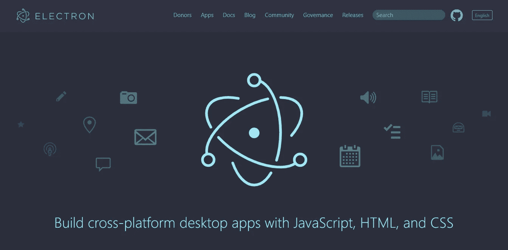
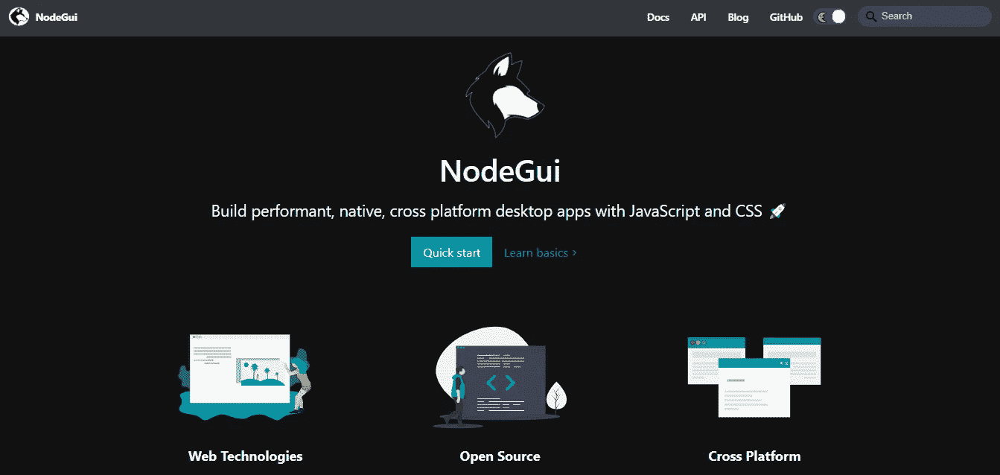
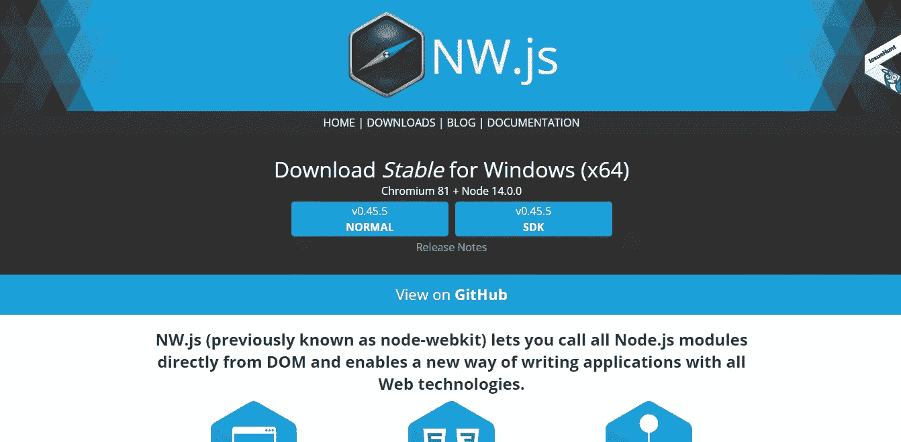
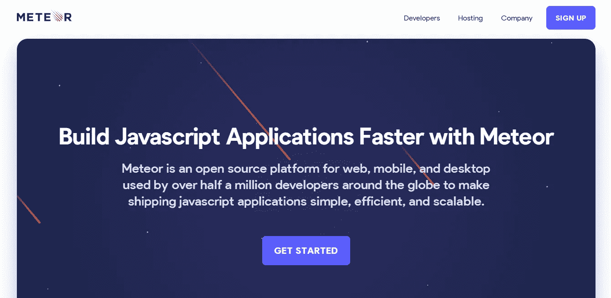
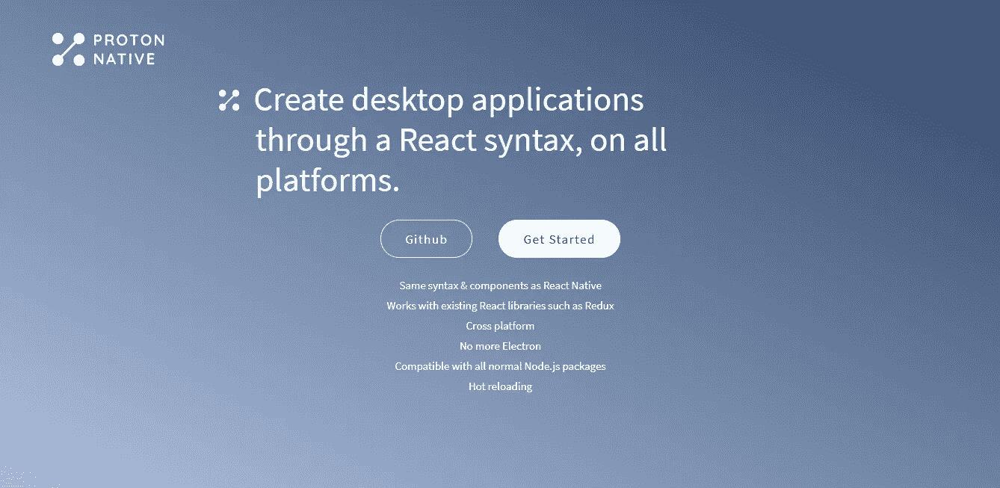

# 用于构建桌面应用程序的 JavaScript 框架

> 原文：<https://javascript.plainenglish.io/javascript-frameworks-for-building-desktop-applications-35ee2370f25d?source=collection_archive---------1----------------------->

## 可用于创建桌面应用程序的最佳 JavaScript 框架

不久前，使用 JavaScript 开发桌面应用是不可能的。但是现在 JavaScript 开发人员可以利用他们的 web 开发知识创建桌面应用程序。

在本文中，我将带您了解创建桌面应用程序的最佳 JavaScript 框架

## [1。电子](https://www.electronjs.org/)

[ElectronJS](https://www.electronjs.org/)

Electron 是由 GitHub 开发和维护的开源框架。它允许跨平台兼容性，这意味着您可以使用 Mac、Windows 和 Linux 创建应用程序。Electron 使用 Chromium 和 Node.js，所以你可以用 HTML、CSS 和 js 创建你的应用。它通常重用 web 应用程序的业务逻辑、设计和一般结构。大多数流行的桌面应用程序都是使用 electronic 构建的(Visual Studio Code，WhatsApp，Slack 等)

## [2。NodeGUI](https://docs.nodegui.org/)

[NodeGui](https://docs.nodegui.org/)

NodeGui 是一个用 JavaScript 和 CSS 创建跨平台原生桌面应用的开源框架。它允许您创建真正的本机应用程序，它提供了一组与平台无关的核心本机小部件，可以直接映射到平台的本机 UI 构建块。NodeGui 小部件构建在成熟的桌面应用框架 [Qt](https://www.qt.io/) 之上。还有一个基于 React 的版本[。](https://react.nodegui.org/)

## [3。NW.js](https://nwjs.io/)

[NW](https://nwjs.io/)

NW.js 是英特尔开源技术中心结合 Chromium 引擎和 Node.js 框架构建的开源框架。由于这种组合，它以前被称为 Node-WebKit。它完全支持 Node.js APIs 和所有第三方模块，因为您可以直接从 DOM 和 Web Workers 调用 Node.js 模块。此外，它还提供了 JavaScript 源代码保护。

## [4。流星](https://www.meteor.com/)

[Meteor](https://www.meteor.com/)

Meteor 是一个用于开发现代 web 和移动应用程序的全栈 JavaScript 平台。Meteor 包括一组用于构建连接客户端反应式应用程序的关键技术、一个构建工具和一组来自 Node.js 和普通 JavaScript 社区的精选包。它有前端和后端模块，包括 API，构建工具，Node.js 包。

## [5。质子原生](https://proton-native.js.org/#/)

[Proton Native](https://proton-native.js.org/#/)

Proton Native 对台式机所做的与 React Native 对手机所做的一样。构建面向桌面的跨平台应用，同时不离开 React 生态系统。Redux 等流行的 React 包仍然有效。它让您可以跨平台无缝地管理状态和构建 ui。

我希望你会发现它们有用！如果你有自己的建议，请在下面的评论中分享。谢谢，注意安全！