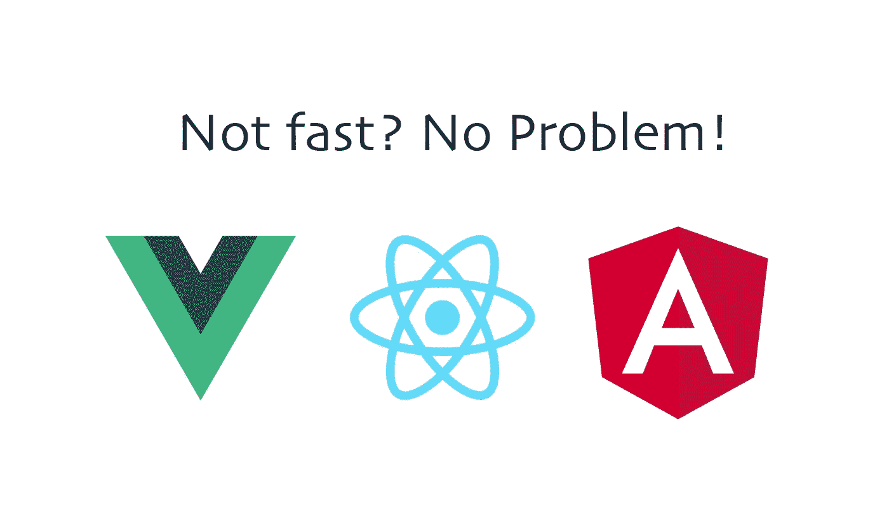
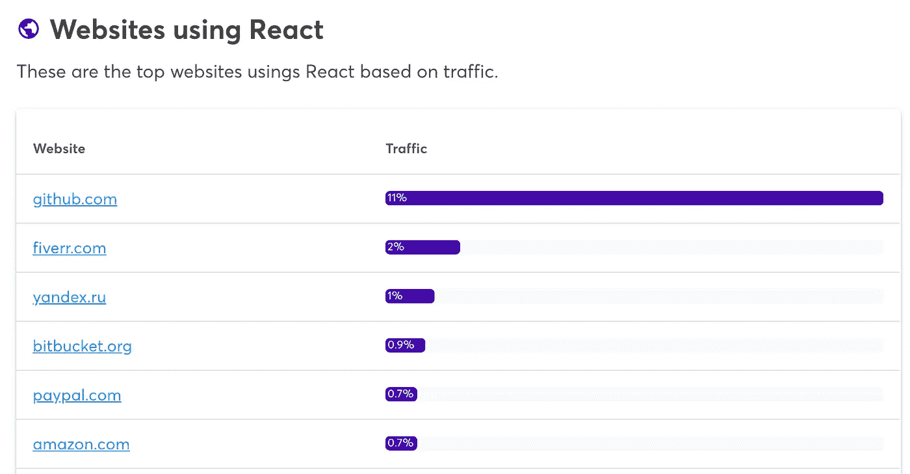

# 框架永远不会像普通 JavaScript 那样快

> 原文：<https://javascript.plainenglish.io/javascript-frameworks-performance-60f71d321693?source=collection_archive---------1----------------------->

## 在大多数情况下——这很好

Source: the author

像 React.js、Vue、Angular 这样的框架和库，其实是每个 web 开发者知识中固定的一部分。在开始一个新项目之前，通常不再有使用哪个框架的问题。是用 Angular，Vue，还是 React.js，往往是一个口味问题。然后，您只需要决定应该使用哪些附加工具和哪个后端。

看看向您展示如何使用 JS 框架的平台就可以证实这一点——世界上大多数最重要的网站都是建立在复杂的框架和库之上的。

Souce: [Wappalyzer](https://www.wappalyzer.com/technologies/javascript-frameworks/react/)

但是一次又一次，古老的讨论出现了:
**JavaScript 框架能和普通的 JS web 应用一样快吗？**T3 答案是**否**。这其中的原因以及为什么它一点也不差——这篇文章会给你答案。

# 即使使用服务器端渲染也不行…

JavaScript 框架能和 Vanilla-JS 一样快吗？

服务器端渲染和客户端渲染的讨论显然是偏向一方的。在大多数情况下，服务器端呈现，或者不需要 JavaScript 呈现的静态页面更优越。

为什么会这样很容易解释。

**服务器端渲染(rendered) /静态:**将完成 HTML 结构的页面发送到客户端浏览器。客户端浏览器通过 HTML 结构直接知道它应该显示什么。

**客户端渲染:**服务器向客户端浏览器发送 HTML 模板，该模板还没有完成的结构。HTML 模板被读取和处理，它请求一个或多个大的 JavaScript 文件。这些也是送的。当处理 JavaScript 时，建立页面的 HTML 结构。只有这样，浏览器才能直观地显示它应该显示的内容。

所以客户端渲染显然走了弯路，这通常会对性能产生负面影响。

许多人错误地认为，服务器端渲染将 React.js 或 Vue 应用程序变成了一个 HTML 结构的页面，只加载最必要的 JavaScript 代码。但这并不完全正确。
根据这篇论文，React.js 和 Next.js 中的同一个应用程序(一次 CSR，一次 SSR)在 Next.js 的情况下必须小得多——因为 React.js 背后的所有逻辑都将被丢弃。但事实并非如此。

为了证明这一点，我在 Next.js 和 React.js 中编写了完全相同的应用程序——这两个应用程序都被制作成了生产版本，并在谷歌 Chrome 的网络选项卡中查看哪个更大。就是 Next.js app。

差不多大了 50 kb。

我用纯普通 JS 再次实现了同一个应用程序。大小为 2.5kb。总尺寸。Next.js 与客户端呈现的 React.js 应用程序大小相同的原因是因为仍然包含所有 React.js 逻辑。例如状态和虚拟 DOM 所需的所有逻辑。

让我们面对它——服务器端渲染加速了网站的第一次内容绘制，但框架本身仍然必须在后台加载。

让我们面对它——服务器端渲染加速了网站的第一次内容绘制，但框架本身仍然必须在后台加载。因此，服务器端渲染永远不会像 vanilla-JS 中实现的相同应用程序那样快。通常情况下——为什么框架仍然有它们的权限，我们现在将谈到这一点。

# 最佳实践和安全性

我刚刚提到，普通的 JS 应用程序应该总是比用框架实现的相同应用程序更快。对于正常情况，我指的是非常重要的一点:香草 JS 应用程序正确实现的情况。

这是贯穿整个技术领域的东西。每个人都在谈论性能，但几乎没有人谈论它是如何实现的。他们很快表示，编程语言 A 比编程语言 B 性能更好。但这只有在正确编程的情况下才成立。**如果你写了糟糕的代码，并且打中了自己的膝盖，那么纸上的性能有什么用？**

我在 Next.js、React.js 和 Vanilla JS 中实现的小应用程序只能显示一个可以通过按钮增加的数字。使用这样的框架完全是夸大其词，因为您可以用几行 JavaScript 实现 onClick 事件和 DOM 操作。

但是即使是我的例子也是从用什么来更新 DOM 中的数字这个问题开始的。`innerHTML`、`innerText`还是`textContent`？

在 Vanilla-JS 中有很多方法可以实现同样的事情。对于选择 DOM 元素，也有不好的做法和好的做法。糟糕的决策总是会导致更糟糕的表现。

大多数 JavaScript 框架要简单得多。它们不仅是我们可以使用的功能的集合，也是它们自己的哲学，为我们如何正确做事提供了一个框架。这是我真正欣赏他们的地方。

因此，JavaScript 框架提供了一系列特性，使我们更容易构建应用程序——最重要的是，更容易构建高性能的应用程序。
以下是一些更有用的功能，其中大部分都包括在内:

以下是许多框架提供的更有用的特性:

## 组件模型

如果没有它，很难想象用可重用的组件来构建所有东西。它让一切变得更愉快、更快捷、更好维护。这个概念不仅用在 JavaScript 框架中，也用在其他技术中。例如，即使在后端，视图渲染框架也可以用来实现 MVC 模型，并将应用程序的所有可视部分分解成组件。

多亏了组件，我们不仅节省了大量的精力，而且它们还允许我们将视觉与状态同步——这在几乎任何框架中都是可能的。在 Vue.js 中有用于此目的的数据，在 React.js 中有状态。

我发现组件模型特别好的一点是，在某个时候你开始用它来思考。每当我对一个应用程序有了新的想法，我都会绘制一些草图，并组织组件结构。

## 惰性装载

只在我们需要的时候加载 web 应用程序的一部分是非常强大的。所以初始负载越小，需要做的渲染就越少。惰性加载是一个特性，已经包含在许多框架中，并且易于使用。尤其是许多框架的面向组件的理念使得使用延迟加载非常有用。

## 记忆化

React.js 中已经包含的另一个特性——当然，您也可以在 vanilla JS 中实现内存化，但是框架或库的官方特性总是首选方式。对于 React，带有 React.memo 的技术是可用的，其他技术也提供类似的功能，或者可能很快就会推出。

## 随时可以工作的环境

在一个私人项目中，有一天我注意到了这一点——我想完全使用普通的 JavaScript。但这也意味着一切都要从头开始——不仅是代码，尤其是配置。在通常的 CLI 中，几乎所有内容都已包含在内。

从 TypeScript 到 JavaScript 和从 Sass 到 CSS 的代码转换很快就可以完成，并且可以非常容易地集成到框架引导的世界中。甚至最小化和代码转换通常也包括在内——这对初学者来说很好。

# 摘要

JavaScript 框架很棒。他们有他们的理由，他们的优势是香草 JS 的劣势。就性能而言，反之亦然。但是性能真的那么差吗？不，我不这么认为。服务器端渲染、缓存、延迟加载&压缩为加速 JavaScript 框架提供了坚实的帮助。当然，它总是以某种方式变得更好——但在某一点上，进一步优化没有意义，因为毫秒并不会真正影响用户体验。

一次又一次，你会看到一些人想要开始一个新的项目，并直接努力追求完美——所以他们完全用普通的 JS 构建他们的应用程序——这比他们简单地使用一个框架要花费更长的时间。此外，对错误的敏感性通常更高。

为什么这么多大公司也依赖 JavaScript 框架？不是因为他们没有技术专长来构建一个完整的普通 js 应用程序，而是因为它易于使用，并且他们可以节省很多钱。

## 例外

还记得标题说在大多数情况下框架总是比普通 JS 慢吗？这只有在 Vanilla JS 开发得当的前提下才成立。

框架的问题在于，它们提供了大量的代码，其中一部分根本没有使用或者使用得太少。然而，从高度的复杂性来看，即使是一个普通的 JS 应用程序也会变得非常大——而且错误率也更高。一个普通的 JS 开发人员不太可能比每个框架背后的团队工作得更干净。

## 清晰的线条

在我看来，每个项目都有一条清晰的界线，什么时候使用框架有意义，什么时候没有。
这个限制可以通过考虑**专业知识、时间、性能和应用**的复杂性来确定。当然，对于一个有经验的普通 JS 开发人员来说，在没有框架的情况下实现一个计算身体质量指数的应用程序更有意义。

另一方面，有这样一种情况，许多开发人员不再想在没有 NPM 包和框架的情况下工作。当我在 React.js 中实现一个只有一个组件的小应用程序时，我自己也犯了这个错误。当然，完全没有必要。

感谢您的阅读:)

[**加入我的邮件列表保持联系**](http://eepurl.com/hacY0v)

关于 React.js 的更多信息:

 [## 您可以在 React.js 中使用的 4 个有用的 JavaScript 简写

### 以下是我最喜欢的提供更少更清晰代码的短手。而且不仅仅在 React.js 中

medium.com](https://medium.com/javascript-in-plain-english/4-useful-javascript-shorthands-you-can-use-in-react-js-ca9d2600bf3f)  [## React + TypeScript 入门

### 结合两者的基本好处

medium.com](https://medium.com/javascript-in-plain-english/react-typescript-813b02ff3672)