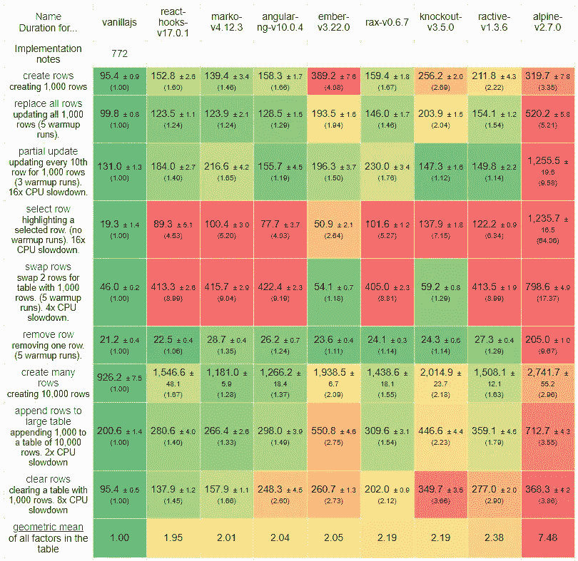
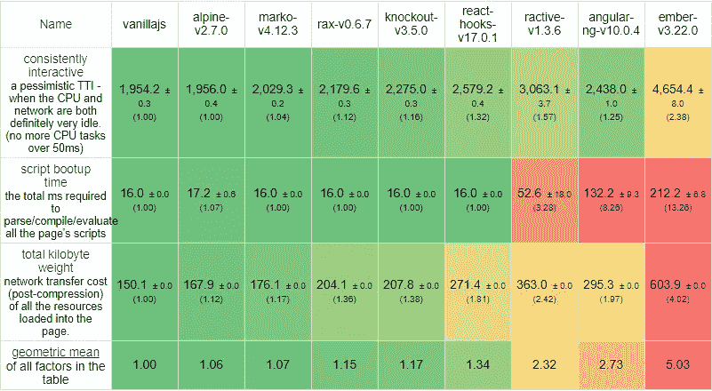

# JavaScript 框架，2020 年性能比较

> 原文：<https://javascript.plainenglish.io/javascript-frameworks-performance-comparison-2020-cd881ac21fce?source=collection_archive---------0----------------------->

## JavaScript 框架之间的终极性能之战

我浏览了一下网页，意识到我们已经两年多没有一个好的 JavaScript 框架性能测试了。所以在 2020 年结束之前，让我们来玩一玩这些库之间的竞争。

把 20 个最流行的 JavaScript 框架放在一起使用 [JS 框架基准](https://github.com/krausest/js-framework-benchmark)怎么样？

> **免责声明:**这种比较是为了好玩，或许在过程中有教育意义。和往常一样，这里的每个库对大多数事情来说都足够好。如果有的话，这应该强调性能可以来自各种不同的技术和技巧。虽然您可以将此作为参考，但是您应该独立地验证您的单个用例的性能。你可以在这里找到最新的官方结果。如果你想了解更多关于这个基准测试的内容，我在这里发布了一个[指南](https://dev.to/ryansolid/making-sense-of-the-js-framework-benchmark-25hl)。
> 
> 同样值得一提的是，我是《坚实框架》的作者。所以我不可能在这里表现出任何偏见。但我的意图是让数字自己说话。抛开这些不谈，享受比较吧。

# 竞争

我拿了 JS 框架基准测试的最新 [Chrome 87 键控结果。这些是在 Fedora 33 下的 Core i7 剃刀刀片 15 上运行的，其中缓解被关闭。](https://krausest.github.io/js-framework-benchmark/2020/table_chrome_87.0.4280.66.html)

我过滤掉了所有有问题的实现，然后我抓取了 Github stars 排名前 20 的库。对于有多个版本的库，我使用了他们的最新版本和最具性能的变体，而没有使用第三方库。

1. [Vue](https://github.com/vuejs/vue) (177k)
2。[反应](https://github.com/facebook/react) (161k)
3。[角度](https://github.com/angular/angular) (68.9k)
4。[苗条](https://github.com/sveltejs/svelte) (40.5k)
5。[预动作](https://github.com/preactjs/preact) (27.9k)
6。[会员](https://github.com/emberjs/ember.js) (21.7k)
7。 [HyperApp](https://github.com/jorgebucaran/hyperapp) (18.2k)
8。[魔族](https://github.com/infernojs/inferno) (14.6k)
9。[暴动](https://github.com/riot/riot) (14.4k)
10。[红豆杉](https://github.com/yewstack/yew) (14.2k)
11。[秘银](https://github.com/MithrilJS/mithril.js) (12.5k)
12。[高山](https://github.com/alpinejs/alpine) (12.4k)
13。[脱模](https://github.com/knockout/knockout) (9.9k)
14。[马尔科](https://github.com/marko-js/marko) (9.9k)
15。 [Rax](https://github.com/alibaba/rax) (7k)
16。 [lit-html](https://github.com/Polymer/lit-html) (6.9k)
17。[榆木](https://github.com/elm) (6.2k)
18。[反应型](https://github.com/ractivejs/ractive) (5.8k)
19。[固体](https://github.com/solidjs/solid) (4.7k)
20。 [Imba](https://github.com/imba/imba) (4.1k)

> **注意:**我将使用 LitElement 实现作为 lit-html 示例，因为标准实现已经标记了一个问题。开销应该是最小的，因为它是包装在单个 web 组件中的原始 lit-html。

这是当前 web 开发生态系统的一个很好的部分。虽然 Github Stars 不是最终的目标，但是在比较中有超过 100 个库，所以我需要标准来选择我们的竞争者。

每个库将在 3 个方面进行比较:DOM 性能、启动指标和内存使用。此外，我将框架分成了 4 组，以便更好地与它们的原始性能进行比较。然而，我将在所有 3 个方面的图书馆排名。

在每个组中，都有一个普通的 JavaScript 引用条目。这种实现使用所有最好的技术进行了极大的优化，以获得最佳性能。它将作为所有比较的基线。

所以让我们开始吧。

# 第 4 组—标准性能

这是最大的一组，由一些最受欢迎的库组成。还有许多公司支持的企业，如脸书、谷歌、易贝和阿里巴巴。这些库要么不太关注性能，要么在某个方面突出性能，但在其他方面却表现不佳。

Group 4 Performance

> 这里有很多红色和橙色，但请记住，这些库平均只比我们在这里使用的手工制作的命令式香草 JavaScript 示例慢 2 倍左右。400ms 和 200ms 有多大区别？

在原始性能方面，React 是这一系列产品中的佼佼者。虽然它从未停止令人惊讶的给予如何不同的架构，如何密切反应，马尔科，角，烬在这里总的来说。不过，React 是 React 钩子的实现，它是这里的领导者。对于所有那些指向额外函数创建和坚持类的人来说，性能的论点并不在你这边。React 挂钩是使用 React 最有效的方式。

这里的大多数库要么是简单的列表排序导致交换行性能很差，要么是创建成本很高。Ember 是这方面的一个极端例子，因为它的更新性能比这个组中的其他人好得多，但创作却是最差的。

最慢的库(Knockout、Ractive 和 Alpine)都是具有相似架构的细粒度反应库。Knockout 和 Ractive(也是《苗条》的作者 Rich Harris)来自 VDOM 图书馆统治之前的 21 世纪初。我还怀疑 Alpine 是否期望用少量的 JavaScript 方法呈现 10k 行。直到比较的后期，我们才会看到另一个纯细粒度的反应库。

接下来，我们将主要基于库的捆绑包大小来比较启动度量。

Group 4 Startup

订单在这里变化很大。在 Alpine 性能最差的地方，我们可以看到它具有最小的包大小和最快的启动时间。Marko(来自易贝)紧随其后，Rax(来自阿里巴巴)紧随其后。所有这 3 个库都是为服务器端渲染而构建的，主要与客户端交互较少。这很大程度上是为什么他们在第 4 组的表现，但在这里领导创业。

表格的后半部分是我们在基准测试中拥有的一些最大的包，以 Ember 结尾，其大小是任何其他实现的两倍多。不知道为什么渲染这个表要半兆多。但是它确实损害了启动性能。

我们要看的最后一个类别是内存消耗。

Group 4 Memory

内存倾向于反映我们已经看到的模式，因为它对性能有很大的影响，较大的库倾向于使用更多的内存。阿尔卑斯山，马尔科，和反应领路。老化的细粒度反应库使用最多的 leading up to Ember。灰烬是巨大的。它使用的内存已经超过了 Vanilla 在页面上渲染 6 个按钮后在整个套件中使用的内存。

## 第 4 组结果

总的来说，这个群体代表了 GitHub 上超过 30 万的明星，可能是 NPM 下载量最大的部分，但在这个群体中，Marko 和 Alpine 的平均排名最高。React 在他们之后排名第三，尤其是在性能方面。

在这个群体中，我们拥有巨大规模的框架，而我们旧的反应式库已经走向死亡。让我们转向更乐观的话题。

# 第 3 组——绩效意识

在这些框架中，您可以看出已经对性能进行了一些考虑。他们意识到了规模，并在创建和更新成本之间找到了平衡。

我们看到了各种各样的方法。一个用 Yew 编写的 Web 组装框架(用 Rust 编写)，一个用 LitElement 编写的 Web 组件。最近发布的 Vue 3 是向前迈出的一大步，它脱离了第 4 组，与你过去可能见过的不同的框架竞争。

事不宜迟，我们来看看他们的表现。

Group 3 Performance

分数上升了一点，我们看到了更加均匀的分布。Preact 是这一组中表现最好的，只是稍微落后一点点。Vue 3 和 Riot 并列在中间，这两个喜欢处于中间的库都有包括反应性和 VDOM 的历史。Mithril 是最早将性能放在首位的 VDOM 图书馆之一，也是唯一的 WASM 图书馆。

在性能方面，所有这些库都是相似的。这一组中没有纯反应库。无论是 VDOM 还是简单的标签模板文字差异，它们都使用自顶向下的渲染。与上一组相比，他们有一个更智能的列表协调(参见交换行性能)。但是，大多数仍然有一些最慢的选择行性能。

红豆杉是个例外，但它是缓慢的全面否则。让我们看看剩下的测试是否有所发现。

Group 3 Startup

事情发生了一些变化，但 Preact 在创业指标方面仍然领先。紫杉是这些图书馆中唯一真正大的图书馆。WASM 的图书馆确实更大。

我们再次看到一种配对的结果。Vue 是仅次于紫杉的第二大树种。Preact 和 Riot 相当紧凑。秘银和元素就在中间

Preact 是 react 的 4kb 替代品，绝对是我们迄今为止见过的最小的库。但是最小的图书馆还在后面。尽管如此，这个范围内的库不应该太关心它们的包大小。

Group 3 Memory

紫杉这次赢了。在所有测试的框架中，它的内存占用最小。WASM 图书馆在这方面做得很好。其他的都很接近。秘银和 Preact 是最差的，但也差不了多少。

从这里没有太多东西可拉。您可能会认为 LitElement 示例可能比其他非 Yew 库更轻便，因为它不像其他库那样使用虚拟 DOM。但是我们稍后会看到，VDOM 并不意味着更多的内存。

## 第 3 组结果

Riot 和 Preact 平均排名最高，其次是 LitElement，排名第三。Riot 虽然不突出，但在这个小组中没有弱点，并取得了胜利。但是很难对这些框架中的任何一个感到失望。有了 WASM 和 web 组件，他们代表了许多人认为的 Web 的未来。

但是我们还没有完成。下一组代表了对网络未来的不同看法。输入编译器…

# 第 2 组—绩效冠军

这个组竞争激烈。我们有大多数被称为编译语言的库。每一种都有自己的特色。我们有不变的结构榆树，红宝石启发 Imba，和“消失”的苗条。

> **注:**我注意到，并不是每个人都熟悉 Svelte 以前的“消失的框架”这个绰号。它描述了从输出中编译自身的能力。我不是说斯维特会去任何地方。抱歉造成了混乱。

最奇怪的是 HyperApp，和其他人完全相反。没有编译器。没有模板。只有`h`函数和一个最小的虚拟 DOM。

想猜猜会怎样吗？

Group 2 Performance

最小虚拟 DOM 胜出。与最近的言论相反，事实证明虚拟 DOM 不仅仅是性能差的原因，编译也没有给其他库提供帮助。

在编译过的库中，我们实际上看到了 3 种不同的渲染方法，它们的平均性能都差不多。Imba 使用 DOM 调和(更接近我们前面看到的 LitElement)，Elm 使用虚拟 DOM，last Svelte 使用组件反应性系统。

您应该注意到虚拟 DOM 库具有最差的选择行，因为这是它们额外工作的地方。但是这些库也有更快的初始渲染。如果你仔细观察目前为止的结果，你会注意到虚拟 DOM 库与反应式库之间的这种共享特征。但除此之外，性能是紧张的。

所以我们继续吧。我们的编译器在启动时间/包大小方面表现如何？

Group 2 Startup

正如你所看到的，虚拟 DOM 库不仅性能更好，而且比其他的更小。事实上，HyperApp 是我们所有库中最小的实现。编译器不会在大小上胜出。

它和 Svelte 都比我们普通的 JavaScript 参考版本小。这怎么可能呢？抽象以一种更可重用的方式编写，产生更少的代码。普通的 JS 实现是针对性能而不是大小进行优化的。

Elm 在这一组中仍然处于竞争中。然而，Imba 开始进入一些第 4 组库的范围。

那就剩下记忆了。编译器大放异彩的最后机会。

Group 2 Memory

内存很接近，几乎是平局，但 Svelte 最终为编译器赢得了胜利。一些甜蜜的报复虚拟 DOM 显示比它更小更快。

老实说，所有这些库都有很好的内存配置文件。现在应该很清楚更少的内存和更好的性能之间的关系了。

## 第二组结果

不要相信炒作？

不。更多的事情比表面上看起来要复杂一些。设计良好的系统，无论是运行时还是编译时，或者无论采用何种技术方法，都可以成为高性能的系统。

HyperApp 是这个组的明显赢家，它的尾巴很苗条，其次是 Elm 和 Imba。有了这种对性能的专注，你就知道这些库在大多数情况下都可以交付，并且总是出现在基准测试的顶端。

那还剩下什么？

如果我告诉你有一些声明式 JavaScript 库对它们的性能如此自信，以至于它们不害怕原始的 WASM、web workers 或任何你扔给它们的技术，那会怎么样？欢迎来到…

# 第 1 组——性能精英

在某一点上，这可能被称为“惊人的快”，我相信这曾经是这些图书馆的标语之一。如果你一直在跟踪，只剩下两个库了。事实上，这个类别中有少数几个库在不断地挑战极限。但是受欢迎的只有 2 个。它们比手工优化的原始 JS 平均慢不到 20%。

这是值得一看的。这里我们有两个库，如果看它们的代码，可能会被认为是兄弟，但使用完全不同的方法。Inferno 是世界上性能最好的虚拟 DOM 库之一。没错，前 5 名中有 3 名是虚拟 DOM 库。选择行测试的减速可以被视为证据。

另一方面，Solid 使用细粒度的反应性，就像第 4 组中一些最慢的旧库一样。奇怪的地方，这种技术再次出现，但固体解决了他们的弱点，因为我们可以看到。创建时间和更新时间一样快。与普通 JavaScript 5%的差距是不可思议的。

奇怪的是，Inferno 和 Solid 的共同点是 JSX 模板和 React 启发的 API。也许这不是你所期望的，因为所有这些库都有优化的定制 DSL。但是正如 HyperApp 所显示的，有些事情对性能的影响比人们想象的要小。

Group 1 Startup

Solid 加入了 HyperApp 和 Svelte 作为第三个库，比普通的 JS 实现要小。但是 Inferno 也不逊色。

虽然高性能库的规模较小，但有时添加更多代码可以提高性能。更好的列表协调算法，更明确的保护，更精细的更新。

Inferno 可能比前几组中的一些库要大，但它仍然是一个 10kb 以下的库，并且在性能上几乎胜过所有库。

Group 1 Memory

这就是了。除了紫杉和它对 WASM 的使用，这些是整个竞争中消耗内存最少的框架。鉴于他们的表现，这不应该太令人惊讶。

这种内存消耗数字反映了对对象和闭包的仔细考虑。这很大程度上来自于两个库都做的自定义 JSX 转换。

这种内存性能的提高对于 Solid 尤其重要，它像大多数细粒度的反应式库一样，以 CPU 开销换取内存消耗。能够克服内存开销是 Solid 能够采用与一些最慢的库非常相似的技术并使其成为最快的一个重要原因。

## 第一组结果

天空是无限的。

…或者说普通的 JavaScript。但是我们这里有声明性库，在性能上非常接近，你永远不会知道区别。当 DOM 是我们要面对的东西时，仔细考虑一下，许多不同的技术可以有效地渲染 DOM。

我们在这里看到了。Solid 凭借一项十年前就被认为陈旧而缓慢的技术摘得性能桂冠，而 Inferno 再次表明，没有什么是虚拟 DOM 不能高效完成的。

# 结论

在构建 JavaScript 前端时，我们有很多选择。这只是对框架带来的性能开销的一个粗略的介绍。当谈到应用程序的实际性能时，用户代码有更大的影响。

但是我在这里真正想强调的是，测试您的解决方案并了解其性能是非常重要的。现实总是与营销不同。虚拟 DOM 不一定会很慢。编译器不能保证产生最小的包。定制模板 DSL 不能保证是最佳的。

最后，我将向您展示显示所有库的完整表格。仅仅因为一个库接近末尾并不一定意味着它很慢，而是因为它比这些强劲的竞争对手得分更低。

# 所有框架

一个图表中的所有框架。

## 表演

## 启动

## 记忆

# 最终排名

所有结果都被加入到一个列表中(第一名得 20 分，最后一名得 1 分)。在平局的情况下，性能结果优先。

1.**固** (57)
二。 **HyperApp** (54)
3。**魔族** (51)
4。**苗条的** (51)
5。**榆树** (46)
6。**暴动** (40)
7。**预动作** (39)
8。 **Imba** (36)
9。 **lit-html** (36)
10。**红豆杉** (32)
11。**Vue**29
12。**秘银** (29)
13。**马尔科** (28)
14。**高山** (28)
15。**做出反应**【19】
16。 **Rax** (16)
17。**角度** (12)
18。**脱模** (11)
19。**反应** (8)
20。**余烬** (6)

特别提及激发本文灵感的 [AJ Meyghani](https://medium.com/u/18fb1859d435?source=post_page-----cd881ac21fce--------------------------------) 的 2018 年对比:

 [## JavaScript 框架，性能比较

### JavaScript 框架之间的终极性能之战

medium.com](https://medium.com/@ajmeyghani/javascript-frameworks-performance-comparison-c566d19ab65b)