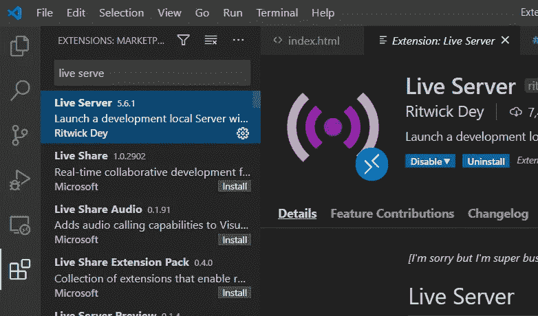
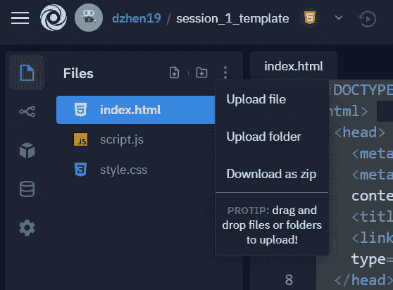
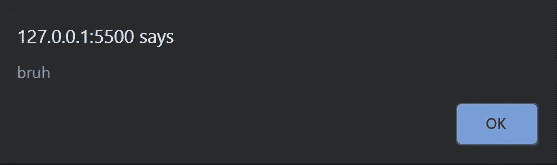
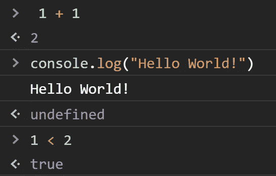
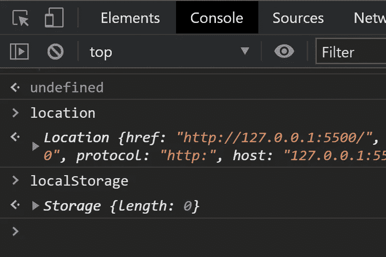
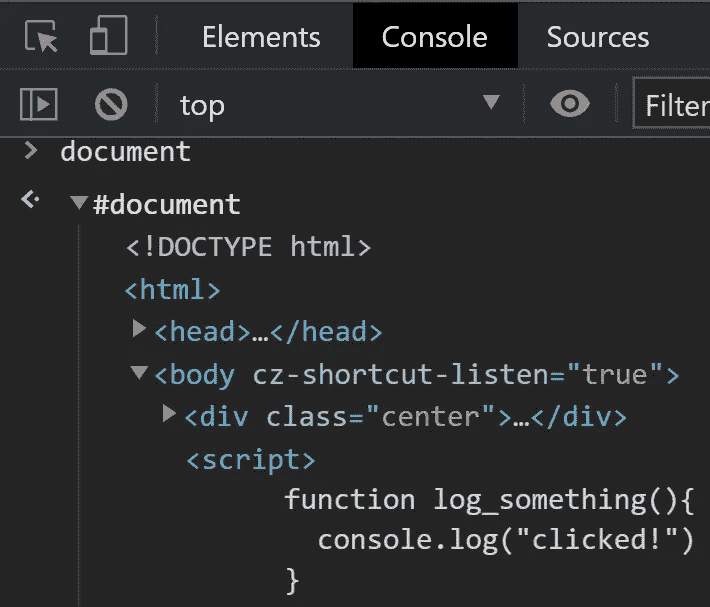
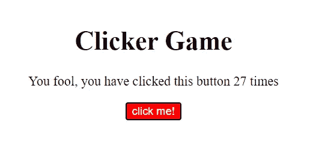

# 通过构建一个简单的点击游戏来学习 JavaScript DOM 基础知识

> 原文：<https://javascript.plainenglish.io/javascript-fundamentals-w-cookie-clicker-part-1-a82eed004150?source=collection_archive---------2----------------------->

## 变量类型、JavaScript 函数、DOM 等等！

DSC Session #2

## 先决条件:

*   你知道编程中有哪些函数和变量，也知道一些基本的 HTML。
*   在本教程中，我将使用一个名为 VS Code 的 IDE。如果你还没有设置好，你可以在这里下载
*   我还将使用名为 Live Server 的 VS 代码扩展，当我更新任何 HTML、CSS 或 JavaScript 时，它会自动重新加载我的 chrome 页面。这是可选的，但是您可以通过在扩展选项卡上搜索 Live Server 并安装扩展来获得它。



*   我将要编写的样板代码仍然可以在 [repl.it](http://repl.it) 中找到。您可以在这里找到存储库[。你可以下载这个回购协议，首先分叉，点击**文件**旁边的省略号，然后**下载为 zip** 。](https://repl.it/@dzhen19/session1template)



*   你可以把这个文件夹拖到 VS 代码里面开始编码！

# HTML 中的 JavaScript？？

JavaScript 是浏览器的语言，所以我们可以通过使用一个`<script />`标签将 JS 直接嵌入到我们的标记中。我们通常希望 HTML 在 JavaScript 之前加载，这就是为什么`<script />`标签通常位于`<body>`标签的末尾附近。

在 VS 代码中打开`index.html`,随意地添加一个`h1`标签，给你的网站添加一些内容。现在，为了使用我前面提到的 Live 服务器扩展，我们需要做的就是单击窗口右下角的“Go Live ”:


窗口应该会自动弹出。尝试编辑您的`h1`，页面应该会自动重新加载。

让我们将 JavaScript 的第一部分放到我们的`index.html`文件中。在`<body>`内，放下:`<script>alert("bruh")</script>`

这是我目前掌握的情况。

```
<body>
      <h1>
          Clicker Game
      </h1>
    <script>
        alert("bruh")
    </script>
  </body>
```

实时服务器现在将重新加载，您应该会注意到弹出一个警告，其中包含我们传递到`alert()`中的字符串



很酷吧？JavaScript 是在考虑浏览器的情况下构建的，因此 JS 中的许多特殊函数引用了浏览器的特定功能(比如弹出警告)。我们很快会看到更多。

## 使用 Chrome 开发工具和浏览器控制台

JavaScript 是一种解释语言，对我们来说很棒，因为我们可以使用浏览器的控制台来测试 JavaScript 代码片段。您可以使用 Windows 上的`ctrl-shift-c`和 Mac 上的`option-cmd-J`来使用开发工具。现在点击“控制台”选项卡。

您现在可以直接在控制台中开始编写 JavaScript 了:



如果您来自 Python，这一切都应该很熟悉。这与在终端中与 Python 控制台接口没有什么不同。你可以把`console.log()`想象成蟒蛇`print()`的陈述。我们可以在代码中随时调用`console.log`来打印出有用的调试信息。

# 3 种将 JavaScript 放到 HTML 中的方法

## **1。直接在 HTML 元素中嵌入 JavaScript。**

尝试将下面的代码粘贴到您的`index.html`中，并通过检查您的控制台来验证 JavaScript 是否运行。

下面的标记创建了一个按钮元素，单击时会调用一些 JavaScript。事实证明，某些事件允许我们直接调用 JavaScript。`onClick`、`onMouseOver`、`onMouseExit`都是不言自明的例子。

```
<button onclick="console.log('clicked!')">  
        press me!
      </button>
```

有问题的是，我们的 JavaScript 也不会像`console.log`一样是一行。此外，我们可能希望在事件处理程序之外使用 JavaScript 特性。因此，我们需要一个更可持续的解决方案，将 JavaScript 放入 HTML 中。

## 2.

除了在 HTML 元素中直接嵌入 JavaScript 之外，我们还可以通过将 JavaScript 包含在`<script>`标签中来编写 HTML。下面是使用我们的`<script>`标签实现的按钮记录器元素:

```
<button onclick="log_something()">  
        press me!
      </button> <script> 
      function log_something(){
        console.log("clicked!")
      }
    </script>
```

我们没有直接在元素中编写 JavaScript，而是在`script`标签中编写了一个 JavaScript 函数。`script`标签中的任何内容在整个`index.html`中都是全局的。因此，当事件`onclick`发生时，通过调用函数`log_something()`，我们可以`console.log`“点击”。

**我刚才是不是介绍了 JavaScript 函数？？**你打赌我赢了。它们并不复杂。在 JavaScript 中，我们用`function`关键字声明一个功能块(就像 Python 中的`def`)。)我们在后面加上括号，在括号中我们可以声明我们的参数。最后，我们将函数块放在花括号内。分号是可选的。

```
function log_2(){
   console.log(1+1)}
```

暂时不要担心理解一切。您仍然可以在不理解所有 JavaScript 的情况下编写 JavaScript。

## 3.script.js 使用其他文件

你可以看到嵌入式 JavaScript 是如何很快变得一团糟的。这就是为什么我们将在`script.js`中编写 JavaScript 并将其导入到我们的 HTML 中。我们可以通过向我们的`<script>`标签添加一个`src`参数，并将其设置为脚本文件的字符串地址来实现。像这样:

```
<script src=”script.js”> </script>
```

为了在`script.js`中重新创建日志按钮的逻辑，我们必须做一些事情。

1.  给按钮一个`id`
2.  通过按钮元件的`id`定位按钮元件
3.  添加一个监听点击的事件监听器
4.  将事件监听器的动作设置为`console.log`，或者调用`console.log`的函数

第一步很简单。我们所要做的就是给按钮一个 id 属性:

```
<button id="btn" >press me! </button>
```

你可能还记得我们上次使用 CSS 选择器来定位某个`class`的元素。因此，通过将多个元素设置为同一个`class`，我们可以重用我们的样式。你可以把`id`想象成`class`，但是是针对 JavaScript 而不是 CSS 的。`id`仅仅是我们唯一识别元素的一种方式。

现在，**第二步**是在`script.js`中定位我们的标记按钮，我们必须调用一个名为`document.getElementById()`的函数。这个函数完全按照您的预期来做(在给定一个 id 字符串的情况下获取元素)。)我将在下一节解释我所说的“获取元素”的确切含义。现在，让我们用`id`“BTN”来实现我们的按钮。

```
document.getElementById("btn")
```

**第三步**是将我们的事件监听器添加到现在定位的按钮中。现在很难解释这是如何工作的，所以请耐心等待，输入以下内容。

```
document.getElementById("btn").addEventListener("click");
```

如果您现在检查您的控制台，您会发现一条错误消息，通知我们`addEventListener`实际上有两个参数。第一个论点是要听的事件。第二个参数是事件被确认时要采取的操作。

因此，**第四步**就是加入那个动作。我们可以通过两种方式做到这一点:

```
document.getElementById("btn").addEventListener("click", console.log("clicked"))const some_action = () => {
    console.log("clicked")
}
document.getElementById("btn").addEventListener("click", some_action)
```

**关于 JavaScript 中的箭头函数的一个简短说明**

哇哇哇，这是怎么回事？我以为函数是用`function xxx (){}`声明的。`const xxx () => {}`是怎么回事？

在 JavaScript 中，函数可以赋给变量。在这种情况下，常数`some_action`指的是一个函数。`const`是一种 JavaScript 变量。

`()=>{}`只是`function () {}`的简称。实际上，两者是完全相同的。

您还会注意到，我们将函数名直接传递给了`addEventListener`的第二个参数。这是因为当我们的事件被检测到时，这个函数会被自动调用。你不必知道这是如何或为什么工作的，但只要记住**将函数名传递给事件监听器**。不是字符串(`“some_action”`)，不是调用(`some_action()`)，只是函数名本身。

# 文档对象模型

但是 JavaScript 如何知道操纵标记呢？我们如何在 HTML 中实现逻辑并呈现动态内容？答案是 DOM，文档对象模型。

`script`标签将我们的 JavaScript 链接到标记，但它也让我们的 JavaScript 访问一个`window`对象。可以把`window`想象成 JavaScript 中的一个对象。如果您是面向对象编程的新手，我建议您在继续之前先熟悉对象和类。

我们之前调用的方法`alert`实际上是`window.alert()`的简写。同样，我们之前使用的`console.log`方法实际上是调用了`console`的`log`方法，它是`window`中的一个子对象。如果这让你感到困惑，现在不要担心。

只要知道我们基本上可以通过引用`window`来访问浏览器拥有的任何属性或方法。如果我们想在页面上保存一些信息，我们可以操作`window.localstorage`；如果我们想获得当前的 URL，我们可以访问`window.location`。

**但在实际操作中，** **我们几乎不会写** `**window**` **。编写`localstorage`或`location`就足以访问它们的方法和属性，因为解释器假设我们在隐式引用`window`。你可以通过在 chrome 控制台中记录这些属性来验证这一点。**



同样通过这个 DOM 魔术，我们的 JavaScript 可以访问我们的标记元素。之前，当我们打电话给:

```
document.getElementById("btn").addEventListener("click", some_action)
```

我们实际做的是参考`window.document`。`getElementById`有效地将我们的 HTML 元素作为 DOM 对象返回。所以不是我们在`index.html`中写的标记包含了监听事件的能力。它实际上是 DOM，因此也是浏览器的能力。请记住，DOM 是由浏览器基于我们的标记、CSS 和 JavaScript 生成的。

在控制台中记录`document`将有助于说明我的意思。你会注意到`document`看起来几乎和我们的标记一模一样。几乎相同，但不完全相同，因为再次，**浏览器生成 DOM。**



# 构建迭代器

我们的游戏很简单。我们所需要的是一个标题，一些厚脸皮的文字表明你点击了按钮多少次，以及按钮本身。以下是我想到的标记:

```
// index.html<!DOCTYPE html>
<html>
  <head>
    <meta charset="utf-8">
    <meta name="viewport" content="width=device-width">
    <title></title>
    <link href="style.css" rel="stylesheet" type="text/css" />
  </head>
  <body>
    <div class ="centered">
    <h1>Clicker Game</h1>
    <p>You fool, you have clicked this button <span id="counter"></span> times</p>
    <button class="bigRed" id="btn">click me!</button>
  </div><script src="./script.js"></script>
  </body>
</html>
```

这里有一些 CSS 来配合它:

```
// style.css
.bigRed{
    background-color: red;
    color: white;
}.centered{
    text-align: center;
    margin: 10%;
}
```

到目前为止，我的页面是这样的:


This is probably how cookie clicker started out

**空的** `**span**` **标签是怎么回事？**一个`span` 标签是一个不换行的`div`。在这种情况下，我希望我的累加器以一个漂亮的句子形式显示信息，当我重复单击按钮时，它会改变。

现在，要设置我们的累加器，我们必须首先声明一个存储累加值的变量。在 JavaScript 中，我们使用关键字`var`、`let`和`const`来声明变量

三者的区别在于:`const`变量不能重定义，`let`变量不能重声明，`var`变量两者都允许。

**声明和定义**之间的区别在下面的代码块中演示:

```
// declaring an element by stating its type
var i
//defining an element by giving it a value
i = 5
//define & declare in the same line
const j = 10// redeclaring an element by restating its type. Currently, i is of type let, which allows us to redefine but not redeclarelet i = 2
i = 10// these will throw errors: //throws an error because let i cannot be redeclared
const i//throws an error because const j cannot be redefined. 
j = 12
```

在我们的`script.js`中，写入…

```
//script.js
let x = 0
document.getElementById("counter").innerHTML = x
document.getElementById('btn').addEventListener("click", iterate)function iterate(){
    x += 1
    console.log(x)
    document.getElementById("counter").innerHTML = x
}
```

上面的 JavaScript 应该给我们一个有效的点击器，它迭代每次点击并在标记中显示其计数:



它是如何工作的？

`document.getElementById(“counter”).innerHTML = x`将带有`counter`的 HTML 的`id`的元素绑定到值`x`，我们的 JavaScript 能够操纵这个值

`document.getElementById(‘btn’).addEventListener(“click”, iterate)`将按钮的点击事件绑定到一个名为`iterate`的函数，我们在下面定义了这个函数。

在`iterate`中，我们简单地增加`x`并刷新元素`counter`的`innerHTML`。

## 奖金

如果我们想在页面刷新后保存我们的计数器呢？在这种情况下，我们必须使用浏览器提供给我们的另一个`window`对象`localStorage`。`localStorage`以键:值格式存储信息，其中键和值都是字符串。

下面是一个点击游戏的代码，它在页面刷新后保持其计数:

```
let x
// if the key value pair exists, we set x equal to the stored value
// else, set x to 0if (localStorage.getItem("count")){
    x = parseInt(localStorage.getItem("count"))
} else{
    x = 0
}document.getElementById('btn').addEventListener("click", iterate)
document.getElementById("counter").innerHTML = xfunction iterate(){
    x += 1
    localStorage.setItem("count", x)
    console.log(x)
    document.getElementById("counter").innerHTML = x
}
```

在上面的代码块中，我们实际上只有几个方法没有遇到。

`localStorage.setItem("count", x)`这个方法有两个参数。第一个是代表我们的密钥的字符串。第二个是我们想要存储的值。当我们调用`localStorage.setItem`时，我们将`x`作为一个字符串存储在一个键值对中，并将`"count"`作为我们的键。

`localStorage.getItem("count")`这个方法接受键值并返回给我们一个字符串。

`parseInt(some_string)`这个方法把一个字符串变成一个整数。

现在您已经了解了一些 DOM 基础知识，是时候开始构建一些交互式 web 应用程序了！干杯。