# JavaScript 高阶函数

> 原文：<https://javascript.plainenglish.io/javascript-higher-order-functions-2d6e3e390208?source=collection_archive---------17----------------------->

Photo by Xuanhao on Hackwagon

如果你曾经在学习 JavaScript 时听说过高阶函数这个术语，并且因为它听起来很难而放弃了，那就不要再害怕了。虽然“高阶”部分可能使它看起来像是一个复杂的主题，但它真的不是。为了更好地理解 JavaScript 中的高阶函数，你需要对什么是*函数式编程*和*一级函数的概念有一个牢固的理解。*

函数式编程是通过组合纯函数、避免共享状态、可变数据和副作用来构建软件的过程。用更简单的行话来说，函数式编程就是你可以将函数作为参数传递给其他函数，也可以将它们作为值返回。功能代码往往更加精确，易于测试和预测。

JavaScript 将函数视为对象。它们是一种特殊类型的对象，称为*函数*对象。我们可以像对待对象一样给函数添加属性。您可以将它们作为回调函数的参数传递给其他函数，也可以将它们赋给变量。

# 高阶函数

高阶函数是接受和/或返回另一个函数的函数。之所以称之为*高阶函数*是因为它不是对字符串、数字或布尔值进行操作，而是对函数进行*高阶*。一些被广泛使用的高阶函数有: *Array.prototype.forEach()、Array.prototype.filter()、Array.prototype.map()、Array.prototype.sort()、Array.prototype.reduce()。*

## Array.prototype.forEach()

的。forEach()方法按升序为给定数组中的每个元素调用一次提供的 ***回调*** 函数。回调用 3 个参数调用:元素的值、元素的索引和被遍历的数组对象。

的示例。forEach()方法:

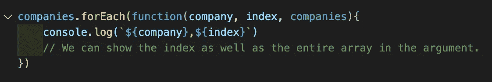

将记录:

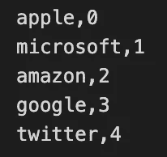

的。forEach()方法看起来比使用 for 循环迭代数组干净得多:

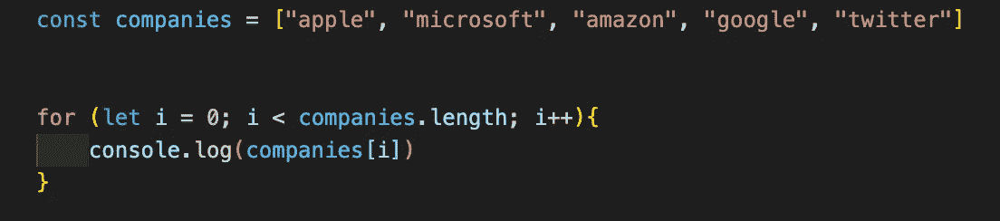

Here we are using a simple for loop and displaying the elements on the console

## Array.prototype.filter()

的。filter()方法返回一个新数组，该数组包含通过回调函数提供的条件的所有元素。的。filter()方法接受 3 个参数:*元素、索引*和*数组。*

不使用。filter()方法:

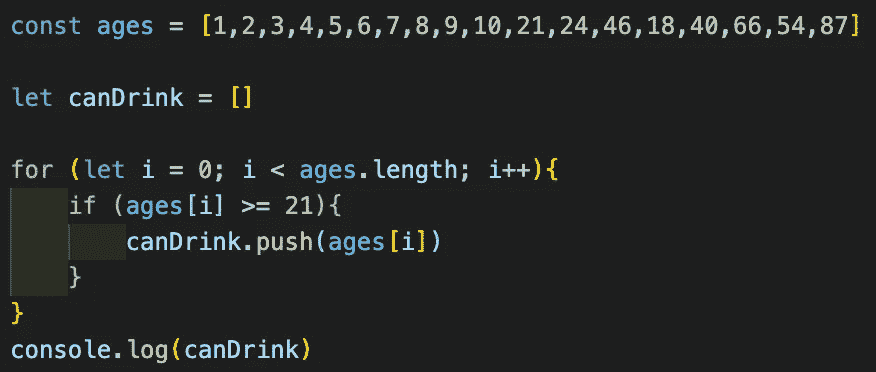

We have an array of ages and we are looking to see how many elements are 21 and older.

日志:

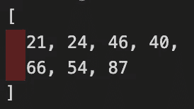

的示例。filter()方法:

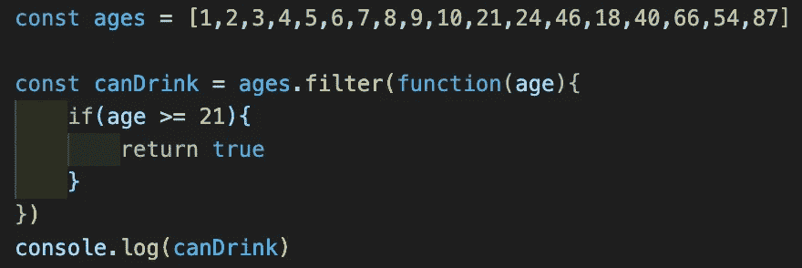

这可以用 ES6 语法做成一行:

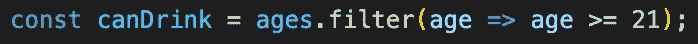

Much cleaner code!

这将与上面的 console.log 相同。

## Array.prototype.map()

的。map()方法通过调用回调函数返回一个新数组，该函数作为输入数组中每个元素的参数提供。的。map()方法将从回调函数中获取每个返回值，并使用这些值创建一个新数组。传入的回调函数。map()可以接受 3 个参数，*元素*、*索引*和*数组*。

的示例。map()方法:

.map() creates a new array with the conditional and leaves the original array intact

日志:

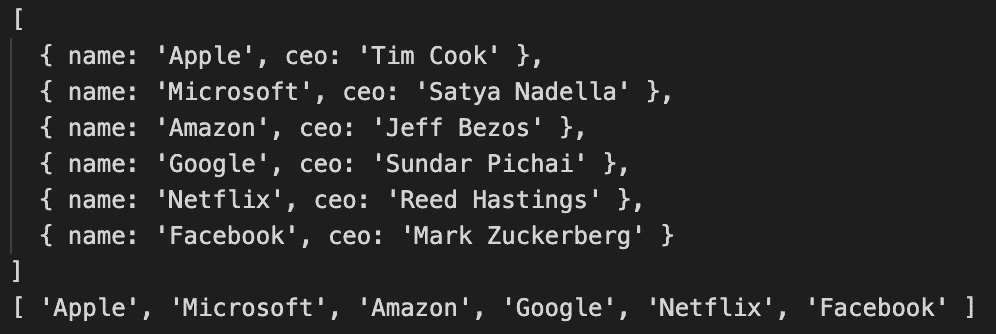

## Array.prototype.sort()

的。sort()方法对数组中的元素进行排序。排序顺序可以是字母或数字，也可以是升序或降序。默认情况下，sort 方法将值作为字符串按字母和升序排序。

的示例。sort()方法:

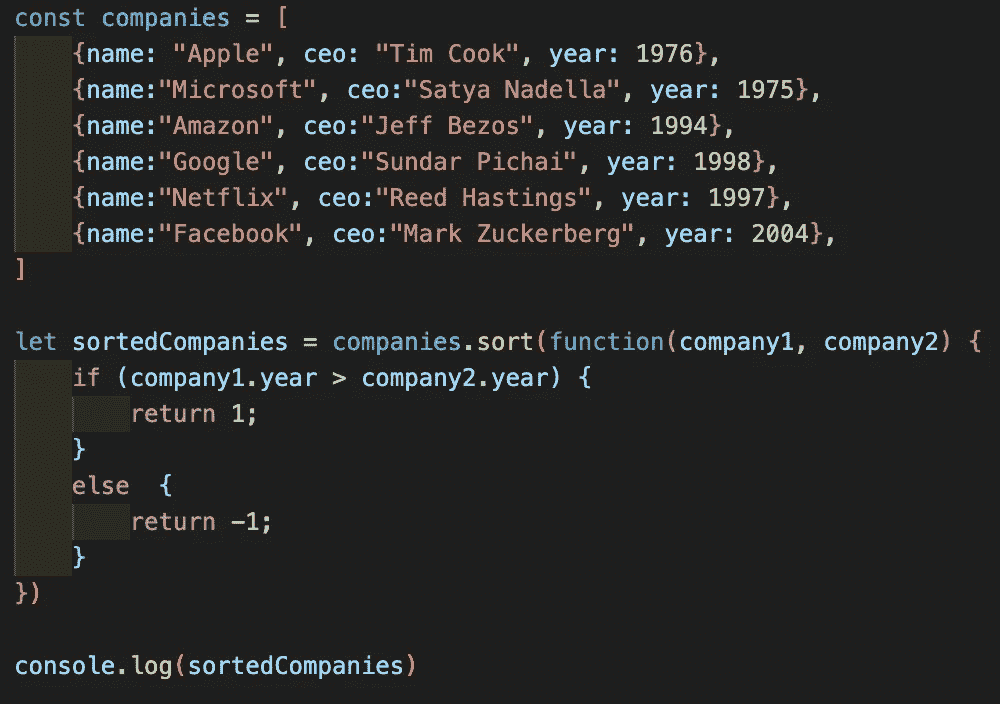

Using a comparing function to sort the company year founded

日志:

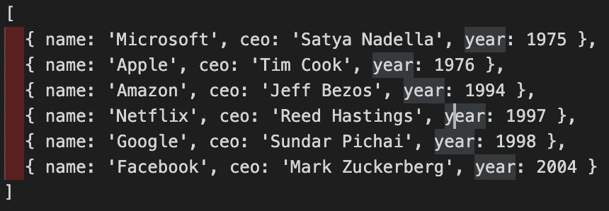

其可以使用 ES6:

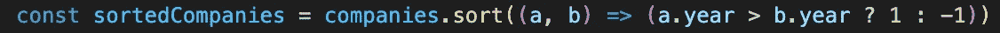

Much cleaner

## Array.prototype.reduce()

的。reduce()方法对输出单个值的输入数组中的每个元素运行回调函数。该方法接受两个参数: ***缩减函数*** (回调函数)，以及一个可选的 ***初始值*** 。reducer(回调)函数接受 4 个参数: ***【累加器】******当前值******当前索引******源数组*** 。

如果提供了初始值，那么累加器将等于初始值，当前值将等于数组中的第一个元素。如果没有提供初始值，那么累加器将等于数组中的第一个元素，当前值将等于数组中的第二个元素。

一个没有的例子。reduce():

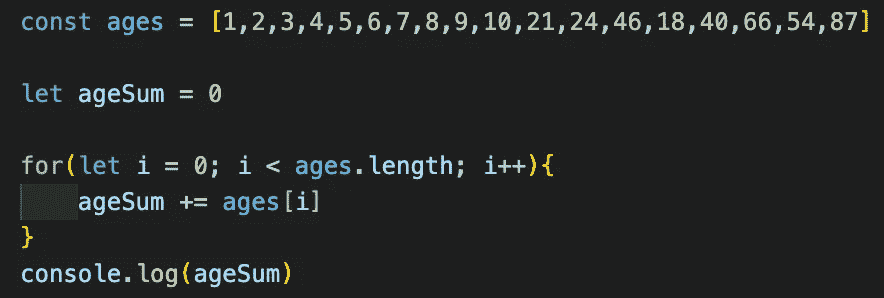

Logs 411 as the sum.

一个例子。reduce():

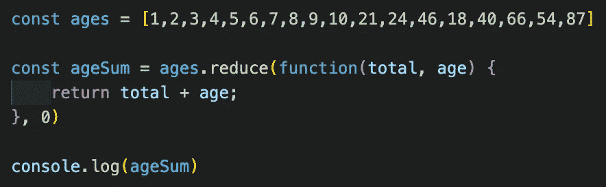

Returns 411 as the sum

作为一个使用 ES6:

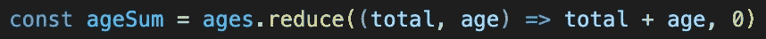

# 结论

我们现在明白为什么高阶函数被认为是“高阶”了。高阶函数接收一个函数作为参数，甚至可以返回一个函数。有了对函数式编程的扎实理解，在你的程序中使用高阶函数将会让你成为一名专业的程序员！