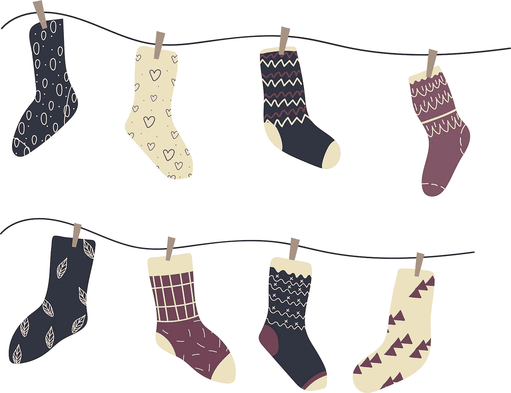
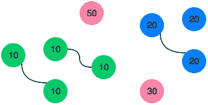
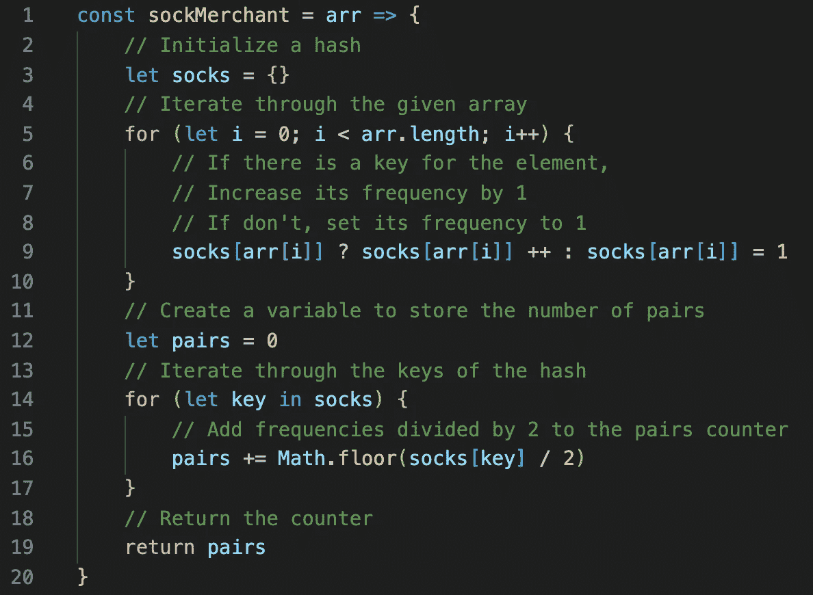
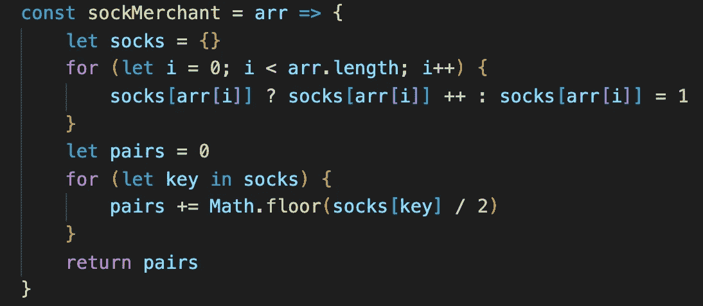

# JavaScript:如何解决袜子商家问题

> 原文：<https://javascript.plainenglish.io/javascript-how-to-solve-the-sock-merchant-problem-58e7d487db11?source=collection_archive---------11----------------------->

## 来自 HackerRank 面试准备工具包的挑战



Image by [anastacia bankulova](https://pixabay.com/users/nbankulova-14764963/?utm_source=link-attribution&utm_medium=referral&utm_campaign=image&utm_content=5320929) from [Pixabay](https://pixabay.com/?utm_source=link-attribution&utm_medium=referral&utm_campaign=image&utm_content=5320929)

对于本周的算法，我从 [HackerRank](https://www.hackerrank.com/dashboard) 中挑选了一个名为[袜商](https://www.hackerrank.com/challenges/sock-merchant/problem)的问题。我稍微调整了挑战，因为我们不会使用袜子数量的第二个参数:

给定一个表示每只袜子颜色的整数数组，确定有多少双颜色匹配的袜子。

这个问题陈述了给我们一个整数数组，其中每个数字代表袜子的一种不同颜色。我们需要编写一个函数，返回列表中匹配袜子的总数。

```
**Example:****Input:** 10 20 20 10 10 30 50 10 20
**Output:** 3
```

**上述例子的说明:**



我们将使用一种简单的方法来解决这个问题，方法是创建一个 hash map，它跟踪表示颜色的数量作为键，跟踪这些颜色在数组中出现的频率作为值。最后将计算并返回配对总数。

让我们通过列出将带领我们找到解决方案的步骤来直面挑战:

1.  创建一个空对象，将每种颜色的袜子数量存储为键，将它们的计数/频率存储为值。
2.  遍历包含每只袜子颜色的给定数组，检查当前元素是否作为键存在于 map 中。
3.  如果有；将其值增加 1。
4.  如果没有，将元素作为值为 1 的键添加到地图中。
5.  循环结束后，声明一个 pair counter 变量来添加每个键的对数。
6.  遍历 map 的每个键，将它们的值除以 2，用`Math.floor`向下舍入，通过只保留除法的整数部分来消除不成对的袜子，并将结果添加到计数器中。
7.  循环结束后返回总计数。

以下是 JavaScript 中的解决方案:



我们需要找出在一个包含不同颜色袜子列表的给定数组中有多少双袜子。我们首先创建一个名为`socks`的对象，每个颜色作为一个键，每个键的出现次数作为一个值。在第二个 for 循环中，我们找到每种颜色袜子的数量，然后返回这些袜子的总数(`pairs`)。这是我们的解决方案，没有注释:



## 复杂性

**这种方法的时间复杂度**是 **O(n)** 其中`n`是给定数组的大小。这是一个有效的解决方案，因为它只遍历数组一次，然后遍历`socks`对象的键。**这个解决方案的空间复杂度**也是 **O(n)** ，因为我们创建的地图需要额外的空间。

我希望你喜欢解决这个编码挑战。感谢您的阅读，如果您想了解用 JavaScript 解决的不同算法，请查看我的其他文章:

[](https://medium.com/the-innovation/javascript-the-two-sum-problem-904b140a5ed2) [## JavaScript:两个和问题

### 来自 LeetCode 的顶级面试问题列表

medium.com](https://medium.com/the-innovation/javascript-the-two-sum-problem-904b140a5ed2) [](https://medium.com/swlh/javascript-three-ways-to-reverse-an-array-32f9819e9a97) [## JavaScript:反转数组的三种方法

### 不使用反向方法

medium.com](https://medium.com/swlh/javascript-three-ways-to-reverse-an-array-32f9819e9a97) [](https://medium.com/swlh/javascript-chessboard-program-6740c855e44f) [## JavaScript:棋盘程序

### 来自雄辩 JavaScript 的练习

medium.com](https://medium.com/swlh/javascript-chessboard-program-6740c855e44f) [](https://medium.com/swlh/remove-adjacent-duplicates-problem-5b9ac4abe87f) [## 删除相邻重复问题

### 使用堆栈在 JavaScript 和 Ruby 中解决

medium.com](https://medium.com/swlh/remove-adjacent-duplicates-problem-5b9ac4abe87f) 

## **用简单英语写的 JavaScript**

你知道我们有三份出版物和一个 YouTube 频道吗？在[**plain English . io**](https://plainenglish.io/)找到一切的链接！