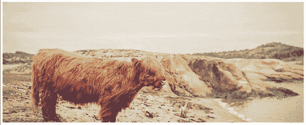

# 创建 JavaScript 图像滑块的初学者指南

> 原文：<https://javascript.plainenglish.io/javascript-image-slider-for-beginners-7630e71bab70?source=collection_archive---------8----------------------->


如果您是 JavaScript 新手，您很可能使用过某种图像滑块库。

在这篇文章中，你将学习如何自己创建一个简单的图像滑块，但它不会很花哨。

然而，在本教程结束时，您会对从头构建一个有很深的理解。



# 在 HTML 中添加静态图像

有三个静态图像包装在一个 div 元素中。

每张图片都有一个 src 属性，带有一个来自 [picsum](https://picsum.photos/) 网站的随机图片 URL。

相当直接。

```
<div>
  
  
  
</div>
```

接下来，我们将使用 CSS 默认隐藏所有图像，并使用 JavaScript 使它们按顺序一个接一个地出现。

# 默认情况下隐藏所有图像

在 CSS 中，我们将设置显示属性为 none，宽度为 img 选择器的 100%。

```
img {
  display:none;
  width:100%;
}
```

在这个阶段，所有的图像都将被隐藏。

让我们使用 JavaScript 让图像一个接一个地无限显示。

> ✅推荐
> [完整的 JavaScript 课程 2020:构建真正的项目！](https://click.linksynergy.com/deeplink?id=nsrC6aUWa3g&mid=39197&murl=https%3A%2F%2Fwww.udemy.com%2Fcourse%2Fthe-complete-javascript-course%2F)

# 逐个显示图像

在这个阶段，你可能想使用某种循环来实现这一点，对吗？

然而，我们有另一个更适合这种情况的选项，那就是使用 setInterval()方法。

setInterval()方法将重复调用函数或代码片段，每次调用之间有固定的时间延迟。

> 可以说，就性能而言，setTimeout()方法比 setInterval()更合适。为了简单起见，我将坚持使用 setInterval()方法。

首先，让我们获取所有的图像 DOM 元素，并将它们赋给一个 images 变量，这将是一个数组。

```
const images = document.querySelectorAll("img");
```

然后，我们将调用 setInterval()方法，该方法有两个参数:

*   回调函数
*   时间

```
setInterval(function(){
console.log("I run every 2 seconds indefinitely");
}, 2000)
```

在上面的例子中，作为第一个参数的回调函数将每隔 2 秒(2000 毫秒)重复运行一次，这在第二个参数中定义。

为了从 images 数组中一个接一个地显示所有三个图像，我们需要每 2 秒钟增加一个 images 数组的索引位置。

为此，在 setInterval 方法外部定义一个名为 I 的变量，初始值为 0。

```
let i = 0;
```

然后，使用 I 变量从 images 数组中获取第一个图像，并通过将 style.display 设置为 block 使其可见。

```
images[i].style.display = 'block';
```

然后将变量 I 递增 1；

i++；

当 setInterval()方法第二次运行时，I 变为 1，images 数组中的第二个索引图像将被设置为 display block。

```
const images = document.querySelectorAll("img"); let i = 0;setInterval(function(){
  images[i].style.display = 'block';
  i++;
}, 2000);
```

> 确保 i++语句在底部。这样，我们可以确保当 setInterval()方法第一次运行时，images 数组中的第一个索引图像是可见的。
> 
> 否则，我将被设置为 1，第一个图像将不会显示，它将直接跳到第二个。
> 
> ✅推荐
> [初学者 JavaScript 基础知识](https://click.linksynergy.com/deeplink?id=nsrC6aUWa3g&mid=39197&murl=https%3A%2F%2Fwww.udemy.com%2Fcourse%2Fjavascript-basics-for-beginners%2F)

# 在每个时间间隔隐藏图像

上述代码的一个问题是，当第二个图像出现在屏幕上时，第一个图像仍然可见。

隐藏前一个图像的最快方法是在使用 forEach 循环的 setInterval()方法的开头将所有图像设置为 display none。

```
const images = document.querySelectorAll("img"); let i = 0;setInterval(function(){

 images.forEach( (img, i) => {
    img.style.display = 'none';
  }) images[i].style.display = 'block';
  i++;}, 2000);
```

这样，每隔 2 秒，forEach 循环运行一次，并将所有图像的显示样式设置为 none。

不错！

> ✅推荐
> [在 JavaScript 的一个循环内添加点击事件](https://softauthor.com/javascript-add-click-event-listener-in-a-loop)

# 重复循环播放图像

如果 I 等于或大于图像数组的长度。

例如，我们在 images 数组中只有三个图像，所以最后一个索引值是 3。当 I 变成 4 时，会发生什么？

嗯…我们会得到以下错误:

*未捕获的类型错误:无法读取未定义的属性‘style’*

因此，我们需要做的是，当增量 I 变为 3 时，将它重置为零，以便当最后一幅图像可见时，它会返回到第一幅图像。

检查 I 是否等于图像样式显示设置为 block 的语句上方的图像数组长度。

```
const images = document.querySelectorAll("img"); let i = 0;setInterval(function(){   images.forEach( (img, i) => {
    img.style.display = 'none';
  }) if( i == images.length) {
    i = 0; 
  }

  images[i].style.display = 'block';

  i++;}, 2000);
```

这很有效。

然而，我发现当我们需要每 2 秒钟循环一次所有的图像时，效率会更低。

假设你有 100+张图片…是的！那将是低效的。

> ✅推荐
> [JavaScript:理解怪异的部分](https://click.linksynergy.com/deeplink?id=nsrC6aUWa3g&mid=39197&murl=https%3A%2F%2Fwww.udemy.com%2Fcourse%2Funderstand-javascript%2F)

# 重构代码

首先让我们去掉 setInterval()方法中的所有东西，除了 incrementer i。

```
const images = document.querySelectorAll("img"); let i = 0;setInterval(function(){ 
// get rid of everything in here
i++;}, 2000);
```

然后，如果 I 等于 0，则将第一索引图像显示设置为块

```
setInterval(function(){   if(i == 0) {
    images[i].style.display = 'block';
  }

 i++;

}, 2000);
```

当 setInterval()方法第二次执行时，通过用 1 减去 I 得到第一个索引图像，这给出了先前显示的图像，并将其显示设置为 none。

然后获取第二个索引图像，并将其显示设置为块。

```
setInterval(function(){   if(i == 0) {
    images[i].style.display = 'block';
  } else {
    images[i - 1].style.display = 'none';
    images[i].style.display = 'block';
  }

 i++;

}, 2000);
```

那看起来不错！

还有一个场景需要修复。

如果 I 等于图像数组长度呢？

创建 else if 语句，可以检查 I 是否等于图像数组长度。

在其中，将最后一个索引图像显示设置为 none，并将第一个索引图像显示设置为 block。

另外，将增量器变量 I 重置为 0。

```
setInterval(function(){   if(i == 0) {
    images[i].style.display = 'block';
  } else if(i == images.length ) {
    images[i - 1].style.display = 'none';
    images[0].style.display = 'block';
    i = 0;
  } else {
    images[i - 1].style.display = 'none';
    images[i].style.display = 'block';
  }

 i++;

}, 2000);
```

你有它！

如果你想给这个简单的滑块添加任何额外的功能，请告诉我。