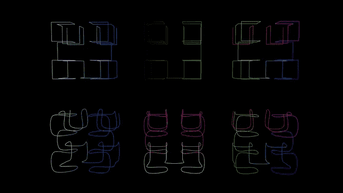
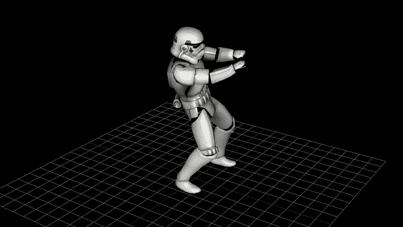
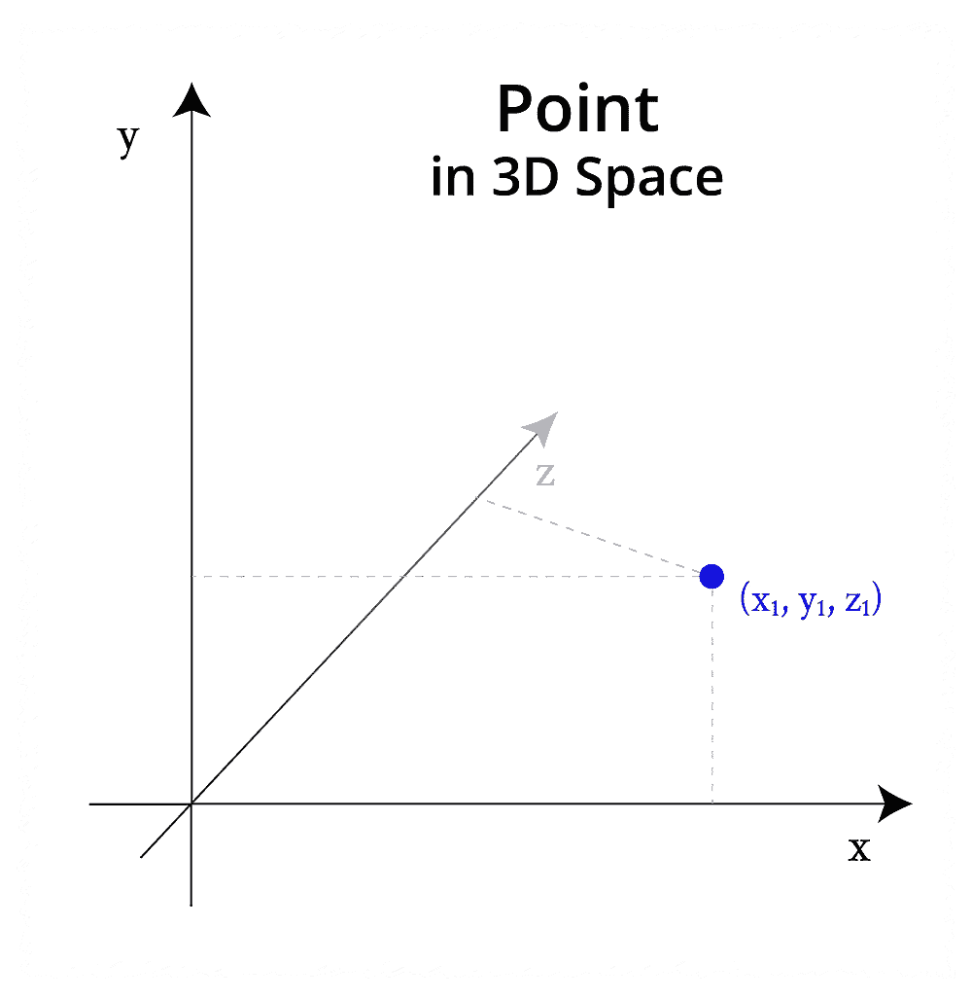
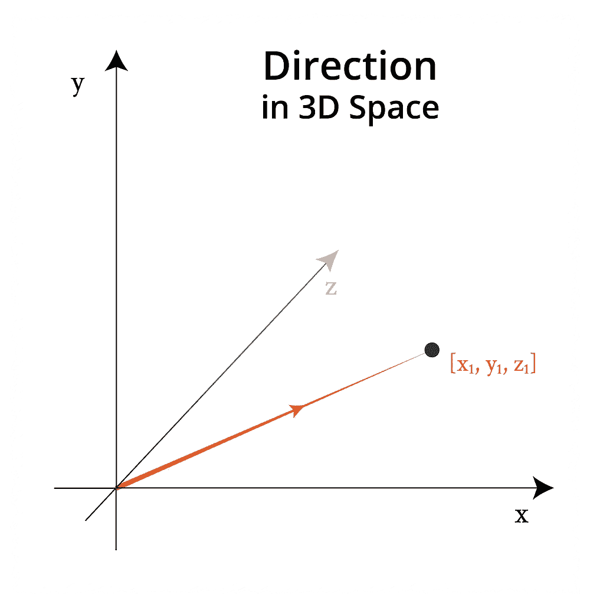
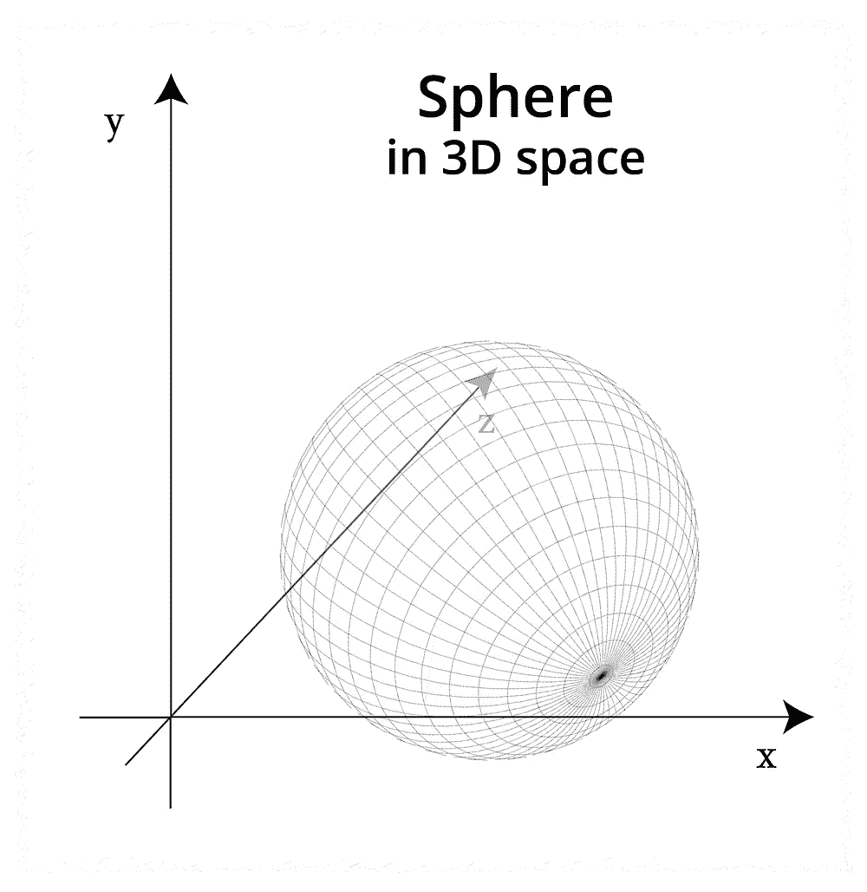
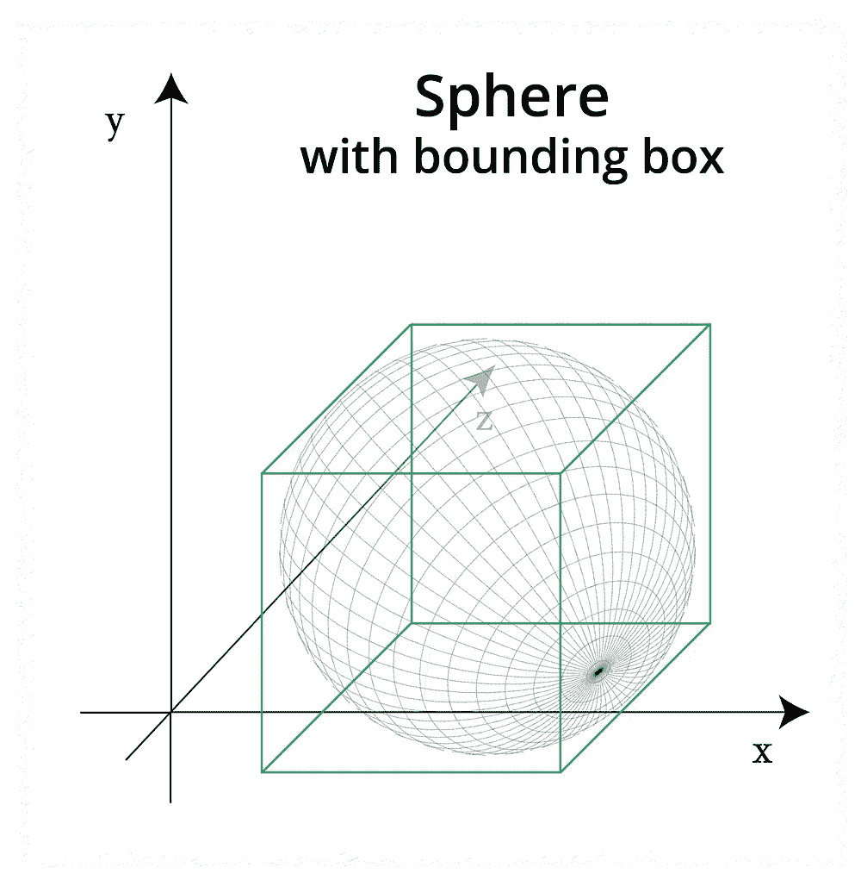
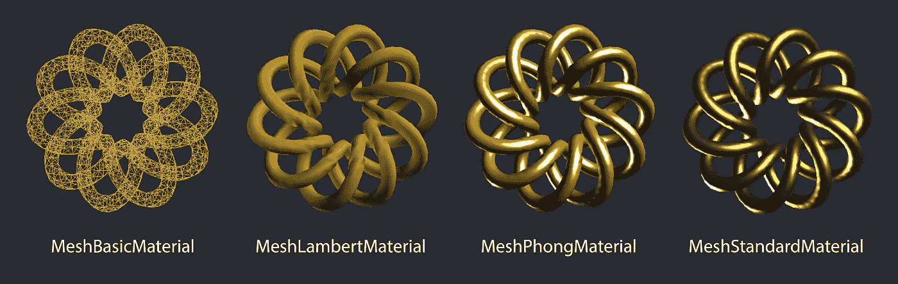

# 3D JavaScript:three . js 简介

> 原文：<https://javascript.plainenglish.io/javascript-in-3d-an-introduction-to-three-js-780f1e4a2e6d?source=collection_archive---------4----------------------->

## 如何为你的下一个网络应用带来三维空间


Photo by [Kari Shea](https://unsplash.com/@karishea?utm_source=unsplash&utm_medium=referral&utm_content=creditCopyText) on [Unsplash](https://unsplash.com/s/photos/laptop?utm_source=unsplash&utm_medium=referral&utm_content=creditCopyText), featuring [a Three.js render.](https://threejs.org/examples/#webgl_shaders_ocean)

hree.js 是一个强大的工具。它有助于以一种高性能和适应性的方式将 3D 设计和动画带到浏览器中。但是，如果你以前从未深入研究过 3D 编程的世界，那么开始会很棘手。

我有一些玩 Unity 游戏引擎和 C#的基本经验，但其他许多概念对我来说都是新的。我意识到没有很多初学者友好的资源，所以我决定写这篇文章。在这本书里，我们将会看到一个 Three.js 场景的主要元素，从网格和材质到几何体，加载器等等。

到本文结束时，您应该对为您的下一个 web 项目添加额外维度所必需的基本构件有了坚实的理解。



Three.js examples by [Ben Houston](https://threejs.org/examples/#webgl_lights_physical), [Thomas Diewald](https://threejs.org/examples/#webgl_lines_colors) and [StrykerDoesAnimation](https://threejs.org/examples/#webgl_loader_collada_skinning).

# 向量和盒子——基本的构建模块

通常，Three.js 中最重要的两个类是`Vector3`和`Box3`。如果你是 3D 新手，这些东西可能听起来有点抽象，但你会经常遇到它们！

## 向量 3

最基础的 3D 类，包含三个数字`x`、`y`、`z`。这可用于表示 3D 空间中的点或方向和长度。例如:

```
const vect = new THREE.Vector3(1, 1, 1);
```



Points are locations in space. Vectors are displacements in space.

很多 Three.js 构造函数将`Vector3`对象作为参数，包括下面的`Box3`。

## 方框 3

这个类代表一个长方体(3D 盒子)。它的主要目的是获得其他对象的边界框——也就是说，3D 对象可以放入的最小长方体。每个`Box3`都与世界轴`x`、`y`和`z`对齐。

下面是如何使用`Vector3`创建一个盒子:

```
const vect = new THREE.Vector3(1, 1, 1);
const box = new THREE.Box3(vect);
```

下面是如何基于现有的 3D 对象创建一个盒子:

```
const box = new THREE.Box3();
box.setFromObject(object);
```



A sphere in 3D space. On the right, the sphere’s bounding box is shown.

尽管您可以在没有这些知识的情况下创建网格，但是一旦您开始尝试移动或操纵您的模型，这些类将会派上用场。现在，我们将从抽象的东西转移到我们能看到的东西上来！

# 网状物

在 Three.js 中，场景中的基本视觉元素是一个`Mesh`。这是一个由三角形组成的 3D 对象。它由两个物体构成:

*   定义其形状的`Geometry`，
*   一个`Material`——定义其外观。

这些定义可能会稍微复杂一些(例如，`Geometry`可能包含颜色数据)，但这是主要的区别。

# 几何学

根据您的用例，您可能希望在 Three.js 中定义一个几何图形，或者从文件中导入一个几何图形。

使用像`THREE.TorusKnotGeometry`这样的函数，我们可以用单行代码创建看起来复杂的形状。我们一会儿就会谈到这个问题，但首先让我们来看几个简单的形状。

最简单的 3D 形状，长方体或盒子，可以用`width`、`height`和`depth`来定义:

```
const geometry = new THREE.BoxGeometry( 20, 20, 20 );
```

对于一个球体，我们需要提供的最少信息是`radius`、`widthSegments`和`heightSegments`。后两个变量告诉我们模型应该使用多少个三角形来表示球体:数字越大，球体的外观越平滑:

```
const geometry = new THREE.SphereGeometry( 20, 64, 64 );
```

如果我们想做出尖的或三角形的形状，一个选择是圆锥。它的参数是提供给前面两个几何图形的参数的混合。下面，我们指定`radius`、`height`和`radialSegments`。

```
const geometry = new THREE.ConeBufferGeometry( 5, 20, 32 );
```

这些只是一些最常见的形状。Three.js 有很多内置的几何图形，你可以在文档中查看[。对于本教程的大部分内容，我们将使用一个更有趣的形状，使用`TorusKnotGeometry`方法构建。](https://threejs.org/docs/index.html#manual/introduction/Creating-a-scene)

为什么这个形状看起来是这个样子已经超出了本教程的范围，但是我鼓励你使用这些值，因为你可以在一行代码中创建一些非常有趣的对象！

```
const geometry = 
  new THREE.TorusKnotGeometry(10, 1.3, 500, 6, 6, 20);
```

# 材料

几何定义了 3D 物体的形状，但不是它们的外观。为此，我们需要添加一种材料

Three.js 带有 10 种网格材料，每种材料都有自己的优点和可定制的属性。我们将研究几个最有用的。



Four of the most common material types in Three.js.

## 网状正常材料

*用途:快速起床跑步*

我们将从`MeshNormalMaterial`开始，这是迄今为止我们在示例中使用的多色材质。它将法向量映射到 RGB 颜色:换句话说，它使用颜色来区分向量在 3D 空间中的位置。

```
const material = new THREE.MeshNormalMaterial();
```

注意，如果你想改变`MeshNormalMaterial`的颜色，你可以简单地使用 CSS 滤镜，改变色调:例如`filter: hue-rotate(90deg)`。

根据我的经验，`MeshNormalMaterial`对于快速启动和运行最有用。为了更好地控制你的对象的外观，最好使用别的东西。

## 网状基础材料

*适用于:线框*

如果你想让你的物体有统一的颜色，你可以使用`MeshBasicMaterial`，因为它不受光线的影响。我发现这对于线框很有用。要使用线框模式，只需将`{ wireframe: true }`作为参数传递即可。

```
const material = new THREE.MeshBasicMaterial({ 
  wireframe: true, 
  color: 0xdaa520
});
```

基础材料的缺点是它没有提供关于材料深度的线索。每种材料都有线框选项，但一个包括深度的高性能解决方案是`MeshDepthMaterial`。

## MeshLambertMaterial

*适用于:高性能(但精度较低)*

这是第一个受灯光影响的材质，所以为了看我们在做什么，我们需要给我们的场景添加一些灯光。在下面的代码中，我们将添加一点黄色到聚光灯，以创建一个更温暖的效果:

```
const scene = new THREE.Scene();const frontSpot = new THREE.SpotLight(0xeeeece);
frontSpot.position.set(1000, 1000, 1000);
scene.add(frontSpot);const frontSpot2 = new THREE.SpotLight(0xddddce);
frontSpot2.position.set(-500, -500, -500);
scene.add(frontSpot2);
```

现在让我们为我们的形状添加材质。因为它看起来有点像一件珠宝，我想我会选择金色的。另一个属性`emissive`，是物体自身发出的颜色(没有任何光源)。通常，深色效果最好，比如深灰色，如下所示:

```
const material = new THREE.MeshLambertMaterial({
  color: 0xdaa520,
  emissive: 0x111111,
});
```

正如你在下面的例子中看到的，颜色或多或少是正确的，但它与光线相互作用的方式并没有产生最真实的外观。为此，我们需要使用`MeshPhongMaterial`或`MeshStandardMaterial`。

## 网状材料

*适用于:中等性能和精度*

这种材料提供了性能和外观之间的折衷，因此它是需要高性能同时实现比`MeshLambertMaterial`更高质量水平的应用的良好中间地带。

我们现在可以改变一个新的属性`specular`，它定义了表面反射的亮度和颜色。虽然`emissive`属性通常是深色，但`specular`属性通常是浅色效果最好。下面，我们使用浅灰色:

```
const material = new THREE.MeshPhongMaterial({
  color: 0xdaa520,
  emissive: 0x000000,
  specular: 0xbcbcbc,
});
```

从视觉上看，上面的图像以一种更有说服力的方式反射了光线，但它仍然不完美。白光有点太亮，材料看起来更像橡胶而不是金属(我们想要的效果)。使用`MeshStandardMaterial`我们可以得到更好的结果。

## 网格标准材料

*适用于:高精度(但性能较低)*

这是 Three.js 材料中精度最高的，尽管这是以牺牲更强的处理能力为代价的。`MeshStandardMaterial`带有几个附加属性— `metalness`和`roughness`，这两个属性的取值都在`0`和`1`之间。

`metalness`属性改变了物体的反射方式，使其在本质上更接近金属。这是因为导电材料(如金属)与介电材料(如陶瓷)具有不同的反射特性。

`roughness`增加了一层定制功能。你可以把它想象成光泽度的反义词:一个值`0`是非常光滑的，而一个值`1`是非常粗糙的(意味着反射的光非常少)。

```
const material = new THREE.MeshStandardMaterial({
  color: 0xfcc742,
  emissive: 0x111111,
  specular: 0xffffff,
  metalness: 1,
  roughness: 0.55,
});
```

这肯定是最现实的结果，但请记住，它需要更多的资源。

上面讨论的材料是我最常遇到的，但是要想知道还有什么其他选择，[请查阅文档](https://threejs.org/docs/index.html#manual/introduction/Creating-a-scene)。

# 装载机

正如我们已经讨论过的，可以手动定义网格的几何体。然而，在实践中，许多人通常更喜欢从 3D 文件中导入他们的几何图形。幸运的是，Three.js 有大量受支持的加载器，涵盖了大多数主要的 3D 文件格式。

基本`ObjectLoader`加载一个 JSON 资源，使用 [JSON 对象/场景格式](https://github.com/mrdoob/three.js/wiki/JSON-Object-Scene-format-4)。但是大多数加载器需要手动导入。您可以在 GitHub 目录中找到支持的加载器列表，并使用 GitHub 文件路径像这样导入它们。以下是几种常见格式的导入:

```
// GLTF
import { GLTFLoader } from 'three/examples/jsm/loaders/GLTFLoader.js';// OBJ
import { OBJLoader } from 'three/examples/jsm/loaders/OBJLoader.js';// STL
import { STLLoader } from 'three/examples/jsm/loaders/STLLoader.js';// FBX
import { FBXLoader } from 'three/examples/jsm/loaders/FBXLoader.js';// 3MF
import { 3MFLoader } from 'three/examples/jsm/loaders/3MFLoader.js';
```

在线查看的推荐文件格式是`GLTF`，理由是它“专注于运行时资产交付，传输简洁，加载快速”。

当然，可能有理由更喜欢特定的文件(例如，如果质量是您的优先事项，或者如果您需要准确地表示用于 3D 打印的文件)。但是如果可以的话，你可以通过以`GLTF`格式导入文件来获得最佳的在线性能。

```
import { GLTFLoader } from 'three/examples/jsm/loaders/GLTFLoader.js';
import model from '../models/sample.gltf';let loader = new GLTFLoader();loader.load(model, function (geometry) {
  // if the model is loaded successfully, add it to your scene here
}, undefined, function (err) {
  console.error(err);
});
```

# 将这一切结合在一起

Three.js 看起来令人生畏的原因之一是，如果你从头开始构建一些东西，仅仅是为了在屏幕上看到一些东西，就需要相当多的代码。到目前为止，在每个例子中，我们都需要创建一个场景和一个摄像机。为了使事情更简单，我将这段代码放在了底部，但是我们现在将把所有的东西放在一起。

订购和组织代码的方式由您决定。在更简单的例子中，比如本文中的例子，将所有的 Three.js 代码放在一个地方是有意义的。但是，在实践中，划分单独的元素以使代码库更容易管理和扩展是很有用的。

为了简单起见，我们将查看呈现单个对象所需的元素，并且我们将在单个 JavaScript 文件中这样做。下面是一个让您入门的大纲，它将呈现:

# 我应该使用框架吗？

最后，是否使用特定于框架的 Three.js 版本值得讨论。目前，其中最流行的是神奇的 [react-three-fiber](https://www.npmjs.com/package/react-three-fiber) ，用于 react。对于 React 的用户来说，使用这样的包有一些很大的好处——也就是说，您可以保持基于组件的结构，这允许您轻松地管理和重用代码。

但是，对于初学者，我建议从普通的 Javascript 开始。这是因为大多数关于 Three.js 的在线资料都是指普通 JavaScript 中的 Three.js。根据我作为学习者的经验，通过一个包学习 Three.js 可能会令人困惑，例如，如果您经常需要将 Three.js 对象和方法翻译成组件和道具。(但是一旦你对 Three.js 更熟悉了，就使用你喜欢的软件包吧！)

## 如何将 vanilla Three.js 添加到框架中

Three.js 将为您提供一个 HTML 对象(通常称为`renderer.domElement`)，您可以将它添加到应用程序中的任何 HTML 元素中。因此，例如，如果您有一个带有`id="threejs"`的`div`，您可以简单地在您的 Three.js 代码中包含以下内容:

```
document.getElementById('threejs').appendChild(renderer.domElement);
```

一些框架为您提供了访问 DOM 节点的首选方式——比如 React 中的`ref`、Vue 中的`$ref`或 Angular 中的`ngRef`——这比直接从 DOM 中查询元素有一定的优势。作为一个例子，我们现在来看看 React 的快速实现策略。

## 应对策略

如果您使用 React，有一种方法可以将常规的 Three.js 文件合并到您的一个组件中。在一个文件`ThreeEntryPoint.js`中，我们将保存普通的 Three.js 代码:

```
export default function ThreeEntryPoint(sceneRef) {
  let renderer = new THREE.WebGLRenderer(); 
  // ...
  sceneRef.appendChild(renderer.domElement);
}
```

我们应该将它导出为一个函数，它接受一个参数:React 引用 React 组件中一个元素。我们现在可以制作我们的组件了，`ThreeContainer.js`:

```
import React, { Component } from 'react';
import ThreeEntryPoint from './threejs/ThreeEntryPoint';export default class ThreeContainer extends Component {componentDidMount() {
    ThreeEntryPoint(*this*.scene);
  }render() {
    return (
      <>
        <div ref={element => *this*.scene = element} />
      </>
    );
  }
}
```

导入的`ThreeEntryPoint`函数应该放在我们的`componentDidMount`方法中，并使用 refs 传递我们的新`div`作为它的参数。

作为这种方法的一个实例，您可以随意克隆下面的库并亲自尝试:【https://github.com/BretCameron/three-js-sample。

# 结论

关于 Three.js 还有很多可以说的，但是我希望这篇文章已经为您提供了足够的信息来开始使用这项强大的技术。当我开始学习 Three.js 时，我找不到任何像这篇文章一样的资源，所以我希望我已经帮助新手更容易理解这项技术。

如果你有任何问题或者你认为有一些有用的东西可以添加，请在评论中告诉我！