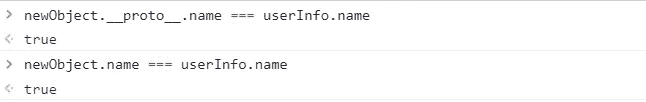
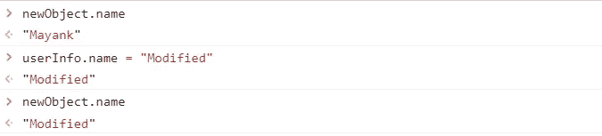

# Object.create: JavaScript 继承

> 原文：<https://javascript.plainenglish.io/javascript-inheritance-with-object-create-958b921e9d81?source=collection_archive---------0----------------------->

## 使用 Object.create 理解 JavaScript 继承

使用“ **Object.create** ”是在 JavaScript 中创建继承模型的最基本方法。 **Object.create** 可用于以现有对象为原型创建一个新对象。现有对象可用作原型，使得现有对象的所有属性可用于新对象。

我们来详细看看这个方法。

[https://gist.github.com/Mayankgupta688/5b8bc1e669e9b148030192bc87eb324b](https://gist.github.com/Mayankgupta688/5b8bc1e669e9b148030192bc87eb324b)

在上面的代码中，我们使用“ **Object.create** ”来创建一个新的对象。由于我们没有给新对象添加任何属性或方法，因此，对象“new object”仍然是空的，没有方法或属性。

见下图。

上面的输出显示，新创建的对象没有可用的属性。它仍然不包含任何方法或属性。

但是，我们将“userInfo”对象作为参数传递给“Object.create”函数。“userInfo”对象包含“姓名”、“年龄”、“职务”和“薪金”属性及其值。**让我们看看将“userInfo”作为参数传递给函数的影响。**

# **我们可以使用新对象访问这些属性吗？**

当我们使用“ **Object.create** 创建一个对象时，作为参数传递的对象被**添加到创建的新对象**的“原型”链中。当用户试图从创建的新对象中访问属性时，**它寻找新对象可用的原型链**。JavaScript 对象可以使用**“_ _ proto _ _”**属性遍历“原型”链。传递给 Object.create 函数的**“userInfo”对象被添加到新对象的“__proto__”属性中。让我们看看如何访问这个对象的原型链。**

当我们试图使用“newObject”访问属性“name”时，它首先查找该对象可用的属性。因为我们没有给这个对象添加任何属性，所以它使用对象引用“ **__proto__ 【T21”)遍历到“原型”链。“ **__proto__** ”属性指向“userInfo”对象的引用。**

由于属性“name”在由属性“ **__proto__** ”指向的对象中是可用的，所以我们可以使用新创建的对象来访问属性“name”。属性“姓名”、“年龄”、“职务”和“薪水”可用于使用原型链的新对象。

简而言之，它表示父子关系:如果在被引用的对象中找不到该属性，它将遍历其原型链以在父对象中找到该属性/方法。如果属性/方法在原型链中可用，我们可以访问这些属性和方法。

在上面几行代码中，我们使用的是“=== ”;它声明“ **userInfo.name** ”和“ **newObject。__proto__name** "指向相同的内存位置。

# 原型链的访问方法

到目前为止，我们已经讨论了从原型链中访问属性。我们还可以访问原型链中可用的方法。让我们借助一个例子来看看。

[https://gist.github.com/Mayankgupta688/d4774188752ba32d82b04797935a73db](https://gist.github.com/Mayankgupta688/d4774188752ba32d82b04797935a73db)

# 覆盖原型链的值

“name”属性在新创建的对象的原型链中可用。我们可以将同名的属性添加到新对象中。当我们将具有相同名称的属性添加到新对象中时，它会被添加到新对象的属性中。如果用户试图访问/修改“name”属性，它引用添加到对象的属性，而不是从原型链访问 name 属性。

[https://gist.github.com/Mayankgupta688/2eb401b5098b466c14d6d56762172ebf](https://gist.github.com/Mayankgupta688/2eb401b5098b466c14d6d56762172ebf)

在上面的代码中，我们可以看到我们正在向新创建的对象添加属性。在这种情况下，对象将拥有自己可用的新属性，它将访问/修改自己的属性，而不是引用父属性。

在上图中，我们可以看到“name”属性被添加到新创建的对象“newObject”中。

让我们来看看这种方法的**优缺点**:

**object . create 的优点**

**1。“userInfo”对象可用的所有方法和属性也可用于创建的新对象，因为它是原型链的一部分。我们可以使用这种方法，利用**功能和属性的可重用性。****

**2。**属性通过原型链变得可用，因此对象不需要消耗更多的内存空间来保存现有的函数和属性。不消耗单独的存储空间。因此这些方法和属性可以重用。

**3。**当我们有一些分层数据表示和/或如果我们需要显示从源对象到目的对象的一些继承特征时，该方法提供了功能和属性的可重用性

**“object . create”的缺点**

**1。**新创建的对象不会创建单独的属性。修改源对象的属性也会修改新对象可用的数据。

开发者可以假设该属性属于所创建的新对象。修改源对象中的属性或函数会反映在目标/新创建的对象中。

如果希望使用“Object.create”创建的每个对象都有一个专用的“name”属性，则需要为新创建的对象显式添加一个属性。在下面的代码中，我们为新创建的对象添加了一个单独的属性。所以，在这种情况下，它不会从原型链中访问“name”数据。

[https://gist.github.com/Mayankgupta688/c08b4c7f35e818f922f09ff6e1032350](https://gist.github.com/Mayankgupta688/c08b4c7f35e818f922f09ff6e1032350)

2.**不会为对象**创建深层副本

它**不创建深层拷贝；**对象遵循继承的概念。所以新对象**不包含单独的属性和方法**。属性和方法是从继承链中的父级访问的。

*更多内容请看*[***plain English . io***](http://plainenglish.io/)