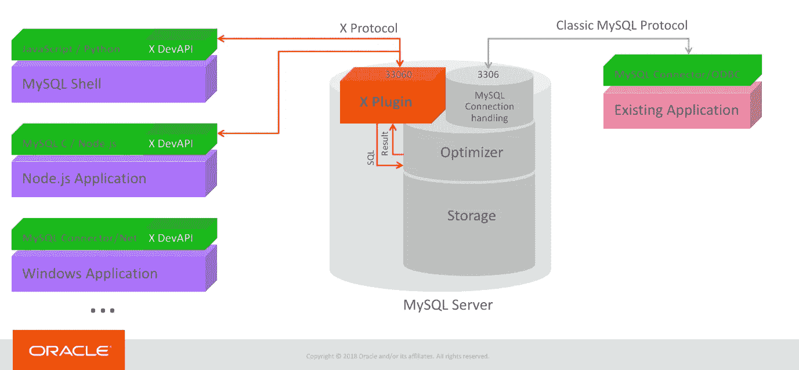
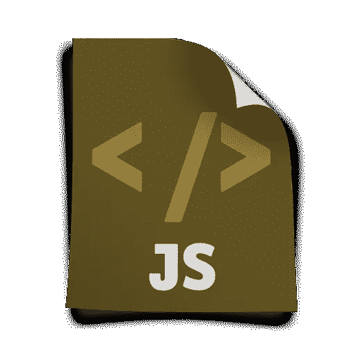
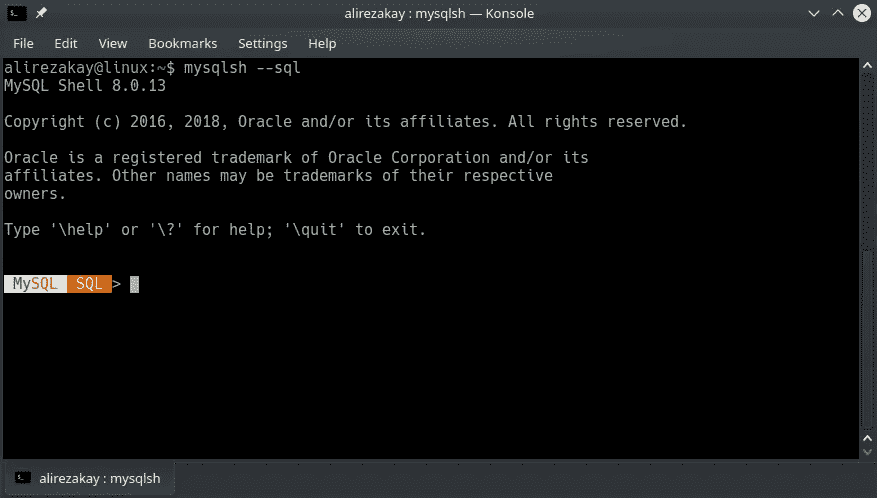
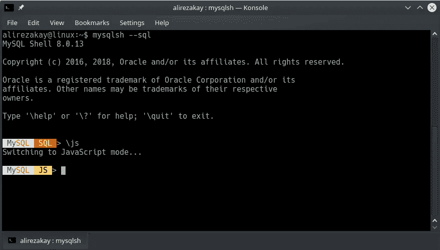

# 如何通过 MySQL Shell 8.0 为 MySQL 文档库创建 JavaScript 接口

> 原文：<https://javascript.plainenglish.io/javascript-interface-for-mysql-document-store-via-mysql-shell-8-0-d9a98c91e5fc?source=collection_archive---------7----------------------->

> *循序渐进(附实例)*

在这篇文章中，我们将使用 **JavaScript** 使用 **MySQL Shell 8.0 (X Dev API)** 。

X Dev API 在 MySQL Shell X Dev API 中提供了 SQL 的两种语言:

*   计算机编程语言
*   java 描述语言



这是我们想要完成的任务的大纲:

1.  作为根用户**连接 MySQL 服务器**
2.  创建一个**新的**T21 数据库
3.  创建/授予一个**新用户**
4.  切换到 **JS 界面**
5.  使用之前创建的数据库/ **模式**
6.  创建**新收藏**
7.  将**文件**插入集合
8.  通过导入 **JSON** 文件将**文件**插入到集合中


Photo by [Michael D Beckwith](https://unsplash.com/@michael_david_beckwith?utm_source=medium&utm_medium=referral) on [Unsplash](https://unsplash.com?utm_source=medium&utm_medium=referral)

— *先决条件*

在深入之前，最好安装/升级到 MySQL 8.0，
因为默认启用 X 协议。

对于 **Ubuntu** ，可以按照这个[链接](https://stackoverflow.com/questions/49963923/how-do-i-update-mysql-5-7-to-the-new-mysql-8-0)来安装。

安装 MySQL Server 8.0 后，必须安装 **MySQL Shell。**
在 Ubuntu 中，你可以使用下面的命令:

```
sudo apt install mysql-shell
```

—

*提示:* `*mysql*` 命令是经典的命令行界面。
*(2000 年~现在)提示:* `*mysqlsh*` 命令是新的 shell 界面。(2016 ~现在)

*提示:*经典 MySQL 协议运行在端口 **3306** *提示:* MySQL X 协议运行在端口 **33060**

*提示:*到**清除**`mysql`中的**屏幕**使用此命令:`\! clear` *提示:*到**清除**`mysqlsh`中的**屏幕**点击此快捷键:`ctrl` + `L`

## 1.以 Root 身份连接

打开**端子**，使用该命令**连接**作为**根**:

```
sudo **mysql** -u root
```

*   如果它引发`Access Denied`错误，最好使用这个命令来代替:
    `sudo mysql -u root -p`，然后它会提示您输入密码。
*   否则，您现在作为根用户**连接到 MySQL-server**

—备选方案

你也可以使用`mysqlsh`命令来连接 mysql-server:
但是，你可能会遇到`root`用户的`access denied`！

```
**mysqlsh** -u root --sql
```

🧩🧩🧩🧩🧩🧩🧩🧩🧩🧩🧩🧩🧩🧩🧩🧩🧩🧩🧩🧩🧩

## 2.创建数据库

```
**create** database marveldb
```

🧩🧩🧩🧩🧩🧩🧩🧩🧩🧩🧩🧩🧩🧩🧩🧩🧩🧩🧩🧩🧩

## 3.创建并授权用户

```
**create** user 'tonystark' **identified** by 'ironman';**grant** **all** privileges **on** marveldb.* to 'tonystark';**commit**;
```



## 4.在 MySQL Shell 中使用 JS 接口(X 协议)

退出上一个终端，打开另一个会话并键入:

```
**mysqlsh** --sql
```

*提示:*界面语言有三种选择:`--sql` `--js` `--py`



现在，您处于 shell 环境中，

您可以使用以下命令之一来更改语言:

*   `\sql`
*   `\py`
*   `\js`

执行下面的命令切换到 **Javascript** :

```
**\js**
```



现在，**将**连接到之前创建的用户，命令如下:

```
**\connect** tonystark@localhost
```

系统会提示您输入密码
——在这种情况下，**用户名**是 **tonystark
-** ，而**密码**是 **ironman**

*提示:*以`**\**`开头的命令是可以在所有三种语言中执行的全局命令:使用`\help`可以看到所有命令

🧶🧶🧶🧶🧶🧶🧶🧶🧶🧶🧶🧶🧶🧶🧶🧶🧶🧶🧶🧶🧶

## 5.使用模式(数据库)

要显示分配给模式变量的值，请键入`db`。

```
db
```

*提示:* `db`是保存 schema 对象的全局变量。

在输入`db`并按下回车键后，您将看不到任何结果，可能是因为该值尚未赋值！

键入`\use`并按下**选项卡**按钮以查看您的所有数据库，然后键入您想要的模式:

```
\use marveldb
```

在这种情况下，我们使用了 **marveldb** 模式。

现在再次输入`db` ,这一次你应该会看到如下结果:

> <marveldb></marveldb>

在这种环境下，您可以使用 javascript 中的大多数概念，例如，键入以下内容:

```
**var** name = 'tony';
**var** fname = 'stark';
**var** movies = ['iron-man 1', 'iron-man 2', 'iron-man 3'];**var** roles = {
  ironman: {
    first_name: name,
    last_name: fname,
    movies: movies
  }
};
```

键入`roles`并检查结果是否与顶部的值一致！

🧶🧶🧶🧶🧶🧶🧶🧶🧶🧶🧶🧶🧶🧶🧶🧶🧶🧶🧶🧶🧶

## 6.创建收藏

`db`对象有几个操作功能:

*   **getCollections()**
*   **createCollection()**
*   帮助()
*   createCollection()
*   getName()
*   dropCollection()
*   getSchema()
*   existsInDatabase()
*   getSession()
*   getCollection()
*   getTable()
*   getCollectionAsTable()
*   getTables()
*   会议
*   (计划或理论的)纲要
*   名字

要创建新集合，请使用下面的函数:

```
db.createCollection('role');
```

在本例中，我们创建了一个集合，名为:" **role** "
要确保集合已创建，请执行以下操作:

```
db.getCollections();
```

结果将是这样的:

> [
> <集合:角色>
> ]

🧶🧶🧶🧶🧶🧶🧶🧶🧶🧶🧶🧶🧶🧶🧶🧶🧶🧶🧶🧶🧶

## 7.将文档插入收藏

每个集合都有几个操作它的函数:

*   **添加()**
*   **查找()**
*   帮助()
*   replaceOne()
*   addOrReplaceOne()
*   getName()
*   **修改()**
*   createIndex()
*   getOne()
*   dropIndex()
*   getSchema()
*   移除()
*   existsInDatabase()
*   getSession()
*   移除一个()
*   名字
*   会议
*   (计划或理论的)纲要

首先，让我们创建另一个收藏名称: **person**

```
db.createCollection("person");
```

这样做可以查看**人**的**文档**集合:

```
db.person.find();
```

您必须看到一个空的结果，因为其中还没有文档！。

*提示:* `find`函数不带 args，将显示所有文档。您可以传递一个参数来查找特定的对象模式。

要将文档添加到集合中，可以使用带有 JSON/object 参数的`add`函数:

```
db.person.add(
  {
    name: "alireza",
    age: 21
  }
);
```

将代码粘贴在顶部，然后**按 Enter** (如果需要，按两次)。

现在，再次使用`find`方法查看该集合的文档:

```
db.person.find();
```

结果会是这样的:

> [
> {
> " _ id ":" 00005 c38a 59300000000000002 "，
> "年龄":21，
> "姓名":" alireza"
> }
> ]
> 一套 1 份文件(0.0011 秒)

现在，让我们通过传递之前声明的对象并使用函数来添加另一个文档:

记住我们在“主题 5”中声明的变量:

> **var**name = ' Tony '；
> **var**fname = ' stark '；
> **var** 电影= ['钢铁侠 1 '，'钢铁侠 2 '，'钢铁侠 3 ']；
> 
> **var**roles = {
> iron man:{
> first _ name:name，
> last_name: fname，
> movies:movies
> }
> }；

我们来为《钢铁侠》的**角色**添加一个文档，不插入完整数据:
(注意我们已经创建了“角色”集合！)

```
db.role.add({role: "iron man"});
```

使用`find`方法后的结果，会是这样的:

> {
> " _ id ": " 00005 c38a 59300000000000005 "，
> "角色":"钢铁侠"
> }

现在，让我们使用**修改**并完成文档:

```
db.role.modify("role = 'iron man'").merge(roles.ironman)
```

使用`find`方法后，结果会是这样的:

> {
> " _ id ": " 00005 c38a 5930000000000005 "，
> "名字":"托尼"，
> "姓氏":"斯塔克"，
> "电影":[
> 《钢铁侠 1》，
> 《钢铁侠 2》，
> 《钢铁侠 3》
> ]，

*温馨提示:*

*   `modify`函数获取一个字符串模式
*   `merge`功能通过"修改"功能找到一个将要与文档合并的对象

🧶🧶🧶🧶🧶🧶🧶🧶🧶🧶🧶🧶🧶🧶🧶🧶🧶🧶🧶🧶🧶

## 8.通过导入 JSON 文件插入文档

假设我们有一个如下所示的 JSON 文件:

使用`util`模块将 JSON 导入集合:

```
**util**.importJson("./roles.json", {collection: "role"});
```

上面的代码将“roles.json”文件导入到“role”集合中。

*温馨提示:*

*   roles.json 文件包含**两个文档**！(在这种情况下)
*   如果该文件不存在，它将引发一个错误！
*   `importJson`函数的**第一个**参数是文件的**路径**。
*   `importJson`函数的**第二个**参数是**选项对象**

Python Shell API 与 JS Shell API 非常相似，不同之处在于 **JS** 中的函数是 **Camel Case** ，而 **Python** 中的函数由一个**下划线** ( `_`)隔开

例如:

**JS:**

```
db.getCollections();
```

**PYTHON:**

```
db.get_collections()
```

## 最后一句话:

要获得帮助，有关文档，请参考 MySQL [网站](https://dev.mysql.com/doc/refman/8.0/en/mysql-shell-tutorial-javascript.html)或使用每个对象的`help()`函数。

例如:

```
**db**.help();**util**.help("importJson");// db.<collection_name>.help([<function_name>]);
**db**.role.help("modify");
```