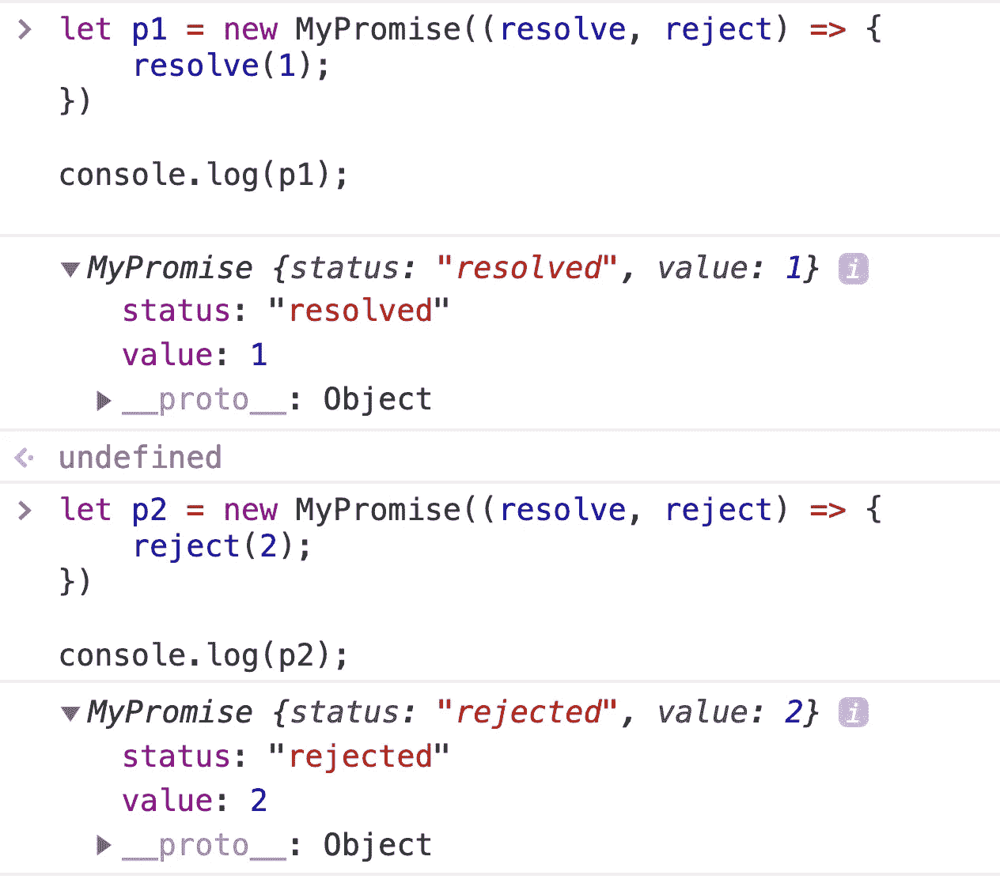
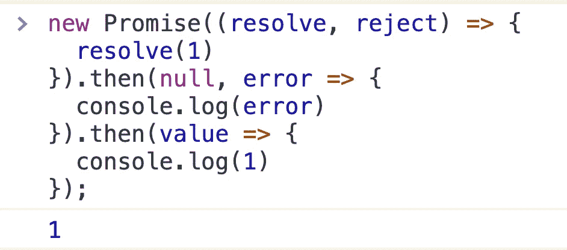

# JavaScript 采访问题:如何实现承诺？

> 原文：<https://javascript.plainenglish.io/javascript-interview-question-how-to-implement-a-promise-1a2ac69b9a0d?source=collection_archive---------1----------------------->

## 一步一步写承诺函数。


Photo by [marcos mayer](https://unsplash.com/@mmayyer?utm_source=medium&utm_medium=referral) on [Unsplash](https://unsplash.com?utm_source=medium&utm_medium=referral)

“承诺”是 ES2015 版 JavaScript 的核心功能。承诺是一个在未来某个时候可能会产生单个值的对象:解析的值或未解析的原因(例如，发生网络错误)。承诺可能处于 3 种可能状态之一:已履行(已解决)、已拒绝或待决。承诺用户可以附加回调来处理已实现的值或拒绝的原因。

我们的无极功能应该符合无极 A+规范，如果您不熟悉，请先阅读本规范。

 [## 承诺/A+

### 承诺代表异步操作的最终结果。与承诺互动的主要方式是…

promisesaplus.com](https://promisesaplus.com/) 

接下来，让我们一起写一个 Promise 函数。

# 执行者

我们知道，当您创建一个 Promise 实例时，我们需要传入一个执行器函数。执行器函数应该采用两个函数参数:函数`resolve`和函数`rejec`。当`resolve`函数被调用时，承诺实例被解析。如果执行器函数发生异常，则应调用`reject`函数，承诺实例的状态将被拒绝。

现在，让我们编写一个基本上满足这些要求的 MyPromise 函数。

注意，为了更好的理解，我使用 ES6 的`class`语法。这实际上是构造函数的语法糖。

好了，现在让我们简单地测试一下我们刚刚编写的函数。

```
let p1 = new MyPromise((resolve, reject) => {
    resolve(1);
})let p2 = new MyPromise((resolve, reject) => {
    reject(2);
})console.log(p1);
console.log(p2);
```



好了，现在我们已经编写了 MyPromise 函数，可以通过解析和拒绝函数正确地改变状态。

# 然后

接下来，让我们为我的承诺写下`.then`方法。`then`方法应有两个函数参数，第一个在承诺成功后执行，第二个在承诺失败后执行。

同时，`.then`方法支持链调用，在每次执行后返回一个承诺实例。

```
new Promise((resolve, reject) => {
  resolve(1)
}).then(null, error => {
  console.log(error)
}).then(value => {
  console.log(1)
});
```



现在让我们改进前面的代码。

# 捕捉

`.catch`方法用于捕捉异常。与`.then`方法的第二个回调函数相同。

所以，我们可以这样写:

```
catch(rejectFn) {
    return this.then(null, rejectFn)
}
```

# 解决并拒绝

我们知道`Promise.resolve(…)`方法是返回一个已解决状态的承诺实例，而`Promise.reject(…)`方法是返回一个已拒绝状态的承诺实例。这两种方法非常容易实现:

```
static resolve(result) {
    return new MyPromise(resolve => {
        resolve(result)
    })
}static reject(reason) {
    return new MyPromise((_, reject) => {
        reject(reason);
    })
}
```

# 最后

`finally()`方法返回一个承诺。当承诺完成时，即履行或拒绝时，执行指定的回调函数。这为代码的运行提供了一种方式，无论承诺是成功实现还是在承诺被处理后被拒绝。

这是代码片段:

```
finally(finallyFn) {
    let P = this.constructor;
    return this.then(
        value => P.resolve(finallyFn()).then(() => value),
        reason => P.reject(finallyFn()).then(() => reason)
    )
}
```

这是完整的代码:

# 全部

`Promise.all()`方法返回一个单一的`Promise`,当作为可迭代对象传递的所有承诺都已履行时，或者当可迭代对象不包含承诺时，或者当可迭代对象包含已履行的承诺和已返回的非承诺时，该方法履行。它拒绝的原因是第一个拒绝的承诺，或者是第一个参数捕获的错误(如果该参数使用 try/catch/throw 块捕获了其中的错误)。

```
// Receive array parameter
static all(promiseList) {
    // Returns a new instance
    return new MyPromise((resolve, reject) => {
        let index = 0,     
            results = []; 

        for(let i = 0; i < promiseList.length; i++) {
            let item = promiseList[i];

            if(!(item instanceof MyPromise)) return;

            item.then(result => {
                index++;
                results[i] = result;
                if(index === promiseList.length) {
                    resolve(results);
                }
            }).catch(reason => {
                reject(reason);
            })
        }
    })
}
```

## **用简单英语写的 JavaScript 笔记**

我们已经推出了三种新的出版物！请关注我们的新出版物: [**AI in Plain English**](https://medium.com/ai-in-plain-english) ，[**UX in Plain English**](https://medium.com/ux-in-plain-english)，[**Python in Plain English**](https://medium.com/python-in-plain-english)**——谢谢，继续学习！**

**我们也一直有兴趣帮助推广高质量的内容。如果您有一篇文章想要提交给我们的任何出版物，请发送电子邮件至[**submissions @ plain English . io**](mailto:submissions@plainenglish.io)**，使用您的 Medium 用户名，我们会将您添加为作者。另外，请让我们知道您想加入哪个/哪些出版物。****