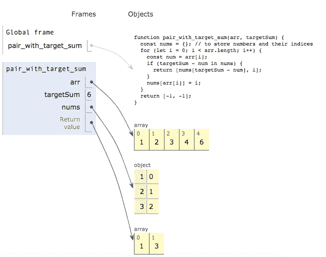
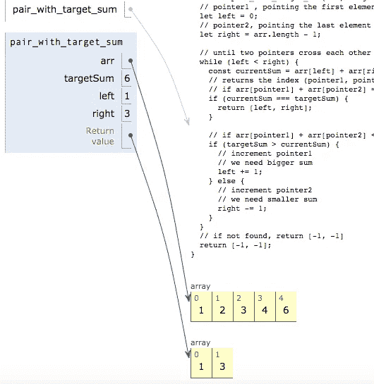

# JavaScript 面试问题:与目标总和配对

> 原文：<https://javascript.plainenglish.io/javascript-interview-question-pair-with-target-sum-5ba34ab871c7?source=collection_archive---------4----------------------->


Photo by [Daniel Lincoln](https://unsplash.com/@danny_lincoln?utm_source=medium&utm_medium=referral) on [Unsplash](https://unsplash.com?utm_source=medium&utm_medium=referral)

# 与目标总和配对

**问题表述为**

```
*Given an array of* ***sorted numbers*** *and a target sum, find a pair in the array whose sum is equal to the given target.**Write a function to return the indices of the two numbers (i.e., the pair) such that they add up to the given target.*
```

*   最受欢迎的面试问题之一
*   简单级别&必答问题
*   有 2 种方法可以解决**对与目标和**的问题

> 你心里有什么猜测吗？

*   第一种方法需要

```
Time Complexity : O(N)
Space Complexity : O(N)
```

*   第二种方法需要

```
Time Complexity : O(N)
Space Complexity : O(1)
```

# 让我们深入研究两种方法


Photo by [Jeremy Bishop](https://unsplash.com/@jeremybishop?utm_source=medium&utm_medium=referral) on [Unsplash](https://unsplash.com?utm_source=medium&utm_medium=referral)

# >方法 1 >使用哈希表

*   JavaScript 开发人员最直观的方法
*   我们可以一次遍历一个数字
*   我们持有一个**对象**，并将迭代后的值设置为**键**，将其索引号设置为**值**

```
Let's say during our iteration we are at number 'X', so we need to find 'Y' such that "X + Y == Target"
```

# **pseu do 代码**

```
- Search for "Y" (which is equivalent to "Target- X") in the **HashTable** - If it's there, we found the required pair
- If not, insert "X" in the **HashTable,** so that we can search it for the later numbers
```

# 在寻找解决方案之前，先自己尝试一下


# 解决办法

*   我们首先在数组中做一个 for 循环
*   在第 5 行，我们在**散列表**中搜索“Y”(相当于“Target- X”)
*   在第 6 行，如果`X + Y == Target`，我们找到了一对并返回
*   在第 8 行，如果`X + Y != Target`，在**哈希表**中插入“X ”,这样我们就可以搜索后面的数字

截图来自 [**Pythontutor**](http://pythontutor.com/)



**时间复杂度**

*   O(N)，其中“N”是给定数组中元素的总数

**空间复杂度**

*   O(N)，在最坏的情况下，我们将在**散列表**中推送‘N’个数字

# 哈希表-重复的数字


Photo by [mari lezhava](https://unsplash.com/@marilezhava?utm_source=medium&utm_medium=referral) on [Unsplash](https://unsplash.com?utm_source=medium&utm_medium=referral)

> 有人会喜欢:
> 
> “它对重复的号码有效吗？”

# 我不知道。我们试试吧！

```
Given,
- An array : [1, 2, 2, 3, 4, 4, 4, 5, 6, 6, 6]
- Target Number : 10
```

*   返回`[6, 8]`，即 4 的**最后一个索引**和 6 的**第一个索引**
*   发生这种情况是因为对象键在 JavaScript 中是惟一的，如果存在重复的键，就会覆盖该值

# 哈希表-未排序的数字


Photo by [mari lezhava](https://unsplash.com/@marilezhava?utm_source=medium&utm_medium=referral) on [Unsplash](https://unsplash.com?utm_source=medium&utm_medium=referral)

> 有人会喜欢:
> 
> “它对重复的号码有效吗？”

# 我不知道。我们试试吧！

```
Given,
- An array : [2, 5, 6, 4, 10, 8, 3, 7]
- Target Number : 10
```

*   它返回`[2, 3]`，即 6 的**索引**和 4 的**第一个索引**

# >方法 2 >使用两个指针

*   比**哈希表**更有效的解决方案

```
Space Complexity
- Two Pointer : O(1) [No need for any spaces]
- HashTable : O(N)[we may push 'N' numbers in the HashTable
```

# pseu do 代码

```
Given 
- an array[1, 2, 3, 4, 6]
- target sumpointer1 points to the first element of an array, which is 1
pointer2 points to the last element, which is 6First, 1 + 6 > target sum (6) so let's decrement pointer2
(Now, pointer 2 points to the second to the last element, which is 4Second, 1+ 4 < target sum (6) so let's increment pointer1
(Now, pointer 1 points to the second element, which is 2)... so on until finding the pair which has the equal value to the target sum
```

# 在寻找解决方案之前，先自己尝试一下


# 解决办法

*   我们先来看一下，有两个指针**左**和**右**

```
- **left** points to the first element- **right** points to the last element
```

*   在第 8 行，我们一直看到两个指针交叉
*   在第 12 行，如果`X + Y == TargetSum`，返回索引(【左**，右**)
*   在第 16 行，如果`X + Y < TargetSum`，向左增加**；我们需要一个更大的和(记住，数组是**排序的)****
*   **在第 21 行，如果`X + Y >TargetSum`，右递减**；我们需要一个更小的和(记住，数组是**排序的)******

**截图来自 [**Pythontutor**](http://pythontutor.com/)**

****

****时间复杂度****

*   **O(N)，其中“N”是给定数组中元素的总数**

****空间复杂度****

*   **O(1)**

# **两个指针—重复的数字**

****

**Photo by [Tachina Lee](https://unsplash.com/@chne_?utm_source=medium&utm_medium=referral) on [Unsplash](https://unsplash.com?utm_source=medium&utm_medium=referral)**

> **有人会喜欢:**
> 
> **“它对重复的号码有效吗？”**

# **我不知道。我们试试吧！**

```
Given,
- An array : [1, 2, 2, 4, 4, 6]
- Target Number : 6
```

*   **它返回`[1, 4]`，即 2 的第**个索引**和 4 的**个索引****
*   **这是因为我们有两个指针**

```
- A pointer **increment from the front** - The pointer **decrement** **from the backend
at a time**
```

# **两个指针—未排序的数字**

****

**Photo by [Tachina Lee](https://unsplash.com/@chne_?utm_source=medium&utm_medium=referral) on [Unsplash](https://unsplash.com?utm_source=medium&utm_medium=referral)**

> **有人会喜欢:**
> 
> **“它对重复的号码有效吗？”**

# **我不知道。我们试试吧！**

```
Given,
- An array : [1, 3, 2, 4, 6]
- Target Number : 6
```

*   **它返回`[-1, -1]`，这是错误的答案**
*   **我们只是简单地互换了`3` & `2`的位置**
*   **正确答案应该是返回`[2,3]`，这是 2，4 ( `2 + 4 == 6`)的索引数组**
*   **两个指针**不**对未排序数组有效吗**

# **>结论**

## ****排序+非重复数组****

*   **两个指针比**哈希表**更高效**
*   **时间复杂度( **O(1)** )与( **O(N)** )**

## **重复数组**

*   ****哈希表**工作正常**

```
returns the last index of smaller element & the first index of bigger element
```

*   ****两个指针**工作正常**

```
returns the first index of smaller element & the last index of bigger element
```

## **未排序数组**

*   ****哈希表**工作正常**
*   ****两个指针****不**工作**

****

**Photo by [Anastase Maragos](https://unsplash.com/@visualsbyroyalz?utm_source=medium&utm_medium=referral) on [Unsplash](https://unsplash.com?utm_source=medium&utm_medium=referral)**

> **感谢您的阅读！**