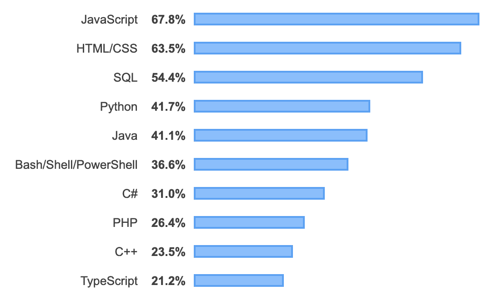

# 你需要知道的 JavaScript 面试问题

> 原文：<https://javascript.plainenglish.io/javascript-interview-questions-you-need-to-know-26fbdda23d6e?source=collection_archive---------0----------------------->

本周我写的是你在面试中可能会遇到的 JS 问题。将从难度不等的 5 个问题开始。如果你们想要更多的问题，请在下面留下评论，我将在下周继续这个系列！

为什么是 JavaScript？对于全栈开发者来说，JavaScript 可能被认为是圣杯。根据 [Stack Overflow 的年度开发者调查](https://insights.stackoverflow.com/survey/2019#technology)，JS 已经连续七年被评为最常用的编程语言！Python 排名在攀升，刚刚击败 Java，但 JS 依然是王者/女王👑。



JavaScript for the win…again

由于 JS 对于全栈开发者来说是不可或缺的，所以让我们坚持使用它。

# 容易的

## 问:解释 JavaScript 中的等式

答:在 Java 中我们有两种比较，严格比较和类型转换比较。

**严格的比较**或者说相等是三重相等===

类型和值必须相同，例如:

```
10 === 10 // true'hello world' === 'hello world' // true because both are strings and equal values23 === '23' // false because you are comparing a Number to a String
```

严格比较**不**允许*强制。*

由于你们中的一些人可能不熟悉强制，我将在下面展示一个简单的例子:

在 JS 中，强制是两种内置数据类型之间的转换。

显性胁迫:

```
let a = '23';
let b = Number(a);a; // '23'
b; // 23 (this is the Number 23 not the String)
```

隐性强制:

```
let a = '23';
let b = a * 2; // '23' is implicitly coerced to 23a; // '23'
b; // 46 (this is the Number 46 not a String)
```

**抽象比较**或双等号==

抽象比较是比较值相等和**强制是允许的**。因此，在尝试将这两个值转换为相同的数据类型后，将对它们进行比较。

```
23 == '23' // true
```

## 问:Null 和 Undefined 的区别是什么

答:当某个东西没有初始化时，它就是**未定义的**。当某样东西当前不可用时，它是空的。

# 中等

## 问:什么是 IIFEs(立即调用函数表达式)？

答:立即调用的函数 Express 在创建后会立即执行。

```
(function iifeExample() {

  console.log('Hello, World!');

})(); *// Hello, World!*
```

## 问:匿名函数和命名函数有什么区别？

```
function foo(){
    alert("Hi, I'm foo!");
}var bar = function(){
    alert("I am an anonymous function that is assigned to the variable "bar");
}foo(); // "Hi, I'm foo!"
bar(); //"I am an anonymous function that is assigned to the variable "bar"
```

匿名函数只是一个没有名字的函数，并且都是在应用程序运行时创建的。

可以想象，在调试和查找导致错误的函数时，命名函数非常有用。

# 困难的

## 问:下面的代码会输出什么？

```
0.1 + 0.2 === 0.3
```

这令人惊讶地返回 false！为什么？因为浮点在内部没有正确表示。例如，0.1 + 0.2 等于 0.3000000000000004。很奇怪吧？同样，这是因为计算机不能准确地表示浮动。一种解决方法是在执行带小数的算术运算时将数字四舍五入。

不相信我？你自己试试吧😉

**节日快乐！**