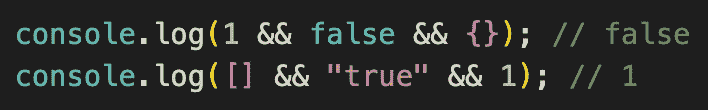
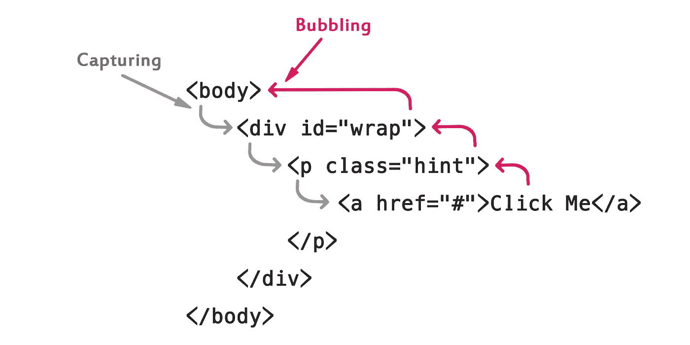

# 你需要知道的 JavaScript 面试问题——第三部分

> 原文：<https://javascript.plainenglish.io/javascript-interview-questions-you-need-to-know-part-iii-2374a32c53b9?source=collection_archive---------1----------------------->

## JS 面试问题系列的最后一部分。

***查看第一部分*** [***此处***](https://medium.com/p/javascript-interview-questions-you-need-to-know-26fbdda23d6e) ***和第二部分***[*此处*](https://medium.com/javascript-in-plain-english/javascript-interview-questions-you-need-to-know-part-ii-e1e49ea64bc3)


Image from Tutorialrepublic

# 容易的

## 问:`&&`操作符是做什么的？

答:这可能更容易首先在代码中看到:



Which expressions are falsy?

基本上，`&&`操作符(读作逻辑 AND)在表达式中找到第一个 *falsy* 值并返回它。如果它没有找到一个*false*值，它将返回表达式中的最后一个值。

所以，第一行

```
console.log(1 && false && {});
```

返回 false，因为 **false** 是该表达式中的第一个 *falsy* 值。

第二行

```
console.log([] && "true" && 1);
```

不包含 *falsy* 值，因此返回表达式中的最后一个值，即 1。

# 简单/中等

## 问:JS 中有哪些 falsy 值类型？

答:JS 中有 7 个 falsy 值:

1.  数量`0`
2.  BigInt `0n`
3.  关键词`undefined`
4.  关键词`null`
5.  数量`NaN`
6.  布尔型`false`
7.  空字符串`“”`(相当于````或`‘’`)

在条件句中，这些都将计算为假。同样，许多地方只会列出 6 个*错误*值，而忘记了`0n`。此外，与 *falsy* 值相对的是 *truthy* 值，这是其他所有值。例如`{}`和`[]`是*真值*。

**把你从* [*第一部分*](https://medium.com/javascript-in-plain-english/javascript-interview-questions-you-need-to-know-26fbdda23d6e) *学到的关于宽松等式和严格等式的知识拿出来测试一下吧**

# 中等

## 问:给我分解一个 URL 的不同部分。https://www.movies.com:443/movies/index.html?type =恐怖& imdb = 8 #大片

答:首先，URL 代表统一资源定位符……换句话说，是在线资源的网址，即网站或文件。

URL 的第一部分，http 或 https，被称为**协议**。该协议决定了您的浏览器如何与 web 服务器通信。在这个例子中，https 是安全的超文本传输协议。https 连接是加密的，比普通 http 更安全。该方案以`:`和`//`开始的域名分隔。

www.movies.com 是域名或主机。这是向其请求数据的 web 服务器。一个域总是包括顶级域。在这种情况下，顶级域名是`.com`，其他顶级域名是`.gov` `.net` `.org` `.uk`等。

`:443`是**港**。端口就像一个技术大门，用于访问 web 服务器上的资源。如果 web 服务器位于标准端口(http 端口:80，https 端口:443)，您将不会在 URL 中看到它。否则它是必需的，它将授予对该 web 服务器上的资源的访问权。

`movies/index.html`被称为文件的**路径。它指示客户端(浏览器)请求访问的 web 服务器上特定资源的路径。**

`?type=horror&imdb=8`是 URL 的**参数**。这些基本上是由符号`&`分隔的键值对。因为在这个特定的 URL 中有一个`?`，所以您可以将`?type=horror&imdb=8`称为**查询字符串**。Web 服务器都是唯一的，处理参数的方式也不同。

`#Blockbusters`是**锚**。有些人可能称之为片段标识符。它总是以一个散列值`#`开始。它基本上是一个内部页面参考。锚将把你带到网页上的特定位置。如果是一个很长的网页，可能会把你带到页面的某个特定部分。

## 问:事件传播的三个阶段是什么？

答:传播发生在**先捕获**，然后**冒泡**。

在捕获阶段，事件从窗口通过 DOM 树传播，直到到达目标节点。例如，如果你点击一个超链接，它可能从`<html>`元素，到`<body>`元素，到`<div>`元素，到有链接的`<p>`元素。



Image from Tutorialrepublic

然后在目标元素被访问后(在代码中这可能是`event.target`)，冒泡阶段就发生了。

冒泡与捕获阶段相反。在冒泡阶段，事件*在 DOM 树中冒泡*。所以它会从目标元素一直到窗口。在我们上面的例子中，当超链接被点击后，它会从有链接的`<p>`元素，到`<div>`元素，到`<body>`元素，到`<html>`元素，最后到窗口。

* *在现代浏览器之前，事件传播有 3 个阶段。捕捉>目标>冒泡。* *在现代浏览器中，目标阶段不是单独处理的。**

# 困难的

## 问:下面代码的输出会是什么？

```
var Food = {
  cuisine: 'abc'
}
var food1 = Object.create(Food);
delete food1.cuisine
console.log(food1.cuisine);
```

…请在评论中发送您的答案！我也会把我的贴在那里😎