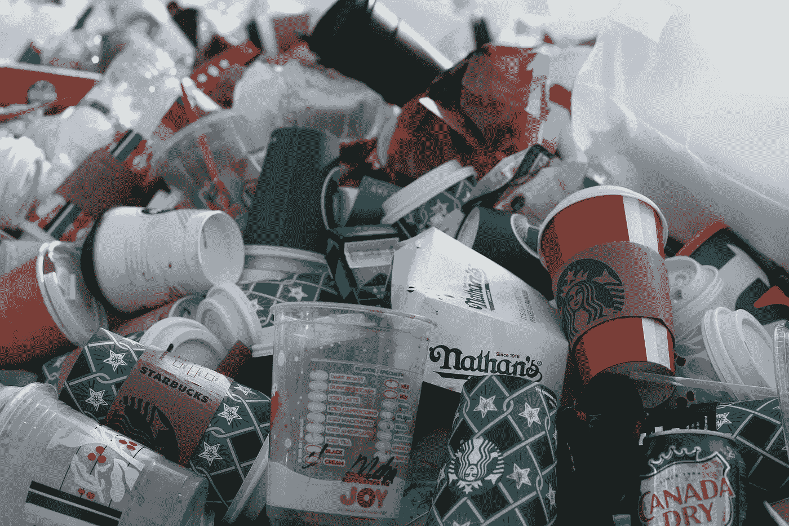

# JavaScript 是新的塑料

> 原文：<https://javascript.plainenglish.io/javascript-is-the-new-plastic-aba1d6cc59bb?source=collection_archive---------4----------------------->

## 污染程度相同，只是空间不同

JavaScript 是一种很棒的语言，真的。就像 100 年前塑料是一项了不起的发明一样。但是任何事情都会带来后果，无论是环境污染还是计算机污染。

建议读者自行判断:这是我的个人观点，可能与你的观点一致，也可能不一致，这很好。如果你有任何建设性的批评，我将非常乐意考虑。

# 塑料的问题是

虽然早在 20 世纪之前，这种合成材料的一些形式就已经存在，但真正的突破是在我们开始从石油中制造材料的时候。它最终导致了以尽可能低的价格创造出具有精心设计特性的耐用材料的能力。经济学家眼中的天堂。

重要的是要记住，在特定应用中，塑料(作为一种材料)不如大多数其他类型的材料(金属、碳纤维、其他类型的复合材料)。塑料的优势在于它适用于 90%的大规模制造品，这一优势超过了传统塑料的明显优势。

这个决定的致命后果在差不多五年后才被意识到，那时已经有点太晚了。所有的供应链都以石油和塑料为中心，消费者对此习以为常，替代材料被遗忘或从未被发明出来。塑料行业的“专家”立即被弃用，而研究新型材料的科学家和公司受到高度重视。我们的土地、水源和地球上的大多数生物都被微塑料污染了，而且没有已知的方法让人类过滤掉它。多亏了便宜、方便和*可重复使用*。

# JavaScript 的问题是

当 JavaScript 被发明出来的时候，它唯一的目的就是给网页增加一点点*的交互性。这导致了一种非常简单的语言，忽略了许多重要的特性和实践。然后，我们开始一点一点地给它添加功能，直到它成为一个巨大的庞然大物，可以在任何地方运行任何东西。*

当我说一个巨大的庞然大物时，我指的是运行它所需的运行时间的大小。即使是最简单的应用程序(比如计算器)，电子应用程序也有完整的 Chromium 安装。虽然有一种观点认为我们拥有所有这些计算能力，但不妨使用它。是的。我们可以用它来治疗癌症，测序 DNA 基因，探索星球。相反，我们用它来画按钮。

JavaScript 就像塑料一样，已经深深地束缚在我们的日常生活中。你会在你的浏览器、桌面应用、操作系统、手机、电器甚至[火箭](https://www.tesmanian.com/blogs/tesmanian-blog/spacex-reddit)中找到它。现在，在阅读其余部分之前，假设在未来的某个时候我们将不得不尽快放弃 JavaScript(就像我们现在对塑料做的那样)。会很容易吗？

与塑料的相似之处不止于此。现在来说说 npm 包。基于包的依赖系统已经存在很长时间了。它既包括 Linux 风格的包管理器(`apt`、`zypper`、`packman`，...)，移植的 Linux 风格的包管理器(家酿，`chocolatey`，...)，以及语言型管理者(`pip`、`gem`、Maven、...).

现在，如果你使用了其中的任何一个，我不需要解释为什么`npm`是如此令人厌恶的工作。你的`node_modules`中有成千上万的*包，它们可能相互兼容，也可能不兼容，或者包含恶意软件，或者干脆被抛弃。这种情况发生在一个包中的几率是微乎其微的，但是当你把它放大到指数级时，情况就变得可怕了。*

你多久跑一次`rm -r node_modules`和`npm i`？这与您重新安装操作系统的频率相比如何？开发人员被鼓励依赖材料，而不考虑这种依赖所代表的含义(很像构建供应链)。这都是由开源教条驱动的，它认为既然任何人都能修复代码，那么就会有人修复代码。他可能会也可能不会。

与塑料的最后一个相似之处是 JS 非常*便宜*。不是像 Java 那样在 SDK 的价格上，而是在人力上。JS 是一种过于简单的语言，它允许任何人在观看了 2 周的课程后创建一个应用程序。

不是说它本身不好，而是我们在*生产*中使用这些应用。在生产中的*汽车*、*火箭*、*卫生系统*、*私人通讯*等等。所以，JS 是一种非常便宜的语言，它让你可以创建*非常便宜的应用*。对于 JavaScript 的每一次使用(目前除了网站)，都有一种更健壮的语言更适合这项任务，但看起来我们并不是为了质量而使用它。

# 不要误解我

我喜欢 JavaScript。这是*完美的*游乐场，让你以惊人的速度实践、学习、原型化和迭代。但是我坚持这三个观点，我认为这三个观点是必要的:

1.  JavaScript 不会成为最流行的语言。只是因为 JavaScript 解释器和运行 JavaScript 解释器的 OS，按照定义都要用别的东西写。此外， [WebAssembly](https://medium.com/better-programming/webassembly-is-the-end-of-the-internet-as-we-know-it-9085a49cbc7b) 的兴起将把大多数编译语言带到浏览器中，为 JavaScript 创造了一个非常激烈的竞争
2.  我们应该考虑我们正在构建的系统的责任级别，并问自己这样一个问题:我们正在使用的语言和框架是使用相同的责任级别构建的吗？对于许多应用程序，这允许使用 JavaScipt 等。但是对于人类生活所依赖的系统来说，JavaScript 并不是一个答案。例如，如果您手机上的 9–1–1 呼叫是用 JavaScript 实现的，您有多大把握？还是气体泄漏检测系统？还是你的网络摄像头？
3.  塑料和 JavaScript 的情况都在好转。你现在可以在流行的软件包和安全审计中看到震撼人心的努力。但这只是我们 JS 排毒的开始。

# 结束语

感谢你阅读我对 JavaScript 的慷慨陈词，我希望我们还能成为朋友。让我知道你对 JavaScript 的看法！

# 资源

*   [为什么开发者终于要解决 Node.js 和 NPM 的混乱了](https://www.techrepublic.com/article/why-its-finally-time-for-developers-to-address-the-chaos-of-node-js-and-npm/)