# JavaScript 惰性评估:生成器(包括示例)

> 原文：<https://javascript.plainenglish.io/javascript-lazy-evaluation-generators-examples-included-f9eaa517f969?source=collection_archive---------2----------------------->

## JavaScript Alpha 指南

## 什么是 JavaScript 生成器？深入的教程和真实的用例示例。

在[之前的文章](https://medium.com/@MelkorNemesis/javascript-lazy-evaluation-iterables-iterators-e0770a5de96f)中，我们看了 JavaScript **迭代器**和**迭代器**。它们是**生成器**的先决条件，会让你更好地理解今天的主题。如果你不知道什么是 Iterables 和 Iterators，现在就去读它，然后回到这里。

首先，我们将回顾一些理论，在本文的结尾，我们将看看生成器的真实用例。

# 懒惰评估

让我们快速回顾一下**懒评**是什么意思，它的优点是什么。

**惰性求值**的意思是将表达式的求值延迟到需要的时候。惰性评估有时被称为**按需调用**。

惰性评估可以:

*   定义潜在的无限数据结构
*   通过避免不必要的计算来提高性能
*   为希望其元素可供公众访问的数据结构定制迭代行为

# 发电机

## 什么是发电机

我发现维基百科的定义非常准确，所以让我们看看它是怎么说的:

> 在计算机科学中，生成器是一个可以用来控制循环迭代行为的例程。所有生成器也是迭代器。生成器与返回数组的函数非常相似，因为生成器有参数，可以被调用，并生成一系列值。但是，生成器一次生成一个值，而不是构建一个包含所有值的数组并一次返回所有值，这需要较少的内存并允许调用者立即开始处理前几个值。简而言之，生成器看起来像函数，但行为像迭代器。
> 
> [https://en . Wikipedia . org/wiki/Generator _(计算机编程)](https://en.wikipedia.org/wiki/Generator_(computer_programming))

换句话说，生成器是类固醇上的迭代器。与迭代器相比，它接受参数，可以作为函数调用。

维基百科的引用没有提到的是，你不仅可以从生成器中获取值，还可以向生成器发送值。也就是说，**生成器不仅是迭代器，还是观测器**。

## 迭代协议

发电机符合`Iterable`和`Iterator`两种接口。这意味着调用生成器函数的结果是`Iterable`和`Iterator`，并使生成器成为**数据生产者**。

使用类型脚本，我们可以如下定义接口:

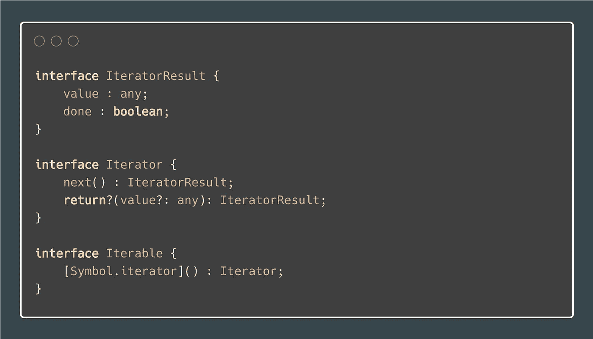

Iterator and Iterable interfaces

关于**迭代协议**的更多信息，请参见[上一篇文章](https://medium.com/@MelkorNemesis/javascript-lazy-evaluation-iterables-iterators-e0770a5de96f)，在那里我详细讨论了它。

## 观察者界面

生成器遵循的另一个接口是`Observer`接口。换句话说，这使得生成器成为数据消费者。当生成器暂停时，它们会等待输入。

> 生成器每次点击`yield`关键字时都会等待输入。

有三种类型的发电机输入:

*   `next(value?: any)` =向发电机发送一个值
*   `return(value?: any)` =终止发电机
*   `throw(error)` =在生成器内部抛出异常

使用类型脚本，我们可以如下定义接口:

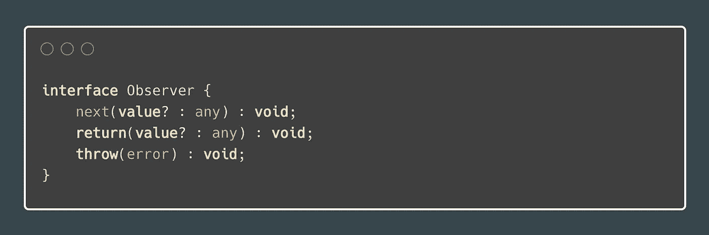

Observer interface

## 句法

**发电机功能**返回一个**发电机**。对于如何创建生成器函数，有四个选项:

**发电机功能声明**

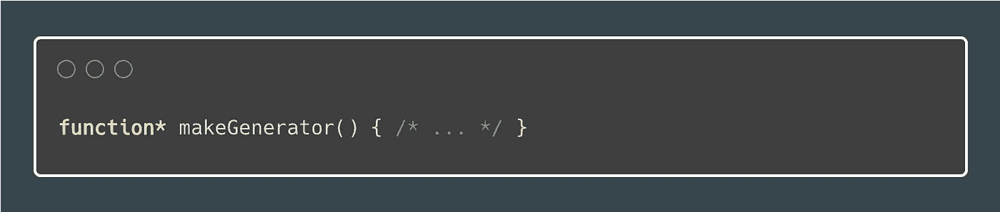

Generator function declaration

**生成器函数表达式**

Generator function expression

**生成器方法(对象文字)**

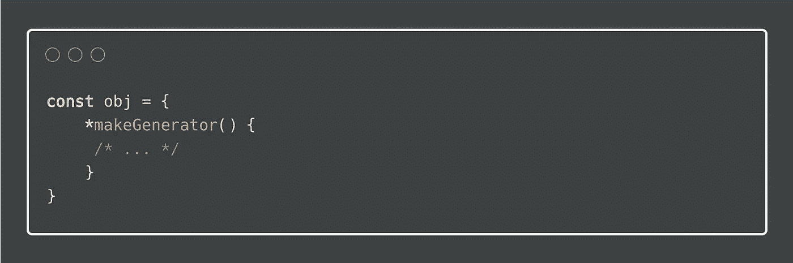

Generator method (object literal)

**生成器方法(类)**

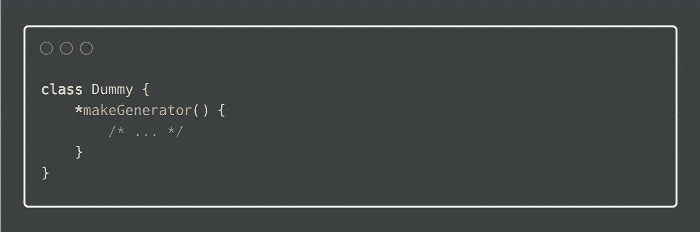

Generator method (class)

注意星号(`*`)的位置没有区别。有鉴于此，以下所有内容都是等效的:

*   `function* generator() {}`
*   `function * generator() {}`
*   `function *generator() {}`

**发电机功能与发电机**

如果我们检查`generator.__proto__`和`gen.__proto__`，我们可以看到`generator`是一个`GeneratorFunction`(构造函数)，它编排了一个新的`Generator`对象的创建。

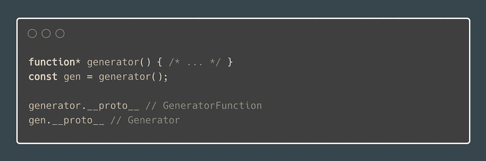

Generator function vs. generator

## 动态生成函数创建

您也可以动态声明一个生成器函数，尽管我建议您永远不要这样做。我提到这一点只是为了完整。因为我认为这是一种不好的做法，所以我就不再赘述了。

你可以在这里阅读更多关于这个话题的内容[。](https://developer.mozilla.org/en-US/docs/Web/JavaScript/Reference/Global_Objects/GeneratorFunction)

## `Run To The Next yield`

常规功能遵循所谓的**运行到完成**模型。要退出常规功能，您必须:

*   `return`从它
*   `throw`一个错误

如果一个函数没有`return`语句，该函数默认返回`undefined`。

如果您再次调用该函数，它将从头开始，并一直同步执行到退出点。

对于常规函数，您通过参数传递中的值**，通过`return`语句传递**中的值**。**

**发电机**另一方面**可以中途停止**和**暂停自身**。

> 产量是每台发电机的核心和灵魂。

这种暂停机制使**双向信息在发生器及其控制机制之间传递**。每次`yield`你发送消息**到**，每次重启你发送消息**到**。

> 生成器将控制权交还给调度程序，以便它可以运行另一个任务。

我将在本文后面讨论协作式多任务处理时详细阐述这个主题。

## 从生成器中提取值

通过将生成器用作迭代器(和/或可迭代的),您可以从中提取值。

生成器使用关键字`yield`生成一系列值。控制机制(在这种情况下只有我们)可以使用生成器上的`next()`方法访问下一个序列值。

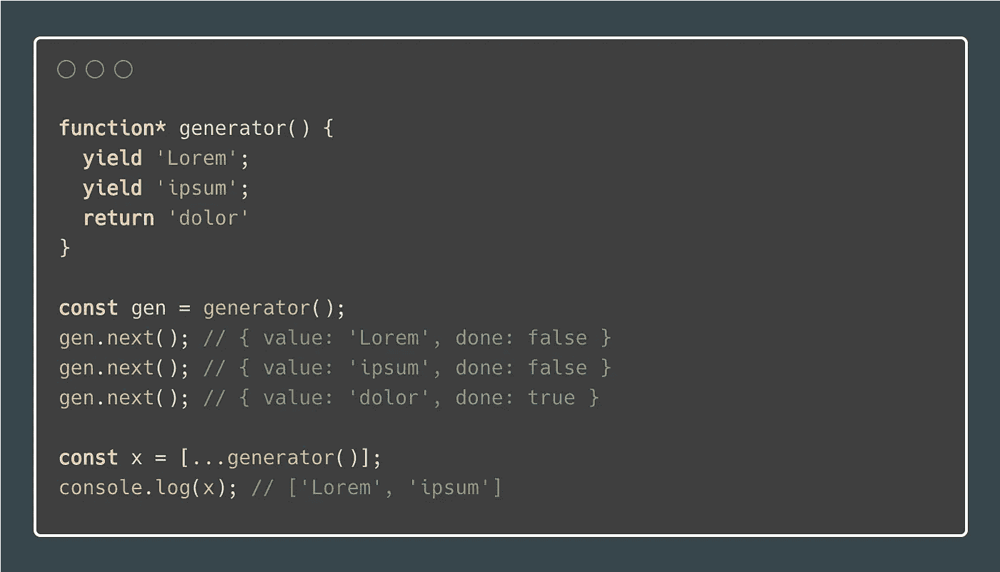

Pulling values from a generator, with a return statement

之前的生成器有一个显式的`return`。注意，当`done`为`true`时，大多数使用 iterables 的构造都会忽略`value`。`yield*`运算符确实考虑了返回值，我们稍后会看到这一点。

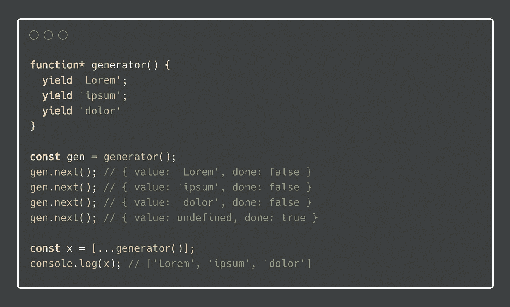

Pulling values from a generator, without return statement

如果不在生成器中使用`return`，它会隐式返回`undefined`，并且再调用一次`next()`来消耗迭代器。这是因为生成器等待传回一个值，在该值中重新启动并完成生成器。看完下一节你就明白了。

因为生成器对象是可迭代的，所以您可以将它们与期望可迭代的 ES6 语言结构一起使用:

*   `**for ... of**`(循环)
*   `**...**`(传播算子)
*   `const **[a, b, ..]** = iterable;`(破坏任务)
*   `**yield***`(发电机委托)

参见[上一篇关于迭代器和 iterable 的文章](https://medium.com/javascript-in-plain-english/javascript-lazy-evaluation-iterables-iterators-e0770a5de96f)了解更多信息。

## 将值推入生成器

前面我说过生成器符合`Observer`接口。生成器每次点击`yield`关键字时都会等待输入。

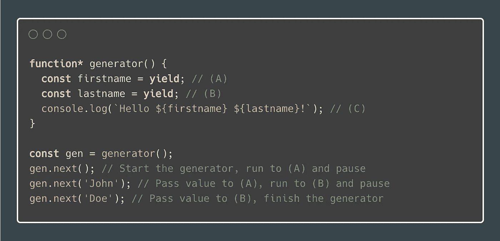

Pushing value to a generator

调用`generator()`只会创建一个生成器对象。要真正启动发电机并在第一次`yield`暂停，您必须调用`next()`。只有这样，它才准备好输入。

**牢记** `**next()**` **方法在发电机上是不对称的**。当被调用时，它既向当前挂起的`yield`发送一个值，同时又返回后面的`yield`的`{ value, done }`对。

当发生器在`yield`处暂停时，调用`next(value)`向发生器传递一个值。传递的`value`然后在适当的位置替换`yield`。所以当生成器运行到第`(C)`行时，实际上与您写的一样:

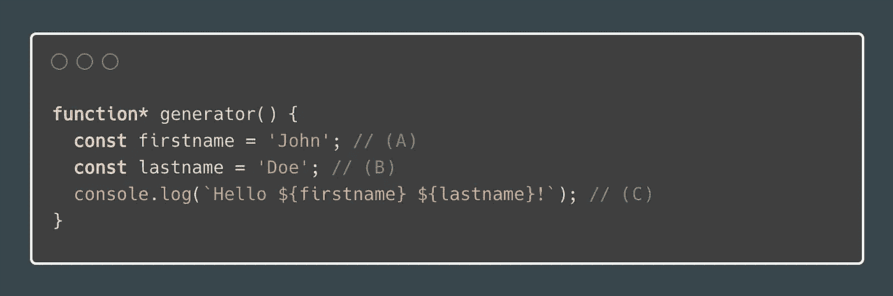

Pushing value to a generator, yields replaced

`{ value, done }`对被称为`IteratorResult`。更多信息见[上一篇文章](https://medium.com/javascript-in-plain-english/javascript-lazy-evaluation-iterables-iterators-e0770a5de96f)。

## 发电机委托

有时你会意识到你的生成器函数太长了。你想把一堆代码提取到不同的生成器中。此外，您需要一种方法来调用这个提取的生成器，并确保从原始生成器生成的所有值仍然被生成，但这一次是从子例程生成的。这就是`yield*`介入的地方。

考虑下面的例子:

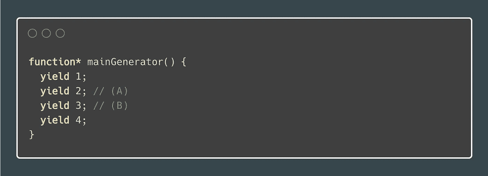

Generator delegation, before refactoring

假设您想将线`(A)`和`(B)`提取到另一个发电机。这不成问题，让我们创建一个`subGenerator`生成器函数并将代码放在那里。

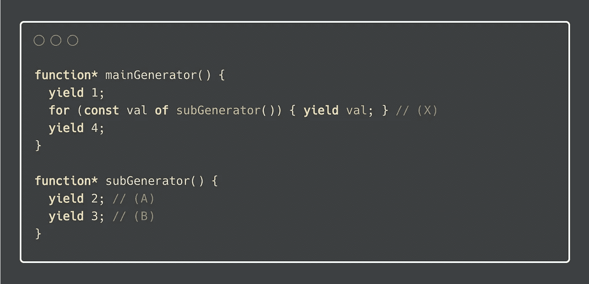

Generator delegation, re-yielding values from a subroutine

现在我们需要迭代新提取的生成器，并在第`(X)`行产生我们从中提取的值。那很好，但是…

我们可以更进一步。我们可以用`yield*`。

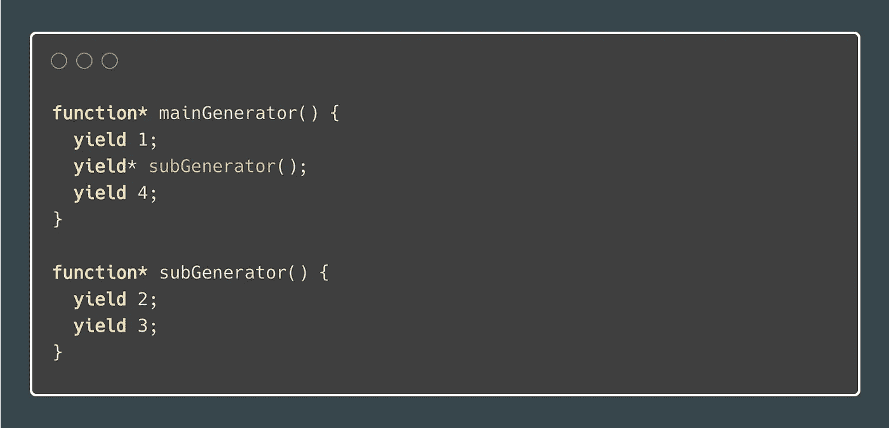

Generator delegation, using yield*

`**yield***` **在进入下一条生产线之前，同步排空传入的发电机。**

> 当用`yield*`调用子程序时，你可以捕获从生成器返回的值。

前面我提到过，当`done`是`true`时，大多数使用 iterables 的构造忽略了`value`，而`yield*`是一个例外，实际上确实考虑到了这一点。

Generator delegation, returning from yield*

当`(A)`线上的发电机`subGenerator`被消耗后，返回`3`。然后在`number`变量中捕获。请参见**示例/ DOM 事件处理程序**部分，了解这为什么有用。

## 清除

类似于迭代器，当突然完成时，您可能希望执行清理。为了举例说明什么是突然完成，假设您有一个打开文本文件的生成器。您对生成器进行循环，该生成器逐行向消费者生成文本文件。当没有更多的行产生时，生成器关闭文件。

但是如果你不循环所有的行呢？这将使文件描述符挂起，永远不会关闭。让我们用一个简单的例子来证明这一点。

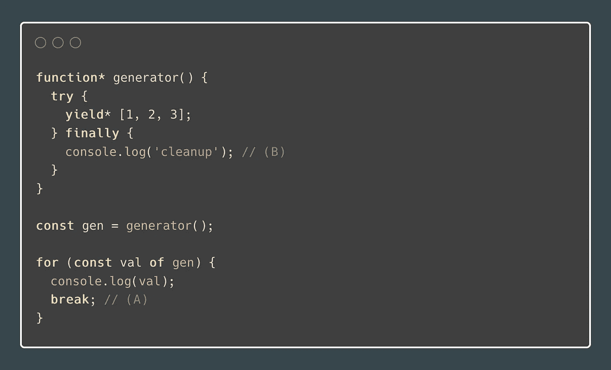

Generator cleanup after abrupt completion

为了能够捕捉第`(A)`行的突然结束，您将生成器内部的代码包装到一个`try/finally`块中。当在`try`块中突然完成时，代码继续在`finally`块的第`(B)`行执行，在这里你可以执行任何清除。

请随意通读[上一篇文章](https://medium.com/javascript-in-plain-english/javascript-lazy-evaluation-iterables-iterators-e0770a5de96f)，该文章也描述了什么构造了没有被消耗的封闭迭代器，或者什么可以提前终止迭代。

## 抛出异常并返回值

您不仅可以向生成器传递一个值，还可以让生成器**返回值**或**抛出一个异常**。

除了`next()`方法，生成器上还有另外两种方法可用，来自`Observer`接口。

*   `return()`
*   `throw()`

请注意，只有当您能够控制生成器的前进方式或者使用运行生成器的协程时，您才能使用这些方法。

**返回值**

当你调用`gen.return(value?)`时，发生器不会恢复它正在做的任何事情。它做两件事:

1.  执行`finally`块(如果存在)
2.  向调用者返回一个`IteratorResult`:`{ done: true, value: <undefined|any> }`

Generator: returning a value

`gen.next()`启动发电机。发电机停在`(A)`行。第`(B)`行上的`gen.return(false)`完成生成器，继续到第`(C)`行的`finally`阻塞，并将`IteratorResult`，更具体地说是`{ done: true, value: false }`返回给调用者。

**抛出异常**

当您调用`gen.throw(err)`时，无论发生器正在做什么，它也不会恢复。它做三件事:

1.  执行`catch`程序块(如果存在)
2.  执行`finally`程序块(如果存在)
3.  向调用者返回一个`IteratorResult`:`{ done: true, value: undefined }`

**例 1** :捕捉生成器内部抛出的异常

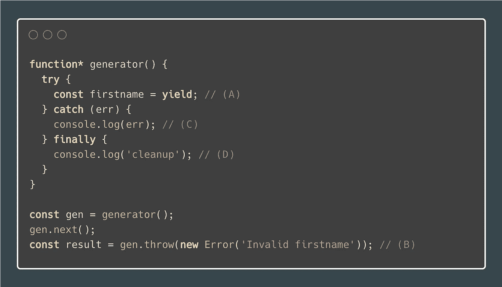

Generator: catching a thrown exception inside the generator

1.  `gen.next()`启动发电机。
2.  发电机停在`(A)`线上。
3.  第`(B)`行的`gen.throw(new Error('Invalid firstname'))`指示生成器在当前暂停的地方抛出一个错误，这是第`(A)`行。
4.  在线`(C)`上的发生器内部捕捉到异常。
5.  然后执行`(D)`线上的`finally`块。发电机返回`IteratorResult`，特别是`{ done: true, value: undefined }`。

**示例 2** :在生成器外捕获抛出异常

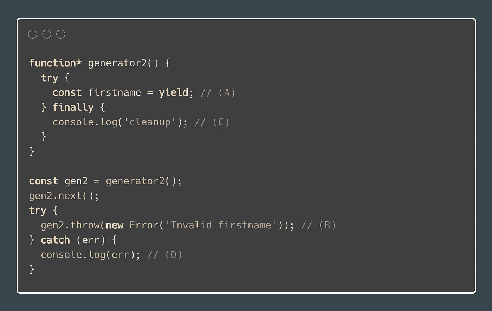

Generator: catching a thrown exception outside the generator

1.  `gen.next()`启动发电机。
2.  发电机停在`(A)`线。
3.  `gen.throw(new Error('Invalid firstname'))`在线`(B)`上指示生成器在当前暂停的地方抛出错误，这是一条线`(A)`。
4.  发电机内部没有`catch`块，所以发电机跳到`C)`线上的`finally`块进行清理。
5.  **错误向呼叫者冒泡。**线上捕捉到异常`(D)`。

请注意`(B)`线上没有`IteratorResult`返回给来电者。

## 限制

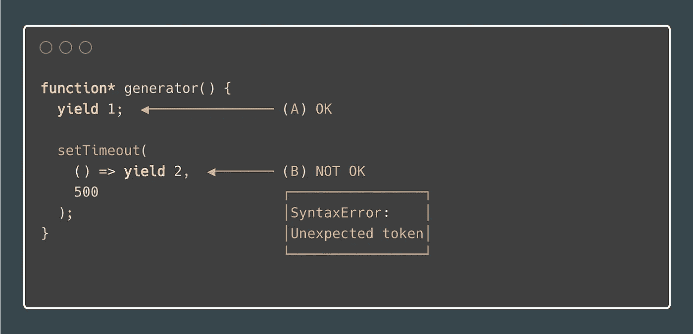

Generator function with SyntaxError

我见过很多人问同样的问题:*我如何在回调中使用收益率？*事实是，你不能。

您只能直接在生成器功能内部使用`yield`。如果你仔细观察我们传递给`setTimeout`的回调函数，你会发现它只是一个箭头函数，而不是一个生成器函数。为此，非发生器功能内部的`yield`导致`SyntaxError`。

以上示例可以通过`delay()`功能和协同多任务来修复。我们稍后将讨论协作多任务处理。固定生成器函数如下所示:

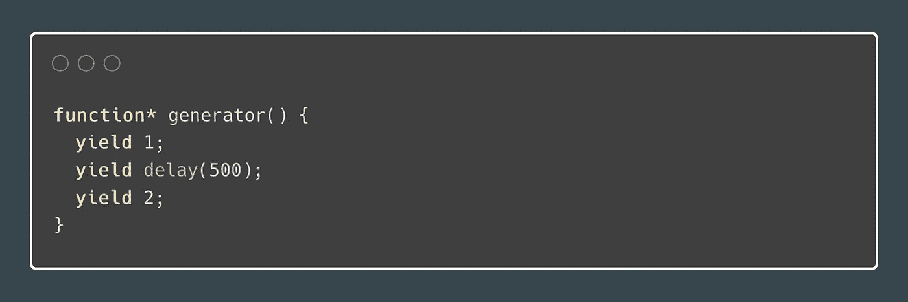

Generator function with delay utility

参见**示例** / **用于处理承诺的简单协同程序(又名异步/等待)**中的解决方案。

# 协同程序

您可以使用生成器的事情之一是 coroutines。例如，它们允许您在 JavaScript 中实现**异步/等待**行为。据我所知，这实际上是如何在 JavaScript 中实现**异步/等待**的。

首先，让我们看看维基百科对死因有什么看法。我再次发现维基百科的描述非常准确。

> 协程是计算机程序组件，它通过允许暂停和恢复执行来概括用于非抢占式多任务处理的子例程。协程非常适合于实现常见的程序组件，如协作任务、异常、事件循环、迭代器、无限列表和管道。
> 
> [https://en.wikipedia.org/wiki/Coroutine](https://en.wikipedia.org/wiki/Coroutine)

为此，在 JavaScript 上下文中，协程是围绕着生成器的包装器，用于控制生成器的执行。

> 协作式多任务处理，也称为非抢占式多任务处理，是计算机多任务处理的一种风格，操作系统从不启动从一个正在运行的进程到另一个进程的上下文切换。相反，进程会定期或在空闲或逻辑阻塞时主动让出控制权，以使多个应用程序能够并发运行。这种类型的多任务被称为“合作的”，因为所有的程序必须合作，整个调度方案才能工作。
> 
> 【https://en.wikipedia.org/wiki/Cooperative_multitasking 号

换句话说，当 JavaScript 生成器等待一个任务完成时，比如一个异步请求，它可以将控制权交还给调度程序，以便运行另一个任务。这样，多个进程可以并发运行。

## 并发性与并行性

并发意味着应用程序同时在多个任务上取得进展。

并行性意味着应用程序将其任务分解成更小的子任务，这些子任务可以在同一时间并行处理。

> 并发是指**同时处理很多事情**。并行就是**同时做很多事情**。

礼貌地摘自[马德哈万·纳加拉詹](https://medium.com/u/5ee12e939c80?source=post_page-----f9eaa517f969--------------------------------)的精彩文章 [**并发与并行——简评**](https://medium.com/@itIsMadhavan/concurrency-vs-parallelism-a-brief-review-b337c8dac350) **。**

# 表演时间

理论说够了，让我们把手弄脏一点，看看有什么大惊小怪的。让我们从简单的开始，一点一点地增加例子的复杂性。

在[上一篇文章](https://medium.com/javascript-in-plain-english/javascript-lazy-evaluation-iterables-iterators-e0770a5de96f)中，一些例子也被实现为迭代器。您可以随意查看那里的示例，并比较用生成器实现相同的行为有多容易。

## 范围迭代器

首先，一个简单的范围迭代器。

JavaScript range Iterator

## 无限序列迭代器

注意这个例子中通常不被认可的`while (true)`是如何变得有意义的。

JavaScript infinite Iterator

## 结束迭代器

这段代码演示了突然完成后的清理，在本例中是一个`break`语句。

JavaScript generator cleanup after abrupt completion

## 对正则表达式匹配进行循环

更舒适的正则表达式匹配提取。

JavaScript generator for regular expressions

## Zip 实用程序

Zip 是一个迭代器，它聚集了来自每个可迭代对象的元素。

它返回元组的迭代器，其中第 *i* 个元组包含来自每个参数序列或可迭代对象的第 *i* 个元素。当最短的输入 iterable 用尽时，迭代器停止。

JavaScript Zip utility

## 组合子

组合子是组合现有的可重复项来创建新的可重复项的函数。可重复的组合。

我举了两个例子。他们证明了:

*   `filter`和`map`在迭代上操作
*   `cycle`从有限序列生成无限序列的实用程序
*   `take`采用有限或无限序列的`n`元素的实用程序

**例 1:**

JavaScript generator combinators — map and filter

**例 2:**

JavaScript generator combinators — cycle and take

我想在例子中保持简单，所以我使用了高阶函数(例如`filter`函数返回另一个函数)。您通常可能会做的是一个带有两个参数的 curried `filter`函数。

另外，注意我使用的是`pipe`。通常我更喜欢`compose`，但是当使用组合函数时，感觉更自然。纯粹是喜好问题。

## 处理承诺的简单协程(又名异步/等待)

所以你知道什么是协程，但是你以前没见过。这个例子展示了处理产生的`Promise`的协程的实现。

这使得代码看起来是同步的，并且更容易推理。此外，你能够轻松避免一个**承诺地狱**。

这个例子相当简单。我只想演示生成器和协程之间双向消息传递的基本思想。为了更容易定位和理解，我将注释直接放在源代码中。

JavaScript Coroutine for handling Promises

最重要的代码块如下所示。我们必须检查我们是否收到了任何`value`，因为`yield`隐含地产生了`undefined`。如果接收到的值是可解析的(a `Promise`)，我们将在获得解析的值后重启生成器。或者如果`Promise`被拒绝，则将`Error`传播到发电机。

如果值是`undefined`或者不是一个 Thenable，我们就把它反馈给生成器。

我们也不能忘记在`handleYieldedValue()`函数中包装`iterator.next()`，因为像我之前提到的那样`iterator.next()`方法是**非对称的**并返回后续的`IteratorResult`给我们处理。

JavaScript Promise Coroutine handling

在[阅读更多关于**无极地狱**罗纳德陈](https://medium.com/u/6849951de65c?source=post_page-----f9eaa517f969--------------------------------)的伟大文章**如何逃离无极地狱**。

## DOM 事件处理程序

很久以前，我看到一篇文章，展示了用生成器处理 DOM 事件的可能性。

这个解决方案背后的思想是**您将所有的 DOM 事件提供给生成器**，它反过来检查它当前是否对这样的事件感兴趣。那么它要么相应地采取行动，要么忽略该事件。

我从未在作品中使用过这个，但我喜欢这个想法。这个例子很好地演示了生成器委托(`yield*`)的使用和从生成器返回值。

Handling DOM Events With Generators

# 在你离开之前

如果你想不出如何在你的项目中使用发电机，不要难过。并非每个项目都需要发电机。它们是非常特殊的构造，解决特定领域的问题。但是他们处理得很好。

如果你是 Redux 用户，看看[**Redux Saga**](https://redux-saga.js.org/)**。这是一个基于生成器的处理 Redux 副作用的流行库。**

> 当处理无限值序列时，生成器是一个很好的工具。

我必须学习不同的编程语言来完全理解生成器的用例。比如**哈斯克尔**。Haskell 的核心是能够对无限的值序列进行操作。而且在语言中用的很重，你基本上逃不掉。

下次见。**🐺阿尔法，完毕。**

# 资源

*   [https://exploringjs.com/es6/ch_generators.html](https://exploringjs.com/es6/ch_generators.html)
*   [https://hacks . Mozilla . org/2015/07/es6-深入-生成器-续/](https://hacks.mozilla.org/2015/07/es6-in-depth-generators-continued/)
*   [https://developer . Mozilla . org/en-US/docs/Web/JavaScript/Reference/Global _ Objects/Generator](https://developer.mozilla.org/en-US/docs/Web/JavaScript/Reference/Global_Objects/Generator)
*   [https://code burst . io/understanding-generators-in-es6-JavaScript-with-examples-6728834016 D5](https://codeburst.io/understanding-generators-in-es6-javascript-with-examples-6728834016d5)
*   [https://medium . com/daily js/a-simple-guide-to-understanding-JavaScript-es6-generators-d1c 350551950](https://medium.com/dailyjs/a-simple-guide-to-understanding-javascript-es6-generators-d1c350551950)
*   [https://www . pan company . com/blog/2020/6/5/does-JavaScript-need-generators](https://www.pancompany.com/blog/2020/6/5/does-javascript-need-generators)
*   [https://davidwalsh.name/es6-generators](https://davidwalsh.name/es6-generators)
*   [https://rileygelwicks . git books . io/you-dont-know-js/content/async % 20&% 20 performance/APB . html](https://rileygelwicks.gitbooks.io/you-dont-know-js/content/async%20&%20performance/apB.html)
*   [https://www . LinkedIn . com/pulse/using-JavaScript-generators-yield-promises-vladim % C3 % ADr-gorej/](https://www.linkedin.com/pulse/using-javascript-generators-yield-promises-vladim%C3%ADr-gorej/)
*   [https://www . aaron-Powell . com/posts/2014-01-18-calling-up-callbacks-with-yield/](https://www.aaron-powell.com/posts/2014-01-18-calling-up-callbacks-with-yield/)
*   [https://github . com/isRuslan/learn-generators/tree/master/exercises](https://github.com/isRuslan/learn-generators/tree/master/exercises)
*   [https://developer . Mozilla . org/en-US/docs/Web/JavaScript/Reference/Global _ Objects/generator function](https://developer.mozilla.org/en-US/docs/Web/JavaScript/Reference/Global_Objects/GeneratorFunction)
*   [https://hacker noon . com/JavaScript-es6-you-don-t-really-need-to-learn-generators-96aa 2e 9114 fa](https://hackernoon.com/javascript-es6-you-dont-really-need-to-learn-generators-96aa2e9114fa)
*   [https://media . com/JavaScript-scene/the-hidden-power-of-es6-generators-observated-async-flow-control-CFA 4c 7f 31435](https://medium.com/javascript-scene/the-hidden-power-of-es6-generators-observable-async-flow-control-cfa4c7f31435)
*   [https://gist . github . com/elclanrs/45800747 e7c 1c 126594 fa 1257688 BF 85](https://gist.github.com/elclanrs/45800747e7c2c126594fa1257688bf85)
*   [https://whistlr.info/2020/async-generators-input/](https://whistlr.info/2020/async-generators-input/)
*   [https://www . smashingmagazine . com/2018/01/rise-state-machines/](https://www.smashingmagazine.com/2018/01/rise-state-machines/)
*   [https://dev . to/rfornar/JavaScript 用例生成器-1npc](https://dev.to/rfornal/use-cases-for-javascript-generators-1npc)
*   [https://en.wikipedia.org/wiki/Cooperative_multitasking](https://en.wikipedia.org/wiki/Cooperative_multitasking)
*   [https://en.wikipedia.org/wiki/Coroutine](https://en.wikipedia.org/wiki/Coroutine)
*   [https://media . com/@ itimadhavan/concurrency-vs-parallelism-a-brief-review-b 337 c8 DAC 350](https://medium.com/@itIsMadhavan/concurrency-vs-parallelism-a-brief-review-b337c8dac350)
*   [https://docs.python.org/3/library/functions.html#zip](https://docs.python.org/3/library/functions.html#zip)