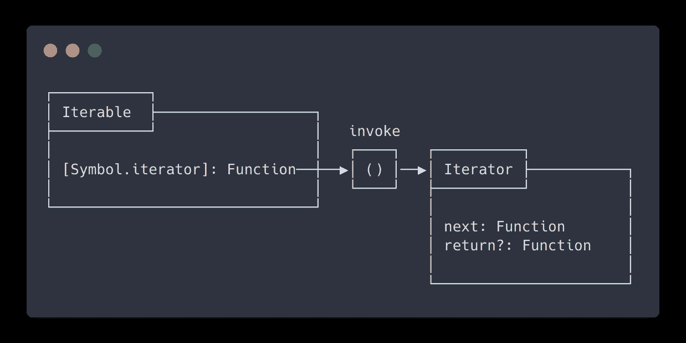
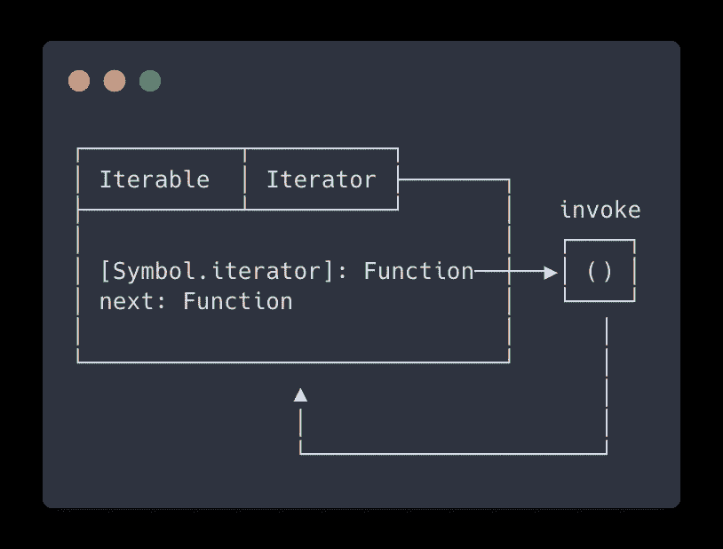

# JavaScript 惰性求值:可迭代程序和迭代器

> 原文：<https://javascript.plainenglish.io/javascript-lazy-evaluation-iterables-iterators-e0770a5de96f?source=collection_archive---------2----------------------->

## JavaScript Alpha 指南

## 可迭代和迭代器。惰性评估算法的基本构件。让我们看看它们是由什么组成的，以及它们有什么用处。


JavaScript lazy evaluation: Iterables & Iterators

懒评测，每个函数式程序员的梦遗。很快，我们就会看到发电机。但是首先，让我们了解什么是迭代器和可迭代对象，因为对我来说，它们是生成器的先决条件。

# 懒惰评估

**惰性求值**意味着将表达式的求值延迟到需要的时候。惰性评估有时被称为**按需调用**。

懒惰评估的反义词是**热切评估**。这是大多数编程语言中使用的评估策略。

惰性评估可以:

*   定义潜在的无限数据结构
*   通过避免不必要的计算来提高性能
*   为希望其元素可供公众访问的数据结构定制迭代行为

# 迭代器

JavaScript 中的**迭代器**(因为 [**ECMAScript 6**](http://es6-features.org/#IteratorForOfOperator) )使得惰性求值和创建用户定义的数据序列成为可能。

**迭代**是一种遍历数据的机制。迭代器是遍历数据结构元素的指针，称为 **Iterable** 。产生一系列值的指针。

迭代器是一个可以被迭代的对象。它抽象了一个数据容器，使其行为像一个可迭代的对象。

迭代器不会在实例化时计算每一项的值。下一个值仅在请求时生成。这很有用，尤其是对于大型数据集或无限数量元素的序列。

# 可重复的

Iterables 是希望公众可以访问其元素的数据结构。

许多 API 接受 iterables，例如:

*   `new Map([iterable])`
*   `new WeakMap([iterable])`
*   `new Set([iterable])`
*   `new WeakSet([iterable])`
*   `Promise.all([iterable])`
*   `Promise.race([iterable])`
*   `Array.from([iterable])`

也有期望可迭代的语句和表达式，例如:

*   `**for ... of**`(循环)
*   `**...**`(传播算子)
*   `const **[a, b, ..]** = iterable;`(解构分配)
*   `**yield***`(发电机委托)

JavaScript 中已经有许多内置的可迭代对象:
`String`、`Array`、`TypedArray`、`Map`、`Set`。

# 迭代协议

**迭代器**和**迭代器**符合 [**迭代** **协议**](https://developer.mozilla.org/en-US/docs/Web/JavaScript/Reference/Iteration_protocols) 。

> 协议是一组接口和使用它们的规则。

迭代器符合**迭代器协议**。可迭代符合**可迭代协议**。

## 可迭代协议

Iterable 协议允许 JavaScript 对象定义或定制它们的迭代行为。

要使一个对象成为可迭代的，它必须实现一个可通过`Symbol.iterator`访问的迭代器方法。这个方法是迭代器的工厂。

使用 TypeScript，iterable 协议如下所示:

```
interface Iterable {
  [Symbol.iterator]() : Iterator;
}
```

`[Symbol.iterator]()`是一个零参数函数。它在 iterable 对象上被调用，这意味着您可以通过`this`访问 iterable。它可以是常规函数，也可以是生成器函数。

## 迭代器协议

迭代器协议定义了产生值序列的标准方法。

一个对象要成为迭代器，它必须实现一个`next()`方法。可选地，迭代器可以实现一个`return()`方法，我们将在本文后面讨论。

使用 TypeScript，迭代协议如下所示:

```
interface Iterator {
    next() : IteratorResult;
    return?(value?: any): IteratorResult;
}
```

其中`IteratorResult`是:

```
interface IteratorResult {
    value?: any;
    done: boolean;
}
```

*   `done`通知消费者迭代器是否已被使用，`false`表示仍有值要生成，`true`表示迭代器已到达其末尾
*   `value`可以是任何 JavaScript 值，它是向消费者公开的值

当`done`为真时，可以省略`value`。

## 放在一起

要可视化 iterable 和 iterator 之间的连接，请参见下图。



The connection between iterable and iterator


# ⌨️表演时间

好了，理论到此为止。让我们看一些例子。我们将从一些基本的例子开始，然后一点一点地添加我们到目前为止学到的东西，使事情变得更有趣。

## 范围迭代器

让我们从一个非常基本的迭代器开始，`createRangeIterator`迭代器。

我们手动调用`it.next()`来获得下一个`IteratorResult`。最后一次调用返回`{ done: true }`，这意味着迭代器现在被消耗掉了，不会再产生更多的值。

Simple iterator

## 可迭代范围迭代器

在本文的前面，我提到过 JavaScript 中的一些语句和表达式需要 iterables。正因为如此，我们之前的例子在使用`for ... of`循环时就不起作用了。

但是创建一个同时符合**迭代器**和**可迭代**协议的对象是很容易的。

为了形象化这一点，请参见下图。



An object that is both iterable and iterator

Iterable iterator

## 无限序列迭代器

迭代器可以表达无限大小的序列，因为它们只在你需要时才计算值。

注意不要在无限迭代器上使用扩展运算符(`...`)。JavaScript 会尝试消耗迭代器，因为迭代器是无限的，所以它永远不会到达终点。相反，你的应用会崩溃，因为你会耗尽内存。

此外,`for ... of`循环在这样的 iterable 上将是无止境的。确保退出循环。否则，你也会耗尽内存。

Infinite iterator

## 结束迭代器

前面我们提到迭代器可以选择一个`return()`方法。当迭代器直到末尾才被迭代时，使用该方法，并让迭代器进行清理。

`for ... of`循环可以通过以下方式提前终止迭代:

*   `break`
*   `continue`(当你用标签继续外循环时)
*   `throw`
*   `return`

以下构造关闭未被消费的迭代器:

*   `for ... of`
*   `yield*`
*   解构
*   `Array.from`
*   `Map(), Set(), WeakMap(), WeakSet()`
*   `Promise.all(), Promise.race()`

摘自[https://2ality.com/2015/02/es6-iteration.html](https://2ality.com/2015/02/es6-iteration.html)。

Iterator cleanup through return()

*   如果你知道迭代器已经到达终点，你可以手动调用`cleanup()`函数。
*   如果有一个突然的完成，那么`return()`就会开始为我们做清理工作。


# 💥额外的

如果你已经做到这一步了，我们再补充一些额外的东西。

## 组合子

组合子是组合现有的可重复项来创建新的可重复项的函数。可重复的组合。

正因为如此，我们能够创建许多实用函数。`map`或者`filter`怎么样？看到下面的代码，给它一分钟的时间来理解。

Combinators

耶！代码太多了。很快我们将会看到如何使用**生成器**和**函数式编程概念**来重构这一切。您会惊讶于所有这些代码可以变得多么紧凑。

保持安全，保持关注，并留意我即将到来的文章，我们仍然有很多要涵盖。

下次见。**🐺阿尔法，完毕。**


# 资源

*   [https://exploringjs.com/es6/ch_iteration.html](https://exploringjs.com/es6/ch_iteration.html)
*   [https://developer . Mozilla . org/en-US/docs/Web/JavaScript/Guide/Iterators _ and _ Generators](https://developer.mozilla.org/en-US/docs/Web/JavaScript/Guide/Iterators_and_Generators)
*   [https://developer . Mozilla . org/en-US/docs/Web/JavaScript/Reference/Iteration _ protocols](https://developer.mozilla.org/en-US/docs/Web/JavaScript/Reference/Iteration_protocols)
*   [https://swi zec . com/blog/finally-a-practical-use-case-for-JavaScript-generators/](https://swizec.com/blog/finally-a-practical-use-case-for-javascript-generators/)
*   [https://2ality.com/2015/02/es6-iteration.html](https://2ality.com/2015/02/es6-iteration.html)
*   [https://www . freecodecamp . org/news/how-and-why-you-should-use-python-generators-f6fb 56650888/](https://www.freecodecamp.org/news/how-and-why-you-should-use-python-generators-f6fb56650888/)
*   [https://vegi bit . com/iterators-in-ES6/#:~:text = ES6 % 20 now % 20 has % 20 what % 20 known，that % 20 returns % 20 an % 20 iterator % 20 object](https://vegibit.com/iterators-in-es6/#:~:text=ES6%20now%20has%20what's%20known,that%20returns%20an%20iterator%20object)。
*   [https://en.wikipedia.org/wiki/Lazy_evaluation](https://en.wikipedia.org/wiki/Lazy_evaluation)