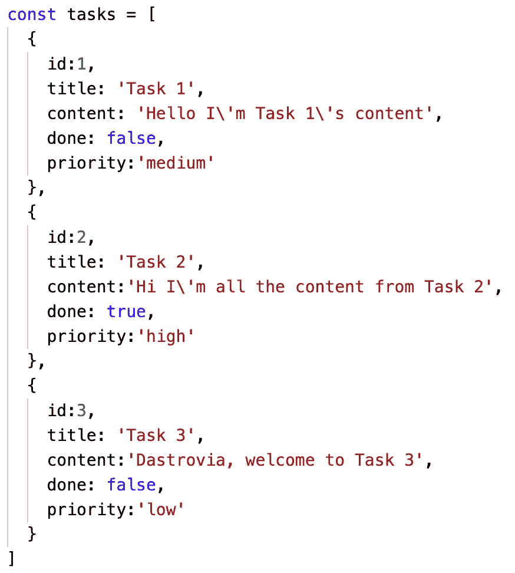
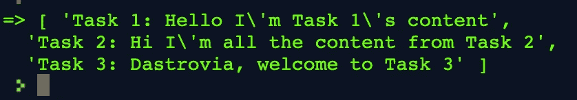

# 用例子映射 JavaScript

> 原文：<https://javascript.plainenglish.io/javascript-map-with-examples-fd679d04a16d?source=collection_archive---------1----------------------->

## 那个。地图，地图。过滤器和。减少数组原型方法是大多数 JS 应用程序的动力

## 正因为如此，我把它分成了三篇文章，这样你就可以随心所欲了！

所以，让我们花一分钟时间简单回顾一下地图原型的功能。我们将回顾许多小代码示例，所以如果您愿意的话；[这是一个回购](https://repl.it/@PatrickGoulding/Map-Filter-Reduce-Practice)，数组以及问题和答案在底部。



*The example array*

# 地图:

地图是我最喜欢的易于使用和适应性的原型方法。[有几个简单的规则。map](https://developer.mozilla.org/en-US/docs/Web/JavaScript/Reference/Global_Objects/Array/map) ，它总是返回一个相同大小的数组**，它是**非破坏性的，**它返回数组，数组中的每个元素**是回调函数**的结果。如果您试图迭代大量的对象并修改或显示它们，这个原型方法特别有用。假设我们只想显示这个数组中的所有信息，我们可以称之为. map()并返回结果。**

```
tasks.map(task => task) // find this in the Repl by: A.1
```

**好了，现在你已经从[数据集](https://en.wikipedia.org/wiki/Data_set)中获得了一个充满对象的数组。方法是当您致电时。map()在一个数组中，可以使用多个参数来显示它们。最常见的只是回调函数*(或“task = >”)。***

**现在很明显，很少有我们不想修改数组某个部分的情况。所以，让我们试着从数据集中获取标题和内容，然后像这样返回:**

****

**Received value**

```
// Answer here:tasks.map(task => task.title + ': ' + task.content) // find this in the Repl by: A.2
```

**因此，在每次迭代中，映射函数的工作方式是将*“任务”*视为一个对象，并使用点符号来访问该特定对象的属性，然后[连接](https://www.merriam-webster.com/dictionary/concatenate)或将它们相加。当它完成时，它有一个数组，其中有三个值[“任务 1:……”，“任务 2:……”，“任务 3:……”]，所以它的长度仍然相同。**

> **当它完成时，它有一个带有三个值的数组[“任务 1:……”、“任务 2:……”、“任务 3:……”]，所以它的长度仍然是**。****

**只要数组的长度保持不变，Map 就可以将字符串转换成对象，反之亦然。map 的另一个优点是能够动态修改元素，比遍历数组、找到对象然后更改对象并将其发送回去要快得多。**

**现在我们已经了解了更多关于引擎盖下发生的事情，我鼓励你[去回复](https://repl.it/@PatrickGoulding/Map-Filter-Reduce-Practice)并做一些练习。**

**感谢您花时间阅读这篇文章，如果您想在我发表其他文章时得到通知，请在 Twitter 上关注我 [@p_goulding](https://twitter.com/p_goulding) ！**

**再次感谢 [Alan B Smith](https://medium.com/u/d9498cd91fed?source=post_page-----fd679d04a16d--------------------------------) 帮助解决我可能有的任何问题，感谢 [Jessica West](https://medium.com/u/b74e3ea5d064?source=post_page-----fd679d04a16d--------------------------------) 成为我灵感的持续来源，感谢[图灵学校](https://medium.com/u/4d5de5a312c8?source=post_page-----fd679d04a16d--------------------------------)将我塑造成今天的开发者。**