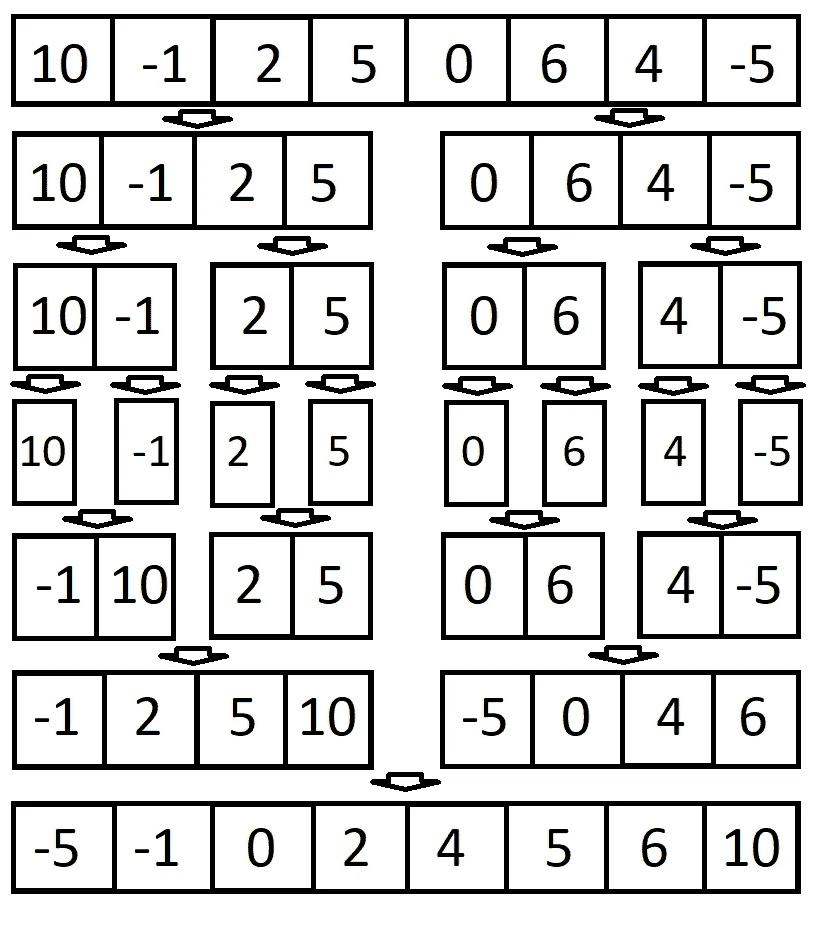

# JavaScript 中的合并排序算法

> 原文：<https://javascript.plainenglish.io/javascript-merge-sort-3205891ac060?source=collection_archive---------0----------------------->


[Source](https://gifer.com/en/7StW)

了解和实现排序算法非常重要。今天，我想回顾一下 JavaScript 中最流行的排序算法之一，叫做**合并排序**。

# 什么是合并排序？

合并排序是当今最流行的排序算法之一，它使用*分治*的概念来对元素列表进行排序。也就是说，它将大问题分成小问题，然后解决每个小问题，以解决我们开始时的大问题。

# 履行

## 规划

既然我们简要地讨论了合并排序，那么让我们直接进入合并排序的实现。

*(注意:我将使用递归在 JavaScript 中实现合并排序，以升序对未排序的数组进行排序。)*

在我们直接进入写代码之前，我们先确定一下**问题**、**计划**，拿出**解决方案**。我们举一个数组**【10，-1，2，5，0，6，4，-5】**的例子。这显然是一个未排序的数组。这正是我们的问题，我们必须使用合并排序来排序这个数组。归并排序需要把问题分成更小的问题。让我们来看一张图表，看看它会是什么样子:



请注意，在每一层，我们将数组分成两半，直到得到一堆单元素数组。这就是 ***划分*** 部分的 ***划分和*** ***征服*** 的方法。然后，我们开始在一系列步骤中合并和排序较小的数组，这是 ***征服*** 部分 ***分治*** 。

## 密码

我们现在已经确定了问题所在，并且有了一个关于如何实现合并排序的计划。所以我们来编码吧！

上面的代码将是我们的主函数，在递归调用的每次迭代中，它将给定的数组分成更小的数组。不要忘记递归需要一个基本用例，以避免无限递归。在我们的案例中，我们有:

```
if (unsortedArray.length <= 1) { 
    return unsortedArray; 
}
```

在我们设置了基本情况之后，我们可以继续确定中间的索引，并将数组分成左右两部分，就像上图中那样。然后，我们需要合并左侧和右侧，我们现在将实现:

在上面的合并函数中，我们需要确保我们对左边和右边的所有元素进行了排序。我们这样做的方法是使用一个 *while 循环*。此外，我们将需要确保通过使用变量 *leftIndex* 和 *rightIndex* 来跟踪我们正在比较的每个左边和右边的元素。

在 while 循环中，我们比较了位于 *leftIndex* 的左侧元素和位于 *rightIndex* 的右侧元素。我们可以将两者中较小的*放入结果数组中，并移动光标(*left index*/*right index*)以确保我们不会重复任何比较。*

最后，我们需要将结果数组与 *left.slice(leftIndex)* 和*right . slice(right index)*连接起来。**这很重要！**如果我们不执行这里的最后一步，我们将在末尾得到一个不完整的元素列表，因为一旦两个游标中的任何一个到达末尾，while 循环条件将失败，这意味着左侧或右侧的最后一个元素没有插入到结果数组中。

那是归并排序！没那么糟吧。

如果你想看完整的代码，你可以在这里查看[。](https://github.com/yeb9925/sorting-algorithms/blob/master/src/merge_sort/merge_sort_recursion.js)

非常感谢大家的阅读！您也可以通过我的个人资料查看我的其他 JavaScript 帖子。


## JavaScript 基础知识:

> **变量**:[https://medium . com/@ timhancodes 0281/basics-of-JavaScript-Variable-3 EB 6 f 4 f 0 af 18](https://medium.com/@timhancodes0281/basics-of-javascript-variable-3eb6f4f0af18)
> 
> **数据类型**:[https://medium . com/@ timhancodes 0281/basics-of-JavaScript-Data-Types-385 Bab 24 b 51](https://medium.com/@timhancodes0281/basics-of-javascript-data-types-385bab24b51)

## JavaScript 基础知识

> **原型继承**:[https://medium . com/JavaScript-in-plain-English/JavaScript-fundamental-Prototypal-inheritage-9153 ab 434 aae](https://medium.com/javascript-in-plain-english/javascript-fundamental-prototypal-inheritance-9153ab434aae)

## ES6

> **数组方法 cheat sheet**:[https://medium . com/@ Tim hancodes/JavaScript-Array-Methods-cheat sheet-633 f 761 AC 250](https://medium.com/@timhancodes/javascript-array-methods-cheatsheet-633f761ac250)
> 
> **Rest & Spread 运算符**:[https://medium . com/JavaScript-in-plain-English/Rest-Spread-operator-in-JavaScript-2 da 13 aa 942 FB](https://medium.com/javascript-in-plain-english/rest-spread-operator-in-javascript-2da13aa942fb)

## 数据结构

> **什么是栈和队列？**:[https://medium . com/@ Tim hancodes/JavaScript-what-is-stack-and-queue-79 df 7 af5a 566](https://medium.com/@timhancodes/javascript-what-are-stack-and-queue-79df7af5a566)

## JavaScript 采访主题

> **8 JavaScript 面试话题**:[https://medium . com/@ Tim hancodes/8-hot-JavaScript-Interview-Topics-4595458 d22fc](https://medium.com/@timhancodes/8-hot-javascript-interview-topics-4595458d22fc)

## 资源:

> Github:[https://github.com/yeb9925/sorting-algorithms](https://github.com/yeb9925/sorting-algorithms)