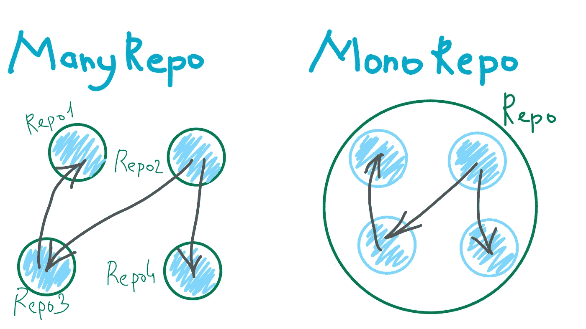

# 用 Lerna 构建 JavaScript Monorepo

> 原文：<https://javascript.plainenglish.io/javascript-monorepo-with-lerna-5729d6242302?source=collection_archive---------4----------------------->

如今的 JavaScript 几乎无处不在:后端、前端、桌面、移动、工具等等。

如果你的项目由多个 JavaScript 库组成，现在，最好将它们转移到一个/mono 库中，并使用 Lerna 控制它们。



# 什么是 Lerna？

> [Lerna](https://lernajs.io) 是一个用多个包管理 JavaScript 项目的工具。

在我们继续之前，我建议您看一下 [lerna 命令](https://github.com/lerna/lerna)。

# 为什么是 Monorepo？

***Monorepo*** 不是将一个项目中的所有东西混合在一起(**不要与 monolith** 混淆)。
**Monorepo** 是关于在一个存储库中拥有属于一个域的多个应用程序、服务和库的源代码。

> **注意:** Monorepo 可以以任何舒适的方式组织，目录树，这取决于开发人员/团队。

## 优点:

*   整个系统(应用/服务/库)的固定版本。
*   **跨项目变更。**例如，一个改变系统多个部分(库/服务/应用)的特性可以在一个拉取请求中完成。
*   **单克隆**。不需要克隆多个存储库。
*   **进入系统的所有部分**。整个系统的简化重构。

## 缺点:

*   版本控制系统性能下降。
*   安全。所有开发人员都可以访问系统的所有部分。

# 要求

*   节点。JS 版本 8 或以上

# 开始

在本例中，我们将创建一个简单的应用程序，包括:

*   **API:** API 服务(后端)
*   **前端:**前端/web app

此外，为了不将所有逻辑混在一起，我们将创建单独的包:

*   **验证器:**自定义验证库/包
*   **日志记录器:**自定义日志记录库/包

我们 monorepo 项目的整体文件结构是:

```
**packages/**        # directory for our custom libraries
../validator      # custom validation helpers
../logger         # custom logger library
**apps/**            # directory for our apps/services
../api            # API backend
../frontend       # frontend/web
```

## 1.初始化 Monorepo

```
# install lerna globally
npm i -g lerna# create a new dir for project
mkdir my-project && cd my-project# initialize a new lerna managed repository
lerna init
```

并编辑`lerna.json`

```
{
  "packages": [ "packages/*", **"apps/*"**],
  "version": **"0.1.0"**
}
```

> **注意:**我们将使用 [npm 范围的包](https://docs.npmjs.com/misc/scope)命名我们所有的应用和包。
> 举例:`@my-project/{package-name}`

让我们从库包开始。

## 2.创造一个`"validator" library package`

1.  创建并初始化`@my-project/validator`包:

```
# create library directory and cd inside
mkdir -p packages/validator && cd packages/validator# initialize library with scope name
npm init --scope=my-project --yes
```

2.增加`packages/validator/index.js`，内容如下:

## 3.创建一个“记录器”库包

1.  创建并初始化`@my-project/logger`包:

```
# From the root directory of the repository# create library directory and cd inside
mkdir -p packages/logger && cd packages/logger# initialize library with scope name
npm init --scope=my-project --yes
```

2.添加以下内容的`packages/logger/index.js`:

## 4.创建“api”应用程序包

1.  创建并初始化`@my-project/api`包:

```
# From the root directory of the repository# create app directory and cd inside
mkdir -p apps/api && cd apps/api# initialize app with scope namenpm init --scope=my-project --yes# install expressnpm i express --save# add our **logger** library as dependency to our **api** applerna add @my-project/logger --scope=@my-project/api
```

2.添加`apps/api/index.js`文件:

3.将开始脚本添加到`apps/api/package.json`:

```
"scripts": {
 ** "start": "node index.js"**
  ...
}
```

4.运行 app: `**npm start**`打开`http://localhost:8080/greeting`

## 5.创建“前端”应用程序包

1.  使用`create-react-app`创建`@my-project/frontend`:

```
# From the root directory of the repository# create frontend app using create-react-appcd apps && npx create-react-app frontend
```

2.编辑`apps/frontend/package.json` **:**

```
{
 **"name": "@my-project/frontend",**
  ...
 **"proxy": "http://localhost:8080"**
}
```

3.将我们的验证器作为依赖项添加到我们的前端。

```
# Add **validator** library as a dependency to **frontend** lerna add @my-project/validator --scope=@my-project/frontend
```

4.添加`apps/frontend/src/Greeting.js`:

5.在`apps/frontend/src/App.js`内的某处添加`<Greeting />`:

```
...
**import {Greeting} from './Greeting';**class App extends Component {
  ...
  render() {
    return (
        <div className="App">
           <header className="App-header">
             ...
             **<Greeting />**
           </header>
        </div>
    );
  }
}
...
```

6.运行前端 app: `npm start`打开`http://localhost:3000`。

# 结论

如你所见，一个 mono 库可以包含项目所需的任意数量的应用程序和库。重要的是保持一切松散耦合:

*   一个应用/服务/库->一个包

公共逻辑、实用程序或助手可以放在一个单独的包中。因此，我们可以构建高度独立的包，这更容易理解、维护和重构。

参见 [Github](https://github.com/erzhtor/javascript-monorepo-with-lerna) 上的完整源代码。

此外，您可以在这里查看更高级的 monorepo 示例。

## **用简单英语写的 JavaScript 笔记**

我们已经推出了三种新的出版物！请关注我们的新出版物:[**AI in Plain English**](https://medium.com/ai-in-plain-english)，[**UX in Plain English**](https://medium.com/ux-in-plain-english)，[**Python in Plain English**](https://medium.com/python-in-plain-english)**——谢谢，继续学习！**

**我们也一直有兴趣帮助推广高质量的内容。如果您有一篇文章想要提交给我们的任何出版物，请发送电子邮件至[**submissions @ plain English . io**](mailto:submissions@plainenglish.io)**，使用您的 Medium 用户名，我们会将您添加为作者。另外，请让我们知道您想加入哪个/哪些出版物。****