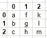
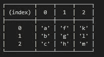
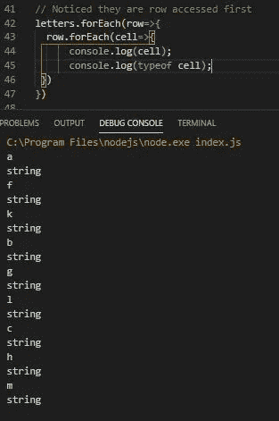

# JavaScript 多维数组

> 原文：<https://javascript.plainenglish.io/javascript-multi-dimensional-arrays-7186e8edd03?source=collection_archive---------1----------------------->

## 真相大白了


Photo by [Leo Foureaux](https://unsplash.com/@leofoureaux?utm_source=unsplash&utm_medium=referral&utm_content=creditCopyText) on [Unsplash](https://unsplash.com/s/photos/dimensions?utm_source=unsplash&utm_medium=referral&utm_content=creditCopyText)

> 事实是，JavaScript 不直接支持二维或多维数组。

S ome 语言，C#，Java 甚至 Visual Basic，举几个例子，让一个声明多维数组。但不是 JavaScript。在 JavaScript 中，你必须构建它们。

*个人评论:我喜欢建造它们。这有助于我理解它们到底是如何工作的。*

> 我们将关注二维数组。

# 定义

**一个二维数组**是由行和列组成的[矩阵](https://en.wikipedia.org/wiki/Matrix_(mathematics))的项目集合，并被赋予一个名称。

# 抽象解

**JavaScript 中的二维数组**是数组的数组，所以我们创建一个一维数组对象的数组。

> 让我们通过一个问题和一个解决方案来检验这一点。

# 问题是

假设我想要一个二维数组，名为**字母**，由字母组成，比如，



A 3 by 3 two-dimensional Array (matrix)

如果我们仔细观察，我们可以看到第一行字母是一个一维数组， **firstRow** =[a，f，k]。第二行也是一维数组， **secRow** =[b，g，l]依此类推。

同样，第一列字母是一维数组，
**firstCol** = [a，b，c] with **secondCol** =[f，g，h]依此类推。

> 换句话说，我们可以通过一个一维数组来构造它，其中每个原始的一维数组条目都是另一个一维数组。

> 基本上，它是一个数组的数组。简单，哈！

就像一维数组需要索引来引用每个数组位置中的项一样，二维数组也需要访问每个位置中的项的方法。

在上面的例子中，我们可以通过指定
**first row**【0】或**first col**【0】来访问字母“a”。

*这让我们想到了访问二维数组条目的解决方案*。对于我们的**字母**数组，字母‘a’将通过指定
**字母**【0】【0】来访问。字母“h”通过指定**字母**【2】【1】。

> 本质上，**array name**[**rowIndex**][**column index**。

> 那么，我们如何构建这个阵列，以及如何使用它呢？

# 解决方案

要创建二维数组，**首先创建一维数组**。然后遍历原始一维数组中的每一项，并在原始一维数组的每个索引位置创建另一个一维数组。

让我们以字母数组为例。

首先，我们将创建一个能够存储 3 个“东西”的一维数组然后我们将循环遍历这个数组，使这些“东西”中的每一个成为一个能够存储 3 个东西的数组，*一个字母*。

```
// Create a one dimensional array 
// capable of storing 3 objects
let  letters = new Array(3); // Indices 0,1,2

// Loop through the array, adding a 
// new array to each location
for (let i = 0; i < letters.length; i++) { 
    letters[i] = new Array(3);// new array of 3 locations
} 
// Put items in the 2D array
letters[0][0]='a';
letters[0][1]='f';
letters[0][2]='k';
letters[1][0]='b';
letters[1][1]='g';
letters[1][2]='l';
letters[2][0]='c';
letters[2][1]='h';
letters[2][2]='m';// Display the 2D Array
console.table(letters);
```

运行这个会给出，



Output of our 2D array

Console.table()做得很好。但是可以通过对循环使用嵌套的**或者许多其他方式中的一种来访问这些元素，例如 **forEach** 。**

```
// Noticed they are row accessed first
letters.forEach(row=>{
    row.forEach(cell=>{
        console.log(cell);
        console.log(typeof cell); })
})
```

哪个输出，



Each item or cell

或者类似于，

```
// Better to use console.dir() and not console.log()
for ( i in letters){
    for ( j in letters[i]){
      console.dir(letters[i][j]);
    }
}
```

请注意 console.dir()的用法。这是因为 **console.log()** 以字符串表示形式返回对象，而 **console.dir()** 将对象识别为对象并输出其属性。

> 关键是要记住，**array name**[**rowIndex**][**column index**]

对于一个“立方体”，三维数组，我们需要一个数组的数组的数组。以某种方式访问项目，例如， **arrayName** [i][j][k]。

# 结论

由于 JavaScript 不直接支持二维或多维数组，我们可以根据需要模拟它们，根据我们的需要使用数组的数组。

重要的是，我们要跟踪我们的索引以及如何访问数组中的项。

感谢您的阅读，我鼓励您进一步探索这一点。

**快乐编码！**

在 Medium 上阅读所有你想要的文章，并以每月 5 美元的价格成为 Medium 会员，帮助我继续写作。

[](https://bobtomlin-70659.medium.com/membership) [## 通过我的推荐链接加入灵媒——重力井(罗伯·汤姆林)

### 作为一个媒体会员，你的会员费的一部分会给你阅读的作家，你可以完全接触到每一个故事…

bobtomlin-70659.medium.com](https://bobtomlin-70659.medium.com/membership) 

你也可以享受，

[](https://medium.com/javascript-in-plain-english/using-javascript-sets-37752330682d) [## 使用 JavaScript 集

### 一些有趣的用法、观察和陷阱

medium.com](https://medium.com/javascript-in-plain-english/using-javascript-sets-37752330682d)