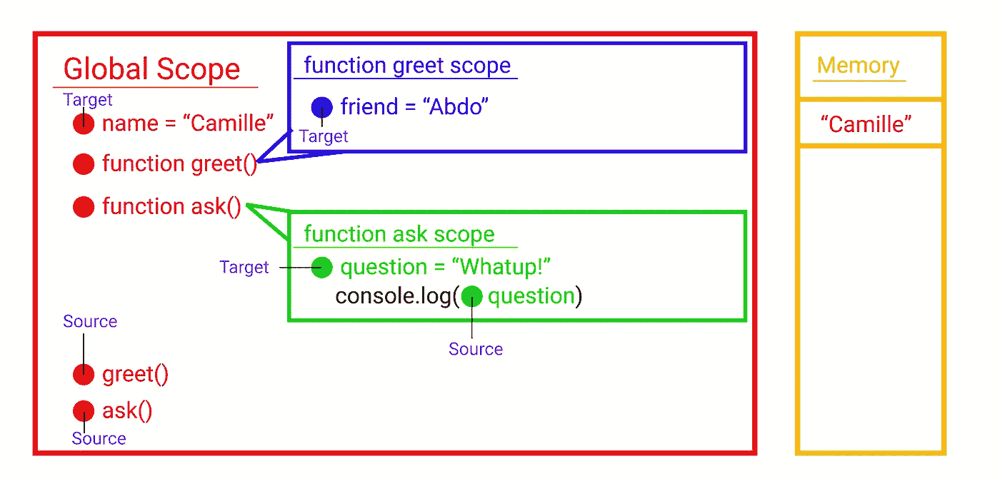

# JavaScript，我最喜欢的编译语言。

> 原文：<https://javascript.plainenglish.io/javascript-my-favorite-compiled-language-a-blog-about-scope-2012071aac86?source=collection_archive---------6----------------------->


Woah Woah Woah Woah，JavaScript 一种编译语言？！你可能会告诉自己，这个家伙太离谱了，应该去学习一两件关于 C 或 C#的事情，这是理所当然的。如果你问谷歌“javascript 是编译语言吗？”出现的第一个结果是来自斯坦福大学，它明确表示“ **JavaScript** 是一种解释型**语言**，而不是**编译型语言**”。

当然，JavaScript 不像 C 或 C#程序那样在一台机器上编译，然后在另一台机器上执行。但是 JavaScript 是一个**两遍系统**，这是不可否认的，所以我们将在这个意义上谈论它是一种编译语言。给定以下有问题的 sudo 代码，比较 bash 脚本和一些 JS 代码，我可以说明我的观点。

**痛击**

```
1 do something
2 do something else
3 do another thing
4 do a fourth thing < ---------- Error
```

**JavaScript**

```
1 do something
2 do something else
3 do another thing
4 do a fourth thing < ---------- Error
```

bash 脚本将**执行**第 1 到第 3 行，遇到我们的错误并崩溃，让我们不得不撤销我们在第 1 到第 3 行所做的事情。

另一方面，我们的 JS 示例不会执行第 1 行到第 3 行，解释器会在运行任何代码之前提醒我们。

**当我们说 JavaScript 是一种编译语言时，这就是我们的意思，其他人更喜欢用“解析”这个词，所以我将互换使用这两个术语，编译器/解析器也是如此。**

最重要的是要记住，JS 是一个**二传系统**。

第一遍:解析/编译

**第二遍**:执行

# 迷你编译器课程预警！

**一个** **编译器**是一个特殊的**程序**，它处理以特定编程语言编写的语句，并将它们转换成机器语言或“代码”，供**计算机的**处理器使用。

编译器有 4 个阶段。

*   词法分析->现在被认为是标记化阶段的一部分。
*   记号化:将字符序列变成**记号**
*   解析:将**令牌流**转化为所谓的**抽象语法树**。- > **这是我们的处理步骤/解析步骤**
*   代码生成:获取一个抽象的**语法树**并生成某种计算机能够理解的其他可执行形式的程序。

在 JavaScript 中，编译器通过第一遍，生成那个**抽象语法树**，但是也为**‘词法环境/词法范围’**(术语可以互换使用)生成一个**计划**。该计划将是第二遍中使用的路线图。

# 一些需要的定义

让我们从有助于理解我们正在谈论的东西的定义开始。

**范围**:在执行阶段，在哪里寻找东西(正在寻找的东西是 JS 引擎)。

**标识**:用于存储或检索信息的标签，例如:`variables`，`functions`

相对于 JavaScript 引擎，一个标识符只能在**的两个**位置中的一个:**目标**或**源**

**目标**:识别器将接收数据。

例如:

```
var name = "Greg"
```

**来源**:识别器会给出数据

例如:

```
console.log(name)
```

# 第一遍，编译/解析阶段|创建我们的计划。

这里需要注意的一个**非常重要的**细微差别是，这个**传递**是 JavaScript 中的一个**实际步骤**，并不与执行内联。

让我们用下面的例子和*一个匹配彩色弹珠(我们的标识符)和匹配彩色桶(我们的作用域)的游戏*来描述 JS 的编译阶段发生了什么。


JS 引擎从创建所谓的 ***全局范围*** 开始，这将是我们的红色桶。


当它到达第 1 行时，它遇到了我们的第一个**标识符** `var name`。它检查以前是否遇到过它，在这种情况下，它没有遇到过，因此创建了一个红色的弹球。


当它到达第 3 行时，它遇到了我们的第二个**标识符**，`function greet`这次它是一个函数，并创建了一个红色的弹球。功能是一种特殊的**标识符**。它们是“特殊的”,因为 JS 引擎不仅为它创建了一个“弹球”,还创建了一个“桶”,一个**范围**,我们将把它的颜色设为蓝色。


在第 4 行，我们遇到了我们的第三个**标识符**、`var friend`，它检查它以前是否遇到过它，在这种情况下，它没有，因此创建了一个蓝色的弹球。


我们将对第 5 行进行润色，`console`由 JS 引擎在全局范围内提供，实际上被分配了一个红色弹球。

在第 8 行，我们遇到了另一个**标识符**，一个函数，就像在第 3 行一样，创建了一个红色的弹球，因为它是一个函数，所以有了一个新的绿色桶。


在第 9 行，它遇到另一个**标识符**，`var question`，它检查它以前是否遇到过它，在这种情况下，它没有遇到，因此创建一个绿色弹球。


在第 10 行，即使我们没有创建弹球，解析器也必须注意输入来自哪里，所以我们可以给它分配一个绿色弹球。


在**解析阶段**期间，编译器还会识别我们的**标识符**所在的**位置**，所以让我们将该信息添加到我们的绘图中。

这就是我们的范围计划。


# 第二遍，执行阶段。

我们将首先引入一个新元素，我们的记忆。


现在我们已经有了我们的**执行计划**和内存，让我们从第 1 行开始。

JS 引擎在**目标位置**看到我们的`var name` **标识符**，对照范围计划进行检查，是否在全局范围内可用？答案是**是**，JS 引擎在内存中保留一个位置，并给它分配字符串`"Camille"`。



第 3 到 6 行和第 8 到 11 行是声明，因此在我们的第一次**中被编译掉了。因此执行跳转到第 13 行。**

JS 引擎在**源位置**中看到我们的`greet` **标识符**，对照范围计划进行检查，是否在全局范围内可用？答案是**是**，JS 引擎拉函数声明，遇到`()`就执行。

我们进入了`function greet`的范围，也就是我们的蓝桶。

我们转到第 4 行，JavaScript 在**目标位置**看到我们的`var friend` **标识符**，对照范围计划检查它，它在蓝色范围中可用吗？答案是**是**，JS 引擎在内存中保留一个位置，并在其中存储字符串`"Abdo"`。


我们移到第 5 行，在**源位置**中找到`console` **标识符**，对照范围计划检查它，它在蓝色范围中可用吗？答案是**否**，接下来会发生什么值得关注。记住，`console`是在全局范围内可用的。JavaScript 出一个作用域，这里是全局作用域(红桶)，那么`console`在全局作用域可用吗？**是**，太好了！请运行它。

我们执行完了我们的`function greet`(蓝色范围)，现在 JavaScript 释放了分配的内存。


同样，JS 引擎在**源位置**中看到我们的`ask` **标识符**，对照范围计划检查它，它在全局范围中可用吗？答案是**是**，JS 引擎拉函数声明，遇到`()`就执行。

我们进入了`function ask`的范围，也就是我们的绿桶。

我们转到第 9 行，JavaScript 看到我们的`var question` **标识符**在**目标位置**，对照范围计划检查它，它在绿色范围中可用吗？答案是**是**，JS 引擎在内存中保留一个位置，并在其中存储字符串`"Whatup!"`。


我们移到第 10 行，再次在**源位置**中找到`console` **标识符**，对照范围计划检查它，它在绿色范围中是否可用？答案是**没有**。JavaScript 出一个作用域到全局作用域(红桶)，全局作用域有`console`吗？**是**，太好了！请运行它。

我们执行完我们的`function ask`(绿色范围)，现在 JavaScript 释放分配的内存。


这是我们程序的最后一行，因此释放内存中最后一个保留的地址，回到我们的初始状态。


我希望这有所帮助。

博客灵感来源于[前端大师](https://frontendmasters.com/) / [前端大师](https://medium.com/u/1b199ed2dfd?source=post_page-----2012071aac86--------------------------------)，深度 JavaScript 基础，v3，由[凯尔](https://medium.com/u/5dccb9bb4625?source=post_page-----2012071aac86--------------------------------)辛普森教授，由此衍生出本文。对于那些想大幅增加他们的前端编程知识的人来说，这是一个惊人的资源。

感谢阅读！

爱，光，代码❤️

## 用简单英语写的 JavaScript 的注释

我们已经推出了三种新的出版物！请关注我们的新出版物:[**AI in Plain English**](https://medium.com/ai-in-plain-english)[**UX in Plain English**](https://medium.com/ux-in-plain-english)[**Python in Plain English**](https://medium.com/python-in-plain-english)**——谢谢，继续学习！**

**我们也一直有兴趣帮助推广高质量的内容。如果您有一篇文章想要提交给我们的任何出版物，请发送电子邮件至[**submissions @ plain English . io**](mailto:submissions@plainenglish.io)**，并附上您的 Medium 用户名，我们会将您添加为作者。另外，请让我们知道您想加入哪个/哪些出版物。****