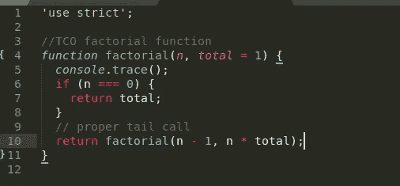

# 如何在 JavaScript 中使用尾部调用优化

> 原文：<https://javascript.plainenglish.io/javascript-optimizations-tail-call-optimization-tco-471b4f8e4f37?source=collection_archive---------1----------------------->

## 简短、有用的 JavaScript 课程——让它变得简单。



在应用任何优化之前，你必须了解你的代码是否运行在关键路径上。如果它不在关键路径上，那么你的优化就没有什么价值，过早的优化通常是个坏主意。

那么，什么是过早优化呢？这句话出自 Donald Knuth 的一句名言:“过早优化是万恶之源”。许多开发人员引用这句话来暗示大多数优化是“不成熟的”,因此是浪费精力。事实更加微妙。

如果你的代码在一个关键的路径上，这种优化会让你感兴趣，否则，最好花时间让代码更可读。

## 什么是 TCO 优化？

尾部调用优化与函数调用可能发生的特定类型的优化相关。根据 Kyle Simpson 的说法，尾调用是出现在另一个函数尾部的函数调用，这样在调用结束后，就没有什么可做的了。

尾代码优化采用一个递归函数，并在内部使用“goto”生成一个迭代函数，然后执行它。它不限制堆栈调用，因为没有堆栈调用，而且函数也不是递归函数。这种迭代函数的性能与其递归函数相当。

换句话说，尾部调用优化意味着可以从另一个函数调用一个函数，而不会增加调用堆栈。

例如，这里有一个尾部调用:

```
function doA(a) {
    return a;
}function doB(b) {
    return doA( b + 1 ); //tail call
}function foo() {
    return 20 + doB(10); //not tail call
}foo(); // 31
```

doA(b+1)是 doB(b)中的尾调用。在 doA(b+1)完成之后，doB(..)也结束了，只需要返回 doA(b+1)调用的结果。然而，doB(10)不是一个尾调用，因为在它完成之后，它的结果必须加到 20，foo()才能返回它。

**调用一个新函数需要额外数量的保留内存**来管理，称为堆栈帧。所以前面的代码片段通常需要一个堆栈框架来处理每个调用。

然而，如果具有 TCO 能力的引擎可以意识到 doA(b+1)调用处于尾部位置，这意味着 doB(b)基本上是完整的，那么当调用 doA(b+1)时，它不需要创建新的堆栈帧，而是可以重用来自 doB(b)的现有堆栈帧。速度更快，占用内存更少。

在处理递归时，这种优化变得至关重要，尤其是当递归可能导致数千个堆栈帧时。有了 TCO，引擎可以在单个堆栈帧中执行所有这些调用。

考虑这个递归函数**没有 TCO 优化**

此函数不可优化，因为最后一条指令不是对另一个函数的调用，而是将 n 乘以阶乘(n-1)返回的值的表达式。这可以防止引擎通过强制创建一个存储初始值的新堆栈来删除堆栈。

```
function factorial(n) {
    console.trace();

    if (n === 0) {
        return 1;
    } // no proper tail call
    return **n * factorial(n - 1);**
}
factorial(2);VM31:4 console.trace
**factorial** @ VM31:4VM31:4 console.trace
**factorial** @ VM31:4
**factorial** @ VM31:10VM31:4 console.trace
**factorial** @ VM31:4
**factorial** @ VM31:10
**factorial** @ VM31:10 
```

为了使前面的函数可以被引擎优化，我们只需删除表达式 n * factorial(n-1 ),并修改函数以不同的方式做同样的事情。

```
'use strict'; function factorial(n, total = 1) {
    console.trace();
    if (n === 0) {
        return total;
    } // proper tail call
 **return factorial(n - 1, n * total);**
}
factorial(2);Trace
    at **factorial**
Trace
    at **factorial**
Trace
    at **factorial** 
```

这里没有增加调用堆栈的大小。这意味着这样您就不会遇到超出最大调用堆栈大小的错误。

## 最后的笔记

尾调用优化是 ES2015-ES6 规范的一部分。支持它不是 NodeJS 的事情，而是 NodeJS 使用的 V8 引擎需要支持的事情。从 7.10 到 6.5.0 的节点仅在严格模式下支持这一点，并带有标志“ **-和谐**”。

关于 TCO 的不确定未来，参见 stackoverflow 中的这个回答: [ES6 尾部递归优化](https://stackoverflow.com/questions/42788139/es6-tail-recursion-optimisation-stack-overflow)。

## 如果这对你有帮助，请点击下面的拍手按钮。非常感谢！