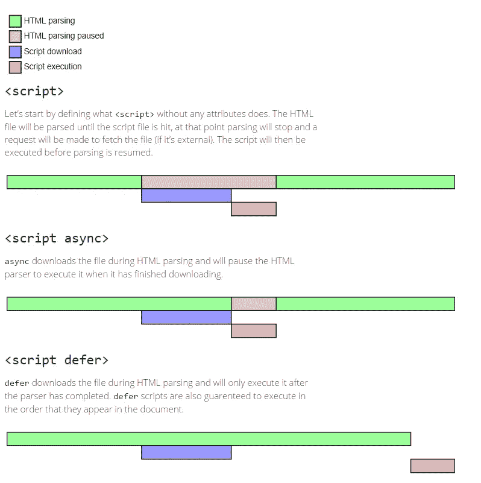

# JavaScript 性能问题？

> 原文：<https://javascript.plainenglish.io/javascript-performance-issues-6edaee6db7b1?source=collection_archive---------11----------------------->

## 初学者加载 JS 代码以获得更好性能的一些技巧


Photo by [Marc-Olivier Jodoin](https://unsplash.com/@marcojodoin?utm_source=medium&utm_medium=referral) on [Unsplash](https://unsplash.com?utm_source=medium&utm_medium=referral)

浏览器要运行 JavaScript 代码，需要下载代码，解析代码，然后运行代码命令浏览器做的任何事情。每个步骤的执行都需要时间；脚本文件越多，执行的时间就越长。并且在错误的时间加载脚本文件，也会阻止其他一些内容..猜猜接下来会发生什么？

> 你开始抱怨你的应用程序像蜗牛一样慢！

# *JavaScript 中的脚本是如何加载的？*

当您的浏览器遇到 HTML 文件中的任何 *<脚本>* 标签时，所有其他操作都会暂停，直到 *<脚本>* 标签被成功解析。

loading script in an HTML file

您的浏览器现在将向服务器请求一个文件名为 *sampleScript.js* 的脚本，然后下载它进行解析和执行。但是请记住，在这一切发生的同时，浏览器的呈现是被阻塞的。(浏览器上显示的所有可视内容将被保留)

# **我现在在哪里加载我的 JS 脚本？**

通常建议将所有脚本加载到 HTML 页面底部的 *< body >* 标签下，这将使浏览器能够很快加载它们。但是等等。本文不仅仅是关于在底层加载脚本，还有更多内容。这可以进一步优化以获得更好的性能。

*<脚本>* 标签附带了两个新属性，称为 **async** 和 **defer** ，帮助脚本更高效地执行。

**async** 属性负责告诉浏览器异步下载脚本，并在完成下载后立即执行。这样就不会阻碍整个渲染过程。它是这样使用的。

```
<script src="sampleScript.js" async></script>
```

**defer** 属性比 async 更好。它异步下载脚本，然后在页面解析完成后执行代码。像 async 属性一样，这也可以防止渲染阻塞。

```
<script src="sampleScript.js" defer></script>
```

> **警告**:不能同时使用**异步**和**延时**。这样做，可以冻结您的应用程序或网页



normal script VS script async VS script defer

# 除了这两个属性，还有更好的方法吗？

是的。不要绝望。在渲染网页时尽可能晚地加载脚本的常用方法是使用 **load** 事件。只有在下载了所有资源(如样式表、图像和脚本)之后，才会触发此事件。

要使用这个加载事件，我们需要创建一个*窗口*事件侦听器，并将*加载*事件绑定到它。现在在回调函数内部，创建一个 *<脚本>* 标记，添加 *src* 属性并将其附加到文档正文中。通过这样做，我们可以确保当视觉效果全部下载并出现在页面上时，脚本被加载。

# 结论

使用**异步**和**延迟**是开始提高页面性能的两个好方法。但是，如果您的要求是从 JavaScript 为顶级用户体验提供的性能中获得最大限度(UX)，那么我建议您参加 *load* 事件，这将保证您看到结果。

**资源**

[https://flaviocopes.com/javascript-async-defer/](https://flaviocopes.com/javascript-async-defer/)
[https://gist . github . com/Amjad 675/d73 a6 f 0 bea 5 ce 210d 12 ff 92882 FFA 1ba](https://gist.github.com/Amjad675/d73a6f0bea5ce210d12ff92882ffa1ba)
[https://gist . github . com/Amjad 675/fab 546 a912 a 57d 24 FEA 4 b 9 C3 f 87 a 33](https://gist.github.com/Amjad675/fab546a912a57d24fea1a4b9c3f87a33)