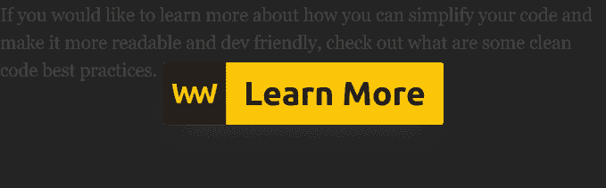

# JavaScript 承诺

> 原文：<https://javascript.plainenglish.io/javascript-promises-39249e5f0e87?source=collection_archive---------3----------------------->

## 停止回调地狱

Photo by [James Lee](https://unsplash.com/@picsbyjameslee?utm_source=medium&utm_medium=referral) on [Unsplash](https://unsplash.com?utm_source=medium&utm_medium=referral)

如果你还记得回调的世界，你已经成为 JavaScript 生态系统的一部分有一段时间了。随着 ES6 的推出，带来更美好世界的承诺随之而来。

在此之前，回调提供了一种处理异步操作的方法。一旦异步操作完成，它们就是执行代码的一种强有力的方式。但是 JavaScript 在发展，现在是时候继续前进了。

因此，我们将研究承诺，这被证明是优于回调。但是首先为了避免混淆，让我们定义一下回调到底是什么。

# 复试

那么什么是回调呢？

> 回调是作为参数传递给其他函数的函数，在事件发生或任务完成时使用。

举个最简单的例子，想象一个事件监听器监听一个点击事件。

传递给`addEventListener`的第二个参数是回调。

当你不得不等待多个相互依赖结果的连续事件时，回调地狱就发生了。想象一下加载图像。你开始把一个回调包装到另一个回调中，直到你得到一棵漂亮的圣诞树:

那么，治愈所有这些疯狂的方法是什么？

# 替代方案

当然，这篇文章的另一种方式是使用承诺。`Promise`对象是一个 Web API，可通过全局`window`对象访问。这是一个异步操作，可以用来代替回调。`Promise`对象可以始终处于三种状态之一:

最初，它有一个`pending`状态，意味着承诺还没有完成操作。当承诺完成时，它进入两种状态之一:

*   **完成**:表示操作成功完成
*   **拒绝**:表示操作因错误而失败

## 优势

说到承诺比回电有很多优势。最突出的是它们是可组合的，不像回调。这就是你可以避免回调地狱的原因。

它还提供了一个 API，只等待来自多个并发未决承诺的一个结果。最快的反应将是履行*(或拒绝)*并接受价格。其他的将被丢弃。我们稍后将对此进行研究。

## 不足之处

当然，没有免费的东西。就像其他事情一样，承诺也有缺点。可能最常见的问题是它们在旧的浏览器中不可用。它们必须是多填充物的。然而，全球适应范围很广。截止到写这篇文章，大概在 [94%](https://caniuse.com/#search=Promise) 左右。

信不信由你，因为他们的工作方式，他们也比传统的回调要慢。并且它们一次只能对一个值进行操作。然而，由于它们的可组合性，它们是回调的更好选择。

那么如何在代码中使用它们呢？来看几个例子吧！

要创建一个承诺，只需用`new`构造函数调用它，传入一个`resolve`和`reject`参数，它们可以用作函数。上面的例子将在 1 秒钟后用文本“Resolved！”。要使用解析后的值，可以对它调用`then`方法。

现在假设你有多个承诺要处理。你可以在`Promise.all`烘焙它们，然后调用一个回调函数。

## 承诺。所有

例如，您想使用`fetch` API 一次检索多个用户。`fetch` API 也返回一个承诺，因此您可以对其调用`then`。期待一系列的承诺。每当三个承诺都被解决或拒绝时，就会调用`then`处理程序。

## 承诺.比赛

但是，如果您有多个并发的未决承诺，但您只需要使用最先返回的承诺，该怎么办呢？这就是`Promise.race`的用途:

请记住，如果您有一个首先拒绝的承诺，那么在这种情况下也会调用`then`处理程序。

# 进一步增强可读性

为了使事情变得更简单，我们可以将`async/await`与 promises 结合使用，以同步方式编写异步代码。按照前面的例子，你可以写下:

在这里，每个变量都返回一个承诺。通过在它们前面使用关键字`await`，我们告诉 JavaScript 等待承诺的完成。请注意，为了使用`await`关键字，您必须在`async`函数内部。

现在你已经知道了承诺的一切，并且把它放在了你的工具箱里，确保你永远不会再掉进回调地狱的陷阱。👹

感谢您通读，编码快乐！

