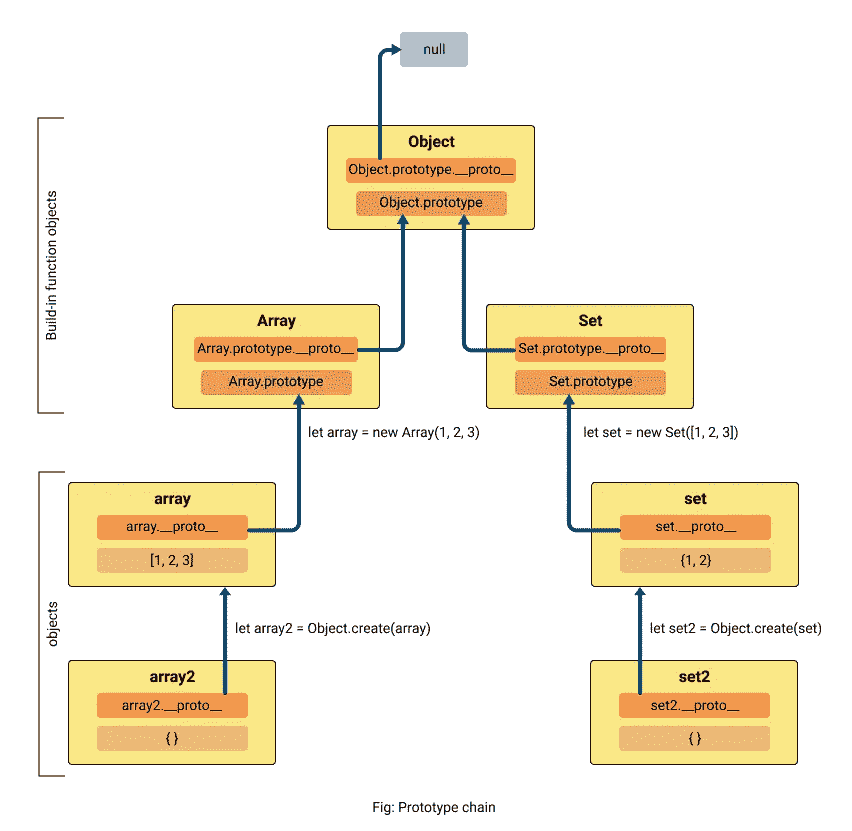

# JavaScript 原型——理解基础

> 原文：<https://javascript.plainenglish.io/javascript-prototype-understanding-the-basics-1d323166fbf8?source=collection_archive---------9----------------------->

与面向对象编程相比，原型通常与继承联系在一起。但是**为什么是**？甚至原型在 JavaScript 中意味着什么。在这篇博客中，我将解释**什么是原型**，以及**如何用 JavaScript 设计和构建原型**。当然，还有为什么。

> *在 JavaScript 中，所有的函数都是对象，唯一不同的是函数可以被调用。*

```
// Here is a simple function
function Superman() {
  // ...
}// Since function Superman is also an object we can add properties and methods like in objects.
Superman.isHero = true;
Superman.test = function() {
  console.log('test ok')
}console.log(Superman.isHero) // true
console.log(Superman.test()) // test ok
```

在这个博客中，我将告诉你一个小故事，在这个故事中，我们有像超人、蝙蝠侠和神奇女侠这样的超级英雄，他们每个人都有独特的超能力。还有一些科学家。

> *超人*:飞行、超人力量、x 光视觉、热视觉、冷呼吸、超速度、强化听觉、高无敌等。
> 
> *蝙蝠侠*:小玩意，超人级别的力量，敏捷，智力等。
> 
> *神奇女侠*:超人的力量和耐力、飞行、超人的速度、反应和敏捷；感官增强，包括嗅觉、视觉、听觉等。

让我们稍微调整一下这个故事，每个超级英雄的超能力都放在一个包里，他们只能打开自己的包。

在 JavaScript 中，我们都见过像数组、日期、对象、集合、承诺、字符串、数字等标准内置对象。让我们把他们想象成 JavaScript 的超级英雄，就像故事里一样，他们的超能力也存放在一个标有‘原型’的袋子里。是的，这是原型，细节如下。


我确信我们都在 JavaScript 中使用过很多次超能力。他们在这里:

> *数组* : forEach，filter，sort，slice，concat，length 等。
> 
> *字符串* : toUpperCase，toLowerCase，replace，substr 等。
> 
> *设置*:有、增加、删除、清除、取值等。
> 
> *许诺*:然后，抓住，最后，等等。

所有这些属性(或方法)都存储在每个函数对象的一个名为“原型”的属性中。这意味着原型也是一个对象。您可以通过在浏览器的控制台中直接访问它们的原型来查看所有这些属性(或方法)——array . prototype、Set.prototype 等等。下面是一些相关图片。


showing properties and functions that are stored inside prototype properties

> *超级英雄= >函数对象(*数组，集合，日期，诺言，地图等。 *)*
> 
> *superpowers = >属性和方法(*长度，forEach，map，size 等。 *)*
> 
> *袋子= >原型*

现在介绍一组科学家，他们可以创造或克隆这些超级英雄。让我们称其中一位科学家为*构造者*，他使用 **new** 操作符来创建超级英雄的实例。其他科学家可以称为 *Object.create* 、 *Object.setPrototypeOf 和 syntax 构造。他们有不同的原型制作方法。*

```
*// Lets first create our own Superhero in LAB1*function Superhero(name, faction) {
  this.name = name;
  this.faction = faction;
  this.XRayVision = false;
  this.fly = false;  
}// add toggleXRayVision method to Superhero prototype
Superhero.prototype.toggleXRayVision = function() {
  this.XRayVision = !this.XRayVision;
  console.log(`Superhero ${this.name} has turned ${this.XRayVision ? "on" : "off"} X Ray vision.`);
};// add toggleFlight method to Superhero prototype
Superhero.prototype.toggleFlight = function() {
  this.fly = !this.fly;
  console.log(`Superhero ${this.name} ${this.fly ? "is now flying" :       "has stopped flying"} over ${this.faction}.`);
};// create instances s1 & s2 using new operator
let s1 = new Superhero("Hero1", "Asia");
let s2 = new Superhero("Hero2", "Europe");// **************s1.toggleXRayVision(); 
*// Superhero Hero1 has turned on X Ray vision.* s2.toggleXRayVision(); 
*// Superhero Hero2 has turned on X Ray vision.*// update method so that changes reflect in all instances
Superhero.prototype.toggleXRayVision = function() {
  this.XRayVision = !this.XRayVision;
  console.log(`Modified: Superhero ${this.name} has turned ${this.XRayVision ? "on" : "off"} X Ray vision.`);
};s1.toggleXRayVision(); 
// Modified: Superhero Hero1 has turned off X Ray vision.
s2.toggleXRayVision(); 
*//* Modified: Superhero Hero2 has turned off X Ray vision.// **************s1.toggleFlight(); *// Superhero Hero1 is now flying over Asia.* s2.toggleFlight(); *//Superhero Hero2 is now flying over Europe.**// this is called* [***method shadowing***](https://en.wikipedia.org/wiki/Method_overriding) *or* [***method overriding***](https://en.wikipedia.org/wiki/Method_overriding)*, affect only s1 instance but not prototype* s1.toggleFlight = function()  {
  this.fly = !this.fly;
  console.log(`Defect: Superhero ${this.name} flying has been defected`);
};s1.toggleFlight();
*// Defect: Superhero Hero1 flying has been defected* s2.toggleFlight();
*// Superhero Hero2 has stopped flying over Europe.**// dynamically update toggleFlight method for all instances* Superhero.prototype.toggleFlight = function()  {
  this.fly = !this.fly;
  console.log(`Fly Repaired: Superhero ${this.name} ${this.fly ? "is now flying" : "has stopped flying"} over ${this.faction}.`);
};*// if s1 hadn't overridden this method, it would have been repaired too, so update on prototype level will not affect this method* s1.toggleFlight(); 
*// Defect: Superhero Hero1 flying has been defected* s2.toggleFlight(); 
*// Fly Repaired: Superhero Hero2 is now flying over Europe.*
```

> 注意:对于创建的每个新实例，不会创建原型的新副本，但是它们都共享(或链接到)同一个原型。

怎么会？每个实例(对象)都有一个私有属性，用于保存到另一个对象的链接，该对象称为其原型(父对象)。在大多数浏览器中，私有属性被命名为 ***__proto__*** ，它链接到一个函数对象的属性原型。你可以在 JavaScript 的每个对象中找到它，如下图所示( *__proto__* 最后)。

> 注意: *__proto__* 的标准符号是[[prototype]]。


proto 的这个概念创建了一个**原型链**(下面解释)，在这里孩子可以访问原型。这就是 JavaScript 继承属性和方法的方式。

但是，如果替换或修改任何对象的 *__proto__* ，链可能会断开，这可能会导致继承无法正常工作。所以更新它是不可取的，除非它是必要的，你知道你在做什么。

```
// few expressions
let array = new Array(); // constructor
or, let array = []; // syntax constructs
array.*__proto__* === Array.prototype // truelet set = new Set();
set.*__proto__* === Set.prototype // true
```

> 注意:set 继承自 Set.prototype 而不是 Set 本身，这意味着属性 prototype 字面上是它的原型(父对象)而不是 Set。

在 JavaScript 中，几乎所有的对象都是对象的实例。

```
// Array.prototype inherits from Object.prototypeArray.prototype.*__proto__* === Object.prototype // truearray.*__proto__*.*__proto__* === Object.prototype // trueObject.prototype.*__proto__* // null
```



prototypal structure in JavaScript

如上图所示，你可以看到一连串的原型一直连接到 Object prototype object。这意味着对象位于其 *__proto__* 为空的**原型链**的顶部。

关于原型链有趣的事情是，当访问一个属性时，如果在一个对象中没有找到一个属性，它的 *__proto__* 通过被查看，如果在 *__proto__* 中没有找到，那么 *__proto__* 的 *__proto__* 被查看，直到到达链的末端，即空，最终返回*未定义的【T28 是的，`console.log(array2[0])`从上面的图片打印 1。*

所以，出于性能的考虑，尽量把链条做的小一点。此外，您可以使用每个对象从 Object.prototype 继承的 *hasOwnProperty* 方法来检查当前对象上是否存在属性，并防止遍历整个链。虽然它不检查一个属性值是否*未定义*。

最后，我们已经知道从一个函数初始化一个对象会继承它的原型。然而，我们也可以使用 **Object.create** 方法从一个对象继承，这使得第一个参数成为新对象的原型。

```
let obj = {a: 1, b: 2};
obj ---> Object.prototype ---> nulllet o = Object.create(obj); // obj is prototype for o
o ---> obj --> Object.prototype ---> null
console.log(o.a) // 1let arr = [1, 2];
arr ---> Array.prototype ---> Object.prototype ---> nulllet a = Object.create(arr);
a --> arr --> Array.prototype ---> Object.prototype ---> null
console.log(a[1]) // 2
```

> 通常，JavaScript 中的 prototype 是一个对象(不一定存储在 property prototype 中)，从它创建的新对象链接到该对象，因此可以使用它的属性和方法。

> 在 JavaScript 中，对象为王。如果你理解了对象，你就理解了 JavaScript。—已复制

如果你想了解更多关于原型或者原型链的知识，这里有链接:[https://developer . Mozilla . org/en-US/docs/Web/JavaScript/Inheritance _ and _ the _ prototype _ chain](https://developer.mozilla.org/en-US/docs/Web/JavaScript/Inheritance_and_the_prototype_chain)

感谢阅读。非常感谢评论。请随意评论你对这个博客的看法或有任何问题。

链接到我以前的博客:[反应渲染优化几个技巧](https://medium.com/swlh/react-render-optimization-few-tips-360837d98e91)

## **用简单英语写的 JavaScript 笔记**

我们已经推出了三种新的出版物！请关注我们的新出版物: [**AI in Plain English**](https://medium.com/ai-in-plain-english) ，[**UX in Plain English**](https://medium.com/ux-in-plain-english)，[**Python in Plain English**](https://medium.com/python-in-plain-english)**——谢谢，继续学习！**

**我们也一直有兴趣帮助推广高质量的内容。如果您有一篇文章想要提交给我们的任何出版物，请发送电子邮件至[**submissions @ plain English . io**](mailto:submissions@plainenglish.io)**，使用您的 Medium 用户名，我们会将您添加为作者。另外，请让我们知道您想加入哪个/哪些出版物。****