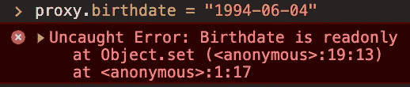

# JavaScript 代理

> 原文：<https://javascript.plainenglish.io/javascript-proxies-b41abcdd2bda?source=collection_archive---------3----------------------->


Photo by [Tim Mossholder](https://unsplash.com/@timmossholder?utm_source=unsplash&utm_medium=referral&utm_content=creditCopyText) on [Unsplash](https://unsplash.com/s/photos/private?utm_source=unsplash&utm_medium=referral&utm_content=creditCopyText)

代理是 ES6 的一个特性，能够监控给定对象的访问方式。例如，假设我们有一个对象`alice`包含一些关于爱丽丝的信息，比如她的生日、年龄、身高、体重和身体质量指数。

```
const alice = {
  birthdate: '2000-04-06',
  age: 20,
  height: 170,
  weight: 65,
  bmi: 22.5,
};
```

通过执行以下操作，可以简单地读取和设置属性:

```
console.log(alice.height);
console.log(alice.age);
alice.weight = 64;
```

该对象可能会被代码的其他部分使用，因此可能会出现一些问题。我们可能希望让对象的外部消费者改变 Alice 的体重，而不是她的生日。如果她是一个成年人，改变她的身高也没有多大意义。如果她的体重发生变化，我们应该重新计算身体质量指数。而且她的年龄大概应该在被要求的时候算出来。

一个想法是创建像`getAge`或`setWeight`这样的方法。这将部分工作，但不会阻止任何人简单地做`alice.weight = 64;`。JavaScript 本身没有私有字段。

一种本地 JavaScript 解决方案是使用代理。代理仅仅是你的原始对象的包装器(称为*目标*)。

```
const handler = {};
const proxy = new Proxy(alice, handler);
```

您通过调用`Proxy`构造函数来创建它，您将*目标*，在我们的例子中是`alice`，以及一个*处理程序*作为参数传递给它。*处理程序*是一个对象，我们可以在其中定义如何访问每个属性。在这个例子中，我们的*处理程序*是空的，所以代理只是将每个访问请求转发给对象。

```
console.log(proxy.age); // 20
console.log(proxy.height); // 170
```

现在让我们使用*处理程序*来定义当`age`属性被读取时返回什么。

```
const handler = {
  get (target, key) {
    if (key === 'age') {
      return calculateAge(new Date(target.birthdate));
    }
    return target[key];
  }
};
const proxy = new Proxy(alice, handler);
```

如果您正在测试，这里是`calculateAge`函数:

```
const calculateAge = (birthdate) => {
  const today = new Date();
  let age = today.getFullYear() - birthdate.getFullYear();
  const m = today.getMonth() - birthdate.getMonth();
  if (m < 0 || (m === 0 && today.getDate() < birthdate.getDate())) {
    age--;
  }
  return age;
}
```

我们的*处理程序*现在包含一个`get` *陷阱*。当试图读取代理的任何属性时，将使用`target` ( `alice`)和`key`调用这个`get`函数。当试图读取`age`时，我们从`birhdate`返回一个计算值，而不是简单地返回`alice.age`。对于任何其他属性，我们只返回`target[key]`。

您可以测试:

```
alice.age = 22;
console.log(proxy.age); // 20
console.log(proxy.height); // 170
```

我们还可以定义一个`set`陷阱，定义是否以及如何设置属性。例如，我们希望防止设置出生日期属性，并且如果体重发生变化，我们希望重新计算身体质量指数:

```
const handler = {
  get (target, key) {
    ...
  },
  set (target, key, value) {
    if (key === 'birthdate') {
      throw new Error('Birthdate is readonly');
    } else if (key === 'weight') {
      const { height } = target;
      target.bmi = Math.round(
        value / (height / 100 * height / 100) * 100
      ) / 100;
    }
    return true;
  }
};
```

如果您试图设置一个新的生日，您将会收到一个错误消息:



否则每个属性都被设置为值(这就是`return true;`的意思)。设置重量后，我们现在重新计算身体质量指数。您可以测试:

```
console.log(proxy.bmi); // 22.5
proxy.weight = 63;
console.log(proxy.bmi); // 21.8
```

我们可以对其他只读属性做类似的事情，比如`age`和`height`。我们还可以在它们的名字前面添加`_`，并编写我们的`set`陷阱，这样对于任何以`_`开头的名字的属性都会抛出一个错误。

顺便说一句，只有当你不访问`alice`对象而只访问`proxy`对象时，这一切才有价值。因此`alice`对象不应该被导出。

陷阱不止是`set`和`get`。例如，您可以在以下情况下定义行为:

*   正在使用`deleteProperty`陷阱删除一个属性(`delete alice.height;`)。
*   正在检查带有`has`陷阱的对象(`console.log('age' in proxy);`)上是否存在属性。
*   用`defineProperty`陷阱在代理(`proxy.name = 'Alice';`)上定义了一个新的属性。

可能的陷阱有一长串，我只是在这里列出了最常见的。你可以在这里找到完整的名单。

代理让您控制如何访问字段，是否以及如何读取、修改、添加或删除字段，并且通常让您监视可以对对象做的一切。它们确实有助于在 JavaScript 中实现某种封装。例如，它们可以用于验证(将验证写入代理的`set`陷阱中)，在设置值之前更改值(例如，将`string`转换为`Date`)，或者跟踪和记录对象的更改。

## **用简单英语写的 JavaScript 笔记**

我们已经推出了三种新的出版物！请关注我们的新出版物:[**AI in Plain English**](https://medium.com/ai-in-plain-english)[**UX in Plain English**](https://medium.com/ux-in-plain-english)[**Python in Plain English**](https://medium.com/python-in-plain-english)**——谢谢，继续学习！**

**我们也一直有兴趣帮助推广高质量的内容。如果您有一篇文章想要提交给我们的任何出版物，请发送电子邮件至[**submissions @ plain English . io**](mailto:submissions@plainenglish.io)**，并附上您的 Medium 用户名，我们会将您添加为作者。另外，请让我们知道您想加入哪个/哪些出版物。****