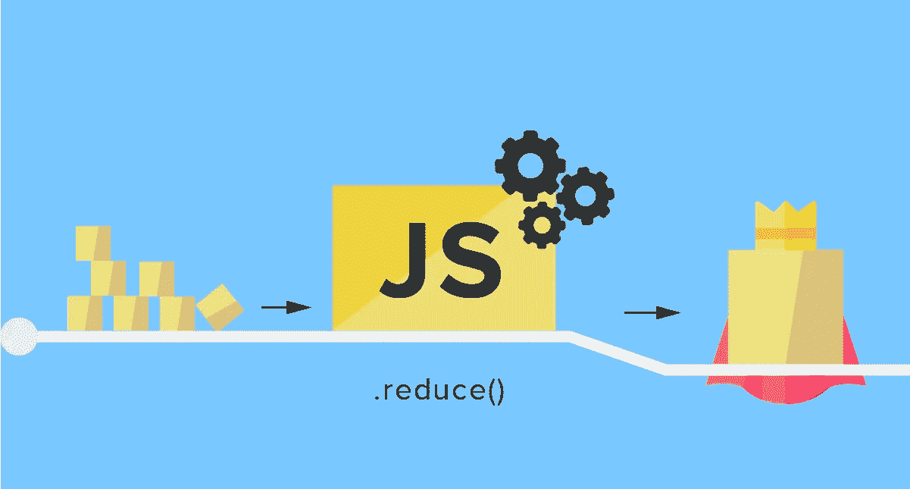

# JavaScript Reduce:终极迭代器

> 原文：<https://javascript.plainenglish.io/javascript-reduce-the-ultimate-iterator-e486e4503a13?source=collection_archive---------5----------------------->



我刚学 JavaScript 的时候完全低估了`Array.prototype.reduce()`的威力。我并不完全理解它是如何工作的，所以我把它仅仅作为一种方便的方法来计算数组元素的和。

但是现在我明白了`reduce`是如何工作的，我看到了它在各种不同应用中的潜力。为了展示这种潜力，我将首先使用`reduce`来模拟我使用的两个最常见的数组方法——`map`和`filter`——的行为，然后展示如何使用它来代替`for`循环，从而很好地清理代码。

# 缩小为地图

对于外行来说，`Array.protoype.map()`是一种可以在任何数组上使用的方法，它可以对数组的每个元素运行相同的代码，从而产生一个新的、经过转换的数组。看起来是这样的(`>>`表示返回值):

```
[1, 2, 3].map(num => num + 1)
>> *[2, 3, 4]*
```

方法`.map()`接受一个回调函数作为其第一个参数——这里我传递一个匿名函数——并将数组中的每个元素作为第一个参数传递给回调函数。

像这样用`reduce`可以达到同样的结果:

```
[1, 2, 3].reduce((result, num) => [ ...result, num + 1 ], [])
>> *[2, 3, 4]*
```

好吧，这里发生了什么？传递给`reduce`的回调函数的第一个参数是累加器，即`reduce`最终返回的值。每次`reduce`运行这个回调函数，都会返回一个新的累加器，并传递给下一个回调函数，依此类推，直到到达数组的末尾。th；；

回调函数的第二个参数是数组中的实际元素。所以，我上面做的是把累加器复制到一个新的数组里，把当前数组元素加到新数组里。这个新数组成为新的累加器，然后传递给回调函数。

`reduce`方法也不同于`map`，因为它接受可选的第二个参数，该参数用作累加器的初始值。在我的例子中，我传递了一个空数组。

# 减少为过滤器

`Array.prototype.filter()`与`map`结构相似，但结果大不相同。传递给`filter`的回调函数用于确定哪些值出现在新返回的数组中，哪些值不出现。

看起来是这样的:

```
[1, 2, 3].filter(num => num > 1)
>> *[2, 3]*
```

当回调函数返回`false`时，被求值的元素从返回的数组中省略。

使用`reduce`，看起来是这样的:

```
[1, 2, 3].reduce((result, num) => {
  return num > 1 ? [ ...result, num ] : result
}, [])
>> *[2, 3]*
```

我通过返回一个三元语句来模仿`filter`的行为。如果`num > 1`的计算结果为`true`，则返回一个新数组，其中包含累加器的内容和`num`的当前值。如果表达式计算结果为`false`，则原样返回累加器，从返回的数组中忽略`num`的当前值。

# 减少的力量

既然我们对如何使用`reduce`来模仿其他数组方法的行为有了更好的了解，我想演示如何使用`reduce`来替换我发现自己经常编写的有些难看的代码(通常是在解决关于*代码大战*或*黑客等级的问题时)。*

首先，我们来看一下场景。我们需要遍历一个数组，删除所有重复的数组，返回一个新的数组，该数组只包含原始数组中的唯一值。

作为具有复杂性意识的程序员，我们知道强力解决方案——为每个值迭代整个数组，或者换句话说，将一个迭代器嵌套在另一个迭代器中——会导致二次复杂性，因为您可以通过计算原始数组长度的平方来计算这样做所需的时间。

我们不需要在整个数组中搜索数组中的每个值，而是可以创建一个对象作为库，我们可以使用它来立即查找一个值，并查看它是否已经出现。当我第一次学习编码时，我是这样写这个解决方案的:

```
const unique = array => {
  const lib = {}
  const result = [] for(let i=0; i < array.length; i++) {
    if(!lib[array[i]]) {
      result.push(array[i])
      lib[array[i]] = true
    }
  } return result
}unique([1, 2, 3, 3, 4, 5, 5])>> *[1, 2, 3, 4, 5]*
```

这段代码完成了工作，但是看起来不太好。让我们看看如何用`reduce`来清理它:

```
const unique = array => {
  return array.reduce(
    (result, num) => {
      if(!result.lib[num]) {
        return {
          lib: { ...result.lib, [num]: true },
          arr: [ ...result.arr, num ]
        }
      } else {
        return result
      }
    },
    { lib: {}, arr: [] }
  ).arr
}unique([1, 2, 3, 3, 4, 5, 5])>> *[1, 2, 3, 4, 5]*
```

好吧，也许结果看起来不太干净，但我认为这个例子说明了`reduce`的巨大潜力，因为它表明累加器可以像你需要的那样复杂。你可以在累加器中存储任何你需要的信息。只要记住总是返回一个值，否则`undefined`将取代你的累加器，并可能导致一些令人沮丧的混乱。

喜欢这篇文章吗？如果有，通过 [**订阅获取更多类似内容解码，我们的 YouTube 频道**](https://www.youtube.com/channel/UCtipWUghju290NWcn8jhyAw) **！**