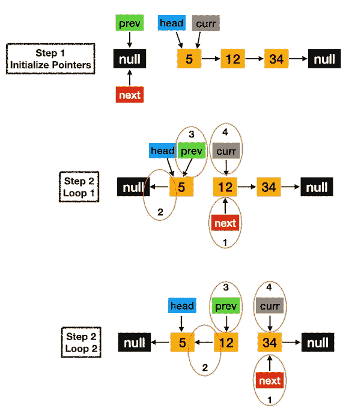
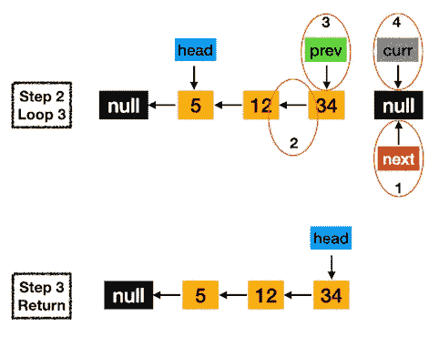
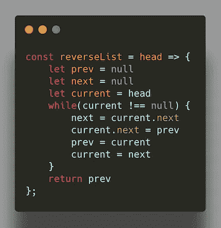

# JavaScript:反向链表

> 原文：<https://javascript.plainenglish.io/javascript-reverse-linked-list-a2d235d64548?source=collection_archive---------2----------------------->

## 在许多公司，这是一个常见的面试问题


Photo by [JJ Ying](https://unsplash.com/@jjying?utm_source=unsplash&utm_medium=referral&utm_content=creditCopyText) on [Unsplash](https://unsplash.com/?utm_source=unsplash&utm_medium=referral&utm_content=creditCopyText)

本周，我们将从 LeetCode 的顶级面试问题列表中涵盖另一个流行的技术面试问题；[反向链表](https://leetcode.com/problems/reverse-linked-list/):

*反转单链表。*

```
**Example:****Input:** 1->2->3->4->5->NULL
**Output:** 5->4->3->2->1->NULL
```

本文不会给出很多关于链表的细节，但这里有一个快速复习:**链表**是表示一系列节点的数据结构，其中每个**节点**包含两条信息:节点的**值**和指向列表中下一个节点**的指针/引用。列表的开头称为**头**，列表末尾的节点称为**尾**，指向空值；**空**。**


[https://www.geeksforgeeks.org/data-structures/linked-list/](https://www.geeksforgeeks.org/data-structures/linked-list/)

与数组相比，链表的主要优点是更容易在列表中插入或移除节点。另一方面，不允许对数据进行随机访问，因为与数组不同，链表没有索引。

上面的问题是要求我们写一个方法来原地反转一个单链表，并返回反转后链表的新头。列表的头部将作为输入给出。我们可以迭代或递归地反转一个链表，但是我们将通过以下步骤来重点解释今天的迭代方法:

1.  初始化三个指针；`prev`、`current`和`next`:

*   `prev`:这个指针将跟踪当前节点的前一个节点，我们将把它设置为`null`，因为*一个单链表*节点没有对其前一个节点的引用。
*   `current`:这个将从列表的`head`开始，跟踪我们当前所在的节点。
*   `next`:该指针将在其引用被改变之前存储下一个节点，并且最初被设置为`null`。

2.遍历所有节点，只要有一个节点就遍历列表，并在每次迭代中执行以下操作:

*   将`next`设置为`current.next`(我们需要在改变之前存储电流的下一个节点)。
*   将`current.next`设置为等于`prev`(我们现在可以通过反转链接来改变下一个电流)。
*   将`prev`设置为`current`(该步骤将前一个节点向前移动)。
*   设置`current`等于`next`(该步骤将当前节点向前移动)。
*   对所有节点重复步骤 2。

3.返回`prev`指针作为反转列表的新头。

基于以上所述，您可以看到我们的链表将如何在下面的图表的帮助下反转，我构建这个图表是为了让您更容易可视化:



下面是上述逻辑在 JavaScript 中的实现:



我们的目标是用指向`head`的给定指针来反转链表。我们需要通过改变引用来反转列表，使下一个元素指向前一个元素。我们首先存储上一个和下一个元素的引用。当我们在循环中重新排列节点时，我们将当前节点的下一个值存储到我们的`next`变量中，因为我们不想在从`current`中断开该节点后丢失这个指针。然后，我们将当前节点的下一个指针设置为指向前一个节点，通过断开`current`和`current.next`之间的链接并将指针指向`prev`来实际反转值。接下来，我们将`prev`和`current`指针移位一个节点:`prev`更新到下一个节点(`current`),`current`更新到下一个节点(`next`)。它们在每次迭代中向前移动一步，直到`current`到达`null`并且 while 循环终止。最后，我们返回`prev`指针，它现在是循环结束时反向链表的新头。

## 复杂性

迭代求解该算法导致**的时间复杂度**为 **O(n)** ，因为我们只遍历列表一次(`n`是列表中的节点数)。这个解决方案的空间复杂度是 O(1) ,因为我们的方法是就地反转列表，并且不使用任何额外的空间。

我希望本文中一个流行的链表面试问题的解决方案能有所帮助。感谢您的阅读！

喜欢这篇文章吗？如果是这样，通过 [**订阅解码获得更多类似内容，我们的 YouTube 频道**](https://www.youtube.com/channel/UCtipWUghju290NWcn8jhyAw) **！**