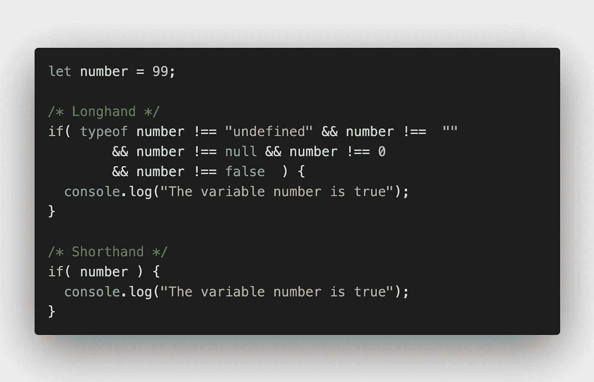

# JavaScript 速记编码技术

> 原文：<https://javascript.plainenglish.io/javascript-shorthand-coding-techniques-anansewaa-de604ecfc3d3?source=collection_archive---------7----------------------->



在这篇博文中，我整理了一些有用的 JavaScript 速记编码技术。JavaScript 速记是很好的编码技术，可以帮助程序员优化和简化他们的 JavaScript 代码。

# 1.如果存在

在代码中的某一点，我们需要检查变量是否存在。 **if present** 简写帮助你用一个简单的代码实现这个目标。

```
// Longhand if(isGirl === true){ 
   console.log('isGirl') 
} //Shorthand if(isGirl){ 
   console.log('isGirl') 
}
```

**注意:**只要`isGirl`是真值，上面例子中的简写就会求值。

# 2.三元运算符

我们可以在一行代码中使用[条件(三元)运算符](https://developer.mozilla.org/en-US/docs/Web/JavaScript/Reference/Operators/Conditional_Operator)来代替`if ... else`语句。

```
//Longhand 
const age = 19; 
let status; 
if(age > 18){ 
  status = "An adult" 
}else{ 
  status = "Young" 
} //Shorthand 
const status = age > 18 ? "An Adult" : "Young"
```

# 3.箭头功能

传统的 JavaScript 函数可以用 ES6 箭头函数简化。

```
//Longhand 
function greet(name){ 
  console.log('Welcome ', name) 
} //Shorthand 
const great = name => console.log(name)
```

# 4.解构分配

[析构赋值](https://anansewaa.com/javascript-es6-array-and-object-destructuring/)不仅会节省大量时间，还会让你的代码更简洁。

```
const vehicles = { 
   car: "🚗", 
   taxi: "🚕", 
   bus: "🚌", 
   minibus: "🚐" 
};

// Longhand 
let car = vehicles.car 
let taxi = vehicles.taxi 
let bus = vehicles.bus 
let minibus = vehicles.minibus // Shorthand 
const { car, taxi, bus, minibus } = vehicles
```

# 5.For 循环

下面的例子使用了简化代码的`for ... of`和`for ... in`。

```
const animals = ["goat", "sheep", "dog", "cat"] // Longhand 
for (let i=0; i < animals.length; i++){ 
  console.log(animals[i]) 
} // Shorthand 
for(let animal of animals){ 
  console.log(animal) 
} // Getting the index 
for(let index in animals){ 
  console.log(animals[index]) 
}
```

# 6.模板文字

通常使用`'+'`来连接多个字符串变量。ES6 模板文字使用反勾号和`${}`使它变得更加容易。

```
// Longhand 
const checkOut = 'Order price: ' + price + ' at a discount of ' + discount // Shorthand 
const checkOut = `Order price: ${price} at a discount of ${discount}`
```

# 7.多行字符串

有了反斜线，在代码中编写字符串就容易多了。

```
// Longhand 
const msg = 'A wonderful serenity has taken possession\n\t' 
  + 'of my entire soul, like these sweet mornings of spring\n\t' 
  +'which I enjoy with my whole heart. I am alone,\n\t' 
  +'and feel the charm of existence in this spot,\n\t' 
  +'which was created for the bliss of souls like mine.\n\t ' //Shorthand 
const msg = `A wonderful serenity has taken possession of my entire soul, like these sweet mornings of spring which I enjoy with my whole heart. I am alone, and feel the charm of existence in this spot, which was created for the bliss of souls like mine.`
```

# 8.指数幂

```
// Longhand 
Math.pow(5,3) // 125 // Shorthand 
5**3 // 125
```

# 9.声明变量

在声明多个变量时，简写可以节省你很多时间。

```
// Longhand 
let a; 
let b = 6; 
let c; // Shorthand 
let a, b = 6, c;
```

# 10.默认参数值

ES6 使得在函数声明中给变量赋值默认值成为可能。

```
//Longhand 
function checkOut(quantity, price, discount){ 
  if(discount === undefined){ 
    discount = 0 
  } 
  return quantity * price - discount 
} // Shorthand 
checkOut = (quantity, price, discount) => (quantity * price -discount)
```

# 11.数组.查找

```
const animals = [ 
  {name: 'octopus', animalClass: 'invertebrates'}, 
  {name: 'shark', animalClass: 'fish'}, 
  {name: 'toad', animalClass: 'amphibians'}, 
  {name: 'snake', animalClass: 'reptiles'}, 
  {name: 'ostrich', animalClass: 'birds'}, 
  {name: 'cat', animalClass: 'mammals'}, 
] //Longhand 
function findReptile(name){ 
  for(let i=0; i < animals.length; ++i){ 
    if(animals[i].animalClass === 'reptiles' && animals[i].name === name){ 
      return animals[i] 
    } 
  } 
} // Shorthand 
const findReptile = name => ( 
    animals.find(animal => animal.animalClass ==='reptiles' && animal.name === name) 
)
```

# 12.短路评估

使用短路逻辑运算符有助于将代码行数减少到一行。

```
// Longhand 
let person; 
if(job){ 
  person = job 
}else{ 
  person = 'unemployed' 
} // Shorthand 
const person = job || 'unemployed'
```

# 13.将字符串转换为数字

不需要使用`parseInt`或`parseFloat`就可以轻松地将字符串转换成数字。

```
// Longhand 
const quantity = parseInt("250") 
const price = parseFloat("432.50") // Shorthand 
const quantity = +"250" // converts to int 
const price = +"432.50" // converts to float
```

# 14.传播算子

我见过很多开发人员用`[].concat()`将两个数组连接在一起，用`array.slice()`克隆一个数组。但是这可以用 JavaScript ES6 **spread 操作符**轻松完成。

```
const birds = ["parrot", "swan", "eagle", "duck"] // Longhand // joining arrays 
const animals = ["zebra", "giraffe", "llama", "raccoon"].concat(birds) // cloning arrays 
const newBirds = birds.slice() // Shorthand // joining arrays 
const animals = ["zebra", "giraffe", "llama", "raccoon", ...birds] //cloning arrays 
const newBirds = [...birds]
```

# 15.Null、未定义的空支票

当变量未定义、为空或为空时，可以简单地用速记完成一个动作。

```
// Longhand 
if(variable !== undefined || variable !== "" || variable !== null){
  console.log(variable) 
} // Shorthand 
if(varible){ 
  console.log(variable) 
} // assigning variable to newVariable when variable is truthy let newVariable = variable || ""
```

# 16.十进制基数指数

打 1e4 比打 10000 更简单干净。

```
// Longhand 
for(let i; i < 1000000; i++){} // Shorthand 
for(let i; i < 1e6; i++){} // evaluates to true 
1e0 === 1; 
1e1 === 10; 
1e2 === 100; 
1e3 === 1000; 
1e4 === 10000; 
1e5 === 100000;
```

# 17.对象属性

在 ES6 中，我们可以很容易地给对象分配属性。如果变量名与对象键相同，就可以利用简写符号。

```
const quantity = 324, price = 45.50; // Longhand 
const product = {quantity: quantity, price: price} // Shorthand 
const product = {quantity, price}
```

# 18.隐性回报

使用箭头函数，您可以在一行代码中返回隐式结果。

```
// Longhand 
function area(radius){ 
   return Math.PI * radius**2 
} //Shorthand 
const area = radius => Math.PI * radius**2 // return multi-line statement 
const area = radius => ( 
   Math.PI * radius**2 
)
```

这些是我在这篇文章中收集到的少数人手。我很想找到更多，请在评论中发表你认为有用的短工。

## **用简单英语写的 JavaScript**

喜欢这篇文章吗？如果有，通过 [**订阅获取更多类似内容解码，我们的 YouTube 频道**](https://www.youtube.com/channel/UCtipWUghju290NWcn8jhyAw) **！**