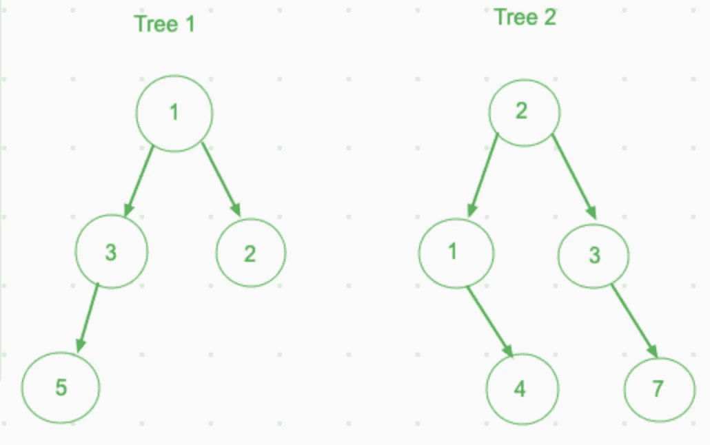
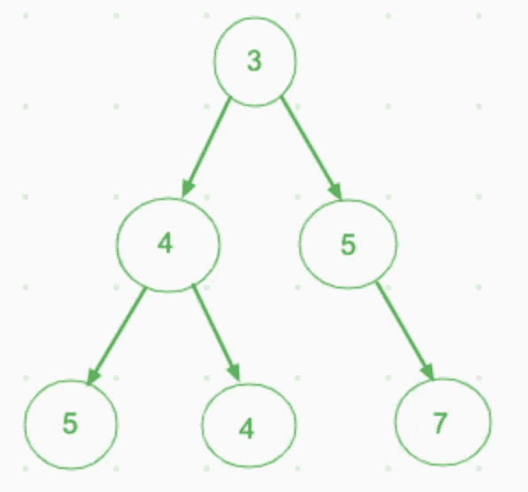

# 如何在 JavaScript 中合并两个二叉树🌳

> 原文：<https://javascript.plainenglish.io/javascript-solution-to-c9de621e0cc3?source=collection_archive---------11----------------------->

[***先决条件:JavaScript 中的树遍历***](https://medium.com/javascript-in-plain-english/tree-traversal-in-javascript-9b1e92e15abb)


Photo by [Alla Hetman](https://unsplash.com/@allahetman?utm_source=medium&utm_medium=referral) on [Unsplash](https://unsplash.com?utm_source=medium&utm_medium=referral)

**问题**

```
Given two binary trees and imagine that when you put one of them to cover the other, some nodes of the two trees are overlapped while the others are not.You need to merge them into a new binary tree. The merge rule is that if two nodes overlap, then sum node values up as the new value of the merged node. Otherwise, the NOT null node will be used as the node of new tree.
```

示例输入:



Example input

示例输出合并树:



Example output

**注意:**合并过程必须从两棵树的根节点开始。

树的节点如下所示:

[https://gist.github.com/GAierken/f1ab81562b141052ce18ca003da0e6b1](https://gist.github.com/GAierken/f1ab81562b141052ce18ca003da0e6b1)

**深度优先搜索解决方案**

首先我们需要确定输入，函数的给定参数，是两个二叉树。并且输出是合并的树。根据这个例子，当在同一层的两棵树都有节点时，我们需要对节点值求和来生成一个新节点，如果其中一个有节点，另一个节点为空，我们需要保留非空节点。要转换一棵合并的树，需要我们遍历这两棵树。

在我们考虑解决方案之前，我们需要考虑边缘情况。没有约束，它们中的一个或两个可能都为空。当给定的一棵树为空时，我们可以立即返回另一棵树，不管它是否为空。为了变换一棵树，我们可以将另一棵树合并到它上面，当两棵树都不为空时，我们对节点值求和。并遍历两棵树的左右路径。最后，返回合并后的树。

最终的解决方案应该是这样的:

[https://gist.github.com/GAierken/a31d1e5596d336b73298c4dca5d4707e](https://gist.github.com/GAierken/a31d1e5596d336b73298c4dca5d4707e)

DFS 的时间复杂度为 O(n)。考虑到我们只访问每个节点一次，我们得到了这种复杂性。

我希望这个解决方案能让你了解如何解决类似的问题。

**资源:**

[](https://leetcode.com/problems/merge-two-binary-trees/) [## 合并两个二叉树- LeetCode

### 给定两个二叉树，想象当你用其中一个覆盖另一个时，这两棵树的一些节点是…

leetcode.com](https://leetcode.com/problems/merge-two-binary-trees/) [](https://medium.com/javascript-in-plain-english/tree-traversal-in-javascript-9b1e92e15abb) [## JavaScript 中的树遍历

### 呼吸优先搜索 vs 深度优先搜索

medium.com](https://medium.com/javascript-in-plain-english/tree-traversal-in-javascript-9b1e92e15abb)