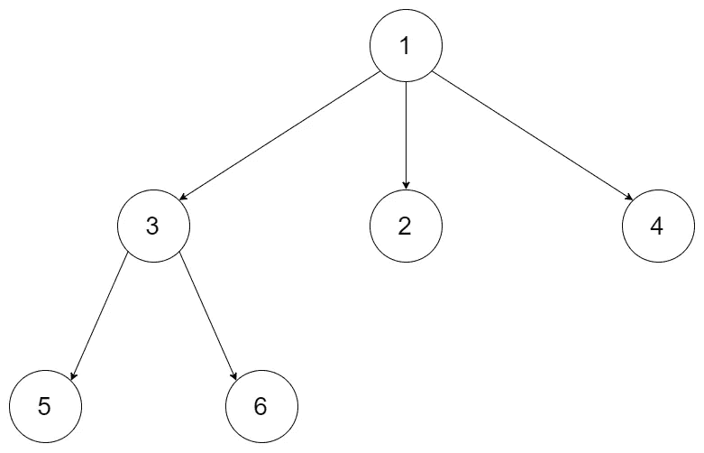
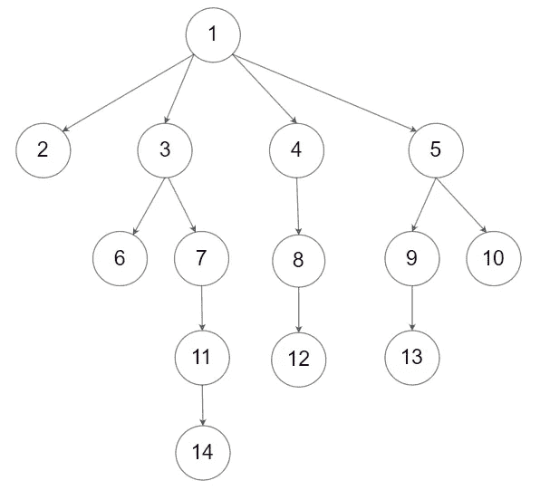

# N 元树最大深度的 JavaScript 解决方案

> 原文：<https://javascript.plainenglish.io/javascript-solution-to-maximum-depth-of-n-ary-tree-30845698ac0?source=collection_archive---------2----------------------->

[***先决条件:JavaScript 中的树遍历***](https://medium.com/javascript-in-plain-english/tree-traversal-in-javascript-9b1e92e15abb)

对于我们上次的“She's coding”数据结构和算法练习活动，我们选择了解决 N 叉树的最大深度问题( ***l*** [***墨迹***](https://leetcode.com/problems/maximum-depth-of-n-ary-tree/) )。我们就解决问题的方法进行了有趣的讨论。在下面的博客中，我将分享这个问题的常用解决方案。


Photo by [Belinda Fewings](https://unsplash.com/@bel2000a?utm_source=medium&utm_medium=referral) on [Unsplash](https://unsplash.com?utm_source=medium&utm_medium=referral)

# 问题:

```
Given a n-ary tree, find its maximum depth.The maximum depth is the number of nodes along the longest path from the root node down to the farthest leaf node.*Nary-Tree input serialization is represented in their level order traversal, each group of children is separated by the null value (See examples).*
```

*例 1:*



Example 1

```
**Input:** root = [1,null,3,2,4,null,5,6]
**Output:** 3
```

*例 2:*



Example 2

```
**Input:** root = [1,null,2,3,4,5,null,null,6,7,null,8,null,9,10,null,null,11,null,12,null,13,null,null,14]
**Output:** 5
```

*约束:*

```
- The depth of the n-ary tree is less than or equal to 1000.
- The total number of nodes is between [0, 10^4].
```

***解决方案:***

n 叉树是一种常见的数据结构，不像二叉树有左右子树，在这个问题中 n 叉树的节点有值和子属性。

[https://gist.github.com/GAierken/6f9b0d8049a41829f5601af3b883dc23](https://gist.github.com/GAierken/6f9b0d8049a41829f5601af3b883dc23)

输入是根树，输出是表示给定树的深度的整数。首先要考虑的是给定的根是否为空。在验证了根之后，为了计算级别，我们遍历了树。因为我们需要计算级别，我们还需要一个变量来存储级别，所以当遍历完成时，我们可以返回树的深度。解决的关键是遍历。在遍历树时，常用的方法是深度优先搜索和呼吸优先搜索。让我们看看如何从两个方面解决它。

***深度优先搜索***

[https://gist.github.com/GAierken/475d54f1a7d76567883935ffb722f2fc](https://gist.github.com/GAierken/475d54f1a7d76567883935ffb722f2fc)

***广度优先搜索***

[https://gist.github.com/GAierken/afa6e80ae45374a5f29ef74de0073a1d](https://gist.github.com/GAierken/afa6e80ae45374a5f29ef74de0073a1d)

我希望这能为你将来解决类似的问题提供一些启示。

***资源:***

[](https://leetcode.com/problems/maximum-depth-of-n-ary-tree/) [## N 元树的最大深度- LeetCode

### 给定一棵 n 元树，求其最大深度。最大深度是从…沿最长路径的节点数

leetcode.com](https://leetcode.com/problems/maximum-depth-of-n-ary-tree/) [](https://medium.com/javascript-in-plain-english/tree-traversal-in-javascript-9b1e92e15abb) [## JavaScript 中的树遍历

### 呼吸优先搜索 vs 深度优先搜索

medium.com](https://medium.com/javascript-in-plain-english/tree-traversal-in-javascript-9b1e92e15abb)