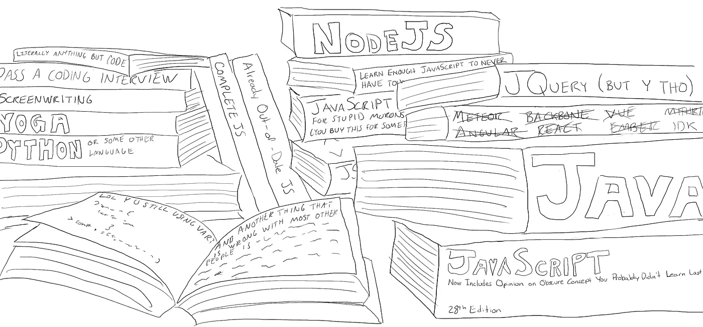
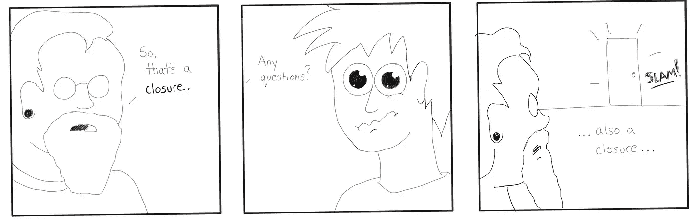

# JavaScript:缺失的现实检验

> 原文：<https://javascript.plainenglish.io/javascript-the-missing-reality-check-66e2bb01fa25?source=collection_archive---------3----------------------->

# 简介:嗨！我是考特尼·霍斯金斯。

欢迎踏上成为 JavaScript 开发人员的旅程！2013 年，在我休产假的第四天，我的团队被解雇了。鉴于我患有严重的冒名顶替综合症，以及在美国最昂贵的城市之一成为一名全新的单身母亲的巨大恐慌，我决定提高我的编码技能，并将我的 JavaScript 知识提升到一个新的水平和其他游戏隐喻。我读了关于这个主题的每一本书。该指南是阅读的结果。

自从那次令人兴奋的经历之后，我在白板上花了无数时间，试图让花括号看起来不像闪电，你他妈的怎么能画出一个&符号，并且积累了足够的经验，以一个 20 岁的技术兄弟的自信来教 JavaScript。接下来的是一本关于学习不断变化的最激动人心的语言的指南。该指南将在出版一周内过时，评论和评论将充满自以为是的愤怒。

准备好装备，学习一些新技能！如果这对你不起作用，就在床上读读这篇文章，发现你从来不知道你需要的治疗失眠的方法！

先决条件:不需要有 JavaScript 的经验。然而，这本书的作者假设你熟悉量子场论和所有计算机科学词汇。说真的，如果你还不知道什么是多维数组或动态类型，那就停止吧。别说了。

另外，我假设你至少已经知道以下六种语言:HTML、CSS、Python、C++、Ruby 或 PHP。

一个JavaScript 简史:JavaScript 不是 Java。你不知道这个。招聘人员似乎并不知道这一点。甚至一些与你交谈的面试官会称之为 Java，但是任何一个自鸣得意的 Java 开发者都乐于指出，它们是完全不同的。实际上，任何沾沾自喜的非 JavaScript 开发人员都乐于指出这一点，并不断指出 JavaScript 是一种*脚本*语言，就好像这是一种疾病一样(从它的名字中也看不出来)。欢迎在你的职业生涯中被贴上潮人剧本小子的标签，不管你有多好。

> 注意:学完这门课程后，你会有一种永不满足的学习“真正的”编程语言的冲动，所以你也可以沾沾自喜，直到你意识到你既不喜欢它，也不需要它来做你的工作，并且会告诉别人你是一名 Node 开发人员，尽管 Node 仍然只是 JavaScript。

本书通篇使用的注意事项:我使用了许多格式约定来强调某些概念。在每一节的开头也要使用首字下沉，因为首字下沉很酷，即使它们会使内容更难阅读。

*斜体*用于引入新术语，也可*任意*用于*强调*某些*词*。

**粗体**也用于强调，但是对于不同的*类型*的强调来说，要稍微大声一点**。**

**`This cool font`用来表示代码。**

> **每当我想分享一件轶事或进一步阐述某事时，就会使用块引号。比如，你知道“轶事”这个词也意味着“绘画中对次要叙事事件的描述吗？”**

**所有的大写字母都将被用来表达对那些毫无意义的观点或我 100%正确的观点的愤怒。就像软 g gif 或硬 g gif，无论你想要什么，但没有“JITHUB”这样的东西，所以如果我听到你说我会失去它，我向上帝发誓。**

**被动语态和连续句贯穿始终，从这里开始，单词“used”将被单词“used”所取代，因为它更长，并且其中有一个“z”。**

**画得不好的漫画被用来说明概念，因为我想这样做。**

****

**LOL WTF is a closure? Starring two bros. -By Courtney Hoskins**

**让我们开始吧，好吗？这是你的第一行代码。在浏览器的控制台中键入以下内容:**

**`>2+3`**

**你应该看到 5！**

**太神奇了！你现在是一个程序员了！**

**现在试试这个:**

**`>0.1 * 0.2`**

**您应该看到 0.02000000000000004！**

**OMG 为什么？！？JAVASCRIPT 坏了吗？？**

**这是这本书的免费预览部分，你只需要相信它的其余部分完全价值 49.99 美元，作为你下周必须更换的精装版。**