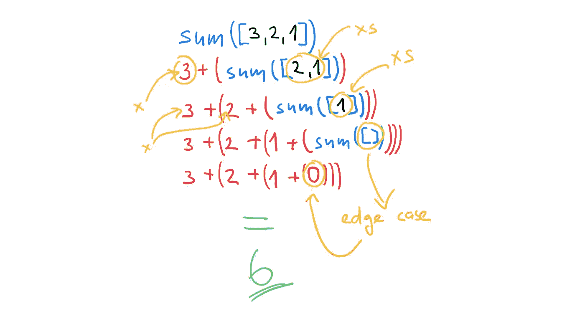
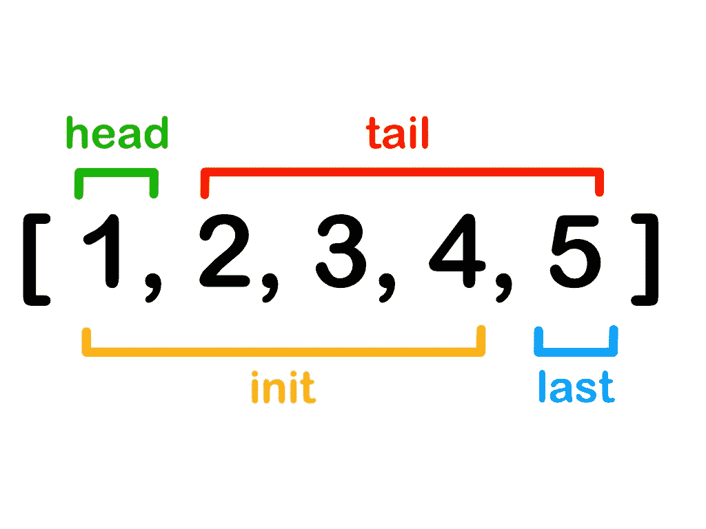

# JavaScript:递归的力量

> 原文：<https://javascript.plainenglish.io/javascript-the-power-of-recursion-f56effadf63b?source=collection_archive---------7----------------------->

## JavaScript Alpha 指南

## 你所需要的就是递归——一个递归概念有多通用的小演示。


> 要理解递归，首先必须理解递归。
> 
> ——斯蒂芬·霍金

我不得不注意到许多程序员在理解递归上有困难。大多数时候，他们不是不知道如何写递归函数，而是不知道如何递归地思考。

我会试着向你们展示这并不是一个困难的概念。你必须记住一些事情，我们将会看到这些。

我将只关注递归本身的概念。PTC(适当的尾调用)、TCO(尾调用优化)和 STC(语法尾调用)今天将不涉及。所有的例子都是 JavaScript 或 TypeScript 代码，但是这个概念适用于每一种语言。


# 什么是递归

递归是一种有用的编程模式，对于那些可以分解成几个同类任务的任务。但是更简单。

这是一个编程术语，意思是**从自身调用函数**。当一个函数调用自己时，这被称为一个**递归步骤**。

**递归是函数调用自身。直到它不存在。**


递归算法与[递归定义的数据结构](https://en.wikipedia.org/wiki/Recursive_data_type)配合得很好。递归定义的数据结构是可以使用自身定义的数据结构。使用 TypeScript，它看起来像这样:

```
interface List<T> {
    value: T,
    next: List<T> | null
}const list: List<number> = {
    value: 1,
    next: {
        value: 2,
        next: {
            value: 3,
            next: null
        }
    }
}
```


**递归函数不一定要返回值。**返回值的递归函数的一个例子是诸如`sum`、`fibonacci`、`map`、`filter`、`reverse`的函数。

但是当你有一个递归定义的数据结构或者[树数据结构](https://www.programiz.com/dsa/trees)时，你可以决定在访问一个节点时执行一些动作。通常，递归函数有两个参数——结构本身和访问节点时执行的回调函数。

我们将关注返回值的递归函数。


# 递归函数的两种情况

递归函数有两种情况:

*   边缘案例——通常称为基本案例
*   递归情况

让我们通过下面这个对列表中的元素求和的函数来解释这两个问题:

```
function sum(list) {
  if (list.length === 0) {
 **return 0; // (A)**
  } const [x, ...xs] = list;
 **return x + sum(xs); // (B)**
}sum([1, 2, 3]); // 6
```

线`(A)`示出了边缘情况。****边缘情况非常重要，因为那是你停止递归的地方。**如果你不识别一个边界情况，递归将永远不会停止，你将耗尽内存。**

**第`(B)`行说明了递归情况。**在这种情况下，调用函数本身仍然有意义。**这个调用创建了一个新的递归步骤。**

****

**Recursive sum function**

****

# **寻找边缘案例**

**那么实际上如何找到边缘案例呢？试着找出这个问题最简单形式的解决方法。给定上面的`sum`函数，你想要求和的最简单的列表是什么？是空名单。**

> ****当递归函数对列表进行操作时，空列表通常是边缘情况。****

**空列表是递归应用程序没有意义的情况。如果您处理的是树，那么边缘案例通常是没有任何子节点的节点。**

**通常情况下，边缘案例被证明是一个身份。把身份想象成一个**中性元素**。加法的中性元素是什么？现在是 **0** 。当你把 0 加到某个东西上，你就把那个东西拿回来了。**

```
1   + 0 =   1
42  + 0 =  42
256 + 0 = 256
```

**同样，做乘法时，中性元素是 **1** 。当你把某样东西乘以 1，你会得到那个东西。**

```
0   * 1 =   1
42  * 1 =  42
256 * 1 = 256
```

****

# **正面和反面**

**在对列表进行操作时，似乎有一个非常常见的模式。列表被分解为一个**头**和一个**尾。**然后只对其中一个使用递归调用。**

**在以下示例中， **x** 为**头；****xs**就是**尾巴。****

```
const list = [1, 2, 3, 4];
const [x, ...xs] = list;
```

**有时候你需要打破列表来得到除了最后一个以外的所有元素，然后再分别得到最后一个。纯函数式语言有专门用于此的函数，称为 **init** 和 **last** 。JavaScript 没有现成的函数，所以您必须创建自己的函数。**

```
const list = [1, 2, 3, 4];
init(list); // [1, 2, 3]
last(list); // [4]
```

****

**head, tail, init, last**

**当你将链表拆分到**头**和**尾**时，通常会调用**尾**上的递归函数。**

**当你将链表拆分到 **init** 和**last**时，你通常会调用 **init** 上的递归函数。**

****

# **例子**

## **列表的乘积**

**列表的乘积是列表的第一个元素乘以列表其余元素的乘积。边缘情况是一个空列表。中性元件为 **1** 。**

```
function product(list) {
  if (list.length === 0) {
    return 1;
  } const [x, ...xs] = list;
  return x * product(xs);
}
```

## **列表的总和**

**我们以前见过这个，但是让我们回顾一下。列表的总和是列表的第一个元素加上列表其余元素的总和。边缘情况是一个空列表。中性元件是 **0** 。**

```
function sum(list) {
  if (list.length === 0) {
    return 0;
  } const [x, ...xs] = list;
  return x + sum(xs);
}
```

## **列表的长度**

**一个列表的长度基本上和用 **1** 替换所有列表元素，然后加起来是一样的。边缘情况又是一个空列表。中性元素为 **0。****

```
function length(list) {
  if (list.length === 0) {
    return 0;
  } const [_, ...xs] = list;
  return 1 + length(xs);
}
```

****

**好吧，这看起来很简单。`map`、`filter`、`reduce`或`zip`功能怎么样？它们可以用递归实现吗？当然了。**

## **列表映射**

**列表上的映射基本上是两件事:**

1.  **将映射函数`fn`应用到列表的第一个元素，并将其放入数组**
2.  **将步骤 1 的结果与应用于列表其余部分(或尾部)的`map`连接起来**

**边缘情况是一个空数组。中性元素是`[]`，因为`[].concat([])`就是`[]`。**

```
function map(fn, list) {
  if (list.length === 0) {
    return [];
  } const [x, ...xs] = list;
  return [fn(x)].concat(map(fn, xs));
}
```

**`filter`和`reduce`功能以相同的精神实现。**

## **过滤列表**

**实现与`map`基本相同。唯一的区别是谓词函数何时返回`false`。在这种情况下，您不需要立即连接，而是把要添加到列表中的值委托给下一个递归步骤。**

```
function filter(predicate, list) {
  if (list.length === 0) {
    return [];
  } const [x, ...xs] = list;
  if (predicate(x)) {
    return [x].concat(filter(predicate, xs));
  } else {
    return filter(predicate, xs);
  }
}
```

## **减少名单**

**如果你看一下`reduce`功能，它比`filter`更类似于`map`。**

**`fn`是将累计值与列表中下一个值相结合的减函数。`acc`是缩减器第一次调用的初始值和后续调用的累计值。**

```
function reduce(fn, acc, list) {
  if (list.length === 0) {
    return acc;
  }

  const [x, ...xs] = list;
  return reduce(fn, fn(acc, x), xs);
}
```

****

# **要记住的关键事情**

**当实现一个调用自身的函数时，请始终考虑:**

*   **什么是边缘情况(有时称为基础情况)**
*   **什么是中性元素(有时称为同一性)**
*   **开始用 edge 实现函数，首先覆盖问题的最简单形式**

**当处理列表时，想想你想在列表的哪个部分应用递归函数——是`tail`还是`init`？**

****

**我希望你现在在实现递归的时候感觉更自信一点。请记住，我只想演示递归实现函数时如何思考。这些函数中的大部分在你选择的编程语言中已经有了对等物，而且很可能性能更好。**

**下次见。**🐺阿尔法，完毕。****

****

# **资源**

*   **[https://en.wikipedia.org/wiki/Recursive_data_type](https://en.wikipedia.org/wiki/Recursive_data_type)**
*   **http://learnyouahaskell.com**
*   **【https://javascript.info/recursion **