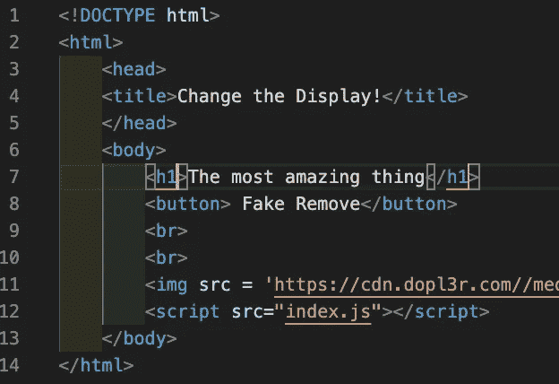
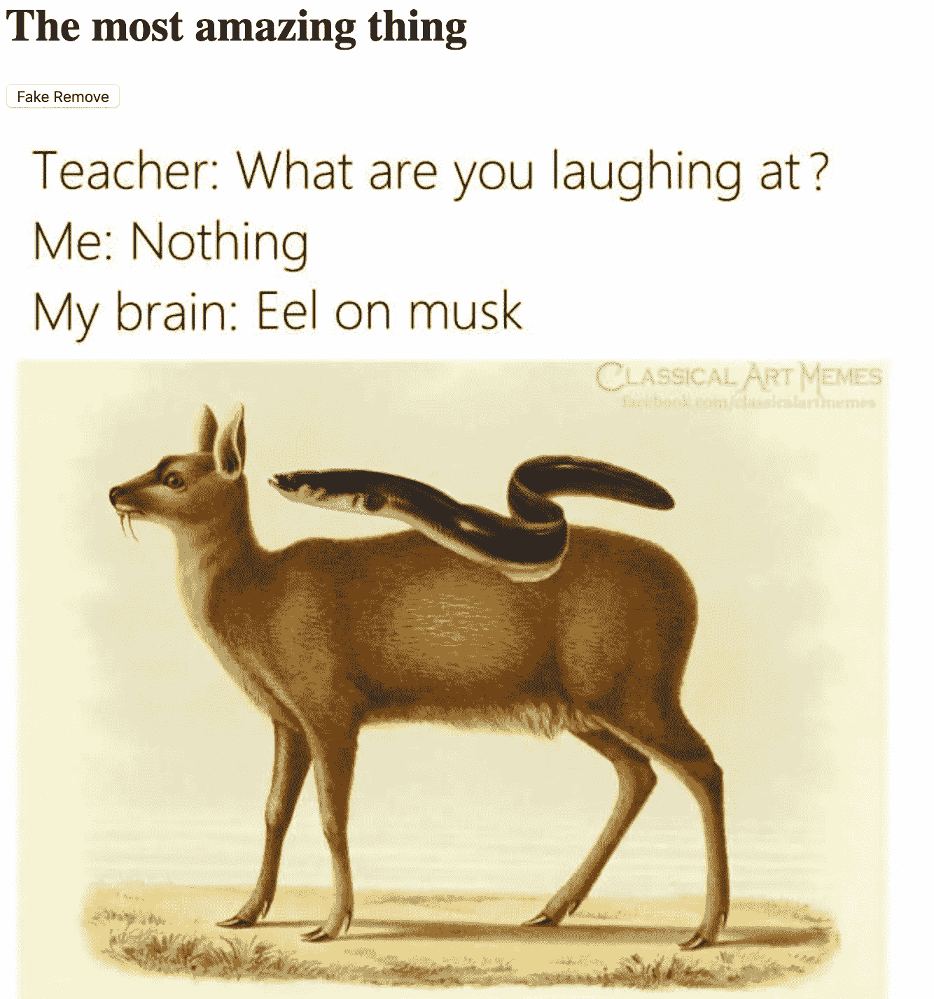
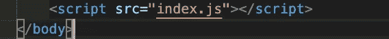
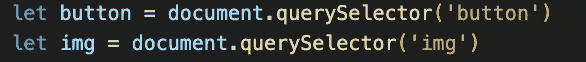
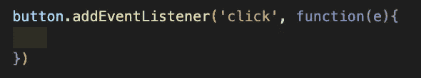
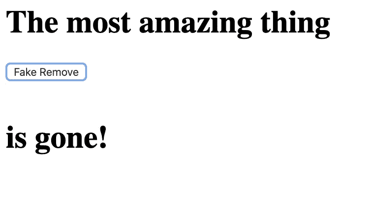

# JavaScript —切换元素视图，而不从 DOM 中移除

> 原文：<https://javascript.plainenglish.io/javascript-toggle-an-elements-view-without-removing-from-the-dom-4a43ce11598a?source=collection_archive---------5----------------------->

一个很酷的技巧:对用户隐藏元素，而不从 DOM 中移除。

我们如何做到这一点？这是你的基础教程。

下面是我为了演示而创建的一个 HTML 文件:



下面是用户加载页面时呈现的内容:



本演练的目标是让我们点击“删除假货”按钮，切换我们的 Elon Musk meme 的视图。

我们现在要做的是创建一个链接到 HTML 文件的 javascript 文件。为了简单起见，我们姑且称之为‘index . js’。

现在，我们可以将下面的标签放在 HTML 文件中 body 标签的底部，如下所示:



现在让我们开始编辑我们的 index.js 文件！

让我们首先使用 querySelector 方法从 DOM 中获取一些元素:



既然我们已经有了一些 DOM 节点，我们现在可以向按钮添加一个事件侦听器，如下所示:



当我们单击按钮时，我们希望现在使图像消失，然后如果我们单击它，它会重新出现。这就是 CSS 知识派上用场的地方。

我们现在要做的是在事件监听器代码块中实现一个条件语句。还是用伪代码写出来吧！

```
if (theImage === notShowing) 
   then(theImage === showing)
else if (theImage === showing)
  then(theImage === notShowing)
```

现在，让我们看看这在实际的 JavaScript 代码中是什么样子的

```
button.addEventListener('click', function(e){ if(img.style.display=== 'none'){ img.style.display = 'block'; }else{ img.style.display = 'none' }})
```

这个条件所做的是首先检查图像当前是否没有显示。这是通过调用 CSS 属性“display”来完成的。Display 可以采用几个不同的值，尽管出于本教程的考虑，我们将在值“block”和“none”之间来回切换。

如果图像的显示是“none ”,那么我们将它设置为“block ”,从而将其渲染到我们的视图中。如果图像显示不是“无”，那么我们将设置显示等于“无”，从而将其从视图中移除。

现在，每当我们点击页面上的按钮时，埃隆·马斯克就会进出我们的视线，同时仍然留在 DOM 中。

