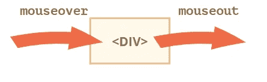
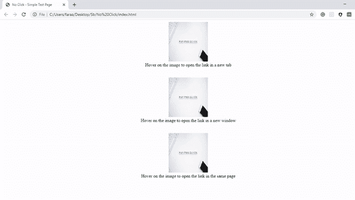
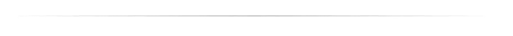

# JavaScript 技巧:不点击就打开一个链接

> 原文：<https://javascript.plainenglish.io/javascript-trick-open-a-link-without-clicking-on-it-499d242b94b1?source=collection_archive---------5----------------------->


Photo by [Dai KE](https://unsplash.com/@elmeng?utm_source=medium&utm_medium=referral) on [Unsplash](https://unsplash.com?utm_source=medium&utm_medium=referral)

## 让我们深入了解一下当鼠标在元素之间移动并且不点击 JavaScript 就打开链接时发生的事件的更多细节

**用 JavaScript 可以不用点击就打开一个链接吗？**

答案是:可以，可以！

对许多人来说，这可能是老把戏了。但是如果你是一个新手，看看你如何简单地通过几个简单的步骤实现一个智能网络链接！

这个问题的解决方案是有一个链接，当鼠标移动到 HTML 元素(如文本、图像或任何其他标签)上时，这个链接就会打开。它返回一个新创建的窗口/选项卡，如果调用失败，则返回 NULL。

在下面的文章中，我们将学习实现智能链路所需的关键概念。我们将讨论以下主题:

1.  用一些很酷的沙箱和代码笔详细描述了 mouseover 和 mouseout 事件
2.  window open()方法的详细说明

3.浏览我们的代码，只需将鼠标悬停在上面即可打开链接

让我们在学习中找到乐趣！

## 1.了解 mouseover 和 mouseout 事件:

当使用定点设备(如鼠标或触控板)将光标移动到元素或其子元素之一上时，`**mouseover**`事件在`[Element](https://developer.mozilla.org/en-US/docs/Web/API/Element)`被触发。

当指向设备离开父元素或子元素时，在`[Element](https://developer.mozilla.org/en-US/docs/Web/API/Element)`触发`**mouseout**` 事件。



Photo by JavaScript.info on [JavaScript.info](https://javascript.info/mousemove-mouseover-mouseout-mouseenter-mouseleave)

这些事件是独一无二的，因为它们具有属性`relatedTarget`。这个属性补充了`target`。当鼠标从一个元素移动到另一个元素时，其中一个变成`target`，另一个变成`relatedTarget`。

对于`mouseover`:

*   `event.target`–是鼠标过来的元素。
*   `event.relatedTarget`–是鼠标来自的元素(`relatedTarget` → `target`)。

对于`mouseout`相反的情况:

*   `event.target`–是鼠标留下的元素。
*   `event.relatedTarget`–是新的指针下元素，鼠标左键用于(`target` → `relatedTarget`)。

Sandbox by [javascript-plunk](https://plnkr.co/users/javascript-plunk/plunks) on [Plunker](https://plnkr.co/)

***如果*** `***mouseover***` ***是*触发的*，那么必然有*** `***mouseout***`。在鼠标快速移动的情况下，中间元素可能会被忽略。

如果指针准确地进入了一个元素(生成了`mouseover`事件)，那么一旦离开它，我们总是得到`mouseout`。

你可以通过运行下面的沙盒代码简明地理解这个概念。

Sandbox by [javascript-plunk](https://plnkr.co/users/javascript-plunk/plunks) on [Plunker](https://plnkr.co/)

CodePen provided by the author

## 2.了解 window open()方法:

理解 JavaScript 中的 [window open()方法真的很好，它会打开一个新的浏览器窗口，或者一个新的标签，这取决于你的浏览器设置和参数值。它具有以下语法:](https://www.w3schools.com/jsref/met_win_open.asp)

`window.open(*URL, name, specs, replace*)`

## 参数:

*   **网址**:可选。指定要打开的页面的 *URL。如果未指定 URL，将打开一个带有 about: blank 的新窗口/选项卡*
*   **名称:**可选。指定*目标属性或窗口*的名称。支持以下值:
    `_blank` —将 URL 加载到新窗口或标签页。这是默认的
    `_parent` —加载 URL 到父框架
    `_self` —加载 URL 替换当前页面
    `_top` —加载 URL 替换任何可能加载的框架集
    `*name*` —窗口的名称(**注:***名称*不指定新窗口的标题)
*   **规格**:可选。逗号分隔的项目列表，没有空格。支持以下值:
    `channelmode=yes|no|1|`—是否以剧院模式显示窗口。默认为 no. IE only
    `directories=yes|no|1|0` —作废。是否添加目录按钮。默认值为是。IE only
    `fullscreen=yes|no|1|0` —是否全屏显示浏览器。默认为否。全屏模式下的窗口也必须处于剧院模式。IE only
    `height=pixels` —窗口的高度。最小值是 100
    `left=pixels` —窗口的左侧位置。不允许负值
    `location=yes|no|1|0` —是否显示地址栏。Opera `onlymenubar=yes|no|1|0` —是否显示菜单`barresizable=yes|no|1|0` —窗口是否可调整大小。IE `onlyscrollbars=yes|no|1|0` —是否显示滚动条。即 Firefox&Opera only
    `status=yes|no|1|0`—是否添加状态`bartitlebar=yes|no|1|0` —是否显示标题栏。忽略，除非调用应用程序是 HTML 应用程序或可信对话框
    `toolbar=yes|no|1|0` ——是否显示浏览器工具栏。IE 和 Firefox 才有
    `top=pixels` —窗口最上面的位置。不允许负值
    `width=pixels` —窗口的宽度。量滴值为 100
*   **replace:** 可选字段，指定 URL 是创建新条目还是替换历史列表中的当前条目。支持以下值:
    `true` — URL 替换历史列表中的当前文档
    `false` — URL 在历史列表中创建新条目

> **注意:**你需要允许弹出网页浏览器来查看代码的工作情况。

## 3.让我们开始我们的代码！

为了简化我们的问题陈述并实现目标，我们需要首先检查指向设备是否停留在我们的元素上，这将最终触发链接打开。

因此，我们只需要一个具有`onmouseover`事件的元素来调用一个具有`window.open()`的 JavaScript 函数。

在我们的演示中，我们使用了具有调用`hover`函数的`onmouseover`事件的图像元素。`hover()`函数有`window.open()`函数，根据其中定义的一组参数执行。

*   要在新标签中打开链接:

```
function hover() { 
    window.open("[https://medium.com/@faraazdhuka28](https://medium.com/@faraazdhuka28)","_blank"); 
}
```

*   要在新窗口中打开链接:

```
function hover() { 
 window.open("[https://medium.com/@faraazdhuka28](https://medium.com/@faraazdhuka28)", "_blank","toolbar=yes,scrollbars=yes,resizable=yes,top=500,left=500,width=900,height=900"); 
}
```

*   要打开同一页面上的链接:

```
function hover() { 
    window.open("[https://medium.com/@faraazdhuka28](https://medium.com/@faraazdhuka28)", "_top","replace:false");
}
```

[Gist provided by the author.](https://gist.github.com/B00784039Faraaz/2dda93b0e89c52c146ea2442e70e1a00)

代码看起来是这样的——我们创建了一个图像标签，它有一个调用脚本中的`hover()`方法的`onmouseover` 事件。`hover()`方法简单地调用窗口`open()`方法，该方法根据参数打开链接。下面是我重复使用 image 标签和 JavaScript 方法三次后的代码输出。



Video provided by the author

## 结论

恭喜你。你学会了如何创建一个链接，只要将鼠标悬停在上面就可以打开它！

JavaScript 毕竟没有那么复杂，你只需要聪明的技巧和窍门就能创造奇迹！使用 mouseover 和 window.open 轻松创建智能链接。



**感谢阅读！你可以在 Medium 上找到我其他作品的链接，关注我这里的**[](https://medium.com/@faraazdhuka28)****。****

## ****用简单英语写的 JavaScript 笔记****

**我们总是有兴趣帮助推广高质量的内容。如果你有一篇文章想用简单的英语提交给 JavaScript，用你的中级用户名发邮件到 submissions@javascriptinplainenglish.com[](mailto:submissions@javascriptinplainenglish.com)**，我们会把你添加为作者。****

****我们还推出了三种新的出版物！请关注我们的新出版物:[**AI in Plain English**](https://medium.com/ai-in-plain-english)，[**UX in Plain English**](https://medium.com/ux-in-plain-english)，[**Python in Plain English**](https://medium.com/python-in-plain-english)**——谢谢，继续学习！******

# ******资源******

1.  ******移动鼠标:mouseover/out，mouse enter/leave by Java script . info .可用:[https://JavaScript . info/mousemove-mouse over-mouse out-mouse enter-mouse leave](https://javascript.info/mousemove-mouseover-mouseout-mouseenter-mouseleave)******
2.  ******通过[w3schools.com](https://www.w3schools.com/)打开()方法窗口。可用:【https://www.w3schools.com/jsref/met_win_open.asp ******
3.  ******鼠标悬停和鼠标移出由[法拉兹·杜卡](https://medium.com/@faraazdhuka28)完成。可用:[https://codepen.io/faraaz-dhuka/pen/JjYoMVZ](https://codepen.io/faraaz-dhuka/pen/JjYoMVZ)******
4.  ******表情符号沙盒由 [javascript-plunk](https://github.com/javascript-plunk) 制作。可用:[https://plnkr.co/edit/3dGFqjP8JiDQPZg2?p=preview&预览](https://plnkr.co/edit/3dGFqjP8JiDQPZg2?p=preview&preview)******
5.  ******通过 [javascript-plunk](https://github.com/javascript-plunk) 鼠标悬停和鼠标移出沙盒。可用:[https://plnkr.co/edit/3dGFqjP8JiDQPZg2?p=preview&预览](https://plnkr.co/edit/JPekeDa1wxumIXNT?p=preview&preview)******