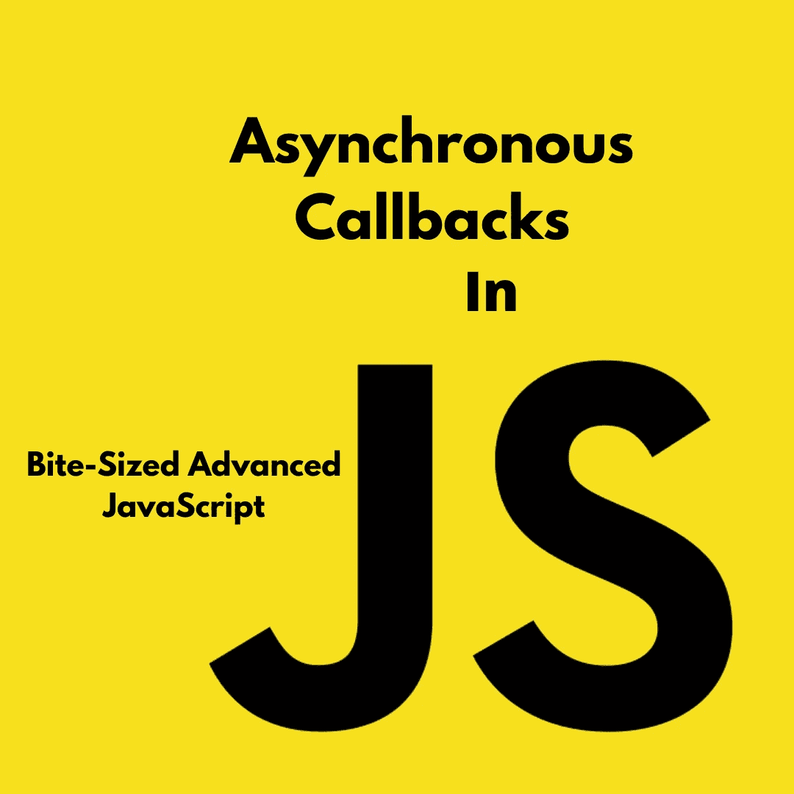
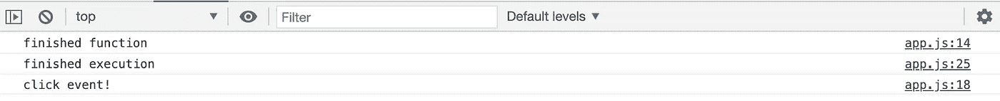

# 引擎盖下的 JavaScript。6:异步回调

> 原文：<https://javascript.plainenglish.io/javascript-under-the-hood-pt-6-asynchronous-callbacks-f8e2e1e332bb?source=collection_archive---------15----------------------->

## 理解 JavaScript 中的异步性和同步性，它们意味着什么，并能够有效地向他人解释它们。

JavaScript 中的异步是一个棘手的话题。主要是因为这个词本身(或者更确切地说，它的使用方式)，在 JavaScript 的概念中，有误导性。

JavaScript 是一种单线程的同步语言，这意味着它按照出现的顺序一次读取一个命令(或一行代码)。那么它怎么可能是异步的呢？好吧，有一点需要记住:**当 JavaScript 在你的浏览器中执行时，它并不是唯一在运行的东西。**这就是 JavaScript 中异步概念的真正本质。

> *JavaScript 是一种单线程同步语言。*

# “单线程”和“同步”是什么意思？

**单线程是指一次一行**，同步是指按顺序(从上到下)。这就是 JavaScript 引擎执行代码的方式。就是这样。

**即使考虑到执行环境，也是如此。**当 JavaScript 引擎在某个执行上下文中运行代码时，它可能不会在文件的全局*词法*环境中完全从上到下读取，但它仍会在相应的执行上下文中一次读取一行(单线程)并按从上到下的顺序读取(同步)。

> *单线程是指一次一行，同步是指按顺序(从上到下)。*

# 那么异步回调呢？

异步的定义相当简单。**当我们说异步时，我们实际上只是说“一次不止一个”**。但是我们刚才不是说 JavaScript 是同步的吗？是的，但是请记住，**当 JavaScript 引擎运行您的代码时，它与浏览器中的其他东西协同工作。**

一些例子:

*   **渲染引擎:**打印/绘制到屏幕上的引擎。
*   **HTTP 请求:**浏览器中实际发出并获取数据的部分。

JavaScript 引擎能够在执行过程中“挂钩”这些类型的东西。因此，尽管所有这些可能同时(或异步)运行，JavaScript 引擎*本身*是同步运行的。

我们知道，在 JavaScript 中，我们有一个叫做“执行栈”的东西，在那里每个执行上下文被完成，然后“弹出”栈去下一个(如果你想了解更多关于全局环境和执行上下文的信息，请参考我的文章[这里](https://codeburst.io/javascript-under-the-hood-pt-1-the-global-environment-332c8494413c))。嗯，在引擎中还有一些东西与您的 JavaScript 代码同时运行，称为**事件队列。**

> 与执行堆栈一起，JavaScript 引擎中还运行着一个叫做事件队列的东西。

事件队列中充满了当前可能正在发生的事件。**当浏览器接收到 JavaScript 引擎想要知道的事件**(例如，点击)**时，它被放置在事件队列**中。无论点击是否被处理，它仍然被放置在队列中。另一个例子是 HTTP 请求，其中浏览器正在获取数据。这也被添加到事件队列中。

**当执行堆栈为空时，JavaScript 会查看事件队列。**一旦整个执行堆栈为空，JavaScript 引擎就会等待并定期检查事件队列中是否出现了什么。*然后*如果被询问就相应地处理它。

如果有一个函数正在监听那个事件(例如点击收听者)。然后，为处理该事件的函数创建一个新的执行上下文。在这之后，查看事件队列中的下一项，如果函数调用它，那么它将被添加到另一个执行上下文中。

所以 JavaScript 是**而不是**异步运行。浏览器正在异步地将内容放入事件队列，但是正在运行的代码仍然是逐行运行的。一次一个。

# 给我看看代码。

让我们创建一个文件，它有一个函数来模拟一个需要很长时间的函数，并将其命名为`waitThreeSeconds()`。这可能令人震惊，但是这个函数在三秒钟内什么也不做，然后在控制台中记录“完成的函数”,让我们知道它的执行上下文已经结束。

我们将创建一个`clickHandler()`事件，让我们知道它的执行何时运行，并在连接到全局环境的事件监听器上调用这个函数。

说了这么多，做了这么多，我们将记录“执行完毕”。

现在，如果我们在执行`waitThreeSeconds()`期间(页面加载后立即执行)点击**，您认为我们的控制台日志会以什么顺序显示？**

你能猜到为什么会这样吗？为什么 click 事件是最后处理的，即使我们在另一个函数运行时单击？因为 JavaScript 是同步的。**JavaScript 引擎不会查看事件队列，直到执行堆栈为空**。一旦堆栈完全清空，**然后**JavaScript 引擎为`clickHandler()`函数创建一个执行上下文。

这正是长时间运行的函数会导致性能问题的原因。

那么，我们学到了什么？

*   JavaScript 是一种单线程同步语言。它按照从上到下的顺序逐行执行代码(根据执行上下文)。
*   JavaScript 用一种叫做“事件队列”的东西来处理异步事件。一旦执行栈完全空了，它就引用事件队列，如果有任何函数需要处理其中一个事件， ***，那么*就为它们创建执行上下文并相应地处理它们。**
*   **“异步”在 JavaScript 中更多的是关于 JavaScript 引擎之外发生的事情。(浏览器等。)**

理解 JavaScript 中异步回调的本质对您的编程有何影响？请在评论中告诉我。要了解更多的高级 JavaScript 知识，请随时查看本系列的其余部分！

喜欢这篇文章吗？如果有，通过 [**订阅获取更多类似内容解码，我们的 YouTube 频道**](https://www.youtube.com/channel/UCtipWUghju290NWcn8jhyAw) **！**