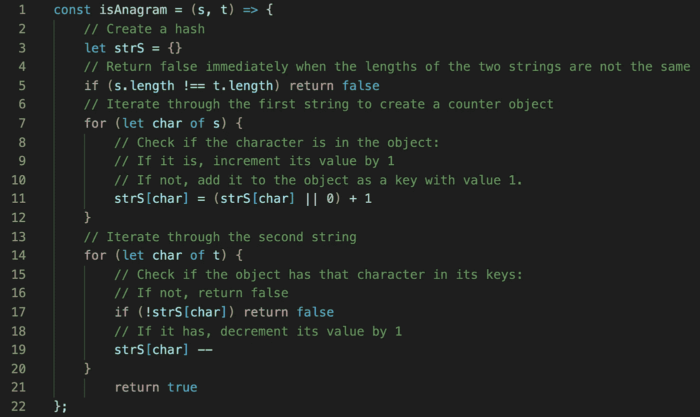
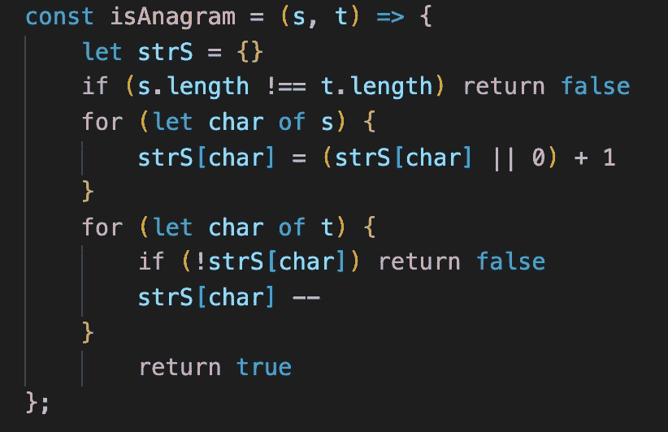

# JavaScript:有效的字谜挑战

> 原文：<https://javascript.plainenglish.io/javascript-valid-anagram-challenge-70bc346fdf4c?source=collection_archive---------3----------------------->

## 顶级面试问题列表— LeetCode


Image by [Pexels](https://pixabay.com/users/Pexels-2286921/?utm_source=link-attribution&utm_medium=referral&utm_campaign=image&utm_content=1834501) from [Pixabay](https://pixabay.com/?utm_source=link-attribution&utm_medium=referral&utm_campaign=image&utm_content=1834501)

在今天的博文中，我将构建一个算法来验证给定的输入是否为字谜。以下是我从 LeetCode 的顶级面试问题列表[中挑选出来的一个最经典的面试挑战，名为](https://leetcode.com/explore/featured/card/top-interview-questions-easy/)[有效字谜](https://leetcode.com/problems/valid-anagram/):

*给定两个字符串* ***s*** *和* ***t*** *，写一个函数判断* ***t*** *是否是* ***s*** *(你可以假设字符串只包含小写字母)。*

**变位词**是通过重新排列另一个单词的字母而形成的，因此它们会以不同的顺序拥有相同频率的相同字母。“听”和“沉默”可以作为一个常见的变位词的例子。对于这个挑战，我们需要确定给定的字符串是否是彼此的有效变位。让我们看几个例子来更好地理解这个问题:

```
**Example 1:****Input:** *s* = "anagram", *t* = "nagaram"
**Output:** true**Example 2:****Input:** *s* = "rat", *t* = "car"
**Output:** false
```

要解决一个问题，总是有多种运行时不同的方法和解决方案。对两个字符串的字符进行排序，然后逐个进行比较，这可能是我们在解决这个给定问题时首先想到的，但请记住，排序所需的时间大于 O(n)。我的方法是使用 hashmap 作为我们的数据结构，我们不需要以这种方式使用 JavaScript 的内置方法:

1.  比较两个给定字符串的长度，如果不相等，则返回`false`。
2.  创建一个空对象，将所有字符存储为键，将它们出现的次数存储为值。
3.  遍历第一个字符串的字符，将每个字符作为一个键添加到哈希中，方法是将它们的值设置为 1，然后在每次出现时将该键的值增加 1。
4.  遍历第二个字符串，检查该字符是否在上面创建的对象中。如果没有，返回`false`。如果该字符存在于哈希中，则将该字符的值减 1。
5.  两个循环完成后，返回`true`，因为这意味着字符串的长度和字符都相等。

让我们看看上面的逻辑在 JavaScript 中的简单实现:



一个单词的变位词可以通过重新排列单词的字母来创建，每个字母只使用一次。上面的函数将比较两个字符串，看它们是否包含相同次数的相同字符。我们首先检查两个字符串的长度是否相同，如果不相同；不需要比较。然后创建一个 hashmap，遍历其中一个字符串，确定每个字符出现的次数。这一步将字符串中的字符存储为键，并将它们的外观存储为值。在使用`for…of`循环的第二次迭代中，检查第二个字符串的字符是否已经存在于对象中。如果是，从它的值中减去 1。如果没有，立即返回`false`,因为字符串不是字谜。Return `true`如果两个循环都完成了，就意味着字符串的长度和字符都被分析了，我们可以断定这些字符串是字谜。

下面是没有注释时的样子:



对于我们的方法，我们使用了两次迭代(每个字符串一次)并提供了线性时间的解决方案，因此**时间复杂度**是 **O(n)** ，其中`n`是字符串的长度。注意，我们只对两个字符串循环一次。

感谢阅读，我希望你喜欢解决这个问题！如果你感兴趣的话，这里是我关于用 JavaScript 解决不同算法的其他文章:

[](https://medium.com/javascript-in-plain-english/javascript-how-to-solve-the-sock-merchant-problem-58e7d487db11) [## JavaScript:如何解决袜子商家问题

### 来自 HackerRank 面试准备工具包的挑战

medium.com](https://medium.com/javascript-in-plain-english/javascript-how-to-solve-the-sock-merchant-problem-58e7d487db11) [](https://medium.com/swlh/javascript-three-ways-to-reverse-an-array-32f9819e9a97) [## JavaScript:反转数组的三种方法

### 不使用反向方法

medium.com](https://medium.com/swlh/javascript-three-ways-to-reverse-an-array-32f9819e9a97) [](https://medium.com/swlh/javascript-chessboard-program-6740c855e44f) [## JavaScript:棋盘程序

### 来自雄辩 JavaScript 的练习

medium.com](https://medium.com/swlh/javascript-chessboard-program-6740c855e44f) [](https://medium.com/swlh/remove-adjacent-duplicates-problem-5b9ac4abe87f) [## 删除相邻重复问题

### 使用堆栈在 JavaScript 和 Ruby 中解决

medium.com](https://medium.com/swlh/remove-adjacent-duplicates-problem-5b9ac4abe87f) [](https://medium.com/swlh/unique-number-of-occurrences-problem-cf25bd3fab4f) [## 唯一出现次数问题

### 用 JavaScript 和 Ruby 解决

medium.com](https://medium.com/swlh/unique-number-of-occurrences-problem-cf25bd3fab4f)