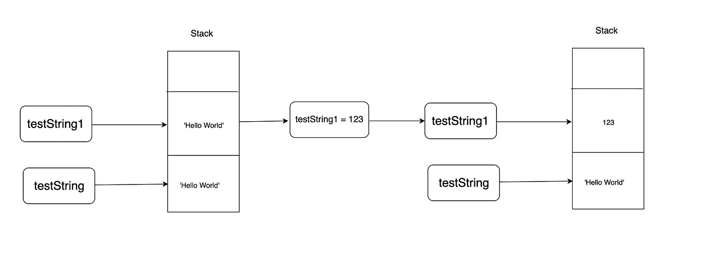
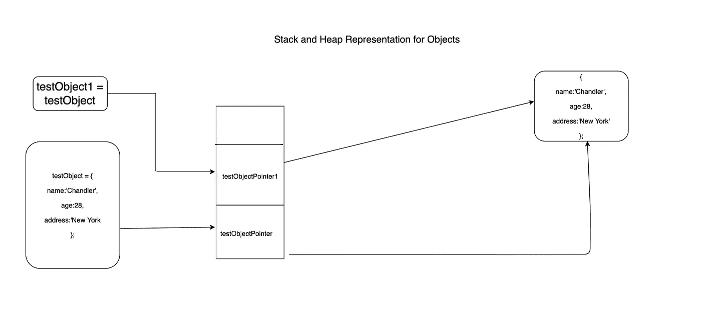

# JavaScript 中的对象可变性

> 原文：<https://javascript.plainenglish.io/javascript-ways-to-fix-object-mutability-6b0cbdeab28b?source=collection_archive---------6----------------------->


JavaScript 是动态类型语言，这意味着类型不像其他面向对象语言那样在编译时定义。JavaScript 提供了两种数据类型分类。

1.  原始值
2.  参考值

> **原语值:** 在 JavaScript 中，原语是指不是对象也没有方法的数据。有 7 种原始数据类型:字符串、数字、布尔、空、未定义、符号、bigint。
> 
> 大多数情况下，原语值直接在语言实现的最低层表示。
> 
> 所有的原语都是**不可变的**，也就是说，它们不能被改变。重要的是不要把原语本身与被赋予原语值的变量混淆。可以给变量重新分配一个新值，但是不能像改变对象、数组和函数那样改变现有值。— [来源— MDN](https://developer.mozilla.org/en-US/docs/Glossary/Primitive)

打破上面的定义，这仅仅意味着在原始值的情况下，它在内存中为定义的变量创建并分配一个固定的位置。原始值存储在 [**堆栈**](https://en.wikipedia.org/wiki/Stack_(abstract_data_type)) 中，名称本身足够直观，可以理解为是一个数据堆栈，具有 **LIFO** ，即第一个操作中的最后一个。

```
*// Primitive Values..**let* testString = 'Hello World';*let* testString1 = testString;console.log('testString:', testString); *// Hello World*console.log('testNumber:', testString1 ); *// Hello World*testString1  = 123;console.log('testString:', testString); *// Hello World*console.log('testNumber:', testString1 ); *// 123*
```

正如我们在上面的代码片段中看到的，它复制、粘贴并在堆栈上分配一个新位置。



**参考值:**

引用值是存储在堆中的对象。 [**堆**](https://en.wikipedia.org/wiki/Heap_(data_structure)) 是一种不同于 [**堆**](https://en.wikipedia.org/wiki/Stack_(abstract_data_type)) 的内存。Heap 访问时间稍长，在数据动态变化的情况下能够容纳更多的数据。堆是这样一种内存，其中的元素不像在堆栈中那样一个接一个地存储，而是随机存储，因此每个元素都有自己的地址。引用值主要是对象和数组(它们是对象的类型)。为了在 JavaScript 中维护数组和对象，我们同时使用堆栈和堆。

下面的代码片段显示了对象的可变性。

```
*// Reference Values ..**let* testObject = {name : 'Chandler',age: 28,address: 'New York'};*let* testObject1 = testObject;console.log('testObject:', testObject.name); *// Chandler*console.log('testObject1:', testObject1.name); *// Chandler*testObject1.name = 'Janice';console.log('testObject:', testObject.name); *// Janice*console.log('testObject1:', testObject1.name); *// Janice*
```

在这里，我们看到两个对象包含与属性相关的相同值，这是因为对象以特殊方式处理，即堆栈上的内存块保存该对象的内存地址(指针),该地址又存储在堆中。



正如我们在上面的表示中看到的，当一个对象通过赋值创建时，它不会分配新的内存块，而是创建一个新的指针块并推送到堆栈上，两个指针都指向内存中的同一个位置，导致指向内存中元素位置的变量发生变化。

让我们看看数组在改变时的行为。

```
*// lets us check what if we push on Array**let* testObject = {name : 'Chandler',age: 28,address: 'New York',friends: ['Monica', 'Ross', 'Joey']};*let* testObject1 = testObject;
testObject1.friends.push('Racheal');
console.log('testObject:', testObject.friends);*// ['Monica', 'Ross', 'Joey', 'Racheal']*console.log('testObject1:', testObject1.friends);*// ['Monica', 'Ross', 'Joey', 'Racheal']*
```

我们可以用多种方法避免可变性

*   ES5 Object.assign :
    该方法用于将所有可枚举的自身属性的值从一个或多个源对象复制到一个目标对象。

```
*const* testObject2 = Object.assign({}, testObject);testObject2.name = 'Paul';console.log(testObject.name); *// Chandler*console.log(testObject2.name); *// Paul*
```

*   ES5 Array slice():
    slice()方法将一个数组的一部分的浅拷贝返回到一个从开始到结束(不包括结束)选择的新数组对象中，其中 begin 和 end 表示该数组中项的索引。原始数组不会被修改。

```
*const* testObject2 = Object.assign({}, testObject);testObject2.friends = testObject.friends.slice();testObject2.friends.push('George');console.log(testObject.friends);*// [ 'Monica', 'Ross', 'Joey', 'Racheal' ]*console.log(testObject2.friends);*// [ 'Monica', 'Ross', 'Joey', 'Racheal', 'George' ]*
```

*   ES6 [spread](https://developer.mozilla.org/en-US/docs/Web/JavaScript/Reference/Operators/Spread_syntax) operator:
    这个方法将自己的可枚举属性从一个提供的对象复制到一个新的对象中。

```
*// ES6 spread operator for Objects.**let* testObject = {name : 'Chandler',age: 28,address: 'New York'};*const* testObject2 = {...testObject};
testObject2.name = 'Paul';console.log('testObject:', testObject.name); *// Janice*console.log('testObject1:', testObject2.name); *// Paul**// ES6 spread operator for Arrays.**const* testObject2 = {...testObject};testObject2.friends = [...testObject.friends];testObject2.friends.push('George');console.log(testObject.friends);*// [ 'Monica', 'Ross', 'Joey', 'Racheal' ]*console.log(testObject2.friends);*// [ 'Monica', 'Ross', 'Joey', 'Racheal', 'George' ]*
```

*   使用[Loadash](https://lodash.com/)_。clone(value)
    该方法创建所提供值的浅层副本。
    _。cloneDeep(value)
    这个方法类似于 clone，只是它递归地克隆值。

> 注意:默认情况下，除了 _ 之外的所有方法。cloneDeep 创建数据的浅层副本。

我希望通过这篇文章，我能够区分原始值和参考值。

如果你觉得这篇文章很有帮助并且喜欢它，请随意与你的朋友和同事分享。

你有任何问题、建议或想要联系我吗？在 LinkedIN[上给我留言或者在下面评论。](https://www.linkedin.com/in/muneer-zargar-fe-dev/)

我也可以在推特上通过@zargarmuneer90 找到我。