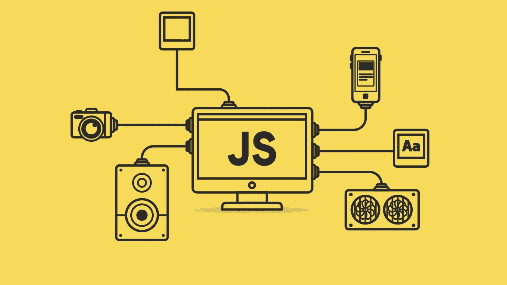
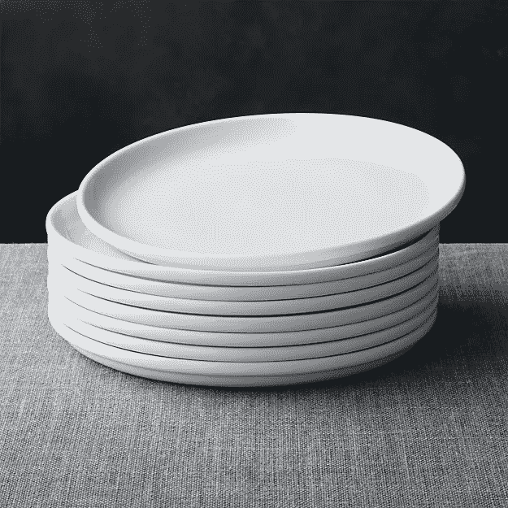

# JavaScript:什么是堆栈和队列？

> 原文：<https://javascript.plainenglish.io/javascript-what-are-stack-and-queue-79df7af5a566?source=collection_archive---------0----------------------->

[Source](https://www.google.com/url?sa=i&source=images&cd=&cad=rja&uact=8&ved=2ahUKEwjg8rDK863hAhWEON8KHX_xDAEQjB16BAgBEAQ&url=https%3A%2F%2Fwww.purelogics.net%2Fblog%2Fthe-good-and-the-bad-of-javascript%2F&psig=AOvVaw15k794h2BDA5kwhvuVjtK0&ust=1554173968672902)

数据结构是一个非常重要的话题，在技术面试和学校的必修课中经常被问到。今天，我想深入探讨两种最常见的数据结构:**堆栈**和**队列**。

# 什么是堆栈？

**堆栈**是一种线性的数据结构，其中顺序保持不变。对于许多人来说，stack 有一个 LIFO(**L**ast**I**n**F**first**O**ut)机制。让我们来看一个现实生活中栈的例子:盘子的栈。

[Source](https://www.google.com/url?sa=i&source=images&cd=&cad=rja&uact=8&ved=2ahUKEwi657yTqLDhAhUJON8KHaOmDDwQjB16BAgBEAQ&url=https%3A%2F%2Fwww.crateandbarrel.com%2Fset-of-8-logan-stacking-dinner-plates%2Fs454005&psig=AOvVaw2LUh1DTzMSuJS53Lm1T5v0&ust=1554255746595536)

如果你不能从中间拿走盘子，你只能看到最上面的盘子，这就是一叠！

现在我们知道了堆栈是如何工作的，让我们用 JavaScript 实现它吧！在我们的实现中，我们将为像`push`、`pop`和`peek`这样的堆栈编写基本方法。

## 实施#1(阵列)

## 实现#2(链表)

# 什么是队列？

与堆栈类似，**队列**是一种线性数据结构，它遵循 FIFO(**F**first**I**n**F**first**O**ut)机制。你可以把排队想象成快餐店里的一排人。

[Source](https://www.google.com/url?sa=i&source=images&cd=&cad=rja&uact=8&ved=2ahUKEwigtYb117LhAhUkU98KHXIoCeoQjB16BAgBEAQ&url=https%3A%2F%2Fwww.masterfile.com%2Fsearch%2Fen%2Fsingle%2Bfile%2Bline%2Bpenguins&psig=AOvVaw11nkQ1cbJZtcJzbea5InlZ&ust=1554338245709398)

假设没有人切任何人，排队的第一个人会先点餐，最后一个人会最后点餐。这是一个队列的例子！

现在我们知道了队列是如何工作的，让我们用 JavaScript 实现它吧！在我们的实现中，我们将为像`enqueue`、`dequeue`和`peek`这样的队列编写基本方法。

## 实施#1(阵列)

## 实现#2(链表)

这些是用 JavaScript 实现的堆栈和队列！

非常感谢大家的阅读！您也可以通过我的个人资料查看我的其他 JavaScript 帖子。

## JavaScript 基础知识:

> **变量**:[https://medium . com/@ timhancodes 0281/basics-of-JavaScript-Variable-3 EB 6 f 4 f 0 af 18](https://medium.com/@timhancodes0281/basics-of-javascript-variable-3eb6f4f0af18)
> 
> **数据类型**:[https://medium . com/@ timhancodes 0281/basics-of-JavaScript-Data-Types-385 Bab 24 b 51](https://medium.com/@timhancodes0281/basics-of-javascript-data-types-385bab24b51)

## JavaScript 基础知识

> **原型继承**:[https://medium . com/JavaScript-in-plain-English/JavaScript-fundamental-Prototypal-inheritage-9153 ab 434 aae](https://medium.com/javascript-in-plain-english/javascript-fundamental-prototypal-inheritance-9153ab434aae)

## ES6

> **JavaScript 中的 Rest/Spread 运算符**:[https://medium . com/JavaScript-in-plain-English/Rest-Spread-Operator-in-JavaScript-2 da 13 aa 942 FB](https://medium.com/javascript-in-plain-english/rest-spread-operator-in-javascript-2da13aa942fb)
> 
> **数组方法 cheat sheet**:[https://medium . com/@ Tim hancodes/JavaScript-Array-Methods-cheat sheet-633 f 761 AC 250](https://medium.com/@timhancodes/javascript-array-methods-cheatsheet-633f761ac250)

## 合并排序

> ***JavaScript 中的归并排序算法***:[https://medium . com/JavaScript-in-plain-English/JavaScript-Merge-Sort-3205891 AC 060](https://medium.com/javascript-in-plain-english/javascript-merge-sort-3205891ac060)