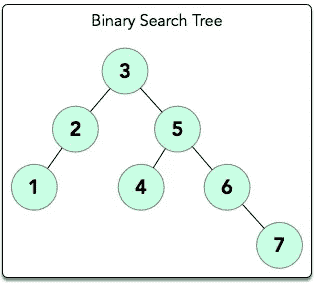
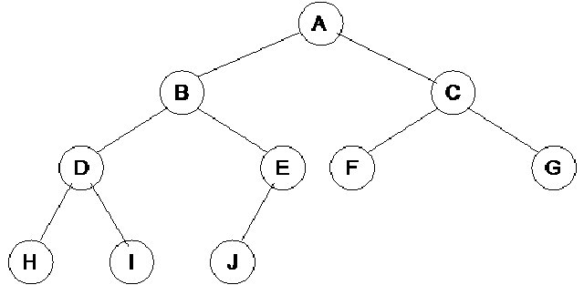
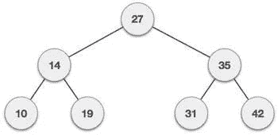

# JavaScript:什么是二叉查找树？

> 原文：<https://javascript.plainenglish.io/javascript-what-is-a-binary-search-tree-a602155abae4?source=collection_archive---------0----------------------->

为了提高编码的准确性和分析代码的能力，数据结构是一个需要学习的重要课题。我们将用另一种流行的数据结构继续讨论数据结构，这种数据结构叫做**二叉查找树**。

# 什么是二叉查找树？

[Source](https://www.google.com/url?sa=i&source=images&cd=&cad=rja&uact=8&ved=2ahUKEwiBmqWM9MbhAhWndt8KHR1wALYQjRx6BAgBEAU&url=https%3A%2F%2Fwww.hackerrank.com%2Fchallenges%2F30-binary-search-trees&psig=AOvVaw1hjtV-isxaeX2hhXUqXDFQ&ust=1555033119112882)

**二叉查找树**是从父节点分支到其子节点的树状数据结构。二叉查找树和其他种类的树有一些不同的属性:

1.  每个节点(父节点)最多只能有 2 个子节点
2.  这两个子节点通常被称为**左子节点**和**右子节点**，其中左子节点的值总是小于父节点，而右子节点的值总是大于等于父节点
3.  每个孩子也必须是二叉查找树

# 二叉查找树的类型

## 完整 BST

[Source](https://www.google.com/url?sa=i&source=images&cd=&cad=rja&uact=8&ved=2ahUKEwjx5NSR9cbhAhWmmeAKHZmaC2kQjRx6BAgBEAU&url=http%3A%2F%2Fcs-study.blogspot.com%2F2012%2F11%2Fcomplete-binary-tree.html&psig=AOvVaw1PFoP36D0kN75lO0TyefKX&ust=1555033434567491)

*   所有级别(可能除了最后一级)子节点的最大数量
*   最后一级的所有节点尽可能出现在最左侧

## 完整 BST

[Source](https://www.google.com/url?sa=i&source=images&cd=&cad=rja&uact=8&ved=2ahUKEwi7p5fK9MbhAhWoneAKHaANCSAQjRx6BAgBEAU&url=https%3A%2F%2Fwww.studyblue.com%2Fnotes%2Fnote%2Fn%2Fdata-structures-algorithims%2Fdeck%2F17404432&psig=AOvVaw2qpYcS7Y5MV9Z-HCZ6o4i1&ust=1555033227026767)

*   每个非叶节点(末端的节点)都填充有左子节点和右子节点

# 履行

# 遍历的类型

## 预购

*   得到根
*   向左走
*   向右移动

## 按顺序

*   向左走
*   得到根
*   向右移动

## 后期订单

*   向左走
*   向右移动
*   得到根

这是用 JavaScript 实现的二叉查找树！

我想提到的最后一点是，有许多方法可以优化二叉查找树，使其更加完整，以避免树变得过于线性。一定要检查这些方法。

非常感谢大家的阅读！您也可以通过我的个人资料查看我的其他 JavaScript 帖子。

## JavaScript 基础知识:

> **变量**:[https://medium . com/@ timhancodes 0281/basics-of-JavaScript-Variable-3 EB 6 f 4 f 0 af 18](https://medium.com/@timhancodes0281/basics-of-javascript-variable-3eb6f4f0af18)
> 
> **数据类型**:[https://medium . com/@ timhancodes 0281/basics-of-JavaScript-Data-Types-385 Bab 24 b 51](https://medium.com/@timhancodes0281/basics-of-javascript-data-types-385bab24b51)

## JavaScript 基础知识

> **原型继承**:[https://medium . com/JavaScript-in-plain-English/JavaScript-fundamental-Prototypal-inheritage-9153 ab 434 aae](https://medium.com/javascript-in-plain-english/javascript-fundamental-prototypal-inheritance-9153ab434aae)

## ES6

> **JavaScript 中的 Rest/Spread 运算符**:[https://medium . com/JavaScript-in-plain-English/Rest-Spread-Operator-in-JavaScript-2 da 13 aa 942 FB](https://medium.com/javascript-in-plain-english/rest-spread-operator-in-javascript-2da13aa942fb)
> 
> **数组方法 cheat sheet**:[https://medium . com/@ Tim hancodes/JavaScript-Array-Methods-cheat sheet-633 f 761 AC 250](https://medium.com/@timhancodes/javascript-array-methods-cheatsheet-633f761ac250)

## 数据结构

> **什么是栈和队列？**:[https://medium . com/JavaScript-in-plain-English/JavaScript-what-is-stack-and-queue-79 df 7 af5a 566](https://medium.com/javascript-in-plain-english/javascript-what-are-stack-and-queue-79df7af5a566)

## 合并排序

> ***JavaScript 中的归并排序算法***:[https://medium . com/JavaScript-in-plain-English/JavaScript-Merge-Sort-3205891 AC 060](https://medium.com/javascript-in-plain-english/javascript-merge-sort-3205891ac060)