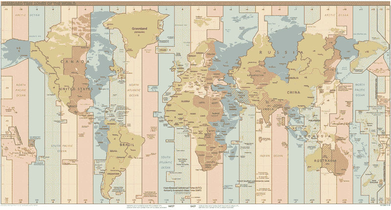
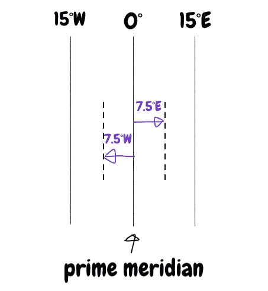
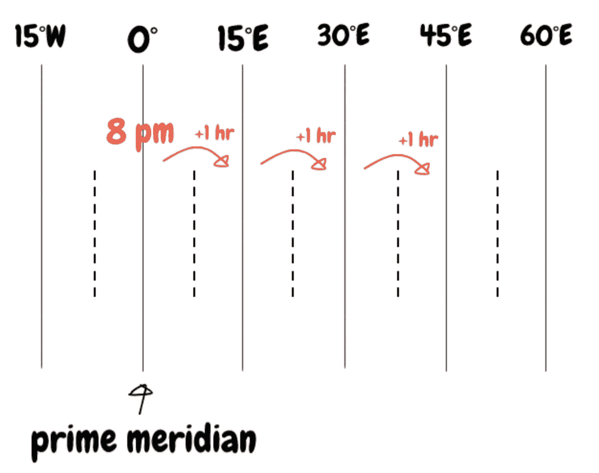
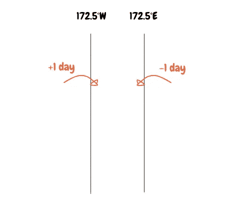
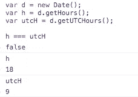

# JavaScript——UTC 到底是什么，为什么你需要知道这个

> 原文：<https://javascript.plainenglish.io/javascript-what-the-heck-is-utc-and-why-you-need-to-know-this-400e2366626a?source=collection_archive---------5----------------------->

## Java Script 语言

## 对 UTC、时区和日期对象的解释


Photo by [Paula May](https://unsplash.com/@paulamayphotography?utm_source=medium&utm_medium=referral) on [Unsplash](https://unsplash.com?utm_source=medium&utm_medium=referral)

每个阅读这篇文章的人一定都使用过 JavaScript 中的 Date 对象，或者使用过一个库来转换日期时间。当我对日期如此陌生时，我不知道 UTC 是什么，也不知道为什么我应该关心它。你难道没有同样的感受和想法吗？在本帖中，我将日期作为以下内容来谈。

*   什么是 UTC
*   JavaScript 中的日期
*   关于日期的开源库

# 什么是 UTC



The image source is from [Wiki](https://en.wikipedia.org/wiki/List_of_UTC_time_offsets#UTC+14:00,_M%E2%80%A0)

追溯到 18 世纪，当火车被发明的时候，人们一直使用当地时间。他们把时钟调到正午，这时太阳在天空中最高处。一旦人类开始能够通过火车进行长途旅行，时间常常会让他们感到困惑。他们很快就想要一个新的标准时间。

在 19 世纪，一群代表他们国家的人聚集在一起，妥协说他们需要新的东西来适应标准时间。他们决定以英国的格林威治为标准时区的中心，并将地球划分为 24 个区域，共 15 个经度。于是这就成了现在的 24 小时制。

```
24 areas x 15 longitudes = 360 deg
```

他们决定将标准时间称为协调世界时。那不应该剪吗？说英语的人最初提议用*协调世界时*，但是说法语的人用了 TUC， *temps universel coordonné* 。所以他们妥协称之为 UTC。

然后让我们来讨论 24 个区域，每个区域有 15 个经度。

# 时区

把世界地图分成 24 个区域意味着什么？现在很多国家使用的时区所在的点位于*格林威治*，一个*伦敦*，*英格兰*的小镇。



这是本初子午线，时间从这里开始。这是地球上经度为 0 的垂直线，也就是格林威治时间*和*。时区是指本初子午线以东东经 15°和以西西经 15°的区域。那是离本初子午线最近的时区。如果你再往东走一点，那么新的时区是从东经 7.5 到东经 22.5。相比之下，如果你去西边，新的时区是从东经 7.5 到东经 22.5。我来自韩国，在东经 127.7 度。

那么向东或向西移动 15°经度会发生什么？就像我在这篇文章前面提到的，有 24 个地区，也就是 24 个时区。每个时区都有 7.5 W 和 7.5 E 作为范围。因此，如果你向东或向西移动 15 经度，就意味着你的时区改变了 1 小时。您可以使用 UTC 和`+`或`-`来表示这一点。有本初子午线的时区是`UTC+0`。时区 7.5 E — 22.5 E 为`UTC+1`，7.5 W — 22.5 W 为`UTC-1`。

假设现在是本初子午线所在的格林威治时间*晚上 8 点，你想前往东经 45 度的伊朗。需要 5 个小时。当你到达韩国时，那里是几点？*



```
Date of departure: 21th
Time for departure: 8 pm
Flight time: 5 hr
Time zone change: 3
```

飞行需要 5 个小时。将是黄金时间 22 日凌晨 1 点。时区应该向东移动 3 个时区。每当您的时区更改为东部时区，您的时间就会增加 1 小时。所以，当你到达时，将是伊朗时间 22 日凌晨 4 点。

```
8 pm(21th) + 5 hr + 3 hr(time zone)
~~~~~~~~~~~
22th 1am
                   ~~~~~~
--> 22th 4am
```

# 时区的界限

即使你不断向东或向西移动，你也不可能永远获得或失去时间。因为地球是一个球体，所以时区的每条边都在本初子午线的另一边相交，在本初子午线的两边，经度都是 180 度。



假设你在西经 135 度，11 日早上 7 点出发。你想向西移动 75 度经度。那么时区将更改如下。

```
Initial: 135°W, 7 am, 11th
1st move: 135°W → 150°W. 6 am
2nd move: 150°W → 165°W. 5 am
3rd move: 165°W → 180°W. 4 am 12th(+1)
4th move: 180°W → 165°E. 3 am
5th move: 165°E → 150°E. 2 am
```

日期在经度 180°处更改。

你要小心的是，日期会在经度 180 度处更改。如果你朝西走，日期会快一天，如果你朝另一边走，日期会晚一天。

此外，许多国家使用 GMT，即格林威治时间*的时区。但是，一些国家像美国一样有夏令时，他们把时区转换成一个特殊的时区，比如夏令时。*

# JavaScript 中的日期对象

JavaScript 中的 Date 对象是开发者的好帮手 API。当你得到当地时间或 UTC 时间时，这是非常有用的。

## [Date.getTime](https://developer.mozilla.org/en-US/docs/Web/JavaScript/Reference/Global_Objects/Date/getTime)

此方法返回您传递到日期构造函数中的指定日期的数值，自 1970 年 1 月 1 日 00:00:00 UTC 开始。如果不向构造函数传递任何参数，它将使用默认日期，即现在。

## `[**Date.prototype.getUTCHours**](https://developer.mozilla.org/en-US/docs/Web/JavaScript/Reference/Global_Objects/Date/getUTCHours)`

有一个相反的方法，Date.prototype.getDate，如果你调用 getDate，它给你指定日期的小时，而 getUTCHourse 给你一个 UTC 时间。这实际上会有所不同。



getHours 返回 18，getUTCHours 返回 9。我现在所在的时间是`UTC+9`。所以 getHours 给了我 18，比`UTC+0`快 9 个小时。

如果你的应用程序的用户只停留在这个国家，那么理论上，你不必考虑 UTC 时间。

# 结论

每个时区都有一个 15°的经度范围，即从子午线开始的西经 7.5 度和东经 7.5 度。每次时区切换时，日期都会改变。如果转到西区，时间会慢 1 小时，如果转到东区，时间会慢 1 小时。

当你必须处理日期时，理解时区是很重要的。我希望你也能阅读其他帖子来强化你的理解！

# 资源

*   [UTC 时间偏移列表—维基](https://en.wikipedia.org/wiki/List_of_UTC_time_offsets#UTC+14:00,_M%E2%80%A0)
*   [协调世界时—维基](https://en.wikipedia.org/wiki/Coordinated_Universal_Time)
*   [GEG-103-OL:时区— YouTube](https://www.youtube.com/watch?v=4nHrSnMVXuU)
*   [GMT 和 UTC 的区别](https://www.timeanddate.com/time/gmt-utc-time.html)
*   [日期— MDN](https://developer.mozilla.org/en-US/docs/Web/JavaScript/Reference/Global_Objects/Date)