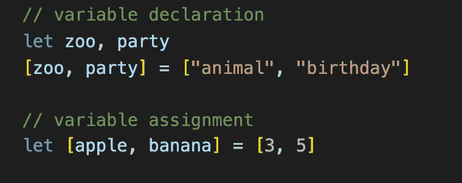
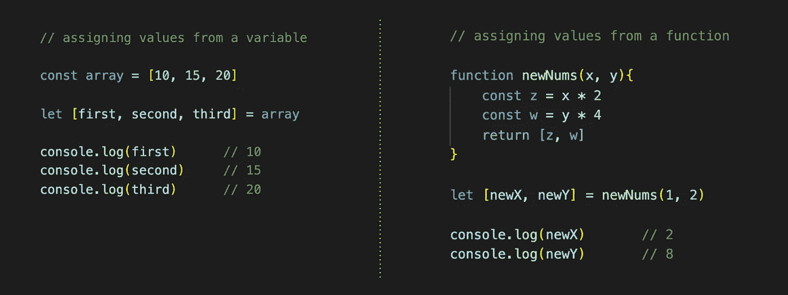
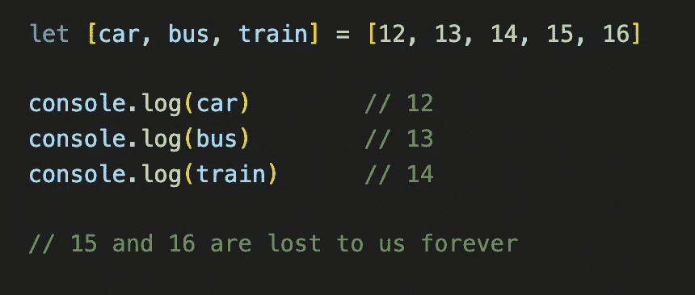
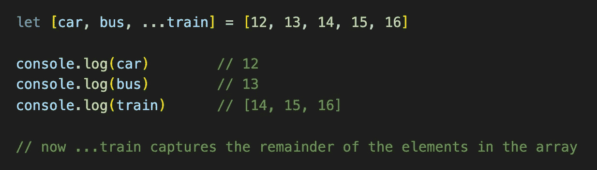
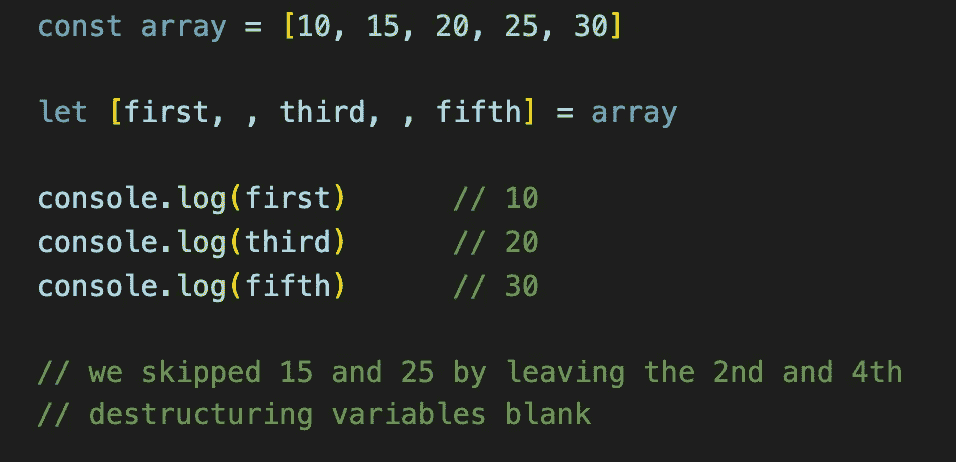
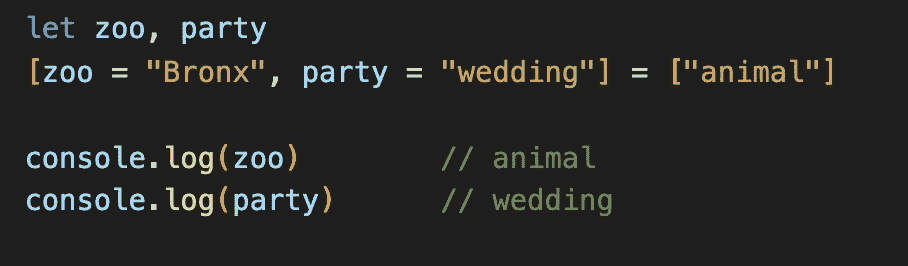
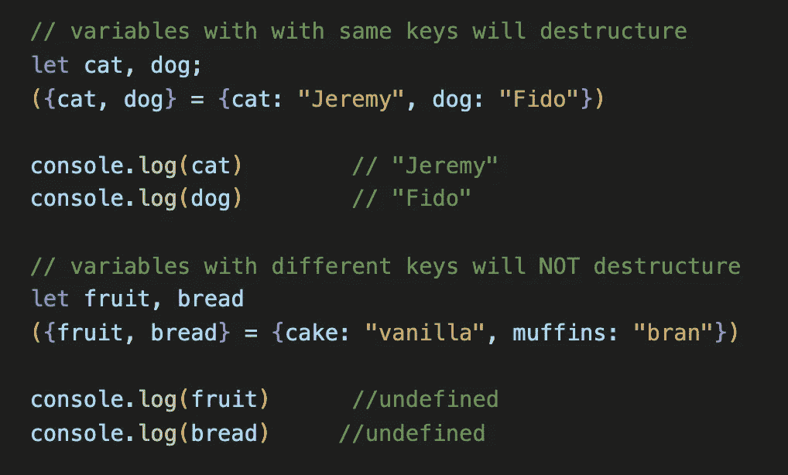

# JavaScript 的析构赋值

> 原文：<https://javascript.plainenglish.io/javascripts-destructuring-assignment-6d2c7db9bea8?source=collection_archive---------7----------------------->

## 一种快速解包数据的方法

Photo by Charles Deluvio from Upsplash

JavaScript 中的析构赋值是将数据从对象和数组文字委托给变量的一种快速而简单的方法。如果你发现自己写了一行又一行的变量赋值，考虑使用析构赋值来节省行数和时间。

## 解构的基础

当涉及到破坏任务时，顺序就是游戏的名字。相等运算符左侧的变量顺序决定了将被赋予的值。如果你不记得其他关于析构的事情，请记住这个金块。**订单。事关重大。**

## 句法

对于数组析构:
`[var1, var2, etc.] = [value1, value2, etc.]`

对于对象析构:
`( {var1, var2, etc.} = {key1: value1, key2: value2, etc.} )`
** * *括号仅在变量声明时需要****

## 如何使用

当使用析构赋值对变量赋值时，它们**必须**被`[]`包围，否则只有最后一个变量会被赋值给等式运算符右边的值。你既可以提前声明变量，也可以使用变量赋值和析构赋值。

You can use variable declaration or variable assignment with the destructuring assignment.

让我们分解上面的代码，看看到底发生了什么:

**变量声明:**

*   在内存中创建两个名为`zoo`和`party`的变量。我们不会分配任何值，因此它们将保持`undefined`。
*   使用析构赋值将`zoo`赋给数组文本中的第一个元素(又名`"animal"`),将`party`赋给第二个元素(又名`"birthday")`

**变量赋值:**

*   在内存中创建两个变量`apple`和`banana`，并立即分别赋值给`3`和`5`。

我们也可以给另一个变量赋值，就像下面的`array`一样，或者给一个函数赋值，比如`newNums`，只要它们返回一个对象或者数组文字。

## 将多个值赋给单个变量

如果要分配的变量少于值，您会发现自己的值“无家可归”。如果你不需要这些额外的价值，那么没有问题，但如果你，那么我们需要一个解决方案…

为了保留所有值，我们可以使用 [rest 模式](https://developer.mozilla.org/en-US/docs/Web/JavaScript/Reference/Operators/Destructuring_assignment#Assigning_the_rest_of_an_array_to_a_variable)将一个对象或数组中的多个元素分配给一个变量。这个模式需要一个扩展操作符`. . .`，后面跟一个您选择的变量。当实现该选项时，它必须是析构赋值中的最后一个变量，因为它会将所有剩余值的**赋值给它。**

## 跳过变量

此外，您可以通过在析构赋值中添加`blank`空格来跳过元素赋值。

## 分配默认值

如果您有一定数量的变量需要赋值，那么您可以通过分配默认值来确保不会返回未定义的值。

查看上面的代码，我们看到`zoo`被赋予了默认值`"Bronx"`，而`party`被赋予了默认值`"wedding"`。因为有一个值可供赋值，`zoo`现在是`animal`。然而，变量`party`没有第二个可用值，因此它保留默认值`"wedding"`。

## 用对象进行析构

析构对象与析构数组略有不同。为了从对象中给变量赋值，它们必须有相同的键。

此外，对象析构需要在赋值操作符左边的变量周围加上`{}`。如果你使用变量声明，你还需要在整个析构语句周围加圆括号`()`。

## 更多资源

如果你正在寻找更多的资源，MDN 网络文档提供了一个关于析构任务的很棒的页面(下面的链接)。他们回顾了我们在上面讨论过的基础知识，以及关于变量交换、常见错误和析构各种不同值(如正则表达式和嵌套对象)的更多信息。

 [## 解构分配

### 析构赋值语法是一个 JavaScript 表达式，它使得从数组中解包值成为可能，或者…

developer.mozilla.org](https://developer.mozilla.org/en-US/docs/Web/JavaScript/Reference/Operators/Destructuring_assignment)