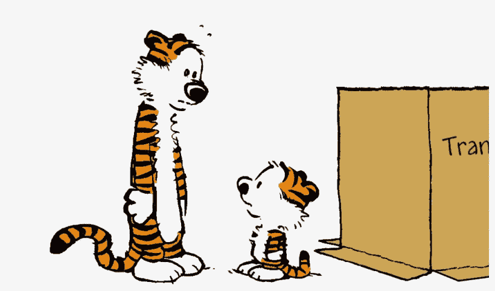

# JavaScript 的等式运算符

> 原文：<https://javascript.plainenglish.io/javascripts-equality-operator-7b75e8cfefa1?source=collection_archive---------12----------------------->

## 一个关于类型转换的故事

说到等式运算符，弄清楚 JavaScript 如何处理类型转换可能很困难。有了更好的理解——或者至少有了参考资料——可以对您的编码产生积极的影响，并为您更好地应对类型转换的奥秘和意外副作用做好准备。

这篇文章希望成为你和我的参考。先说一些定义吧！

## 严格平等

严格相等(`===`，在其他语言中经常是`==`)对于大多数程序员来说都很熟悉。它检查两个值是否是相同类型的*和*。

## 操作数

我们在操作中使用的对象/值。在`5 == '5'`中，有两个操作数——`5`和`'5'`。

## 类型转换

类型转换是将数据从一种数据类型转换为另一种数据类型。这可以隐式发生(当编译器自动分配数据类型时)，也可以显式发生(当您的代码告诉 JavaScript 执行转换时)。当转换自动发生时，就像等式操作符一样，我们也将该过程称为**类型强制**。让我们来看看实际情况。

# 相等运算符

相等运算符(`==`)在比较操作数时执行类型转换。这在比较看起来相似但类型不同的值时很有用。

其中一种情况是对照看起来像数字的字符串来检查数字。

```
5 == '5'; // true
```

这里发生的事情已经有些清楚了。字符串被转换成一个数字，然后严格的相等性被检查…对吗？也许吧！也许数字正在被转换成字符串？在这篇文章中，我将提供具体的例子和问题的描述，比如这些围绕类型转换的问题。



5 == ‘5’

ECMAScript 规范可能会令人费解。它读起来几乎像一篇数学研究论文。当我想知道等式操作符的内幕时，我去了源。下面，我将构建一个易于遵循的协议来帮助您确定抽象等式在几种情况下是如何工作的。

> 注意:
> 
> 一些步骤将有明确的返回(例如# 2):
> –`return true`
> 
> 其他人将输出一个新的抽象等式运算，而不是(例如# 3):
> –`5 == 5;`
> 
> 得到的操作数被带回步骤#1，在那里算法被重复，直到达到显式返回。

# 抽象等式比较算法

为 [ECMA2020](https://www.ecma-international.org/ecma-262/) 更新。

## 对于 `x == y,`,请遵循以下步骤:

**1。如果** `**x**` **和** `**y**` **同类型****，返回** `**x === y**`

```
5 === 5;                             => true
'foo' === 'bar';                     => false
false === false;                     => true
null === undefined;                  => false
{ foo: 'bar' } === { foo: 'bar' };   => false
```

**2。如果** `**x**` **是** `**null**` **而** `**y**` **是** `**undefined**` **(反之亦然)，返回** `**true**`

```
null == undefined; => true
```

**3。如果** `**x**` **是一个字符串，而** `**y**` **是一个数字(反之亦然)，则将字符串转换为数字**

```
'5' == 5;
  => convert '5' to Number
  => Number('5') => 55 == 5;
```

**4。如果** `**x**` **是一个 BigInt，而** `**y**` **是一个字符串(反之亦然)，则将该字符串转换为一个 BigInt**

```
BigInt(5) == '5';
  => convert '5' to BigInt
  => Bigint('5')BigInt(5) == BigInt('5');
```

**5。如果** `**x**` **或** `**y**` **是布尔值，将其转换为数字**

```
true == 3;
  => convert true to Number
  => Number(true) => 11 == 3;false == 'foo';
  => convert false to Number
  => Number(false) => 00 == 'foo';
```

**6。如果** `**x**` **是字符串、数字、BigInt 或符号，而** `**y**` **是对象(反之亦然)，则尝试将对象转换成原语**

有时，对象有内置的/预定义的方法来帮助转换成原语。这种方法超出了本文的范围，我们将忽略这些特殊情况——对于这一步，我们将使用一个简单的对象
`{ foo: 'bar' }`。

```
’baz’ == { foo: 'bar' };
5 == { foo: 'bar' };
BigInt(5) == { foo: 'bar' };
Symbol('baz') == { foo: 'bar' };
```

在每一种情况下，对象的`toString`方法都用于转换。这个方法的默认行为只是返回字符串`'[object Object]'`。

```
[String/Number/BigInt/Symbol] == { foo: 'bar' };
  => convert object using .toString()
  => { foo: 'bar' }.toString() => '[object Object]'[String/Number/BigInt/Symbol] == '[object Object]';
```

**7。如果** `**x**` **是一个 BigInt，** `**y**` **是一个数字(反之亦然):**

*   如果`x`或`y`为`NaN`、`+∞`或`-∞`，则返回`false`

```
BigInt(5) == NaN; => false
BigInt(5) == Infinity; => false
BigInt(5) == -Infinity; => false
```

*   如果`x`和`y`都不是`NaN`、`+∞`或`-∞`，则`x`和`y`的数值完全相等

```
BigInt(5) == 5;
  => Number(BigInt(5)) => 55 === 5; => trueBigInt(5) == 3;
  => Number(BigInt(5)) => 55 === 3; => false
```

8。如果您到达此清单的底部，请返回 `**false**`

终于可以给我们原来的问题一个确定的答案了！

```
5 == '5';
  => Step #3
    => If x is a String and y is a Number (or vice-versa),
    => convert the String to a NumberNumber('5') => 5// return to top of protocol5 == 5;
  => Step #1
    => If x and y are of the same type, return x === y5 === 5; => true
```

现在我们已经确认，在这个例子中，我们的字符串`'5'`被转换成一个数字，然后使用结果检查严格的相等性。

# 结论

太好了！希望本指南能为您的等式运算符需求提供有用的参考。

JavaScript 还有其他几个启动类型转换的操作符。下一次，我将通过另一个演练来探索这些。我很想听到你的反馈，所以请留下你的回复！这些对我以后的文章有帮助。

## 来源

*   [相等(==) — JavaScript | MDN](https://developer.mozilla.org/en-US/docs/Web/JavaScript/Reference/Operators/Equality)
*   [ECMAScript 2020 语言规范](https://www.ecma-international.org/ecma-262/)
*   [对象到图元的转换](https://javascript.info/object-toprimitive#toprimitive)