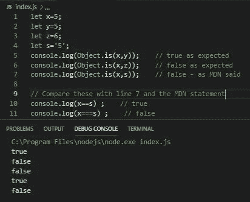

# JavaScript 的对象. is

> 原文：<https://javascript.plainenglish.io/javascripts-object-is-6422408387c4?source=collection_archive---------10----------------------->

论原语和===的重要性

Photo by [Bankim Desai](https://unsplash.com/@rochangraphics?utm_source=unsplash&utm_medium=referral&utm_content=creditCopyText) on [Unsplash](https://unsplash.com/s/photos/chrysalis?utm_source=unsplash&utm_medium=referral&utm_content=creditCopyText)

这是一篇**非常短的**文章，是对在 JavaScrip t 中比较对象的[的补充。](https://medium.com/javascript-in-plain-english/comparing-objects-in-javascript-ce2dc1f3de7f)

在那篇文章的结尾，我提到了 [Object.is()](https://developer.mozilla.org/en-US/docs/Web/JavaScript/Reference/Global_Objects/Object/is) 及其在比较对象中的作用。

> 感谢那篇文章的一位读者的评论，我想我应该提到 Object.is()以及它如何处理原始数据类型，而不仅仅是引用值。

## 比较原语呢

[MDN](https://developer.mozilla.org/en-US/) 上关于 Object.is()的语句之一是，

> 根据`[==](https://developer.mozilla.org/en-US/docs/Web/JavaScript/Reference/Operators/Comparison_Operators#Equality)`运算符，这与*不*相等。在测试相等性之前,`==`操作符对双方应用各种强制(如果它们不是同一类型的话)(导致类似`"" == false`为`true`的行为),但是`Object.is`不强制任何一个值。

关于**类型强制**的最后一部分很重要，还有==和===比较运算符之间的区别。

## 例子

Object.is(), == and ===

# 结论

确保使用正确类型的比较运算符。

记住，==和===运算符的主要区别在于==比较变量，但执行[类型强制](https://developer.mozilla.org/en-US/docs/Glossary/Type_coercion)。但是===不这么做。它不仅检查两个变量的**值**，还检查其**类型**。

感谢您花时间阅读本文！