# JavaScript 的扩展操作符(&它的孪生兄弟，Rest 参数)

> 原文：<https://javascript.plainenglish.io/javascripts-spread-operator-and-it-s-identical-twin-the-rest-parameter-1ebcacd7fa47?source=collection_archive---------5----------------------->


Both the ‘Spread Operator’ and ’Rest Parameter’ look like an ellipsis, but only the latter (sort of) acts like it!

“扩展操作符”是一种奇妙的[语法糖](https://en.wikipedia.org/wiki/Syntactic_sugar):简而言之，它允许你将可迭代的元素(例如数组)在不同的上下文中‘扩展’成适当的格式(见下面的例子)。“Rest 参数”看起来是一样的，但是用于**收集**剩余的东西(因此是“剩余的”)到一个数组或对象中(同样，下面有更多解释)。让我们先来看看 Spread 的一些用途:

# 将数组扩展到函数的参数中

因此，可以用任意数量的参数调用某些 JS 方法。例如，`Math.min()`不介意你给它传递 2 个数字，或者 200 个。例如:

```
Math.min(3,2,4,2,1)  //Outputs --> 1
```

但是如果你试图传递给`Math.min()`一个充满数字的数组，它将返回`NaN`，因为它只希望被传递数字参数……展开操作符来拯救它！(下面的第 1 行到第 4 行):

I’ve added .push() as another example. Like Math.min() or Math.max() it accepts an arbitrary number of parameters. But if you passed arr2 to arr1.push() without using Spread, it would nest arr2 as the final element in arr1!

像这样使用 Spread 也适用于您自己定义的任何函数，例如:

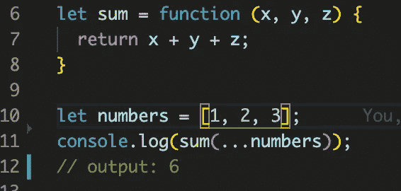

Here the values in the array numbers are being spread into the parameters x, y and z when the function **sum** is called on line 11.

# 与其他可重复项(如字符串)一起使用 Spread

除了数组之外，Spread 还可以与其他' [iterables](https://javascript.info/iterable) '一起使用。让我们看看字符串的例子:

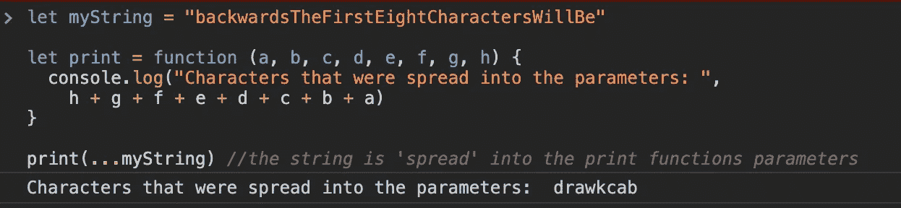

This is bit of a contrived example for this particular use of the spread operator. But if anyone can point me to something more real-world, please do!

上面你可以看到一个字符串可以像我们之前处理一个数组一样被处理。spread 操作符给出了遍历字符串的命令，并将其字符分配给我们的`print`函数的参数(a、b、c 等),直到所有参数都被填充。上面，我选择输出字符串前 8 个字符的反码，结果是“drawkcab”。

# 使用 Spread 复制 JS 对象

编程中一个常见的准则是，你应该*永远不要修改现有的数据*；即始终保持原始数据不变，只修改原始数据的副本(或对其执行功能)。这被视为良好的实践，因为它遵循了拥有[‘单一真实来源’](https://en.wikipedia.org/wiki/Single_source_of_truth)的原则，因此给你更多可预测、可更新和可读的代码。

如果你创建一个 JS 对象(如下面的`originalObj`)然后声明`copyObj`，给它赋值`originalObj`(见下面的第 52 行)，那么你是**而不是**在复制！相反，你只是做了一个[引用](https://codeburst.io/explaining-value-vs-reference-in-javascript-647a975e12a0)(也就是说，实际上给了`originalObj`另一个名字)。因此(在下面的第 53 行)，当您将`copyObj`的属性`.name`更改为“戴夫”时，您实际上只是更改了`originalObj`的名称属性(见顶部输出:右下方)。

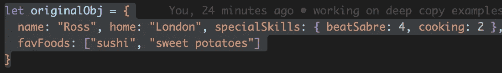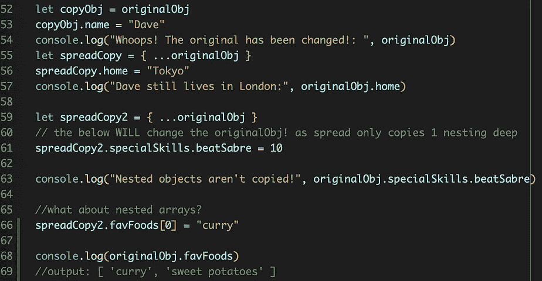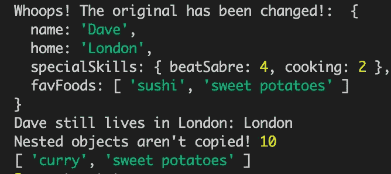

The spread operator will only allow you to make a ‘**shallow’** copy of a JS object: i.e. it will copy properties that have primitive values like a string or an integer, **but** nested objects won’t be copied, just references inserted instead.

如你所见(左上，第 55 到 57 行)，使用 spread **创建 JS 对象的副本将**复制该对象的属性**，只要它们是**[](https://codeburst.io/javascript-essentials-types-data-structures-3ac039f9877b)****(即字符串、数字、布尔值、空值、未定义和符号)。但是，对象中值不是原语的任何属性，例如*嵌套的* JS 对象(例如上面的`specialSkills`)或数组(例如上面的`favFoods`)将不会被复制。相反，将再次给出对嵌套对象/数组的引用。这就是所谓的“浅层”复制，因为它只复制一个对象的第一个*层*，而不是任何嵌套对象的内容。****

## ****制作“深”拷贝，而不是“浅”拷贝****

****那么，该怎么办呢？当然，你可以试着只使用 spread 来复制没有嵌套的 JS 对象，但是这是相当有限的。在使用 JS 库 React 时，我使用了析构(见下文)和 spread 操作符的组合来确保我使用的是“深层”副本:****

****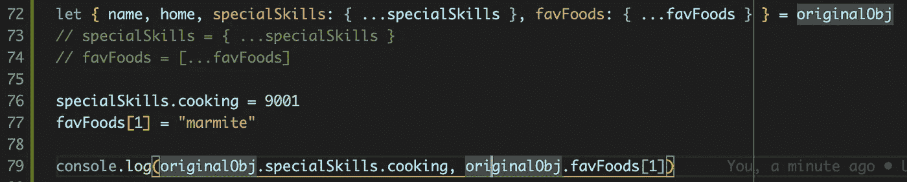****

****Using destructuring (line 72) in conjunction with the spread operator to ensure deep copies are being made****

****在上面的第 72 行，这种“析构”语法允许您从 JS 对象(这里是`originalObj`)中提取属性，将它们中的每一个都声明为与其“键”同名的变量(例如 name、home 等)，并用该属性的“值”(例如“Ross”)初始化新变量。换句话说，这和做:****

```
**let name = originalObj.name**
```

****…针对`orignalObj`的每个属性。*但是*仅此并不能解决我们的浅抄问题！你会注意到(上面的第 72 行),我使用了 Spread 来同时复制嵌套的对象。如果，相反，我刚刚做了:****

```
**let { name, home, specialSkills, favFoods } = originalObj**
```

****…那么特殊技能和喜爱的食物仍然只是参考。**当然**，如果你在你的嵌套对象中有额外的嵌套对象，那么你必须用同样的方式处理它。对于更复杂的 JS 对象，这可能会变得混乱！****

****另一个解决方案是使用一个名为 immutability-helper 的 JS 库。如何做、在哪里做以及为什么做在这篇文章中有概述:“[用 JavaScript](https://www.codementor.io/@ramnmiklus/deep-copying-an-object-in-javascript-mdlj2c318) 深度复制一个对象”。****

## ****将数组/对象相互复制****

****记住上面列出的嵌套限制，Spread 可以用来非常整齐地将数组或对象组合在一起，例如:****

****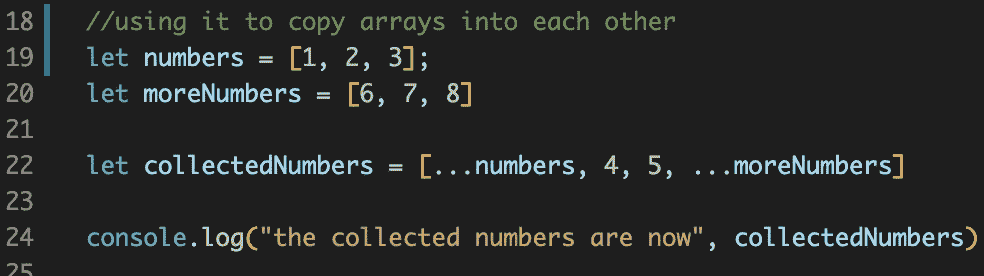********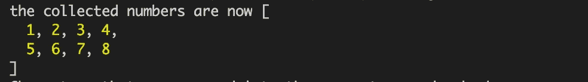****

****Console output****

****此外，当应用于 JS 对象时，同样的方法允许你复制对象*和*同时改变那个副本*的单独属性*:****

****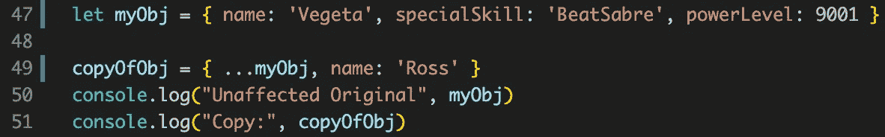****

****Line 49: (shallow) copying an object while changing a specific property of the copy (name) at the same time****

****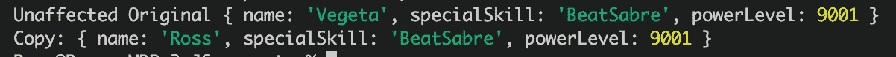****

****Output from the above****

****…我相信你会同意，这很酷。这种技术在 JS [Redux 库](https://redux.js.org/recipes/using-object-spread-operator/)中被大量使用，以允许你快速复制你的“状态”并添加一些更改；抱歉，如果这对你来说毫无意义，但我不想在这里谈这个！****

# ****其余参数****

****因此，简而言之,“Rest 参数”为您收集多余的东西，并将它们放入一个数组(或对象)中。例如，这可以用在函数的括号中，允许你传递任意数量的参数(是的，非常像`Math.min()`允许的):****

****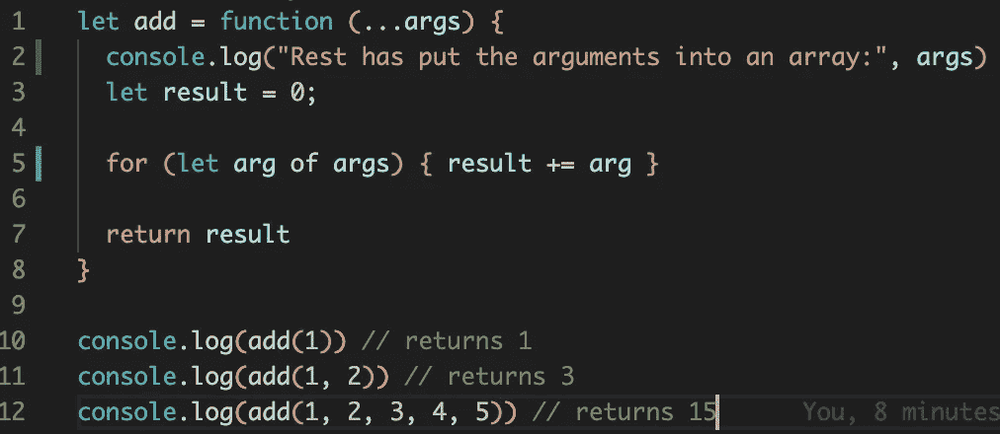****

****Thanks to the Rest parameter this function, add(), can be passed as many numerical arguments as you like.****

****在上面的例子中, [for/of 循环](https://www.w3schools.com/js/js_loop_for.asp)用于遍历**数组中的每个元素，数组是 Rest 参数从传入的参数中为我们生成的**。我在第 2 行放了一个 console.log()来显示正在发生的事情:****

********

## ****收集遗留的论点****

****同样的，*只要你把你的 Rest 参数放在最后一个参数位置*(如下图)，那么它会把任何没有被赋予具体参数的实参收集到一个数组中(下面我称之为`theRest`):****

****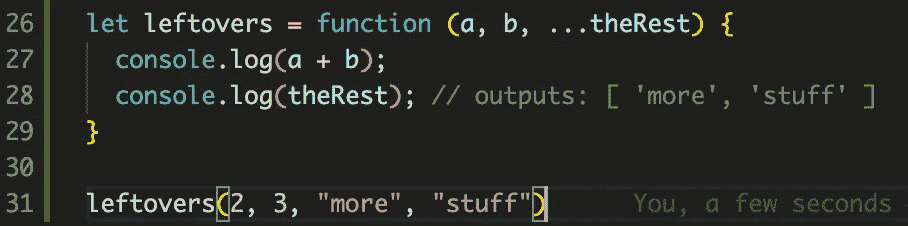****

****The call of leftovers() on line 31 will have 2 and 3 being assigned to parameters a & b respectively. The third and fourth arguments passed to leftover() will therefore be collected by our Rest Parameter (…theRest).****

# ****在析构 JS 对象时使用 Rest****

****尽管我们一直将这个工具称为“Rest *参数*，但是当从一个 JS 对象中收集任何额外的*属性*时，它可以在函数参数的内部和外部使用。例如:****

****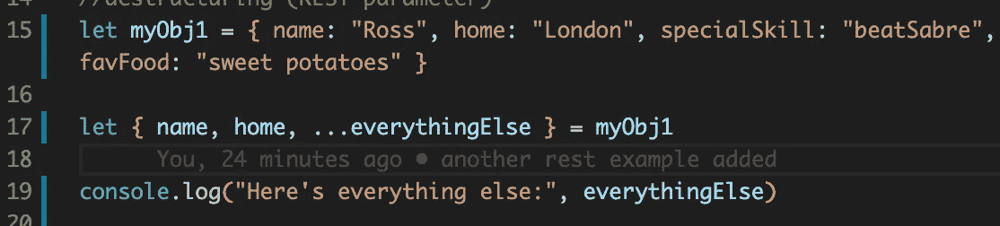****

****Destructuring some properties of an object explicitly , e.g. name and home (line 17), while saving the rest into a new object (everythingElse):****

********

****无论如何，我希望你能学到一些新的东西！非常欢迎任何评论和指正！****